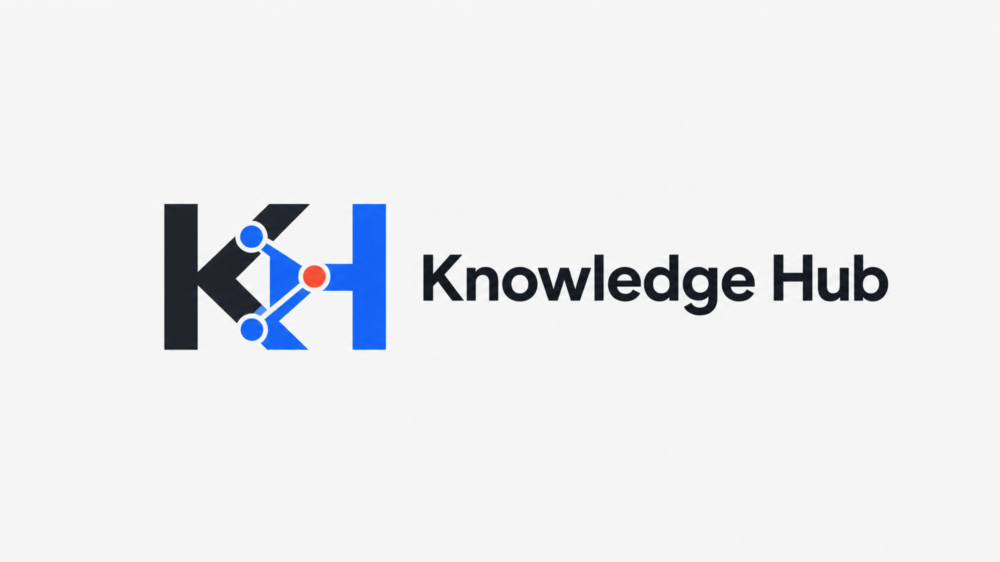
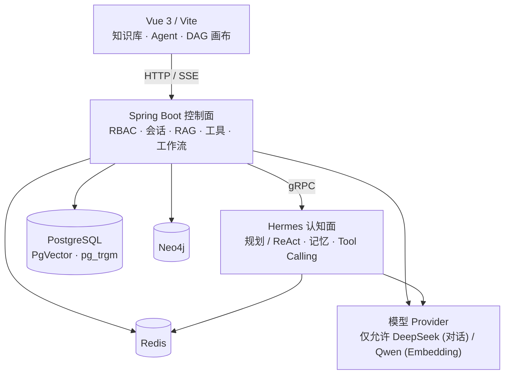

# Knowledge Hub - AI-Native RAG 智能体编排平台

<p align="center">
  
</p>

<p align="center">
  <a href="#技术栈"></a>
  <a href="#技术栈"></a>
  <a href="#技术栈"></a>
  <a href="#技术栈"></a>
</p>

<p align="center">
  <strong>把组织知识、模型、工具与工作流装配成可运行的 AI 应用。</strong>
</p>

Knowledge Hub 是一个面向组织知识资产的 AI 应用编排平台。Spring Boot 控制面负责知识库、模型、Agent、工具与工作流管理，Hermes 认知面通过 gRPC 提供规划、ReAct、记忆与工具调用能力，Vue 3 前端统一承载配置、调试和运行界面。

本项目基于 qKnow 衍生，当前聚焦可验证的 RAG 检索、流式对话和 Agent 编排路径。AI Judge 与反思机制为可选能力，默认并非全部启用。

<p align="center">
  <a href="#核心能力">核心能力</a> ·
  <a href="#系统架构">系统架构</a> ·
  <a href="#快速开始">快速开始</a> ·
  <a href="#开发与验证">开发与验证</a> ·
  <a href="#api-文档">API 文档</a>
</p>

## 核心能力

| 能力 | 当前实现 |
| --- | --- |
| RAG 知识引擎 | 文档入库、语义切块、Embedding、PgVector 与关键词检索、知识图谱路径 |
| Agent 装配 | 模型、知识库、工具、提示词、会话历史与 SSE 流式回答 |
| Tool Calling | 内置 HTTP、搜索、天气等工具，以及 HTTP/stdio MCP 适配 |
| DAG 工作流 | 拓扑执行、条件分支、并行节点、状态快照与恢复 |
| Hermes 内核 | 规划与 ReAct、短期与分层记忆、工具调用、可选反思与 AI Judge |

> 🔒 **架构模型基线纠正 (Architecture Model Baseline Corrected):**
> 本系统的所有生成侧（Chat/Generation/RAG 检索对话）**唯一**使用的是 **DeepSeek API**。
> 本系统的所有向量化侧（Embedding）**唯一**使用的是 **阿里千问 (Qwen) Embedding**。
> **绝无任何本地部署的大语言模型，且已彻底弃用 OpenAI/GPT API。**

## 系统架构



真实执行路径为：前端发起 HTTP/SSE 请求，控制面完成身份校验、会话持久化、模型与工具解析及 RAG 预检索，再通过 gRPC 调用 Hermes，最终把流式结果返回前端。

## 快速开始

### 环境要求

- 本地使用 **SDKMAN** 管理的 **Java 21**（而非全局覆盖），Maven 3.9+
- Node.js 18+、npm
- **Mac 原生（Bare Metal）部署的 PostgreSQL 15+**，需启用 PgVector 与 pg_trgm（绝对不是 Docker 容器）
- **Mac 原生（Bare Metal）部署的 Redis 7+**（绝对不是 Docker 容器）
- Docker 与 Docker Compose v2，仅用于本地 Neo4j

**警告**：本地开发环境使用的是 Mac 原生部署的 PostgreSQL 与 Redis，严禁使用 Docker 启动这些核心数据库；根目录 `docker-compose.yml` 只允许启动 Neo4j。

### 1. 准备配置

```bash
git clone https://github.com/wssAchilles/Spring_Agent.git
cd Spring_Agent
cp .env.example .env
```

编辑 `.env`，至少补全 PostgreSQL、模型 API Key、RSA Key 与 `TOKEN_SECRET`，并补上当前模板缺少的 Neo4j 开发密码：

```dotenv
NEO4J_PASSWORD=neo4jpass123
```

当前启动脚本也使用这个本地默认值进行 Neo4j 健康检查。`.env` 只保存本地真实配置，不要提交密钥。

仅在首次创建全新的空数据库时执行以下初始化；不要对已有 `ai_agent` 数据库重复运行：

```bash
set -a
source .env
set +a

createdb -h 127.0.0.1 -U "$POSTGRESQL_USERNAME" ai_agent
psql -v ON_ERROR_STOP=1 -h 127.0.0.1 -U "$POSTGRESQL_USERNAME" -d ai_agent -f deploy/sql/postgresql/00-init-extensions.sql
psql -v ON_ERROR_STOP=1 -h 127.0.0.1 -U "$POSTGRESQL_USERNAME" -d ai_agent -f deploy/sql/postgresql/01-schema.sql
psql -v ON_ERROR_STOP=1 -h 127.0.0.1 -U "$POSTGRESQL_USERNAME" -d ai_agent -f deploy/sql/postgresql/02-init-data.sql
```

执行扩展初始化的 PostgreSQL 用户需要具备创建 `vector` 与 `pg_trgm` 扩展的权限。

### 2. 启动完整开发环境

```bash
bash scripts/start.sh
```

该脚本会编译后端并启动 Neo4j、Spring Boot 控制面、Hermes 与 Vite。它会清理同名开发容器，并释放 `80`、`8099`、`9090` 端口；运行前请确认这些端口没有承载其他服务。

另开终端查看状态或停止服务：

```bash
bash scripts/status.sh
bash scripts/stop.sh
```

### 3. 访问服务

| 服务 | 地址 |
| --- | --- |
| 前端 | <http://localhost/> |
| 后端 API | <http://localhost:8099/> |
| Swagger | <http://localhost:8099/swagger-ui.html> |
| Hermes gRPC | `localhost:9090` |
| Neo4j Browser | <http://localhost:7474/> |
| Neo4j Bolt | `localhost:7687` |
| PostgreSQL | `localhost:5432/ai_agent` |
| Redis | `localhost:6379`，主后端 DB 3，Hermes 默认 DB 0 |

## 手动开发

需要分别调试服务时，先启动 Neo4j 并在每个终端加载 `.env`：

```bash
docker compose up -d neo4j
set -a
source .env
set +a
```

启动 Spring Boot 控制面：

```bash
cd backend
mvn -pl qknow-server -am spring-boot:run
```

启动 Hermes：

```bash
cd backend
mvn -pl qknow-hermes/qknow-hermes-starter -am spring-boot:run
```

启动前端：

```bash
cd frontend
npm install
npm run dev
```

## 开发与验证

后端测试：

```bash
cd backend
mvn -pl tests -am test
```

前端静态检查与生产构建：

```bash
cd frontend
npm run eslint:lint
npm run build:prod
```

脚本与服务状态检查：

```bash
bash -n scripts/start.sh scripts/status.sh scripts/stop.sh
bash scripts/status.sh
```

## 技术栈

| 层级 | 技术选型 |
| --- | --- |
| 控制面 | Java 21、Spring Boot 3.5.8、Spring AI 1.1、MyBatis-Plus、Reactor/SSE |
| 认知面 | Hermes、gRPC、规划/ReAct、记忆、Tool Calling |
| 前端 | Vue 3.4.31、Vite 5.3.2、Pinia 2.1.7、Element Plus 2.7.6 |
| 检索与存储 | PostgreSQL、PgVector、pg_trgm、Redis 7、Neo4j 5.26 |
| 模型接入 | 严格使用 DeepSeek (Chat/生成) 与 阿里千问 (Embedding)。彻底弃用 OpenAI/本地小模型 |
| 可观测性 | Langfuse，可选启用 |

## 目录与模块

| 路径 | 责任 |
| --- | --- |
| `backend/qknow-server/` | Spring Boot 控制面启动模块 |
| `backend/qknow-framework/` | AI、MyBatis、Redis、安全与公共基础设施 |
| `backend/qknow-module-kb/` | Agent、会话、工具、工作流与 Judge 控制面 |
| `backend/qknow-module-kmc/` | 文档、分段、向量化与 RAG 检索 |
| `backend/qknow-hermes/` | Hermes 推理、记忆、工具与 gRPC 服务 |
| `backend/tests/` | 后端契约、单元与集成测试 |
| `frontend/` | Vue 3 管理与调试界面 |
| `deploy/` | SQL 初始化及镜像部署配置 |
| `scripts/` | 本地启动、停止、状态与开发检查脚本 |

## 数据与部署边界

本地开发配置：

- PostgreSQL 使用 `jdbc:postgresql://127.0.0.1:5432/ai_agent`，凭据来自 `POSTGRESQL_USERNAME` 与 `POSTGRESQL_PASSWORD`。
- Redis 使用宿主机 `127.0.0.1:6379`。
- Neo4j 由根目录 Compose 启动，连接参数来自 Neo4j 相关配置。
- PostgreSQL 初始化与后续数据修正脚本位于 `deploy/sql/postgresql/`；`00`、`01`、`02` 仅用于全新空库，其余脚本应按文件头说明单独评估后执行。

`deploy/docker/` 目录下的编排文件**仅供生产环境或历史遗留参考**，本地开发**严禁**依赖它们启动数据库。它仍包含上游遗留组件，但绝不应在本地开发流程中使用。

## API 文档

后端启动后访问 <http://localhost:8099/swagger-ui.html>。主要 API 分组：

| 分组 | 内容 |
| --- | --- |
| `system` | 用户、角色、菜单与系统管理 |
| `kb` | Agent、Flow、Tool、Conversation 与 Judge |
| `kmc` | 知识库、文档、分段与检索 |
| `ai` | 模型市场与 API Key 管理 |

## 许可说明

本项目基于 qKnow 开源项目衍生。当前仓库没有统一的根级许可证文件：`frontend/LICENSE` 为 MIT，部分后端源码头声明 Apache License 2.0 并保留上游品牌与版权约束。使用、修改或再分发前，请按具体模块核对许可；不要将本 README 视为统一授权。
