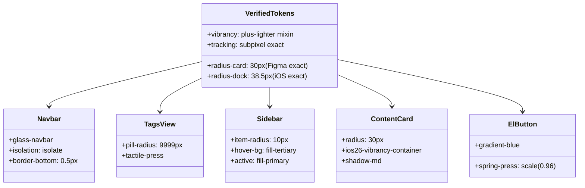

# 本项目现有 UI 适配建议与组件改造对齐清单 (Frontend Adaptation Roadmap)

> ⚠️ **本文档已被 `00_MASTER_frontend_guide.md` 取代。**
> 其中的改造方案建立在 `ios26-vibrancy-container` 这个**已删除**的旧 mixin 之上，
> 并建议使用 `isolation: isolate` 与 hover `translateY(-2px)` —— 这两条经实验证实会
> **直接破坏玻璃效果**（偏差 |Δ| 由 5 恶化到 17~19）。圆角/材质/主色数值亦为旧值。
> 请改用总纲的 §5 迁移路线。本文件保留仅作过程记录。

## 一、当前前端技术架构与现状评估

- **当前技术栈**：Vue 3 + Vite + Element Plus + Pinia + SCSS
- **核心痛点与视觉割裂**：
  1. **圆角非原生**：原先 Element Plus 组件多采用 4px/8px 直角，与 Figma 源文件 `_HSQA - BG` 真实的 **`30px`** 连续超椭圆圆角存在明显割裂；
  2. **材质缺乏物理 Vibrancy**：先前页面背景采用单一平铺的白底或简单半透明，未运用 `mix-blend-mode: plus-lighter` 与双伪元素提纯增亮技术；
  3. **交互缺乏物理弹簧触感**：按钮与模态窗缺少 Apple CASpring 物理阻尼与微缩放。

---

## 二、各组件改造对照检查清单

### 1. 顶部导航栏 (Navbar) 与 多标签页 (TagsView) - [优先级 P0]
- **改造方案**：
  - Navbar 直接引入 `.glass-navbar`，基于 `@include ios26-vibrancy-container` 渲染双伪元素，底部添加物理 `0.5px` 分割线；
  - 标签页激活项采用 `var(--ios26-radius-pill)` 胶囊圆角，点击应用 `ios26-tactile-press` 压感。

---

### 2. 侧边栏菜单 (Sidebar) - [优先级 P0]
- **改造方案**：
  - 侧边栏整体底色设定为 `var(--ios26-bg-secondary)`（#F2F2F7）；
  - 菜单项应用 `var(--ios26-radius-sm)` (10px)，激活态应用 `var(--ios26-fill-primary)` 与 `var(--ios26-color-blue)` 字体。

---

### 3. 内容卡片与工作流画布容器 (Content Card & Canvas) - [优先级 P1]
- **改造方案**：
  - 统一继承 `.liquid-glass-card`，圆角严谨设置为 Figma 真实节点的 **`30px`**；
  - 自动获得 `::before` 增亮透光层与 `::after` 菲涅尔渐变高光边框；
  - 悬停应用 `translateY(-2px)` 与大范围柔和投影。

---

### 4. 按钮与表单控件 (Buttons & Inputs) - [优先级 P1]
- **改造方案**：
  - 主按钮（Primary Button）应用精确的 System Blue 渐变 `linear-gradient(180deg, #0A84FF 0%, #007AFF 100%)`；
  - 混入 `@include ios26-tactile-press`，点击时以 `200ms` Snappy Spring 缩放至 `0.96`；
  - 输入框激活态呈现微光轮廓，去除生硬外框线。

---

### 5. 模态对话框与下拉浮层 (Dialog & Popover / Dropdown) - [优先级 P2]
- **改造方案**：
  - 对话框采用 `var(--ios26-radius-modal)` (26px) 连续圆角；
  - 绑定 `ios26-sheet-spring-in` 弹性回弹入场动画；
  - 面板应用 `blur(40px) saturate(210%)` 高保真材质。
