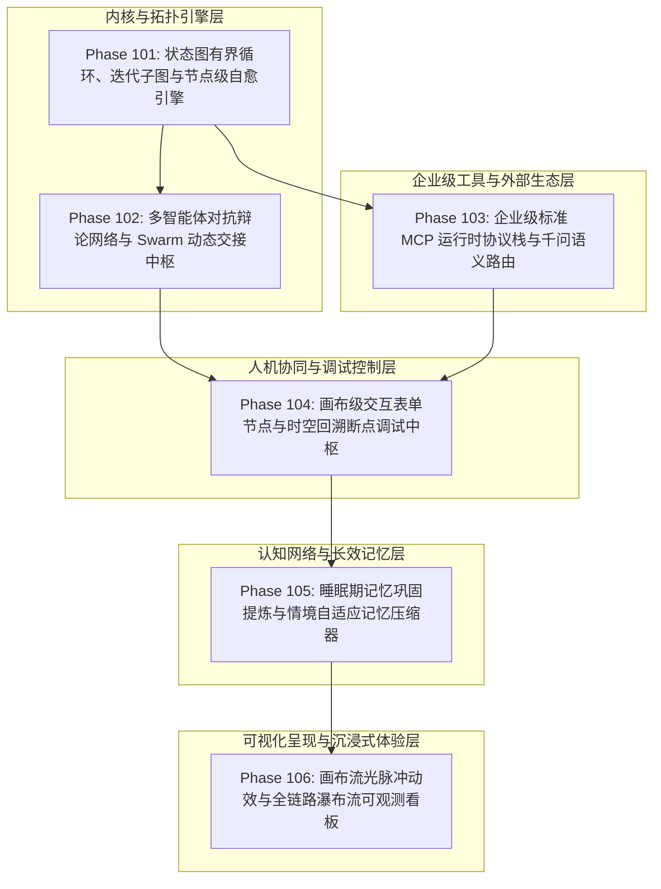

# 企业级 AI-Native 软件智能体编排超融合架构总工程路线图
## (Enterprise AI-Native Agentic Orchestration Master Roadmap: Phase 101 ~ Phase 106)

> **归档路径**：`docs/plans/agent_orchestration_master_roadmap.md`  
> **制定时间**：2026-09-18  
> **战略定位**：严格遵守《业务定位与领域边界铁律（铁律九）》，100% 聚焦于**支柱一：复杂业务 Agent 认知与编排 (Cognitive Orchestration)**、**支柱二：生产级企业 MCP 工具生态 (Enterprise MCP Ecosystem)** 与 **支柱四：前端工作流交互与开发者体验 (Interactive Canvas & HITL Experience)**。  
> **架构模型基线**：唯一生成模型为 **DeepSeek API**（V3 极速推理 / R1 深度推演）；唯一向量模型为 **阿里千问 (Qwen) Embedding**（1536 维超球面几何流形，$\|\mathbf{v}\|_2 = 1.0 \pm 10^{-4}$）；全系统绝无本地部署大模型，彻底弃用 OpenAI API；编译与运行统一使用隔离 **Java 21** 虚拟环境（`/Users/achilles/.sdkman/candidates/java/21.0.5-tem`）。

---

## 一、 规划背景与体系化演进目标

系统在 Phase 01 ~ Phase 100 沉淀了完备的 RAG 知识检索、Hermes 认知中枢、ReAct 循环、多智能体协同竞标与事务挂起恢复能力。然而，在面对更复杂、长链路、高鲁棒性的真实企业级业务需求时，当前的编排内核暴露出六大结构性瓶颈：
1. **拓扑死板**：`DagExecutor` 硬编码了无环图校验（`hasCycle -> throw Exception`），导致闭环迭代、反思纠错、自愈修正等业务场景无法以图拓扑原生承载；
2. **协同单薄**：多智能体局限于“主管分解 -> Worker 竞标执行 -> 主管汇总”的单一星型拓扑，缺乏对抗辩论、交叉验证与动态控制权移交；
3. **工具孤岛**：缺乏对 Anthropic 开源标准 MCP 协议的原生支持，且百量级工具缺乏语义级动态路由过滤（Tool RAG），导致上下文膨胀和幻觉调用；
4. **人机协同脱节**：前端缺少画布级“等待人工表单填写/审批”的交互流转节点，且开发者在排查复杂工作流时无法实现节点级快照回溯（Time-Travel）；
5. **记忆断层**：短期对话与长期向量记忆相对割裂，缺乏后台静默期画像提炼机制，且超长会话极易触发模型上下文溢出；
6. **可观测性盲区**：前端工作流画布缺乏执行中的流光脉冲感知，调试面板缺少全链路分阶段耗时瀑布流（Waterfall Trace）。

为彻底攻克上述瓶颈，规划 Phase 101 至 Phase 106 六大连续战略攻坚子阶段，打造业界首屈一指的企业级智能体编排超融合平台。

---

## 二、 六大子阶段全景规划总览

---

## 三、 子阶段详细规划分解

### 阶段 101：状态图有界循环、迭代子图与节点级自愈引擎 (Phase 101)
- **对应空间**：空间一（拓扑引擎升级）
- **攻坚重心**：
  1. **状态机有界循环图 (StateGraph with Bounded Cycles)**：彻底打破 `DagUtils.hasCycle` 的单一抛错限制，引入 Pregel 计算模型的状态机有界环路执行能力；
  2. **循环收敛门禁与逃逸守卫 (Convergence Gate & LoopGuard)**：每个回跳边（Loop-Back Edge）强制绑定退出条件表达式与最大迭代次数阈值（`maxIterations`），超时或振荡时瞬时熔断并软着陆；
  3. **批处理迭代子图 (Iteration Subgraph)**：支持动态将上游集合拆解为分片，在子图内循环驱动 Agent 处理，最后以 Map-Reduce 汇聚输出；
  4. **节点级失败自愈路由 (Node Self-Healing Router)**：节点执行异常时触发局部捕获，自动调度诊断 Agent 重构参数重试或切入 Fallback 兜底分支。

### 阶段 102：多智能体对抗辩论网络与 Swarm 动态交接中枢 (Phase 102)
- **对应空间**：空间二（协同范式进阶）
- **攻坚重心**：
  1. **多智能体对抗辩论机制 (Multi-Agent Debate Network)**：建立“提案方 (Proponent) - 反方 (Opponent) - 中立仲裁 (Judge)”三方抗辩协议，限定 2~3 轮结构化交锋，利用多视角碰撞强力压低幻觉；
  2. **去中心化交接棒协议 (Swarm Dynamic Handoff)**：实现类似 OpenAI Swarm 的动态上下文移交机制，Agent 运行时可直接执行 `transfer_to_agent` 转移会话控制权；
  3. **多模型专家委员会 (Mixture of Agents - MoA)**：多专业 Agent 并行初答，交叉评审层完成事实校对与高阶合成。

### 阶段 103：企业级标准 MCP 运行时协议栈与千问语义路由 (Phase 103)
- **对应空间**：空间三（企业级工具生态演进）
- **攻坚重心**：
  1. **纯 Java 21 原生 MCP 客户端 (Enterprise MCP Client)**：完整支持 Anthropic Model Context Protocol（JSON-RPC 2.0，兼容 Stdio 与 SSE 双传输模式），支持 Tools / Resources / Prompts 三大规范；
  2. **千问 1536 维超球面工具语义检索 (Tool RAG / Semantic Tool Filtering)**：工具元数据向量化建库，多工具场景下动态召回 Top-5 注入 Prompt，杜绝上下文爆炸；
  3. **高危工具沙箱与审批硬门禁 (High-Risk Tool Safety Gate)**：针对写库、删表、外部推送等敏感工具提供 RBAC 角色鉴权与二次确认（HITL）拦截。

### 阶段 104：画布级交互表单节点与时空回溯断点调试中枢 (Phase 104)
- **对应空间**：空间四（人机协同 HITL 深度）
- **攻坚重心**：
  1. **画布级交互节点 (Interactive Form / Approval Node)**：在可视化 DAG 中支持“人工表单收集”与“审批决策”节点，运行到此节点自动挂起并在前端以优雅抽屉卡片呈现；
  2. **审批超时与降级策略 (Approval Timeout Strategy)**：支持设定有效窗口期，超时自动触发预设降级分支；
  3. **时空回溯断点调试 (Time-Travel Debugging)**：基于不可变节点执行快照，允许开发者在可视化调试面板中自由“倒退”至任意历史节点，修改局部变量后原位重新步进执行。

### 阶段 105：睡眠期记忆巩固提炼与情境自适应记忆压缩器 (Phase 105)
- **对应空间**：空间五（深层记忆网络闭环）
- **攻坚重心**：
  1. **睡眠期画像巩固 Agent (Sleep-Time Memory Consolidator)**：系统空闲或定时触发后台整理，从近期长会话中自动提炼高频实体、偏好规则与纠偏反馈，沉淀至知识图谱并清洗冗余向量碎片；
  2. **情境自适应工作记忆压缩 (Context-Adaptive Working Memory Compressor)**：长链路协同中实时监控 Token 水位，动态对早前轮次的中间执行过程实施层次化语义浓缩，确保推理链完整且永不溢出窗口。

### 阶段 106：前端流光脉冲动效与全链路瀑布流可观测看板 (Phase 106)
- **对应空间**：空间六（前端沉浸式可视化与可观测性）
- **攻坚重心**：
  1. **工作流画布实时流光脉冲动效 (Canvas Energy Flow Animation)**：通过 SSE 双向推送节点状态变化，在 Vue 3 画布上实时渲染节点呼吸光晕与边上的能量粒子脉冲；
  2. **全链路多 Agent 协同瀑布流 (Execution Waterfall Trace)**：层级树状展现意图拆解耗时、Worker 并行耗时、工具执行入参/出参及 Token 消耗分析，打造极致透明的开发者调试体验。

---

## 四、 研发协同与交付铁律

每个子阶段均必须严格执行以下闭环工序：
1. **多智能体对标调研**：学术向智能体深挖论文推导与数学边界，工程向智能体调研业界开源实现与避坑经验，严格输出 14 项必填字段的 Research Ledger；
2. **方案设计汇聚**：汇聚编写 `docs/plans/phase_XX_plan.md`，确立不可变契约、唯一待验证假设与测试方案；
3. **测试驱动开发 (TDD)**：先编写自动化测试用例，再填充业务代码，全量通过单元测试与回归测试；
4. **阶段验证与进度归档**：在真实环境下完成端到端验证，更新 `walkthrough.md` 与总进度后方可迈入下一阶段。
