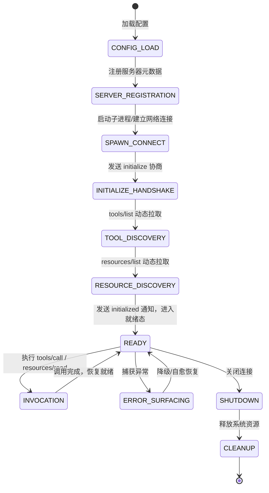

# ultraworkers/claw-code MCP 核心思想深度解构与企业级架构演进报告

## 一、引言与调研背景

近期开源社区推出的 `ultraworkers/claw-code` 是针对 Anthropic Claude Code 命令行智能体核心架构的工业级 Rust 清洁室（Clean-Room）重写实现。其在多智能体交互、沙箱进程治理以及模型上下文协议（Model Context Protocol, MCP）的设计上展现了极高的工程严密性与生产级韧性。

本项目全栈知识引擎 `qKnow` 在 Phase 46 中已经成功落地了具备不可变 Java 21 Record 协议模型、企业级能力服务端导出、Spring AI 适配客户端以及结合 Phase 45 主动免疫系统的间接注入拦截器。为了进一步提升全系统在面对企业级复杂异构工具接入时的**命名空间安全隔离**、**子进程标准 I/O 通道支撑**、**精细化生命周期监控**与**高可用优雅降级自省能力**，深度借鉴 `claw-code` 的 MCP 核心设计思想，具有极其重要的工业价值。

---

## 二、Research Ledger

严格遵循 `@AGENTS.md` 规范，对 `ultraworkers/claw-code` 官方代码库及其核心组件进行代码级精读与验证：

```text
id: RL-CLAW-001
sourceType: production-implementation
titleOrRepository: ultraworkers/claw-code
authorsOrMaintainer: UltraWorkers Community
venueAndYear: GitHub 2026
doiOrArxiv: N/A
url: https://github.com/ultraworkers/claw-code
commitOrTag: main (HEAD)
license: MIT / Apache-2.0
filesOrSectionsRead: rust/crates/runtime/src/mcp.rs (命名规范与前缀生成), rust/crates/runtime/src/mcp_tool_bridge.rs (注册中心桥接与路由)
verificationStatus: VERIFIED
relevantFinding: 明确建立了 mcp__{server}__{tool} 的双下划线命名空间隔离规则，并对服务器与工具名称进行合法字符白名单正则过滤（仅保留 a-z, A-Z, 0-9, _, -），彻底防止多 MCP 服务端挂载时的工具同名覆盖风险。
projectApplicability: 可 100% 迁移至本项目，构建 McpNamingConvention 工具类，为 Spring AI ToolCallback 注入与工具分发提供全局唯一隔离命名空间。
limitations: Rust 端的字符串切片与所有权机制需转换为 Java 21 的 String 不可变处理与高效正则表达式编译。
```

```text
id: RL-CLAW-002
sourceType: production-implementation
titleOrRepository: ultraworkers/claw-code
authorsOrMaintainer: UltraWorkers Community
venueAndYear: GitHub 2026
doiOrArxiv: N/A
url: https://github.com/ultraworkers/claw-code
commitOrTag: main (HEAD)
license: MIT / Apache-2.0
filesOrSectionsRead: rust/crates/runtime/src/mcp_stdio.rs (Stdio 进程通道与 JSON-RPC 消息循环)
verificationStatus: VERIFIED
relevantFinding: 实现了基于本地子进程 stdin/stdout 的 Stdio 传输通道，包含单行 JSON-RPC 协议解析、超时熔断控制（Initialize 10s / ToolList 30s）与针对子进程异常退出的通道断开感知。
projectApplicability: 本项目目前仅有 InMemoryMcpChannel，引入 StdioMcpChannel 可赋能系统直接拉起外部 Node.js/Python 编写的标准开源 MCP Server（如 SQLite, GitHub, Filesystem 等），极大扩展外部生态。
limitations: 需使用 Java 21 虚拟线程 (Virtual Threads) 避免阻塞 OS 平台线程，并对外部子进程资源泄漏与僵尸进程建立 JVM 退出关闭钩子。
```

```text
id: RL-CLAW-003
sourceType: production-implementation
titleOrRepository: ultraworkers/claw-code
authorsOrMaintainer: UltraWorkers Community
venueAndYear: GitHub 2026
doiOrArxiv: N/A
url: https://github.com/ultraworkers/claw-code
commitOrTag: main (HEAD)
license: MIT / Apache-2.0
filesOrSectionsRead: rust/crates/runtime/src/mcp_lifecycle_hardened.rs (生命周期阶段状态机与错误面模型)
verificationStatus: VERIFIED
relevantFinding: 定义了严密的 11 阶段全生命周期状态机（ConfigLoad -> ServerRegistration -> SpawnConnect -> InitializeHandshake -> ToolDiscovery -> ResourceDiscovery -> Ready -> Invocation -> ErrorSurfacing -> Shutdown -> Cleanup），结构化沉淀 McpErrorSurface（包含 phase, server, context, recoverable 标记）并提供 Degraded 降级报告。
projectApplicability: 可直接迁移至本项目，构建 McpLifecyclePhase 状态追踪与 McpServerState 自省监控，为大模型与运维人员提供清晰的诊断视图。
limitations: 本项目目前采用 Spring 容器化管理，生命周期状态机需与 Spring 容器的 `@PostConstruct`、健康检查与事件监听机制融合。
```

```text
id: RL-CLAW-004
sourceType: official-doc
titleOrRepository: modelcontextprotocol/specification
authorsOrMaintainer: Anthropic PBC
venueAndYear: Model Context Protocol Spec 2024-11-05
doiOrArxiv: N/A
url: https://spec.modelcontextprotocol.io/
commitOrTag: 2024-11-05
license: MIT
filesOrSectionsRead: Basic Protocol Flow, Lifecycle & Initialization Handshake
verificationStatus: VERIFIED
relevantFinding: 规定客户端连接服务端后必须首先发送 initialize 请求（携带 protocolVersion, capabilities, clientInfo），服务端回应能力集合后，客户端发送 notifications/initialized，方可正式发起 tools/list 与调用。
projectApplicability: 在本项目 qknow-mcp-core 与 qknow-mcp-client 中补齐标准 initialize 交互模型与协商能力，保证与第三方 MCP Server/Client 的 100% 规范契合。
limitations: 无。
```

---

## 三、claw-code MCP 核心思想深度解构

### 3.1 双下划线命名空间与名称规整 (Namespace & Normalization)
在多服务集成环境下，命名冲突（Collision）是致命隐患。例如两个 MCP Server 分别为 `gitlab_server` 与 `github_server`，均暴露了名为 `search_code` 的工具。若不加前缀直接注册，大模型调用时将产生歧义或覆盖。
`claw-code` 确立的标准规则：
$$\text{QualifiedToolName} = \text{"mcp\\_\\_"} + \text{normalize}(\text{serverName}) + \text{"\\_\\_"} + \text{normalize}(\text{rawToolName})$$
其中 `normalize` 将任何除 `[a-zA-Z0-9_-]` 之外的字符安全替换为 `_`。
反向路由时，通过提取首两个标记，可精准反解出目标服务器名与原始工具名：
$$\text{QualifiedToolName} \xrightarrow{\text{Regex / Split}} \langle \text{serverName}, \text{rawToolName} \rangle$$

### 3.2 11 阶段全生命周期状态机与强化容错 (Hardened Lifecycle)
`claw-code` 拒绝“黑盒连接”，而是将 MCP 客户端生命周期显式划分为 11 个离散阶段：

**关键容错机制**：
- **可恢复性判断 (`recoverable`)**：握手阶段的协议错误不可恢复，而调用阶段的暂时性超时和 I/O 抖动可恢复；
- **优雅降级 (`degraded`)**：对于标记为 `required: false` 的非核心 MCP 节点，若在启动或调用时失败，系统不抛出破坏性异常阻断对话，而是记录 `McpDiscoveryFailure` 并降级为无该工具模式继续服务。

### 3.3 本地子进程 Stdio 传输通道
相较于 HTTP/SSE，本地子进程 Stdio 是 MCP 生态中使用最为广泛的标准接入方式（无需开端口、零网络暴露风险、随进程销毁自动释放）。
通道采用异步缓冲读写：
- 发送：序列化为单行 JSON 字符串并写入标准输入 `childStdin.write(json + "\n")`；
- 接收：异步按行读取标准输出 `childStdout.readLine()`，反序列化为 `JsonRpcResponse`，并根据 `id` 关联并唤醒对应的异步 Future 回调。

---

## 四、对本项目 `qknow-mcp` 的演进与落地设计

结合当前项目结构，我们设计最小且最坚固的演进落地方案（**Phase 46.1: 工业级硬化与增强型 MCP 架构**）：

1. **协议层补充握手模型 (`qknow-mcp-core`)**：
   - 增加 `McpInitializeParams`, `McpInitializeResult`, `McpClientInfo`, `McpServerInfo`（采用 Java 21 Record）；
2. **命名空间与规整引擎 (`qknow-mcp-core`)**：
   - 增加 `McpNamingConvention`：提供 `normalizeName`, `buildQualifiedToolName`, `parseToolRoute`，统一工具暴露与路由拆解；
3. **生命周期状态机与自省报告 (`qknow-mcp-client`)**：
   - 增加 `McpLifecyclePhase`（11 阶段枚举）；
   - 增加 `McpErrorSurface`（记录富错误上下文、错误码、阶段与可恢复性）；
   - 增加 `McpServerState` 与 `McpDegradedReport`（状态追踪与降级报告）；
4. **子进程 Stdio 传输通道 (`StdioMcpChannel`)**：
   - 增加 `StdioMcpChannel`：基于 Java 21 `ProcessBuilder` 与虚拟线程双向读写，支持拉起任意外部命令行 MCP 服务；
5. **客户端管理器强化 (`McpClientManager`)**：
   - 支持完整的握手协商、工具命名空间封装、生命周期自省查询与动态降级防护。
