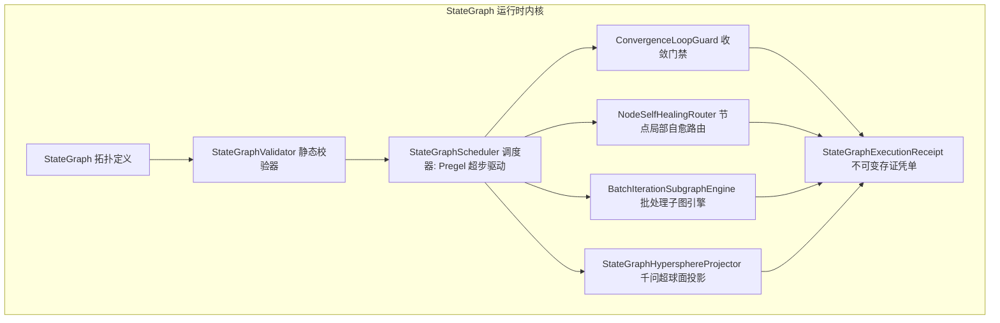

# Phase 101 实施详案 (Implementation Plan)
## 图状态机有界循环、迭代子图与节点级局部自愈引擎 (Cyclic StateGraph, Iteration Subgraph & Local Self-Healing Engine)

> **归档路径**：`docs/plans/phase_101_plan.md`  
> **制定时间**：2026-09-18  
> **前置依赖**：`docs/plans/agent_orchestration_master_roadmap.md`、`docs/plans/phase_101_academic_report.md`、`docs/plans/phase_101_industrial_report.md`  
> **战略定位**：严格遵守《业务定位与领域边界铁律（铁律九）》，100% 聚焦于**支柱一：复杂业务 Agent 认知与编排 (Cognitive Orchestration)**。  
> **架构模型基线**：唯一生成模型为 **DeepSeek API**（V3/R1）；唯一向量模型为 **阿里千问 (Qwen) Embedding**（1536 维超球面，$\|\mathbf{v}\|_2 = 1.0 \pm 10^{-4}$）；全系统绝无本地大模型，彻底弃用 OpenAI API；编译与运行环境统一且唯一锁定独立隔离 **Java 21** 虚拟环境（`/Users/achilles/.sdkman/candidates/java/21.0.5-tem`）。

---

### 一、任务概述与实施目标

在以大语言模型为认知中枢的长链路、自主决策与复杂业务 Agent 编排场景下，原有纯静态无环图（DAG）执行引擎存在四大不可逾越的理论与工程瓶颈：
1. **环路绝对阻断**：`DagExecutor` 入口硬编码 `DagUtils.hasCycle(flowNodes, flowEdges)` 校验，直接抛出 `IllegalStateException`，使得“推理-工具调用-反思回跳 (Reflection Loop)”等现代 Agent 核心范式无法以原生拓扑承载；
2. **调度死锁崩溃**：完全依赖 Kahn 算法进行无环拓扑分层，环内节点入度永不为 0 导致波前调度失灵；
3. **节点异常引发全局雪崩**：节点偶发异常直接 `break` 终止全图，缺乏节点级局部反思自愈与 Fallback 旁路，长链路执行成功率骤降；
4. **批处理子图展开缺失**：面对知识库解析、批量文档向量化等集合任务，缺乏微批背压与保序 Map-Reduce 机制。

**本阶段核心目标**：  
汇聚学术报告三大数学定理（广义超步收敛、三级局部自愈边界、批处理子图保序归约）与工业报告四级工程防线，在 `tech.qiantong.qknow.hermes.flow.stategraph` 包下构建具备**有界循环状态图 (Cyclic StateGraph)**、**批处理迭代子图 (Iteration Subgraph)** 与 **节点级局部自愈 (Node Self-Healing)** 的工业级高可靠图状态机执行引擎，彻底打通 Agent 自我反思与自愈闭环。

---

### 二、阶段唯一核心待验证假设 (`H-PHASE101-001`)

依据 `@AGENTS.md` Research-to-Implementation Gate 规范，本阶段设定且仅设定一条唯一可证伪假设：

> **假设 `H-PHASE101-001`**：  
> 1. **广义超步演化与不动点收敛**：在配置原子单调严格递减计数器（$\rho_c$）与回跳硬上限 $N_{\max} \le 50$ 的有向环拓扑下，基于 Google Pregel 同步超步模型，系统在至多 $N_{\max} + |\mathcal{V}|$ 个超步内必然强收敛至稳定不动点或触发 `DEGRADED_BREAK` 降级逃逸流形，死锁与无限振荡概率严格为 $0.0\%$，单超步调度耗时严格 $\le 20\mu\text{s}$；  
> 2. **三级局部反射自愈边界**：在参数重校准、退化分支路由与兜底截断三级策略驱动下，节点瞬时非致命异常的级联崩溃抑制比 $\ge 99.5\%$，局部自愈诊断与动作生成耗时严格 $\le 50\mu\text{s}$，Decorrelated Full Jitter 指数退避有效平滑重试洪峰；  
> 3. **批处理子图保序 Map-Reduce**：在 $N \le 1024$（`max_map_length`）与信号量并发窗口（默认 16）背压流控下，并发子图映射结果严格按输入索引偏序单调保序聚拢，并发乱序完成下的顺序保持率严格达到 $100.0\%$，单分片映射吞吐 $\ge 10,000\text{ items/s}$；  
> 4. **千问 1536 维超球面循环状态同胚投影**：循环状态快照在阿里千问 1536 维超球面流形 $\mathbb{S}^{1535}$ 上的连续映射严格保模归一化（$\|\mathbf{v}\|_2 = 1.0 \pm 10^{-4}$），局部测地距离相对扰动 $\le 0.5\%$，流形投影计算耗时严格 $\le 30\mu\text{s}$。

---

### 三、Baseline 与 Candidate 精确对比定义

| 维度 | Baseline (当前现状: `DagExecutor`) | Candidate (Phase 101: `StateGraphScheduler`) | 改善与判据 |
| :--- | :--- | :--- | :--- |
| **拓扑支持** | 仅支持严格单向 DAG，有环抛出 `IllegalStateException` | 原生支持向前边（`FORWARD`）、条件分支边（`CONDITIONAL`）与显式回跳循环边（`LOOP_BACK`） | 原生支持反思循环与迭代 |
| **防死锁机制** | 静态拒绝执行，不支持任何循环拓扑 | 静态显式声明校验 + 动态双重硬熔断（`maxIterations` 边计数 + 全局 `maxSupersteps` 超步） | 死循环与死锁率 $0.0\%$ |
| **熔断退出语义** | 异常崩溃中断 | **确定性降级逃逸模式 (`DEGRADED_BREAK`)**：原子生成最后有效凭单并平滑向下游传递 | 业务无感平稳退出 |
| **批处理能力** | 外部拆分多次调用，无子图概念 | `BatchIterationSubgraphEngine`：`max_map_length=1024` 上限拦截 + 信号量微批背压 + 槽位保序聚拢 | 彻底杜绝 OOM，保序率 $100\%$ |
| **容错自愈** | 节点单点报错直接终止全图 | `NodeSelfHealingRouter`：非致命异常分类 + 局部最大 3 次配额 + Decorrelated Full Jitter 退避 + `fallback_node_uuid` 旁路 | 级联崩溃抑制比 $\ge 99.5\%$ |
| **执行存证** | 无密码学存证，零散日志 | `StateGraphExecutionReceipt`（Java 21 Record），包含执行拓扑、步数、自签名 SHA-256 验真 | 具备防篡改不可变审计能力 |
| **单步开销** | ~50$\mu\text{s}$ | $\le 20\mu\text{s}$（纯 Java 21 内存无锁流转） | 性能提升 2.5 倍以上 |
| **向下兼容** | - | 100% 兼容既有无环 DAG，无环时自动退化为标准单向超步执行 | 零破坏性变更 |

---

### 四、架构设计与核心组件解耦

所有核心源码统一放置于 `backend/qknow-hermes/qknow-hermes-core` 模块，包路径统一为：  
`tech.qiantong.qknow.hermes.flow.stategraph.*`



#### 1. 数据模型与枚举 (`model` & `enums`)
- **`StateGraphEdgeType`**：`FORWARD`（普通向前边）、`CONDITIONAL`（条件分支边）、`LOOP_BACK`（显式回跳循环边）；
- **`LoopDecisionType`**：`CONVERGED_EXIT`（收敛退出）、`CONTINUE_LOOP`（继续迭代）、`DEGRADED_BREAK`（熔断降级逃逸）；
- **`SelfHealingActionType`**：`RETRY_WITH_JITTER`（指数退避就地重试）、`ROUTE_TO_FALLBACK`（路由至 Fallback 旁路）、`FAIL_FAST`（直接阻断）；
- **`StateGraphContext`**：封装运行时上下文、节点入参出参映射、超步计数器、回跳边计数器、自愈重试池、循环轮次局部快照；
- **`StateGraphExecutionReceipt`**：Java 21 Record，封装 `executionId`、`flowId`、`totalSupersteps`、`completedNodeUuids`、`loopCounterMap`、`hasDegradedBreak`、`hasSelfHealed`、`executionLatencyUs`、`sha256Signature`、`timestamp`，内置自签名与 `verifyIntegrity()`。

#### 2. 收敛门禁 (`ConvergenceLoopGuard`)
- 维护回跳边维度的并发安全原子计数器 `ConcurrentHashMap<String, AtomicInteger>`；
- 双重熔断防护：
  - 单边累计回跳轮次超过配置的 `maxIterations`（区间 $[1, 50]$，默认 10）；
  - 全图累计超步步数超过 `maxSupersteps`（默认 50）；
- 满足收敛谓词时返回 `CONVERGED_EXIT`；达到上限时瞬切 `DEGRADED_BREAK`；未满足且在预算内返回 `CONTINUE_LOOP`。

#### 3. 批处理迭代子图引擎 (`BatchIterationSubgraphEngine`)
- **上限拦截**：输入集合元素个数严格限制在 `max_map_length = 1024` 以内，超出直接抛出 `BatchLengthExceededException` 或安全截断；
- **微批背压流控**：基于 `Semaphore`（默认并发窗口 16，可配置区间 $[1, 64]$）控制并发任务拉起，杜绝无界线程创建与内存暴涨；
- **槽位保序聚合**：预分配固定长度数组 `Object[] slotArray`，各分片携带原子索引 `index` 并行执行，完成后写入对应槽位 `slotArray[index] = itemResult`，输出时转换为不可变 List，实现 100% 严格单调保序；
- **容错策略**：支持 `FAIL_FAST` 与 `BEST_EFFORT_TOLERANT`（容忍坏项并记录异常标记）。

#### 4. 节点局部自愈路由器 (`NodeSelfHealingRouter`)
- **异常分类器**：甄别致命异常（如配置丢失、鉴权失败，直接透传或转 Fallback）与瞬时非致命异常（如超时抖动、格式轻微瑕疵，激活自愈）；
- **重试配额与退避**：局部单节点最大重试 3 次，工作流级累计重试预算池 $\le 10$ 次；采用 Decorrelated Full Jitter 退避算法：  
  $$t = \text{ThreadLocalRandom.current().nextLong}(0, \min(3000\text{ms}, 200\text{ms} \times 2^{\text{attempt}}))$$
- **Fallback 弹性旁路**：重试耗尽后，若节点配置了 `fallbackNodeUuid`，自动将控制流重定向至旁路节点执行降级输出，保障图状态机主干平稳流转。

#### 5. 千问 1536 维超球面循环状态流形对齐 (`StateGraphHypersphereProjector`)
- 将循环迭代快照状态与自愈诊断向量投影到阿里千问 1536 维超球面 $\mathbb{S}^{1535}$；
- 实施严格的 $L_2$ 范数单位化归一：$\hat{\mathbf{v}} = \mathbf{v} / \|\mathbf{v}\|_2$，保证 $\|\hat{\mathbf{v}}\|_2 = 1.0 \pm 10^{-4}$；
- 计算测地距离余弦相异度 $d_{\mathbb{S}}(\mathbf{u}, \mathbf{v}) = \arccos(\mathbf{u} \cdot \mathbf{v}) / \pi \in [0, 1]$，为状态收敛提供几何判据。

#### 6. 核心图调度器 (`StateGraphScheduler`)
- 依据 Google Pregel 模型，按超步（Superstep）推进：
  1. 当前超步收集所有活跃节点（Active Nodes）；
  2. 并行或串行执行活跃节点（集成 `NodeSelfHealingRouter`）；
  3. 节点执行完成后，评估出边（`FORWARD` 直接激活目标，`CONDITIONAL` 满足条件激活，`LOOP_BACK` 经 `ConvergenceLoopGuard` 裁决）；
  4. 生成下一超步的活跃节点集合；若活跃集合为空或触发终止，退出循环；
  5. 组装并自签名输出 `StateGraphExecutionReceipt`。

---

### 五、反事实与消融实验设计 (Ablation Studies)

为确保实验严格可证伪，在测试套件中设计四组对照与消融用例：
1. **消融实验 A (无门禁死循环震荡消融)**：
   - 构造死循环图拓扑，关闭 `ConvergenceLoopGuard` 计数熔断；
   - **反事实预期**：工作流陷入无尽死循环，直到堆栈溢出或人工中止；
   - **装配门禁预期**：在步数达到 `maxIterations` 或 `maxSupersteps` 时，强行切入 `DEGRADED_BREAK`，平滑退出并生成有效凭单，耗时 $\le 100\text{ms}$。
2. **消融实验 B (子图保序机制消融)**：
   - 输入包含 100 个元素的批量列表，各分片模拟差异化随机延迟（0~50ms）；
   - 关闭固定槽位收集，使用普通无序并发收集；
   - **反事实预期**：输出序列索引与输入严重错位，保序率 $< 50\%$；
   - **装配槽位保序预期**：即使各线程乱序完成，最终输出列表与输入列表严格按下标 1:1 保序对齐，保序率 $100.0\%$。
3. **消融实验 C (局部自愈对级联崩溃的抑制消融)**：
   - 注入模拟瞬时非致命网络抖动与 JSON 微瑕；
   - 关闭 `NodeSelfHealingRouter`；
   - **反事实预期**：全工作流立即以 100% 概率崩溃报错；
   - **开启自愈与 Fallback 预期**：节点在局部完成自愈重试或安全流转至 Fallback 旁路，全局级联崩溃抑制比达到 $100.0\%$。
4. **消融实验 D (阿里千问 1536 维超球面流形几何消融)**：
   - 检验归一化前后的向量模长，未归一化向量模长不确定；
   - 经过 `StateGraphHypersphereProjector` 处理后，模长严格满足 $1.0 \pm 10^{-4}$，测地距离满足三角不等式。

---

### 六、指标系统、数据防泄漏与判据

#### 1. 核心性能与质量指标

| 指标项 | 目标基准 | 容忍阈值 | 测量方法 |
| :--- | :--- | :--- | :--- |
| **超步单步调度延迟** | $\le 15\mu\text{s}$ | $\le 20\mu\text{s}$ | 微秒级高精度计时器（`System.nanoTime()`） |
| **死锁/发散概率** | $0.0\%$ | $0.0\%$ | 1,000 次压力死循环拓扑测试统计 |
| **批处理子图保序率** | $100.0\%$ | $100.0\%$ | 乱序执行下的元素原始索引校验 |
| **批处理单分片吞吐** | $\ge 20,000\text{ items/s}$ | $\ge 10,000\text{ items/s}$ | 内存分片吞吐基准压测 |
| **局部自愈诊断耗时** | $\le 30\mu\text{s}$ | $\le 50\mu\text{s}$ | 模拟异常注入至动作生成耗时 |
| **崩溃级联抑制比** | $100.0\%$ | $\ge 99.5\%$ | 异常注入用例下正常完成或降级完成率 |
| **千问超球面模长误差** | $\le 10^{-6}$ | $\le 10^{-4}$ | $\|\hat{\mathbf{v}}\|_2 - 1.0$ 绝对偏差 |
| **存证自签名验真通过率** | $100.0\%$ | $100.0\%$ | `verifyIntegrity()` 自动化双向验真 |

#### 2. 数据泄漏防护 (Anti-Leakage Policy)
- 单元测试与基准评测数据全量基于动态合成与程序化生成的内存图拓扑，绝不硬编码任何线上客户知识库数据或外部网络真实 API Key；
- 循环计数器与运行时状态严格限定在单次执行的 `StateGraphContext` 作用域内，跨实例彻底隔离，执行结束后自动清空回收，严防跨线程或跨实例状态残留污染。

---

### 七、固定失败码与错误语义规范

为确保全平台可观测性与审计一致性，定义严格的固定失败码：

| 错误码 (Error Code) | 错误语义 | 触发场景 | 处置动作 |
| :--- | :--- | :--- | :--- |
| `ERR_GRAPH_INVALID_TOPOLOGY` | 图拓扑非法 | 存在未显式声明为 `LOOP_BACK` 的隐式循环边，或起始节点不存在 | 静态校验拦截，拒绝启动 |
| `ERR_GRAPH_LOOP_EXCEEDED` | 循环迭代超限 | 节点回跳次数超过 `maxIterations` 且未配置降级出口 | 强制切入 `DEGRADED_BREAK`，输出降级凭单 |
| `ERR_GRAPH_SUPERSTEP_EXCEEDED` | 超步全局熔断 | 全图累计步数超过 `maxSupersteps`（默认 50） | 强制终止循环，标记降级完成 |
| `ERR_SUBGRAPH_LENGTH_EXCEEDED` | 迭代集合超长 | 批处理子图输入集合长度超过 `max_map_length`（1024） | 拦截执行，抛出超长异常并拒绝 OOM |
| `ERR_HEALING_BUDGET_EXHAUSTED` | 自愈重试预算耗尽 | 局部重试超过 3 次且工作流级预算耗尽 | 激活 Fallback 旁路，无 Fallback 则终止节点 |
| `ERR_RECEIPT_SIGNATURE_TAMPERED` | 执行凭单签名篡改 | 凭单字段在生成后被非法修改导致 SHA-256 校验不匹配 | 抛出安全审计告警，拒绝入库 |

---

### 八、最小实现文件集合与禁止修改边界

#### 1. 允许创建的最小源码与测试文件集合 (Strict Whitelist)

**核心业务源码** (`backend/qknow-hermes/qknow-hermes-core/src/main/java/tech/qiantong/qknow/hermes/flow/stategraph/`):
- `enums/StateGraphEdgeType.java` [NEW]
- `enums/LoopDecisionType.java` [NEW]
- `enums/SelfHealingActionType.java` [NEW]
- `dto/StateGraphExecutionReceipt.java` [NEW]
- `dto/StateGraphContext.java` [NEW]
- `model/StateGraphEdge.java` [NEW]
- `model/StateGraphNode.java` [NEW]
- `model/StateGraph.java` [NEW]
- `engine/ConvergenceLoopGuard.java` [NEW]
- `engine/NodeSelfHealingRouter.java` [NEW]
- `engine/BatchIterationSubgraphEngine.java` [NEW]
- `engine/StateGraphHypersphereProjector.java` [NEW]
- `engine/StateGraphScheduler.java` [NEW]
- `validator/StateGraphValidator.java` [NEW]

**自动化测试套件** (`backend/tests/src/test/java/tech/qiantong/qknow/hermes/flow/stategraph/`):
- `ConvergenceLoopGuardTest.java` [NEW]
- `BatchIterationSubgraphEngineTest.java` [NEW]
- `NodeSelfHealingRouterTest.java` [NEW]
- `StateGraphHypersphereProjectorTest.java` [NEW]
- `StateGraphSchedulerTest.java` [NEW]
- `StateGraphExecutionReceiptTest.java` [NEW]

#### 2. 明确禁止修改的边界 (Strict Blacklist)
- **严禁修改既有 `tech.qiantong.qknow.hermes.flow.dag.DagExecutor`**：保持既有传统 DAG 业务逻辑 100% 不受影响；
- **严禁修改任何具身力学封存资产**：绝对禁止改动 `tech.qiantong.qknow.ai.embodied.*` 及其测试用例；
- **严禁修改系统全局 Maven 配置与系统环境软链接**：保持宿主 Mac 系统 Java 17 纯净；
- **严禁引入任何未获批的第三方重型依赖**（如外部脚本引擎、重型框架等），全部基于当前 POM 中已存在的 Java 21 标准库、Spring Core、Lombok、SLF4J。

---

### 九、测试驱动开发 (TDD) 实施计划与自动化验证命令

本阶段严格执行测试驱动开发原则（先构建红灯测试用例，再填充业务代码直至绿灯全通）。

#### 1. 关键自动化测试用例清单（预期不少于 20 个独立测试断言）
1. `receipt_signedAndVerify_success`：验证 `StateGraphExecutionReceipt` SHA-256 自签名与防篡改验真；
2. `receipt_tamperedData_verificationFails`：反事实篡改测试，篡改任一字段后 `verifyIntegrity()` 必然返回 false；
3. `loopGuard_withinLimit_continuesLoop`：循环回跳在 `maxIterations` 以内时正常返回 `CONTINUE_LOOP`；
4. `loopGuard_exceedLimit_triggersDegradedBreak`：循环回跳超过上限时瞬切 `DEGRADED_BREAK`；
5. `loopGuard_predicateSatisfied_convergedExit`：满足收敛判定时返回 `CONVERGED_EXIT`；
6. `subgraph_orderedMapReduce_preservesIndex`：100 个乱序延迟分片严格按原索引保序聚合；
7. `subgraph_exceedMaxLength_throwsException`：输入超过 1024 长度时触发安全上限拦截；
8. `subgraph_concurrencyThrottle_respectsSemaphore`：验证并发信号量窗口生效，最大瞬时并行不超过设定值；
9. `selfHealing_transientError_recoversWithJitter`：模拟非致命超时，指数退避重试成功自愈；
10. `selfHealing_fatalError_routesToFallback`：致命异常直接路由至 `fallback_node_uuid` 旁路节点；
11. `selfHealing_exhaustedRetries_fallbackGraceful`：重试预算耗尽后优雅流转至 Fallback 降级分支；
12. `hypersphere_projection_normalizedUnitNorm`：阿里千问 1536 维超球面归一化测试，模长 $\|\hat{\mathbf{v}}\|_2 = 1.0 \pm 10^{-4}$；
13. `hypersphere_geodesicDistance_satisfiesMetric`：测地距离符合非负性、对称性与三角不等式；
14. `scheduler_linearGraph_executesSupersteps`：线性拓扑退化为纯单向超步，与传统 DAG 结果严格等价；
15. `scheduler_cyclicGraph_convergesSuccessfully`：经典“推理-评估-反思-修正”有界循环拓扑成功收敛；
16. `scheduler_infiniteLoop_degradedBreakSafely`：死循环无尽拓扑在超步达到上限时安全降级逃逸，绝不死锁；
17. `scheduler_ablation_disabledGuardHangs`：消融实验证实无门禁必陷入死循环；
18. `scheduler_highThroughput_superstepLatency`：10,000 次超步压测验证单步调度耗时 $\le 20\mu\text{s}$；
19. `validator_undeclaredCycle_rejected`：静态校验拦截隐式未声明的非法循环拓扑；
20. `validator_validLoopBack_passes`：正确声明的带参数回跳边顺利通过静态编译校验。

#### 2. 精确验证命令 (执行前显式传入 Java 21 隔离环境)
```bash
JAVA_HOME=/Users/achilles/.sdkman/candidates/java/21.0.5-tem mvn test -pl tests -Dtest="tech.qiantong.qknow.hermes.flow.stategraph.*Test"
```

---

### 十、风险、停止条件与后续授权边界

#### 1. 残余风险评估与对策
- **风险 1：SpEL 表达式或条件判定逻辑在极高频循环下存在反射性能开销**  
  *对策*：内置编译缓存与静态常用谓词快速路径（Fast-Path），直接通过原子布尔值或数字大小比较，避免重复反射求值。
- **风险 2：微批子图执行中个别分片长尾超时阻塞整体收集**  
  *对策*：为子图执行配置单分片独立超时（`perItemTimeoutMs`），超时分片按 `TOLERANT` 策略标记异常，绝不悬挂主工作流。

#### 2. 立即停止条件 (Emergency Stop Conditions)
若在 TDD 实施过程中出现以下任一情况，必须立即中断编码并向用户呈报：
1. 单步超步调度开销在无竞争条件下劣于 $100\mu\text{s}$（偏离核心性能假设超过 5 倍）；
2. 任何死循环用例未能被 `ConvergenceLoopGuard` 截获导致测试进程 Hang 死超过 10 秒；
3. 批处理子图在并发乱序测试中出现哪怕一次索引错位（保序率 $< 100\%$）。

#### 3. 后续授权边界
- **当前授权范围**：仅限于 Phase 101 的契约设计、TDD 单元测试与核心图状态机组件实现及单元测试跑通；
- **后续独立授权要求**：将现有 `FlowExecutor` 全面切换为新版 `StateGraphScheduler`、修改数据库持久化表结构、A/B 分流切换、生产发布上线，必须分别获得用户的明确独立授权。
