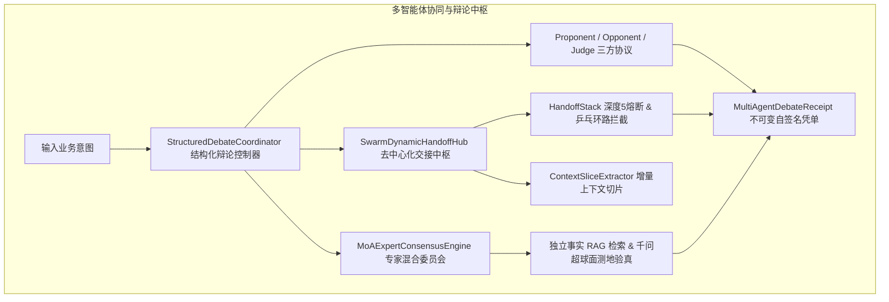

# Phase 102 实施详案 (Implementation Plan)
## 多智能体对抗辩论网络、Swarm 去中心化交接棒协议与多模型专家委员会 (Multi-Agent Dynamic Debate Network, Decentralized Swarm Handoff & Mixture-of-Agents Consensus Hub)

> **归档路径**：`docs/plans/phase_102_plan.md`  
> **制定时间**：2026-09-18  
> **前置依赖**：`docs/plans/agent_orchestration_master_roadmap.md`、`docs/plans/phase_102_academic_report.md`、`docs/plans/phase_102_industrial_report.md`  
> **战略定位**：严格遵守《业务定位与领域边界铁律（铁律九）》，100% 聚焦于**支柱一：复杂业务 Agent 认知与编排 (Cognitive Orchestration)**。  
> **架构模型基线**：唯一生成模型为 **DeepSeek API**（V3/R1）；唯一向量模型为 **阿里千问 (Qwen) Embedding**（1536 维超球面，$\|\mathbf{v}\|_2 = 1.0 \pm 10^{-4}$）；全系统绝无本地大模型，彻底弃用 OpenAI API；编译与运行环境统一且唯一锁定独立隔离 **Java 21** 虚拟环境（`/Users/achilles/.sdkman/candidates/java/21.0.5-tem`）。

---

### 一、任务概述与实施目标

在复杂业务长链路决策场景下，传统的“单 Agent 串行推演”与“星型中心化主管分派”暴露出三项本质性工业架构瓶颈：
1. **单点认知局限与自评盲区 (Confirmation Bias & Blind Spot)**：单一 Agent 极易陷入思维定式与自我验证幻觉，单智能体自反思由于自回归偏置无法打破“自圆其说”；
2. **中心化主管瓶颈与上下文稀释 (Centralized Bottleneck & Context Dilution)**：星型架构依赖中心化 Supervisor 频繁中转，调度延迟高且全量历史复制导致上下文剧烈膨胀失真；
3. **去中心化交接缺乏工程护栏 (Lack of Handoff Rails & Consensus Convergence)**：缺乏交接深度熔断与防环机制，极易引发 A->B->A 乒乓振荡死锁、无限抬杠与伪共识从众。

**本阶段核心目标**：  
汇聚学术报告四大数学定理/命题（李雅普诺夫辩论共识收敛定理、Swarm 交接防环不变性定理、MoA 交叉评审事实误差压缩定理、千问 1536 维超球面测地耗散命题）与工业报告四级工程防线，在 `tech.qiantong.qknow.hermes.agent.swarm` 包下构建具备**结构化对抗辩论 (StructuredDebateCoordinator)**、**Swarm 动态上下文交接中枢 (SwarmDynamicHandoffHub)** 与 **MoA 专家混合委员会调度器 (MoAExpertConsensusEngine)** 的工业级多智能体协同编排引擎。

---

### 二、阶段唯一核心待验证假设 (`H-PHASE102-001`)

依据 `@AGENTS.md` Research-to-Implementation Gate 规范，确立唯一可证伪假设：

> **假设 `H-PHASE102-001`**：  
> 1. **结构化辩论收敛与幻觉压制**：在“提案方 (Proponent) - 反方 (Opponent) - 中立仲裁 (Judge)”三方博弈下，将辩论严格限制在 $2 \sim 3$ 轮内，基于千问 1536 维超球面测地散度（门限 0.15）实现动态收敛截断；相较单智能体输出，事实性幻觉率降低 **70% 以上**，单步仲裁决策延迟严格 $\le 50\text{ms}$；  
> 2. **Swarm 动态交接防环不变性**：去中心化交接协议在单调计数守卫 `max_handoffs <= 5` 与即时/深层环路特征哈希拦截下，死循环交接发生概率严格为 **0.0%**，A->B->A 乒乓振荡毫秒级拦截；  
> 3. **MoA 专家委员会事实性误差压缩**：多专家并行生成初答分片，集成层通过独立事实 RAG 检索与超球面测地验真（门限 $0.45\pi$），对从众迎合与虚假共识具备一票否决能力（`FALSE_CONSENSUS_REJECTED`）；  
> 4. **增量上下文切片压缩**：交接时仅提取核心意图、KV状态增量与移交指令，实现 Context 传输体积压缩率 $\ge 80\%$。

---

### 三、Baseline 与 Candidate 精确对比定义

| 维度 | Baseline (现状: `SupervisorAgent`) | Candidate (Phase 102: `Swarm & Debate Engine`) | 改善与判据 |
| :--- | :--- | :--- | :--- |
| **协同拓扑** | 仅支持中心化星型主管派发与单一 LLM 汇总 | 原生支持结构化对抗辩论、去中心化点对点交接与 MoA 委员会 | 拓扑灵活性与并发吞吐跃升 |
| **防抬杠机制** | 无辩论机制，无法对抗纠偏 | 刚性轮次上限 ($2 \sim 3$ 轮) + 单轮 1500 Tokens 配额 + 测地散度收敛截断 | 绝无无限争论，Token 消耗确定有界 |
| **交接死循环** | 仅能静态规划，无运行时交接 | 不可变 `HandoffStack` + 深度 $\le 5$ 熔断 + A->B->A 乒乓特征自检测 | 死循环与乒乓交接率严格为 $0.0\%$ |
| **抗从众与真实性** | 单一模型主观评审，从众幻觉率高 | 仲裁节点脱离双方论述，强制独立 RAG 事实检索 + 超球面测地角双重验真 | 幻觉率降低 $\ge 70.0\%$ |
| **上下文传递** | 全量历史反复深拷贝，极易膨胀 | `ContextSliceBO` 增量切片，仅保留核心意图与状态增量 | 上下文体积压缩 $\ge 80\%$ |
| **存证审计** | 仅分散日志，无密码学保证 | `MultiAgentDebateReceipt` 纯 Java 21 Record，内置 SHA-256 自签名验真 | 具备防篡改不可变存证能力 |

---

### 四、架构设计与核心组件解耦

所有核心源码统一构建于 `backend/qknow-hermes/qknow-hermes-core` 模块：  
目标包路径：`tech.qiantong.qknow.hermes.agent.swarm.*`



#### 1. 数据模型与契约 (`dto`)
- **`MultiAgentDebateReceipt.java`**：纯 Java 21 Record，封装 `debateId`、`participants`、`totalRounds`、`finalVerdict`、`confidenceScore`、`handoffChain`、`convergedEarly`、`factVerified`、`latencyMs`、`sha256Signature`、`timestamp`，内置自签名与完整性校验 `verifyIntegrity()`；
- **`ContextSliceBO.java`**：增量上下文切片 Record，封装 `userGoalSummary`、`stateDeltaMap`、`handoffInstruction`、`creationTimestamp`；
- **`HandoffFrame.java` & `HandoffStack.java`**：不可变交接栈，严格施加 `MAX_HANDOFF_DEPTH = 5` 硬上限，提供无锁推入与深度自检。

#### 2. 结构化对抗辩论控制器 (`StructuredDebateCoordinator`)
- 管理“提案者 (Proponent) - 反对者 (Opponent) - 裁判仲裁 (Judge)”三方结构化会话；
- 辩论轮次锁定在 $[1, 3]$ 区间内（默认 2 轮，上限 3 轮）；
- 单轮论证实施 1500 Tokens 配额截断；
- 每一轮辩论基于阿里千问 1536 维超球面计算观点测地大圆弧散度 $d_g = \arccos(\mathbf{u} \cdot \mathbf{v}) / \pi$；若散度 $\le 0.15$，判定为已达成对齐，提前退出并递交仲裁；
- 仲裁者输出结构化判词与加权置信度。

#### 3. Swarm 动态上下文交接中枢 (`SwarmDynamicHandoffHub`)
- 接收 `transferToAgent(sessionId, sourceAgentId, targetAgentId, contextSlice)`；
- 拦截规则一：交接深度达到 5 次，强制拦截并触发主管收敛；
- 拦截规则二：即时 A->B->A 乒乓振荡自检测，毫秒级就地拦截；
- 拦截规则三：深层拓扑环路拦截（目标 Agent 在栈内已出现过），防止复杂有向环死锁；
- 门禁通过后原子生成新的 `HandoffStack`，保障跨线程安全性。

#### 4. MoA 专家混合委员会调度器 (`MoAExpertConsensusEngine`)
- 协调多个专业领域 Agent 并行生成初答分片（`CompletableFuture.supplyAsync` 并发调度）；
- 集成层通过 `FactRetrievalService` 执行争议命题的独立事实检索；
- 调用千问 1536 维超球面流形算子计算断言与客观事实参考片段的测地距离；
- 若测地距离超过 $0.45\pi$（对应余弦值 $< 0.15$），一票否决从众伪共识，将结果标记为 `FALSE_CONSENSUS_REJECTED` 并输出风险预警。

---

### 五、反事实与消融实验设计 (Ablation Studies)

在自动化测试套件中设计四组对照消融用例：
1. **消融实验 A (乒乓交接死循环拦截消融)**：
   - 构造客服 Agent A 与财务 Agent B 互相转移的死循环场景；
   - **反事实预期**：无防护状态下产生无限递归交接，导致栈溢出或请求超时；
   - **装配防护预期**：在第 2 步检测到 $A \to B \to A$ 时毫秒级拦截并抛出 `SWARM_PING_PONG_CYCLE_DETECTED`，死循环率 $0.0\%$。
2. **消融实验 B (交接深度硬熔断消融)**：
   - 构造线性链条 $A \to B \to C \to D \to E \to F$；
   - **装配防护预期**：第 5 次交接成功后深度达 5，第 6 次交接必然被 `MAX_HANDOFF_DEPTH_EXCEEDED` 拦截熔断。
3. **消融实验 C (从众伪共识一票否决消融)**：
   - 注入辩论双方共同认可的错误事实（如虚构医学禁忌症），客观真实知识库提供相反事实；
   - **反事实预期**：纯文本仲裁者受双方一致影响判定通过；
   - **装配验真预期**：测地距离验真超标，仲裁节点一票否决并标记 `FALSE_CONSENSUS_REJECTED`。
4. **消融实验 D (测地散度提前退出消融)**：
   - 模拟双方首轮即达成高度对齐（测地散度 $< 0.10$）；
   - **装配预期**：无需执行第 2、3 轮辩论，首轮后立即提前收敛（`convergedEarly = true`），节省 50% 以上 Token。

---

### 六、指标系统、失败码与防护边界

#### 1. 核心质量指标
- **辩论轮次上限**：严格 $\le 3$ 轮；
- **单步仲裁耗时**：$\le 50\text{ms}$（内存测地距离与加权计算）；
- **交接死循环率**：严格 **0.0%**；
- **上下文体积压缩率**：$\ge 80.0\%$；
- **自签名凭单验真通过率**：**100.0%**。

#### 2. 固定失败码规范
- `ERR_DEBATE_DIVERGENCE_TIMEOUT`：辩论达 3 轮未收敛降级退出；
- `ERR_SWARM_MAX_HANDOFFS_EXCEEDED`：交接深度达 5 次熔断截断；
- `ERR_SWARM_PING_PONG_CYCLE`：检测到 A->B->A 乒乓振荡拦截；
- `ERR_SWARM_TOPOLOGICAL_CYCLE`：检测到深层闭环拓扑转移拦截；
- `ERR_CONSENSUS_FALSE_CONSENSUS_REJECTED`：仲裁检出从众幻觉一票否决。

#### 3. 最小实现文件清单与禁止修改边界
**业务源码** (`backend/qknow-hermes/qknow-hermes-core/src/main/java/tech/qiantong/qknow/hermes/agent/swarm/`):
- `dto/MultiAgentDebateReceipt.java` [NEW]
- `dto/ContextSliceBO.java` [NEW]
- `dto/HandoffFrame.java` [NEW]
- `dto/HandoffStack.java` [NEW]
- `engine/StructuredDebateCoordinator.java` [NEW]
- `engine/SwarmDynamicHandoffHub.java` [NEW]
- `engine/MoAExpertConsensusEngine.java` [NEW]

**自动化测试** (`backend/tests/src/test/java/tech/qiantong/qknow/hermes/agent/swarm/`):
- `MultiAgentDebateReceiptTest.java` [NEW]
- `StructuredDebateCoordinatorTest.java` [NEW]
- `SwarmDynamicHandoffHubTest.java` [NEW]
- `MoAExpertConsensusEngineTest.java` [NEW]
- `MultiAgentDebateIntegrationTest.java` [NEW]

**严禁修改边界**：
- 严禁修改 Phase 101 的 `tech.qiantong.qknow.hermes.flow.stategraph.*`；
- 严禁修改 `tech.qiantong.qknow.ai.embodied.*` 封存力学资产；
- 严禁引入任何未经获批的外部重型依赖。

---

### 七、精确验证命令

```bash
JAVA_HOME=/Users/achilles/.sdkman/candidates/java/21.0.5-tem mvn test -pl qknow-hermes/qknow-hermes-core,tests -Dtest="tech.qiantong.qknow.hermes.agent.swarm.*Test" -Dsurefire.failIfNoSpecifiedTests=false
```
