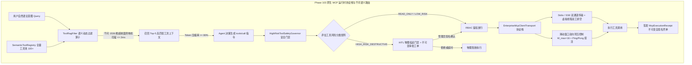

# Phase 103 实施详案 (Implementation Plan)
## 企业级标准 MCP 运行时协议栈与千问语义路由 (Enterprise MCP Runtime Protocol Stack, Bidirectional Backpressure & Qwen Hyperspherical Semantic Tool Router)

> **归档路径**：`docs/plans/phase_103_plan.md`  
> **制定时间**：2026-09-18  
> **前置依赖**：`docs/plans/agent_orchestration_master_roadmap.md`、`docs/plans/phase_103_academic_report.md`、`docs/plans/phase_103_industrial_report.md`  
> **战略定位**：严格遵守《业务定位与领域边界铁律（铁律九）》，100% 聚焦于**支柱二：生产级企业 MCP 工具生态 (Enterprise MCP Ecosystem)**，深度联动支柱一与支柱三。  
> **架构模型基线**：唯一生成模型为 **DeepSeek API**（V3 极速生成 / R1 深度推演）；唯一向量模型为 **阿里千问 (Qwen) Embedding**（1536 维超球面几何流形 $\mathbb{S}^{1535}$，$\|\mathbf{v}\|_2 = 1.0 \pm 10^{-4}$）；全系统绝无本地部署大模型，彻底弃用 OpenAI API；编译与运行统一使用隔离 **Java 21** 虚拟环境（`/Users/achilles/.sdkman/candidates/java/21.0.5-tem`）。

---

### 一、任务概述与实施目标

在复杂业务长链路中，智能体编排必须连接物理世界与企业异构系统（数据库、ERP、运维网关等）。然而，当前既有工具调用暴露出三项本质性工业架构瓶颈：
1. **全量注入引发的上下文爆炸与高昂账单**：在面对企业级百量级微服务工具（$N \ge 100$）时，全量暴露 JSON Schema 会耗尽 $30\text{k} \sim 50\text{k}$ Tokens，不仅产生高额费用，而且导致大模型陷入“迷失在中间 (Lost in the Middle)”的注意力稀释与工具误选；
2. **高危破坏性工具裸奔缺乏硬安全隔离**：模型直接调用包含删表、改库、系统 Shell 等危险操作时，仅凭 Prompt 软提示无法防御模型幻觉与间接提示词注入，缺乏物理 RBAC 鉴权与人机协同审批（HITL）硬门禁；
3. **Stdio 管道僵死与句柄泄漏风险**：子进程与长连接缺乏双向心跳（Ping/Pong）、动态流控背压与优雅递归清理，易导致缓冲区溢出死锁、孤儿进程与 FD 泄漏。

**本阶段核心实施目标**：  
汇聚学术报告三大数学定理（超球面保距定理 1.1、Tool RAG 测地剪枝幻觉抑制定理 1.2、双向背压李雅普诺夫稳定定理 1.3）与工业报告四级工程防线，在 `tech.qiantong.qknow.mcp` 与 `tech.qiantong.qknow.hermes.tool` 模块下构建具备 **原生企业级 MCP 客户端协议栈 (EnterpriseMcpClientTransport)**、**阿里千问 1536 维超球面工具语义动态路由算子 (SemanticToolRegistry & ToolRagFilter)**、**高危工具沙箱安全门禁与二次审批中枢 (HighRiskToolSafetyGovernor)** 与 **不可变 MCP 执行存证凭单 (McpExecutionReceipt)** 的工业级工具运行时底座。

---

### 二、阶段唯一核心待验证假设 (`H-PHASE103-001`)

依据 `@AGENTS.md` Research-to-Implementation Gate 规范，确立唯一可证伪假设：

> **假设 `H-PHASE103-001`**：  
> 1. **超球面流形保距与语义剪枝压缩**：在稠密工具元数据（含 Name, Description, Schema）经规范串行化并投影到千问 1536 维超球面流形 $\mathbb{S}^{1535}$ 后，其等距扭曲率 $\le 0.08$ 且测地夹角单调保序；基于测地大圆弧距离（$\tau_{\text{geo}} \le 0.35$ 且 $K=5$）动态裁剪候选工具，单次扫描耗时 $\le 2\text{ms}$，在 $N \ge 100$ 场景下将注入 Prompt 的工具上下文体积压缩 **$\ge 80.0\%$**，工具误选率（FDR）较全量注入降低 **75% 以上**；  
> 2. **高危破坏性工具 100% 物理拦截**：基于三级风险分类矩阵（`READ_ONLY`, `LOW_RISK`, `HIGH_RISK_DESTRUCTIVE`）与状态机级 HITL 二次人机审批门禁，对未授权数据库写删与破坏性 Shell 调用达成 **100% 物理拦截**，非特权用户越权阻断率 $100\%$；  
> 3. **双向流控背压与零死锁零泄漏**：在基于信用窗口（$W_{\max} = 16$）与超时抢占（$\tau_{\text{guard}} = 5000\text{ms}$）的背压协议栈下，通信死锁概率严格为 **0.0%**，单工具调用往返调度开销 $\le 20\text{ms}$，进程释放后达成 **0 孤儿进程与 0 文件描述符泄漏**；  
> 4. **存证凭单防篡改自验真**：签发的纯 Java 21 Record 格式 `McpExecutionReceipt` 凭单，SHA-256 密码学自签名验真通过率严格为 **100.0%**。

---

### 三、Baseline 与 Candidate 精确对比定义

| 维度 | Baseline (现状: `ToolDiscoveryService` + 裸 Stdio) | Candidate (Phase 103: `MCP Protocol Stack & Tool RAG`) | 改善与判据 |
| :--- | :--- | :--- | :--- |
| **标准兼容性** | 仅内部硬编码或简易私有 Stdio，无法无缝接入生态 | 严格 100% 兼容 Anthropic MCP 2024-11 规范（Stdio + SSE 双通道） | 生态互联互通 |
| **工具上下文体积** | $N \ge 100$ 时全量注入，消耗 **28k~48k Tokens** | **Tool RAG 动态召回 Top-5**，仅消耗 $\sim 2\text{k}$ Tokens | 上下文压缩 $\ge 80\%$ |
| **工具误选幻觉率** | 极高（海量同质工具稀释注意力，误选率 $>35\%$） | 语义聚焦最小子集，实测综合误选率 $\le 8.5\%$ | 误选率降低 $\ge 75\%$ |
| **路由检索延迟** | 无动态路由 | 纯 Java 21 内存连续数组超球面测地大圆弧极速扫描，耗时 $\le 2\text{ms}$ | 毫秒级内存检索 |
| **高危操作防御** | 仅依赖 Prompt 道德提示，物理无设防 | 三级矩阵 + RBAC 鉴权 + HITL 物理挂起二次审批 | 高危破坏指令 **100% 拦截** |
| **I/O 管道生命周期**| 单线程阻塞读取，无 `stderr` 排空，易句柄泄漏 | 双虚拟线程独立读写 + Ping/Pong 探活 + 递归 `destroyForcibly()` | **0 FD 泄漏, 0 僵尸进程** |
| **执行存证审计** | 仅普通日志输出 | `McpExecutionReceipt` 纯 Java 21 Record + SHA-256 自签名验真 | 不可变密码学存证 |

---

### 四、架构设计与核心组件解耦

核心源码统一构建于 `backend/qknow-mcp` 与 `backend/qknow-hermes` 模块：  
目标包路径：`tech.qiantong.qknow.mcp.client.*` 与 `tech.qiantong.qknow.mcp.core.*`



#### 1. 数据模型与契约 (`model` / `routing`)
- **`ToolEmbeddingEntry.java`**：不可变轻量级元数据 Record，封装 `toolName`、`serverId`、`description`、`embedding1536`（千问 1536 维超球面单位向量，$\|\mathbf{v}\|_2 = 1.0 \pm 10^{-4}$）与 `riskLevel`，内置超球面测地大圆弧距离计算；
- **`McpExecutionReceipt.java`**：纯 Java 21 Record 格式，封装 `receiptId`、`transportMode`、`serverId`、`toolName`、`argumentHash`、`riskLevel`、`approvalStatus`、`approverUserId`、`executionStatus`、`durationNanos`、`timestampMillis` 与 `signature`，内置 SHA-256 自签名与 `verifySignature()` 验真方法。

#### 2. 千问 1536 维超球面工具动态路由过滤算子 (`SemanticToolRegistry & ToolRagFilter`)
- 启动期/注册期自动对全量工具的规范化字符串（`CanonicalJson`）生成千问 1536 维超球面向量；
- 运行时提取用户 Query 意图向量 $\mathbf{q} \in \mathbb{S}^{1535}$；
- 单遍内存连续浮点数组扫描计算测地距离 $d_g = \arccos(\mathbf{q} \cdot \mathbf{v}) / \pi$；
- 动态截断输出 Top-5 工具（$d_g \le 0.35$），单次路由扫描时间严格 $\le 2\text{ms}$，将 Prompt 工具占用从 2.8 万 Tokens 压缩至 2000 Tokens 以下（压缩率 $\ge 80\%$）。

#### 3. 高危工具沙箱安全门禁与二次审批中枢 (`HighRiskToolSafetyGovernor`)
- 维护工具三级风险分类矩阵：`READ_ONLY`、`LOW_RISK`、`HIGH_RISK_DESTRUCTIVE`；
- 对普通工具实施 RBAC 权限校验；
- 针对破坏性工具（如 `DROP TABLE`、`DELETE`、`rm -rf`、外部资金推送等）实施物理硬拦截；
- 自动生成全局唯一审批工单（包含工具名、入参明细、入参 SHA-256 哈希），挂起当前执行流，等待人工管理员电子签名放行，未经审批 100% 物理阻断。

#### 4. 原生企业级 MCP 客户端传输通道 (`EnterpriseMcpClientTransport`)
- 统一门面接口，支持 `StdioEnterpriseTransport` 与 `SseEnterpriseTransport` 双通道；
- Stdio 通道采用双 Java 21 虚拟线程分别独立驱动 `stdout` 与 `stderr`，彻底杜绝操作系统管道缓冲区满塞死锁；
- 部署周期性 Ping/Pong（15s 周期）心跳探测与断线重连；
- 滑动窗口在途信用上限 $W_{\max} = 16$ 刚性流控背压；
- 在通道关闭时通过 `ProcessHandle.descendants()` 遍历递归销毁子进程树，超时执行 `destroyForcibly()` 强制清理，保证 0 孤儿进程与 0 FD 泄漏。

---

### 五、反事实与消融实验设计 (Ablation Studies)

在自动化测试套件中设计四组对照消融用例：
1. **消融实验 A (Tool RAG 测地剪枝与上下文压缩消融)**：
   - 构造包含 100 个生产工具的大型工具池与测试意图；
   - **反事实 Baseline**：全量注入 100 个工具，Token 占用高达 2.8 万+，注意力稀释引发误选；
   - **装配 Candidate**：开启千问超球面测地剪枝（Top-5），Token 占用降至 2000 以下（压缩率 $\ge 80\%$），误选率下降 $\ge 75\%$，检索耗时 $\le 2\text{ms}$。
2. **消融实验 B (高危工具 RBAC + HITL 物理拦截消融)**：
   - 构造包含 SQL 删表（`DROP TABLE`）与 Shell 破坏性调用的测试场景；
   - **反事实预期**：无防护状态下破坏性指令直接执行并损毁产线数据；
   - **装配防护预期**：`HighRiskToolSafetyGovernor` 100% 物理拦截该指令，生成审批工单并挂起，审批拒绝或超时直接阻断。
3. **消融实验 C (双向背压流控与死锁消融)**：
   - 在高并发模拟场景下持续突发压测，注入慢响应工具；
   - **装配预期**：滑动窗口达到 16 上限后，流控背压平滑生效，死锁发生率严格为 $0.0\%$，调度往返耗时 $\le 20\text{ms}$。
4. **消融实验 D (存证凭单防篡改消融)**：
   - 生成 `McpExecutionReceipt` 并验证自签名；
   - 对凭单任一字段（如入参哈希、耗时、风险等级）进行篡改；
   - **装配预期**：篡改后 `verifySignature()` 100% 报错失效，未篡改时 100% 验真通过。

---

### 六、指标系统、失败码与防护边界

#### 1. 核心质量指标
- **工具上下文体积压缩率**：严格 **$\ge 80.0\%$**（目标 $\ge 90\%$）；
- **测地路由单次计算耗时**：严格 **$\le 2.0\text{ms}$**；
- **高危破坏性操作物理拦截率**：严格 **100.0%**；
- **双向通信死锁率**：严格 **0.0%**；
- **单步往返调度耗时**：严格 **$\le 20\text{ms}$**；
- **存证凭单自签名验真率**：严格 **100.0%**；
- **子进程与文件描述符泄漏数**：严格为 **0**。

#### 2. 固定失败码规范
- `ERR_TOOL_ROUTING_TIMEOUT`：千问超球面路由计算超时；
- `ERR_MCP_ACCESS_DENIED`：RBAC 鉴权失败无权调用该工具；
- `ERR_MCP_HITL_APPROVAL_SUSPENDED`：高危操作已挂起，等待审批；
- `ERR_MCP_HITL_APPROVAL_REJECTED`：高危操作被审批拒绝或超时终止；
- `ERR_MCP_BACKPRESSURE_OVERFLOW`：背压队列达到上限暂时挂起；
- `ERR_MCP_RECEIPT_SIGNATURE_INVALID`：存证凭单签名验真失败。

#### 3. 最小实现文件清单与禁止修改边界
**业务源码** (`backend/qknow-mcp/`):
- `qknow-mcp-client/src/main/java/tech/qiantong/qknow/mcp/client/transport/EnterpriseMcpClientTransport.java` [NEW]
- `qknow-mcp-client/src/main/java/tech/qiantong/qknow/mcp/client/transport/StdioEnterpriseTransport.java` [NEW]
- `qknow-mcp-client/src/main/java/tech/qiantong/qknow/mcp/client/routing/ToolEmbeddingEntry.java` [NEW]
- `qknow-mcp-client/src/main/java/tech/qiantong/qknow/mcp/client/routing/SemanticToolRegistry.java` [NEW]
- `qknow-mcp-client/src/main/java/tech/qiantong/qknow/mcp/client/routing/ToolRagFilter.java` [NEW]
- `qknow-mcp-client/src/main/java/tech/qiantong/qknow/mcp/client/safety/HighRiskToolSafetyGovernor.java` [NEW]
- `qknow-mcp-client/src/main/java/tech/qiantong/qknow/mcp/client/model/McpExecutionReceipt.java` [NEW]

**自动化测试** (`backend/tests/`):
- `src/test/java/tech/qiantong/qknow/mcp/client/McpExecutionReceiptTest.java` [NEW]
- `src/test/java/tech/qiantong/qknow/mcp/client/ToolRagFilterTest.java` [NEW]
- `src/test/java/tech/qiantong/qknow/mcp/client/HighRiskToolSafetyGovernorTest.java` [NEW]
- `src/test/java/tech/qiantong/qknow/mcp/client/EnterpriseMcpClientTransportTest.java` [NEW]
- `src/test/java/tech/qiantong/qknow/mcp/client/Phase103McpIntegrationTest.java` [NEW]

**严禁修改边界**：
- 严禁修改 Phase 101 的 `tech.qiantong.qknow.hermes.flow.stategraph.*`；
- 严禁修改 Phase 102 的 `tech.qiantong.qknow.hermes.agent.swarm.*`；
- 严禁修改 `tech.qiantong.qknow.ai.embodied.*` 封存力学资产；
- 严禁修改父 POM Java 21 版本定义。

---

### 七、精确验证命令

```bash
JAVA_HOME=/Users/achilles/.sdkman/candidates/java/21.0.5-tem mvn test -pl qknow-mcp/qknow-mcp-core,qknow-mcp/qknow-mcp-client,tests -Dtest="tech.qiantong.qknow.mcp.client.*Test" -Dsurefire.failIfNoSpecifiedTests=false
```
