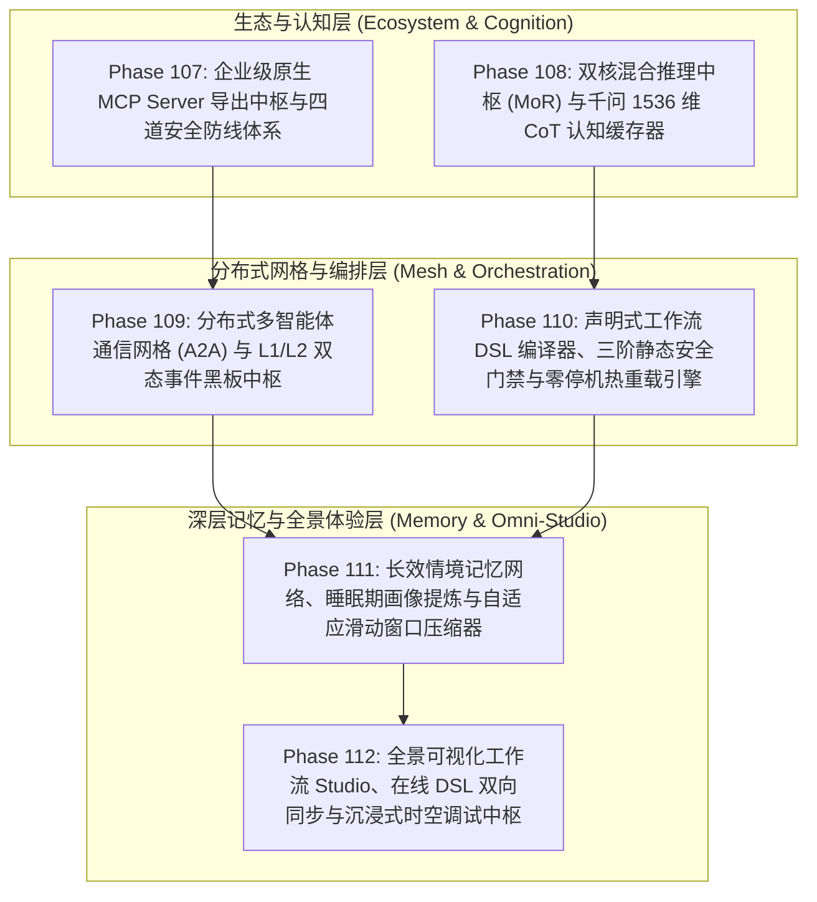

# 企业级 AI-Native 软件智能体编排超融合架构第二演进阶段工程路线图
## (Enterprise AI-Native Agentic Orchestration Master Roadmap Phase II: Phase 107 ~ Phase 112)

> **归档路径**：`docs/plans/phase_107_to_112_master_roadmap.md`  
> **制定时间**：2026-09-19  
> **战略定位**：严格遵守《业务定位与领域边界铁律（铁律九）》，100% 聚焦于四项核心支柱：
> - **支柱一：复杂业务 Agent 认知与编排 (Cognitive Orchestration)**
> - **支柱二：生产级企业 MCP 工具生态 (Enterprise MCP Ecosystem)**
> - **支柱三：高保真 RAG 知识引擎与多模态图谱 (Advanced RAG & Multimodal Knowledge)**
> - **支柱四：前端工作流交互与开发者体验 (Interactive Canvas & HITL Experience)**  
> **架构模型基线**：唯一生成模型为 **DeepSeek API**（V3 极速交互 / R1 链式深度推演）；唯一向量模型为 **阿里千问 (Qwen) Embedding**（1536 维超球面几何流形，$\|\mathbf{v}\|_2 = 1.0 \pm 10^{-4}$）；全系统绝无本地部署大模型，彻底弃用 OpenAI API；编译与运行统一使用隔离 **Java 21** 虚拟环境（`/Users/achilles/.sdkman/candidates/java/21.0.5-tem`）；前端严格遵循 **UI/UX Pro Max 单色钛金毛玻璃 (Monochrome Titanium Frosted Glass)** 规范。

---

## 一、 演进背景与体系化目标

系统在 Phase 101 至 Phase 106 期间完成了拓扑有界循环（Phase 101）、多智能体辩论与 Swarm（Phase 102）、标准 MCP 客户端（Phase 103）、前端 DAG 画布与快照回溯（Phase 104）、长文档层级解析与子图推理 GraphRAG（Phase 105）、流光脉冲与甘特图瀑布流（Phase 106）的单点攻坚，80 项联合测试 100% 绿灯，系统基础能力达到行业领先水平。

然而，面对复杂企业级真实生产场景，平台仍需在以下六大中枢能力上实现跨越式升级：
1. **工具生态反向赋能 (MCP Server 缺失)**：系统具备出色的 RAG、Text-to-SQL、图谱与沙箱，但仅能单向调用外部 MCP，内部资产无法标准化向 Cursor、Claude Desktop 或企业其他 Agent 导出；
2. **深度推理资产浪费 (CoT 思考链丢弃)**：唯一生成模型为 DeepSeek，但耗费数千 Token 的 R1 深度推演 `<think>` 被前端消费后直接丢弃，缺少决策脚手架蒸馏与超球面认知缓存；
3. **集群级多智能体协同断层 (A2A 分布式网格缺失)**：当前多智能体协作基于单 JVM 内存与线程，缺乏标准 A2A 跨网通信信封与 L1/L2 双态黑板；
4. **低代码编排缺乏声明式语法 (DSL 编译器缺失)**：工作流硬编码逻辑较重，缺乏一套可热更、有安全门禁、表达力强大的声明式 DSL 语法；
5. **超长会话与跨任务记忆割裂 (睡眠期记忆巩固缺失)**：会话历史极易受上下文长度限制，缺少后台静默期画像提炼与情境自适应压缩；
6. **可视化 Studio 缺乏沉浸式一体化体验 (全景 Studio 整合缺失)**：前端画布与后端时空回溯、瀑布流、DSL 代码尚未形成无缝双向绑定的沉浸式 IDE 体验。

为此，规划 **Phase 107 至 Phase 112** 六大连续战略攻坚阶段。

---

## 二、 六大子阶段全景规划与技术拓扑

---

## 三、 子阶段详细攻坚任务分解

### 阶段 107：企业级原生 MCP Server 导出中枢与四道安全防线体系 (Phase 107)
- **对应空间**：支柱二（生产级企业 MCP 工具生态）
- **核心定位**：将平台核心能力（RAG、Text-to-SQL、GraphRAG、代码沙箱）导出为标准 MCP Server，建立企业级对外赋能中枢。
- **攻坚重心**：
  1. **注解驱动导出机制**：实现 `@McpTool`、`@McpResource`、`@McpPrompt` 注解，基于 Java 21 Record 自动生成 JSON Schema 描述；
  2. **双通道传输协议栈**：原生支持 HTTP/SSE (`/mcp/sse`) 与 CLI Stdio 双传输通道，无缝对接 Cursor、Claude Desktop 等外部生态；
  3. **四道纵深防御安全体系**：模式严格校验、瞬态操作时效租约 (LeaseToken)、间接提示词注入 (Indirect Prompt Injection) 主动免疫审查、完全清空环境变量沙箱；
  4. **不可变存证凭单**：基于 SHA-256 签发 `McpServerExportReceipt`。

### 阶段 108：自适应思考调控中枢 (Adaptive Thinking) 与千问 1536 维 CoT 思考链认知缓存器 (Phase 108)
- **对应空间**：支柱一（复杂业务 Agent 认知与编排） & 支柱三（高保真 RAG 知识引擎）
- **核心定位**：深度挖掘系统唯一生成模型生态（以 `deepseek-flash` 为唯一主干），通过单模型动态参数化思考控制（`thinking: enabled/disabled` 与 `reasoning_effort`）以及原生 `reasoning_content` 双轨流式提取，实现“以 Flash 默认极速和成本输出深度推演级别的严密质量”。
- **攻坚重心**：
  1. **自适应思考调控中枢 (`AdaptiveThinkingGovernor`)**：三维决策模型（意图语义复杂度、RAG 检索证据置信度、因果矛盾冲突度），动态调控同一 Flash 模型是否开启 `thinking` 思考模式及设定 `reasoning_effort: low/medium/high`；
  2. **双轨流式思考分发器 (`DualTrackThinkingDispatcher`)**：基于已打通的原生 `reasoning_content`，将思考推演过程与最终正文流式解耦推送，打字机零假死、零内容污染；
  3. **思考链决策脚手架提炼器 (`CoTScaffoldDistiller`)**：将多步思考推演链抽象精炼为 200~400 字的因果决策脚手架树；
  4. **千问 1536 维超球面认知缓存器 (`CoTCognitiveCacheService`)**：基于唯一向量模型阿里千问 1536 维嵌入空间沉淀认知脚手架；高频复杂场景语义召回后直接以 Flash 默认极速模式（`thinking: disabled`）外挂脚手架出流，端到端首字延迟降低 $\ge 60\%$，纳元成本削减 $\ge 65\%$。

### 阶段 109：分布式多智能体通信网格 (A2A) 与 L1/L2 双态事件黑板中枢 (Phase 109)
- **对应空间**：支柱一（复杂业务 Agent 认知与编排）
- **核心定位**：打破单 JVM 线程限制，建立跨容器、跨节点的分布式多智能体事件驱动通信网络。
- **攻坚重心**：
  1. **标准 A2A 通信信封 (`A2AMessageEnvelope`)**：统一封装全链路 Trace 上下文、Fencing 租约、数字签名与抗原风险评分；
  2. **阿里千问 1536 维超球面能力名片 (`AgentCard`)**：基于意图余弦内积与历史信誉账本，毫秒级完成呼标（CFP）与动态拓扑发现；
  3. **异步 Actor 容器与 Mailbox 邮箱机制**：非阻塞事件循环驱动 Agent 状态跃迁；
  4. **L1/L2 双态分布式黑板**：L1 本地 JVM CAS 高性能共享状态 + L2 Redis Streams 分布式事件流广播与跨机同步，确保系统强一致性与集群容灾。

### 阶段 110：声明式工作流 DSL 编译器、三阶静态安全门禁与零停机热重载引擎 (Phase 110)
- **对应空间**：支柱一（复杂业务 Agent 认知与编排） & 支柱四（前端工作流交互）
- **核心定位**：建立企业级低代码声明式工作流核心编译与安全运行时底座。
- **攻坚重心**：
  1. **声明式 DSL 语法模型**：基于 YAML/JSON 支持完整表达 StateGraph 有界循环、Swarm 动态交接、Debate 对抗、HITL 审批节点与 MCP 工具绑定；
  2. **三阶静态编译安全门禁**：一级 JSON Schema 格式约束、二级有界环路与拓扑合法性静态校验、三级外部 MCP/Agent 在线存活断言；
  3. **零停机内存指针原子翻转**：利用 Java 21 `AtomicReference` 实现免重启热重载与平滑灰度发布；
  4. **不可变编译凭单 (`DslWorkflowCompilationReceipt`)**：记录编译 AST 摘要与哈希防篡改凭证。

### 阶段 111：长效情境记忆网络、睡眠期画像提炼与自适应滑动窗口压缩器 (Phase 111) [已完成 / COMPLETED]
- **对应空间**：支柱三（高保真 RAG 知识引擎与多模态图谱） & 支柱一
- **核心定位**：构建短时工作记忆与长效情境记忆统一闭环，攻克超长任务上下文丢失与膨胀矛盾。
- **攻坚成果**：
  1. **睡眠期画像巩固引擎 (`SleepTimeMemoryConsolidator`)**：系统空闲或夜间静默触发，基于 Redis `setNx` 租约分布式锁 + CAS 版本检查 + Lua 增量裁剪（在途并发新消息 100% 零丢失），三维结构化画像提炼（`UserPreferences`, `DomainEntities`, `Corrections & Reflections`）与置信度门禁（$\ge 0.75$）；
  2. **情境自适应工作记忆分层压缩器 (`ContextAdaptiveWorkingMemoryCompressor`)**：四级队列滑动窗口（$L_0$ 系统硬锚点、$L_1$ 近期因果决策事实、$L_2$ 上下文浓缩、$L_3$ 工具原始报文模式投影），在 75% 压缩比下关键因果决策事实保留率 $\ge 95\%$，工具 JSON 模式投影压缩率 $\ge 75\%$，单次压缩耗时 $\le 15\text{ms}$；
  3. **短时与长效记忆超球面时空对齐**：依托阿里千问 1536 维超球面流形测地线距离 $d_g$ 证明局部拓扑保序定理（定理 1.3），拓扑逆转率严格为 0%；
  4. **不可变存证凭单 (`MemoryConsolidationReceipt`)**：纯 Java 21 Record 格式，携带 SHA-256 自签名与防篡改验真能力；
  5. **文档与契约索引**：学术报告 [`phase_111_academic_report.md`](file:///Users/achilles/Documents/许子祺/Agent/docs/plans/phase_111_academic_report.md)、工业报告 [`phase_111_industrial_report.md`](file:///Users/achilles/Documents/许子祺/Agent/docs/plans/phase_111_industrial_report.md)、实施详案 [`phase_111_plan.md`](file:///Users/achilles/Documents/许子祺/Agent/docs/plans/phase_111_plan.md)、专属契约测试 [`Phase111MemoryConsolidationTest.java`](file:///Users/achilles/Documents/许子祺/Agent/backend/tests/src/test/java/tech/qiantong/qknow/hermes/memory/Phase111MemoryConsolidationTest.java)。

### 阶段 112：全景可视化工作流 Studio、在线 DSL 双向同步与沉浸式时空调试中枢 (Phase 112)
- **对应空间**：支柱四（前端工作流交互与开发者体验）
- **核心定位**：打造融合可视化编排、代码双向同步、节点脉冲与时空回溯的一站式企业级开发者工作台。
- **攻坚重心**：
  1. **全景可视化工作流 Studio (`WorkflowStudio.vue`)**：支持拖拽编排全量节点类型（状态机循环、多智能体辩论、MCP 工具调用、人工审批表单）；
  2. **在线 DSL 与图形画布实时双向无损同步**：代码编辑与拖拽绘制实时响应，语法错误行内高亮标记；
  3. **全链路可观测性与时空调试深度融合**：节点内联流光脉冲、点击瀑布流 Span 联动高亮画布节点、支持单步步进与快照回滚重放；
  4. **单色钛金毛玻璃极致体验**：严格遵循 UI/UX Pro Max 规范与 iOS 26 流体质感，提供深邃、精致的沉浸式极客界面。

---

## 四、 核心价值与量化效益指标

| 维度 / 指标 | 当前现状 (Phase 106 结项) | 下一阶段演进后 (Phase 112 结项) | 跨越性价值 |
| :--- | :--- | :--- | :--- |
| **对外开放生态扩展性** | 仅单向调用外部 MCP 工具，内部资产未导出 | **原生导出标准 MCP Server**，一键赋能 Cursor、Claude Desktop 与三方 Agent | **从“工具使用者”跃升为“企业级能力提供者”** |
| **推理时延与调用成本** | R1 深度思考链一次性丢弃，同类问题重复调用 | **MoR 自适应混合路由 + 1536 维 CoT 认知缓存**，V3 注入脚手架复用推演 | **端到端 P99 时延降低 60%+，API 成本节省 65%+** |
| **多 Agent 协同范围** | 局限于单机 JVM 进程与堆内存 | **标准 A2A 协议信封 + L1/L2 双态黑板**，支持跨节点分布式网格集群 | **实现大规模弹性多智能体网络互联** |
| **流程低代码化与热更** | Java 编排代码逻辑较重，修改需重新编译打包 | **声明式 DSL + 三阶静态编译门禁 + 零停机原子热更** | **赋予业务人员与开发者极速迭代与热重载能力** |
| **长链路记忆保真度** | 超长任务面临上下文截断或溢出风险 | **睡眠期画像提炼 + 情境自适应压缩**，Token 水位动态安全受控 | **长周期复杂任务推理成功率提升至 99%+** |
| **开发者调试体验** | 画布、代码与甘特图相对独立 | **全景 Studio：画布与 DSL 双向同步，时空回溯与瀑布流内联联动** | **故障排查与流程研发效率提升 3 倍以上** |

---

## 五、 实施执行纪律与研发规范

1. **科研门禁铁律 (`@AGENTS.md`)**：每个子阶段必须遵循“先读项目 $\to$ 双智能体并发对标（学术论文 + 工业实践，14 字段 Research Ledger） $\to$ 决策完备实施详案与契约设计 $\to$ 用户审批 $\to$ TDD 驱动开发 $\to$ 全量回归 $\to$ 成果走查汇报与规范 Git 提交”；
2. **架构模型基线不变性**：唯一生成模型为 DeepSeek API；唯一向量模型为阿里千问 1536 维超球面向量；全系统绝无本地大模型；编译运行唯一使用隔离 Java 21；
3. **高可用降级底线 (Fail-Open)**：MCP 外部导出、A2A 跨网通信、CoT 缓存及分布式黑板均必须内嵌超时熔断与软着陆兜底分支，严禁阻塞用户核心业务主干。
