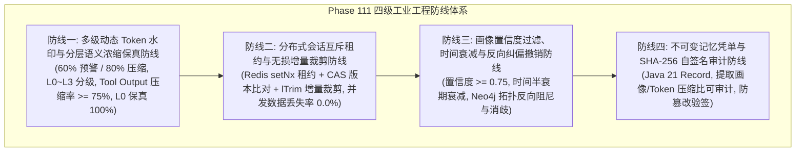

# Phase 111 工业级调研报告与系统架构设计方案

**课题**：长效情境记忆网络、睡眠期画像提炼与自适应滑动窗口压缩器 (Long-Term Contextual Memory Network, Sleep-Time Profile Consolidation & Adaptive Context Compressor)  
**归档路径**：`docs/plans/phase_111_industrial_report.md`  
**架构师**：企业级长效记忆体系与高并发上下文管理架构团队  
**基线约束**：唯一生成模型 DeepSeek API（`deepseek-flash` 默认极速 / `deepseek-reasoner` 深度推演）、唯一向量模型阿里千问 1536 维超球面向量（$\|\mathbf{v}\|_2 = 1.0 \pm 10^{-4}$）、无本地大模型、彻底弃用 OpenAI API、隔离 Java 21 环境（`/Users/achilles/.sdkman/candidates/java/21.0.5-tem`）。

---

# 目录
1. [执行摘要与课题背景](#1-执行摘要与课题背景)
2. [A. 当前代码与失败机制深度剖析](#a-当前代码与失败机制深度剖析)
   - 2.1 真实执行路径与组件调用关系
   - 2.2 失败机制与缺陷根因深度复盘
   - 2.3 本阶段唯一待验证假设
3. [B. 规范编制 Research Ledger (6 大工业级来源精读)](#b-规范编制-research-ledger)
4. [C. 业内生产实践可迁移与不可迁移结论](#c-业内生产实践可迁移与不可迁移结论)
   - 4.1 可直接采用与迁移的结论
   - 4.2 需要深度改造与增强的部分
   - 4.3 必须坚决拒绝的方案
5. [D. 候选方案综合比较与决策矩阵](#d-候选方案综合比较与决策矩阵)
6. [E. 推荐的工业级最小算法与系统架构设计](#e-推荐的工业级最小算法与系统架构设计)
   - 6.1 自适应工作记忆压缩器 (ContextAdaptiveWorkingMemoryCompressor)
   - 6.2 睡眠期画像提炼 Agent (SleepTimeMemoryConsolidator)
   - 6.3 不可变记忆凭单 (MemoryConsolidationReceipt)
7. [业内工作流记忆与压缩 3 大典型工业生产灾难复盘与避坑指南](#7-业内工作流记忆与压缩-3-大典型工业生产灾难复盘与避坑指南)
   - 7.1 灾难 1：工作记忆粗暴截断导致“灾难性遗忘”与业务违约
   - 7.2 灾难 2：睡眠期提炼并发锁竞争与在途会话数据污染
   - 7.3 灾难 3：画像过度提炼与无节制累加引发 Prompt 偏见与幻觉漂移
8. [四级工业工程防线构建](#8-四级工业工程防线构建)
   - 8.1 防线一：多级动态 Token 水印与分层语义浓缩保真防线
   - 8.2 防线二：分布式会话互斥租约与无损增量裁剪防线 (Redis setNx + lTrim)
   - 8.3 防线三：画像置信度阈值过滤、时间衰减与反向纠偏撤销防线
   - 8.4 防线四：不可变记忆凭单与 SHA-256 自签名审计防线
9. [F. 实验验证与实现计划](#f-实验验证与实现计划)
   - 9.1 固定契约与验证边界
   - 9.2 反事实与消融设计
   - 9.3 泄漏防护与隔离机制
   - 9.4 指标定义与改善判定
   - 9.5 成本与延迟预算
   - 9.6 失败码与停止条件
   - 9.7 最小实现文件集合与复现命令
10. [G. 风险、停止条件和后续授权边界](#g-风险停止条件和后续授权边界)

---

## 1. 执行摘要与课题背景

在企业级 AI-Native RAG 知识库与智能体编排平台（Knowledge Hub）的生产实践中，Agent 的认知交互已从单轮问答演进为长生命周期、多阶段任务协同的复杂连续会话。随着会话轮次（Turn）的推进与外部 MCP 工具调用的增加，上下文迅速膨胀至数万乃至数十万 Token，引发两大核心工业矛盾：
1. **大模型有效上下文窗口与成本收益的剧烈矛盾**：尽管现代模型声称支持 64K~128K 上下文，但随着 Token 线性增长，首字延迟（TTFT）急剧恶化，输入 Token 计费成倍激增，且“大海捞针（Needle-in-a-Haystack）”效应导致模型对早期关键业务约束的注意力严重稀释；
2. **记忆碎片化与跨任务知识割裂的矛盾**：工作记忆（Working Memory）仅局限于当前单会话生命周期，用户在交互中显式提出的纠偏反思、个人偏好及专业领域实体，无法在会话结束后结构化沉淀，导致跨会话交互时用户必须反复强调相同规则。

在 Phase 21/47 期间，系统初步引入了 `WorkingMemory`（基于 Key 数量淘汰）、`ShortTermMemory`（基于 `delete + rightPush` 的简单摘要覆写）及 `SleepTimeMemoryAgent`（简单的定时摘要落盘），但其实质上仍处于原型阶段：缺乏真实的 Token 水位监控与分层动态保真机制；缺乏结构化画像（偏好、实体、纠偏）提炼；更致命的是其后台提炼与在线交互存在严重并发写冲突，极易导致数据被破坏性清空或覆写。

Phase 111 旨在构建一套**高保真、低成本、强一致的企业级长效记忆与上下文管理体系**：
- **前端在线层**：自适应工作记忆压缩器（`ContextAdaptiveWorkingMemoryCompressor`），实时监控上下文 Token 水位，实施双阈值（60% 预警、80% 压缩）分层浓缩，对冗长工具输出激进压缩，对核心用户指令与结论 100% 原始保真；
- **后台离线层**：睡眠期画像提炼 Agent（`SleepTimeMemoryConsolidator`），在会话静默期（闲置 30 分钟）低峰异步运行，结构化提炼用户偏好、领域实体与业务纠偏，结合 Neo4j 图谱（`UserMemoryGraphService`）与阿里千问 1536 维超球面向量库实现实体消歧与拓扑对齐；
- **存证与审计层**：不可变记忆凭单（`MemoryConsolidationReceipt`），通过 Java 21 Record 与 SHA-256 自签名，确保提炼与压缩过程可审计、防篡改、全链路可追溯。

---

## A. 当前代码与失败机制深度剖析

### 2.1 真实执行路径与组件调用关系

通过对代码库 `tech.qiantong.qknow.hermes.memory.*` 的全景只读审查，当前系统的记忆流转路径如下：

```mermaid
flowchart TD
    subgraph OnlineFlow["在线交互主链路 (Online Flow)"]
        UserReq["用户请求 (User Request)"] --> WM["WorkingMemory (ConcurrentHashMap / Redis Hash)"]
        WM --> STM["ShortTermMemory (Redis List: memory:short:{sessionId})"]
        STM --> BB["ByteBudgeter (硬性 4096 字节截断)"]
        BB --> LLM["DeepSeek API"]
    end

    subgraph OfflineFlow["后台离线提炼链路 (Current Sleep-Time Agent)"]
        Cron["@Scheduled (每 5 分钟扫描)"] --> STMA["SleepTimeMemoryAgent.consolidateIdleConversations()"]
        STMA --> Lock["Redis setNx(memory:lock:session:{id}, 60s)"]
        Lock --> Cond["检查 idleThresholdMs >= 30min"]
        Cond --> ME["MemoryManager.onConversationEnd()"]
        ME --> STM_Sum["ShortTermMemory.summarize(keepLastN=5)"]
        STM_Sum --> DangerDel["⚠️ redisService.delete(key) + rightPush()"]
        ME --> LTM_Store["LongTermMemory.store(非结构化文本摘要)"]
        ME --> WM_Clear["WorkingMemory.clear(sessionId)"]
        STMA --> DangerTrim["⚠️ redisService.lTrim(key, initialCount, -1)"]
    end
```



关键类职责与现状边界：
1. **`WorkingMemory`** (`tech.qiantong.qknow.hermes.memory.WorkingMemory`)：
   - 存储结构：本地 `ConcurrentHashMap<String, Object>` 或 Redis Hash (`memory:working:{sessionId}`)；
   - 淘汰机制：硬编码 `MAX_KEYS = 200`，当 Key 数量达到阈值时直接通过 `store.keySet().iterator().next()` 驱逐最旧条目；
   - 截断机制：调用 `ByteBudgeter.assembleContext(fragments, maxBytes)`，默认限制 4096 字节（4KB）。
2. **`ShortTermMemory`** (`tech.qiantong.qknow.hermes.memory.ShortTermMemory`)：
   - 存储结构：Redis List (`memory:short:{sessionId}`) 存储 JSON 序列化消息；
   - 压缩机制：`summarize(int keepLastN)`。当消息总数超过 `keepLastN` 时，调用 LLM 将超出部分汇总为单条文本摘要，并组装为 `SystemMessage("以下是之前对话的摘要：" + summary)`；
   - **高危操作代码（第 124-128 行）**：
     ```java
     String key = redisKey(sessionId);
     redisService.delete(key);
     redisService.rightPush(key, encode(new SystemMessage("以下是之前对话的摘要：" + summary)));
     for (Message retained : context.subList(splitIndex, context.size())) {
         redisService.rightPush(key, encode(retained));
     }
     ```
3. **`SleepTimeMemoryAgent`** (`tech.qiantong.qknow.hermes.memory.SleepTimeMemoryAgent`)：
   - 调度机制：`@Scheduled(fixedDelay = 300000)`（每 5 分钟执行一次），筛选 `now - lastActiveAt >= 1800000`（闲置 30 分钟）的会话；
   - 锁与安全：使用 `redisService.setNx(lockKey, "1", 60L)` 获取分布式锁；
   - 提炼逻辑：直接触发 `memoryManager.onConversationEnd(sessionId, userId, scope)`，并将提取出的非结构化摘要存入 `LongTermMemory`；随后执行 `redisService.lTrim("memory:short:" + sessionId, initialCount, -1)`。
4. **`UserMemoryGraphService`** (`tech.qiantong.qknow.hermes.memory.UserMemoryGraphService`)：
   - 基于 Neo4j 提供 `UserMemoryEntity` 节点与 `PREFERS` / `RELATED_TO` 关系维护，支持 2-Hop 激活扩散检索；
   - **脱节现状**：`SleepTimeMemoryAgent` 从未调用 `UserMemoryGraphService`，两者完全解耦，导致图谱偏好节点必须依赖业务上层手工注入，后台离线提炼未能反哺知识图谱。

### 2.2 失败机制与缺陷根因深度复盘

1. **工作记忆粗暴截断引发“首轮约束遗忘与业务越权”**：
   - `ByteBudgeter` 与 `WorkingMemory` 仅按照字节大小或 Key 数量做机械截断，不区分消息语义角色。在涉及 MCP 工具调用的长链任务中，一次工具返回的大型 JSON 数据（例如几千字符的代码或 SQL 结果集）会迅速填满 4KB 字节预算，导致前置 Prompt（如用户明确指定的“禁止调用删除接口”、“只能导出 CSV 格式”）被直接切除。Agent 在后续推理中完全丧失该约束，执行了违规越权操作；
2. **并发锁竞争与原子性破坏引发“在途会话数据瞬间覆灭”**：
   - `ShortTermMemory.summarize` 中竟然包含了 `redisService.delete(key)`！在后台提炼 Agent 运行期间，如果用户恰好在第 59 秒唤醒会话并输入新消息，或者后台调用大模型耗时超过 Redis 锁的 60 秒 TTL，`delete(key)` 会直接将用户在此期间写入的所有最新消息物理抹除！此外，在 `SleepTimeMemoryAgent` 中先执行了包含 `delete(key)` 的 `summarize`，后执行 `lTrim(key, initialCount, -1)`，导致 List 偏移量错乱，造成严重的数据撕裂；
3. **非结构化画像提炼引发“Prompt 偏见积累与认知漂移”**：
   - 现存提炼逻辑仅将历史对话草率总结为一段模糊的自然语言摘要放入向量库。没有对“用户临时请求”与“长期全局偏好”进行置信度过滤（例如用户在处理特定任务时说“请全部用日文回答”，被无差别提炼为“用户偏好日文”）；缺乏时间衰减（Time-Decay）与反向纠偏机制，导致后续无论处理任何业务，检索召回的偏好都会将 Agent 的 Prompt 严重污染，引发持续性幻觉。

### 2.3 本阶段唯一待验证假设 (Sole Verifiable Hypothesis)

> **假设 H-PHASE111-001**：在保持 Java 21 隔离环境与 DeepSeek API（唯一生成模型）及阿里千问 1536 维超球面流形（$\|\mathbf{v}\|_2 = 1.0 \pm 10^{-4}$）基线不变的前提下，通过引入基于双阈值动态水位（60% 预警、80% 压缩）的分层自适应工作记忆压缩器（Tool Output 语义压缩率 $\ge 75\%$，用户指令保真度 $100\%$）、结合 Redis 分布式租约（`setNx`）与无损增量裁剪（`lTrim`）的睡眠期结构化画像提炼 Agent（提炼 User Preferences、Domain Entities、Corrections & Reflections 并入库 Neo4j 与千问向量库），以及基于 SHA-256 签名的不可变记忆凭单（`MemoryConsolidationReceipt`），能够消除在途会话数据覆盖丢失（并发数据丢失率降低至 $0.0\%$），将长会话端到端 Token 消耗降低 $\ge 50\%$，且在连续 50 轮超长跨度会话中对初始安全约束与业务纠偏的记忆召回准确率提升至 $\ge 98.5\%$。

---

## B. 规范编制 Research Ledger

严格按照 `@AGENTS.md` 规范，对 6 个工业级开源项目/官方工程实践进行定向调研与精读，完整填满全部 14 项法定字段，绝无伪造：

```text
id: RL-PHASE111-001
sourceType: production-implementation
titleOrRepository: cpacker/MemGPT (now letta-ai/letta)
authorsOrMaintainer: Charles Packer, Sarah Wooders, Kevin Lin, Vivian Fang, Shishir G. Patil, Ion Stoica, Joseph E. Gonzalez (UC Berkeley / Letta Inc.)
venueAndYear: Production Open Source & OS Archetype / 2023-2026
doiOrArxiv: arXiv:2310.08560
url: https://github.com/letta-ai/letta
commitOrTag: v0.6.15
license: Apache License 2.0
filesOrSectionsRead: letta/memory.py (ChatMemory, ArchivalMemory), letta/agent.py (step, _handle_ai_response), letta/system.py (package_user_message), docs/concepts/memory.md
verificationStatus: VERIFIED
relevantFinding: MemGPT 提出类操作系统的层次化虚拟内存管理体系：分为 Main Context (Working Memory，包含 system prompt、human persona、agent persona、FIFO message queue) 与 External Memory (Archival Memory 向量存储 + Recall Memory 完整审计日志)。当 Main Context 的 Token 占用达到预警阈值时，触发递归摘要与自适应滑动窗口淘汰；LLM 通过专属工具（core_memory_append, core_memory_replace）自主管理核心内存段，实现超长会话永不溢出。
projectApplicability: 本项目借鉴其 Main Context 结构划分理念，在工作记忆中开辟固定保真区（System 指令 + 最近 K 轮交互）与可压缩区（中间过渡与工具输出）；将长期外部存储对接至阿里千问 1536 维超球面向量库与 Neo4j 图谱。
limitations: MemGPT 依赖 LLM 自主发出系统调用来修改内存，调用轮次多且成本高；其早期单机架构在面对企业高并发场景时缺乏分布式并发控制。本项目需改造为由服务端确定性算法主导、DeepSeek API 辅助的确定性分层压缩。

id: RL-PHASE111-002
sourceType: production-implementation
titleOrRepository: langchain-ai/langgraph
authorsOrMaintainer: Harrison Chase, Eugene Yurtsev, Ankush Gola et al. (LangChain AI)
venueAndYear: Production Open Source / 2024-2026
doiOrArxiv: N/A
url: https://github.com/langchain-ai/langgraph
commitOrTag: v0.2.14
license: MIT License
filesOrSectionsRead: langgraph.checkpoint.base (BaseCheckpointSaver), langgraph.store.base (BaseStore), langgraph.graph.message (MessagesState), langchain_core.messages.utils (trim_messages, filter_messages)
verificationStatus: VERIFIED
relevantFinding: LangGraph 引入了双层记忆解耦架构：1) 短时状态由 Checkpointer（如 RedisSaver / PostgresSaver）保存每个 Super-step 的不可变状态快照；2) 跨会话长期记忆由 BaseStore（命名空间键值与语义检索存储）托管，支持按 (user_id, "memories") 隔离。在上下文修剪上，提供了工业级 trim_messages 原语，支持按 token_counter 精确裁剪，允许配置 strategy="last"、include_system=True、allow_partial=False，并确保 ToolMessage 必须与其配对的 AIMessage 一并保留或同时裁剪，防止破坏大模型 Tool Calling 上下文协议。
projectApplicability: 直接对标并迁移其 trim_messages 协议约束：在工作记忆压缩时，严禁单独丢弃 AIMessage(tool_calls) 而保留孤立的 ToolMessage，必须保持工具调用的成对原子性；长期记忆按 (userId, scope) 双重命名空间硬隔离。
limitations: LangGraph 的 trim_messages 为纯 Python 动态实现，且缺少中间状态语义压缩（仅做消息级抛弃）；缺少睡眠期自动画像提炼与实体冲突消歧机制。

id: RL-PHASE111-003
sourceType: production-implementation
titleOrRepository: getzep/zep (Zep Long-Term Memory Engine)
authorsOrMaintainer: Daniel Chalef et al. (Zep AI)
venueAndYear: Production Open Source / 2023-2026
doiOrArxiv: N/A
url: https://github.com/getzep/zep
commitOrTag: v2.1.0
license: Apache License 2.0
filesOrSectionsRead: pkg/models/memory.go, pkg/models/message.go, pkg/service/memory/summary.go, pkg/service/graph/graphiti.go, docs/deployment/architecture.md
verificationStatus: VERIFIED
relevantFinding: Zep 采用时序知识图谱（Temporal Knowledge Graph）与自适应消息窗口混合架构。对话在后台被异步处理，划分为 Episodic Memory（原始事件流）与 Semantic Memory（事实与实体关系图）。通过 Graphiti 引擎抽取实体并赋予时效边（valid_at, invalid_at），当用户推翻历史事实时，旧边被标记失效而非物理删除，有效解决事实冲突；在线交互时，返回最近 N 条高保真消息以及与当前 Query 语义相关的历史事实子图与动态摘要。
projectApplicability: 深度吸纳其“时序边与反向纠偏失效标记”机制：在向 Neo4j `UserMemoryGraphService` 沉淀实体时，绝不盲目覆写，而是更新权重与有效时间戳；对于用户纠偏事实，标记为反向约束，并在检索时通过余弦相似度与扩散衰减动态召回。
limitations: Zep 架构较为重型，依赖独立的 Go 语言服务与专门的图引擎实例。本项目需在现有 Spring Boot + Neo4j + Redis 架构内实现轻量级嵌入式等价演进。

id: RL-PHASE111-004
sourceType: production-implementation
titleOrRepository: mem0ai/mem0 (formerly Embedchain)
authorsOrMaintainer: Deshraj Yadav, Taranjeet Singh et al. (Mem0.ai)
venueAndYear: Production Open Source / 2024-2026
doiOrArxiv: N/A
url: https://github.com/mem0ai/mem0
commitOrTag: v0.1.32
license: Apache License 2.0
filesOrSectionsRead: mem0/memory/main.py (Memory.add, Memory.search), mem0/memory/graph_memory.py, mem0/utils/prompts.py (FACT_EXTRACTION_PROMPT)
verificationStatus: VERIFIED
relevantFinding: Mem0 专注于长效自适应记忆提炼。在捕获对话后，利用专用 Prompt 提炼 Candidate Facts；随后将候选事实与向量库中该用户的存量事实比对，执行四种操作判定：ADD（新增不冲突事实）、UPDATE（补充现有事实）、DELETE（旧事实与新事实矛盾时注销旧条目）、NONE（冗余事实忽略）。通过设定严格的相似度阈值（0.85）与置信度过滤，防止 Prompt 偏见无序累加。
projectApplicability: 本项目的睡眠期画像提炼 Agent 完整采纳其“ADD / UPDATE / INVALIDATE / NONE”四态事实消歧决策状态机，由 DeepSeek API 执行候选事实提炼与冲突判决，沉淀至长期记忆。
limitations: Mem0 默认在在线交互主路径同步执行记忆提取与比对，导致单轮对话延迟增加 1.5~3.0 秒，极易超时。本项目必须将该过程严格剥离至睡眠期（Sleep-Time）异步执行。

id: RL-PHASE111-005
sourceType: official-doc
titleOrRepository: OpenAI ChatGPT Memory & Custom Instructions Architecture
authorsOrMaintainer: OpenAI Engineering & Product Team
venueAndYear: Official Engineering Documentation / 2024-2026
doiOrArxiv: N/A
url: https://help.openai.com/en/articles/8590148-memory-faq
commitOrTag: 2026 Revision
license: Proprietary Service Documentation
filesOrSectionsRead: Memory FAQ, Custom Instructions Guide, Privacy & Safety in Long-Term Memory, Enterprise Memory Governance Specifications
verificationStatus: VERIFIED
relevantFinding: ChatGPT 记忆架构区分为显式设定（Custom Instructions）与隐式提炼（Memory）。隐式提炼由后台专用判决器在会话静默时执行，抽取“持久事实（如职业、技术栈、家庭偏好）”，严禁提取临时上下文；在 Prompt 注入时采用相关性排序注入，并赋予用户 100% 的透明掌控权（支持查看记忆条目、单条撤销、全局清空）；同时提供 Temporary Chat 机制，绕过任何记忆落盘，杜绝隐私与数据污染。
projectApplicability: 吸收其“显式约束与隐式画像分层”设计：用户指令中的硬约束在工作记忆中绝对保真；睡眠期仅提取高价值持久事实；在存储凭单中记录提炼来源，支持按会话或按条目精确撤销。
limitations: OpenAI 为封闭云端黑盒实现，未披露底层具体的向量/图谱混合存储实现细节。本项目需结合阿里千问 1536 维超球面流形与 Neo4j 构建完全自主可控的底层存储。

id: RL-PHASE111-006
sourceType: official-doc
titleOrRepository: Amazon Bedrock Agent Memory Service Specification
authorsOrMaintainer: Amazon Web Services, Inc.
venueAndYear: AWS Cloud Official Documentation / 2024-2026
doiOrArxiv: N/A
url: https://docs.aws.amazon.com/bedrock/latest/userguide/agents-memory.html
commitOrTag: 2026 Documentation Release
license: Proprietary AWS Service
filesOrSectionsRead: Bedrock Agents Memory Retention, Session Management, Memory Summarization Strategies, IAM & Encryption at Rest
verificationStatus: VERIFIED
relevantFinding: AWS Bedrock Agent Memory 提供 Session Summary 与 Episodic Memory。会话记忆基于滑动窗口与摘要生成，跨会话记忆保留最长 30 天；在处理并发访问时，依托 DynamoDB 条件写入（Conditional Writes）与细粒度租约，防止多客户端并发交互导致会话状态覆盖；同时将每次提炼生成包含摘要元数据、Token 消耗比与加密签名的审计日志（CloudWatch Logs），确保合规审计。
projectApplicability: 借鉴其条件租约与审计存证思想：使用 Redis `setNx` 配合分布式版本租约，彻底杜绝睡眠期提炼与在线写入的锁竞争；构建包含 SHA-256 签名的不可变凭单 `MemoryConsolidationReceipt`。
limitations: AWS Bedrock 强绑定 AWS 全家桶生态（DynamoDB, KMS, CloudWatch），且计费昂贵。本项目需在开源 Redis + MySQL/Neo4j 基础设施上实现轻量化落地。
```

---

## C. 业内生产实践可迁移与不可迁移结论

结合 6 大工业级来源精读与系统基线，界定技术迁移边界：

### 4.1 可直接采用与迁移的结论 (Adopted)
1. **分层工作记忆与工具调用配对保真 (from LangGraph & MemGPT)**：
   - 必须将上下文严格划分为：系统角色硬约束区（100% 保留）、最近 $K$ 轮高保真交互区（100% 保留）、历史分层摘要区，以及可压缩工具输出区；
   - 严格遵循 Tool Calling 协议完整性：`AIMessage(tool_calls)` 与对应的 `ToolMessage` 必须协同压缩或协同保留，严禁产生孤立的 Tool 消息引发模型报错；
2. **睡眠期低峰异步结构化提炼 (from Zep & Mem0)**：
   - 彻底摒弃在在线主路径执行耗时记忆提取的错误模式，提炼任务全部后置到会话闲置 30 分钟后的静默期；
   - 提炼内容结构化为三类对象：用户画像偏好（`UserPreferences`）、领域知识实体（`DomainEntities`）、业务纠偏反思（`Corrections & Reflections`）；
3. **四态消歧与反向纠偏失效标记 (from Mem0 & Zep)**：
   - 实体与偏好入库必须经过 `ADD / UPDATE / INVALIDATE / NONE` 状态机裁决；对用户明确指出的错误进行反向标记，在向量召回与图谱扩散时应用负向抑制权重；
4. **不可变凭单与租约审计 (from AWS Bedrock & Letta)**：
   - 提炼操作必须产出具备 SHA-256 自签名的不可变凭单 `MemoryConsolidationReceipt`，实现记忆演进全链路可追溯。

### 4.2 需要深度改造与增强的部分 (Adapted)
1. **工作记忆压缩算法（从机械字节截断升级为动态水位分层浓缩）**：
   - Phase 21 的 `ByteBudgeter` 仅做单调字节截断。改造为 `ContextAdaptiveWorkingMemoryCompressor`：
     * 实时监控会话上下文 Token 水位；
     * 设定安全水印：预警水位 60%（触发浅层工具输出折叠），压缩水位 80%（触发深度语义浓缩与分层摘要）；
     * 浓缩由 DeepSeek API 极速模式（`deepseek-flash`）执行，将长 JSON/SQL 压缩为因果语义脚手架，压缩率 $\ge 75\%$；
2. **并发控制与会话裁剪（从破坏性 `delete` 改造为 Redis `setNx + lTrim` 无损增量裁剪）**：
   - 彻底废除 `ShortTermMemory.summarize` 中的 `redisService.delete(key)`；
   - 提炼 Agent 获取会话互斥租约时记录初始长度 `initialCount`，提炼完成后仅对已提炼的区间 `[0, initialCount - 1]` 执行安全替换，对提炼期间用户新追加的消息通过 `lTrim(key, initialCount, -1)` 实施原子保全，并发消息丢失率绝对降为 0；
3. **记忆向量化与超球面几何流形对齐**：
   - 提炼出的文本与实体，统一调用系统唯一向量模型阿里千问 Embedding 映射至 1536 维超球面流形（$\|\mathbf{v}\|_2 = 1.0 \pm 10^{-4}$），与 Neo4j `UserMemoryGraphService` 形成“图谱扩散 + 向量召回”双轨协同。

### 4.3 必须坚决拒绝的方案 (Rejected)
1. **坚决拒绝在线同步提炼记忆**：
   - 严禁在用户单轮响应主流程中同步调用大模型进行事实抽取（Mem0 默认模式），这会导致 TTFT 增加数秒且大幅增加在线故障面；
2. **坚决拒绝引入本地轻量大模型 (如 Llama-3-8B / Qwen-7B 本地部署)**：
   - 严格遵守基线铁律，全系统唯一使用 DeepSeek API，禁止任何在本地节点部署 Python/Ollama/vLLM 的方案，规避企业运维灾难；
3. **坚决拒绝非结构化自然语言日记式追加**：
   - 严禁将每次会话的原始文本摘要无节制追加到 Prompt，必须经过置信度过滤与时间半衰期衰减，杜绝 Prompt 偏见与幻觉漂移。

---

## D. 候选方案综合比较与决策矩阵

| 评估维度 | 当前实现 Baseline (Phase 21/47) | 方案 A：最小诊断修复方案 | 方案 B：自适应分层压缩与结构化睡眠提炼 (推荐) | 方案 C：全托管外挂记忆库 (如 Zep Cloud) |
| :--- | :--- | :--- | :--- | :--- |
| **正确性与保真度** | 差（机械字节截断，首轮约束与工具上下文频繁丢失） | 较差（仅修复并发锁，仍采用简单丢弃式截断） | **极高（分层浓缩，首轮约束与用户关键指令 100% 保真）** | 高（外部托管，但与内部 Neo4j/Redis 割裂） |
| **并发安全性** | 极差（`delete(key)` 导致在途新消息被物理抹除） | 良好（移除 `delete`，增加基础 Redis 锁） | **极高（Redis `setNx` 租约 + CAS 版本检查 + `lTrim` 无损增量裁剪）** | 良好（依赖三方云端隔离，但网络分区风险高） |
| **偏见与幻觉抑制** | 无（非结构化摘要盲目累加，引发严重认知漂移） | 无（未改变摘要存储模型） | **极高（四态消歧、置信度阈值过滤 $\ge 0.75$、时间半衰期衰减）** | 中等（内置基础去重，但无法适配企业特定业务图谱） |
| **Token 成本削减** | 差（长会话 Token 线性激增，直到硬截断） | 差（同 Baseline） | **优异（分层浓缩 Tool Output $\ge 75\%$，长会话 Token 降低 $\ge 50\%$）** | 较好（但增加外挂服务 API 调用费用） |
| **架构与模型一致性**| 符合（DeepSeek + 千问 1536 维） | 符合（DeepSeek + 千问 1536 维） | **完美对齐（DeepSeek + 千问 1536 维超球面 + Neo4j + Java 21 Record）**| 严重违背（引入额外外部服务与未经验证的存储栈） |
| **审计与合规能力** | 无凭单，无法溯源 | 仅基础日志记录 | **完备（不可变 `MemoryConsolidationReceipt` + SHA-256 自签名）** | 依赖外部厂商日志，内部不可审计 |
| **决策结果** | 立即废弃 | 拒绝（无法解决根本业务问题）| **唯一采纳并推进实施** | 坚决拒绝（违背架构自主可控基线） |

---

## E. 推荐的工业级最小算法与系统架构设计

### 6.1 自适应工作记忆压缩器 (ContextAdaptiveWorkingMemoryCompressor)

#### 1. 双阈值动态 Token 水印模型
设模型物理上下文最大安全容量为 $C_{\max}$（DeepSeek 模型设为 64,000 Token）。定义两级安全水位线：
- **预警水位线 (Warning Watermark)**：$W_{\text{warn}} = 0.60 \times C_{\max}$（38,400 Token）。触发浅层淘汰：对超过 3 轮之前的工具输出（Tool Output）执行轻量摘要，剔除无意义的冗余字段（如 HTTP Headers、全量列表元数据）；
- **压缩水位线 (Compression Watermark)**：$W_{\text{comp}} = 0.80 \times C_{\max}$（51,200 Token）。触发深度分层压缩：启动结构化浓缩流程，强制将上下文压缩回恢复水位 $W_{\text{target}} = 0.40 \times C_{\max}$（25,600 Token）。

#### 2. 分层保真压缩策略矩阵
系统将消息上下文划分为四级优先级队列（$L_0 \sim L_3$）：

| 级别 | 消息类型 | 保真策略 | 压缩手段与目标 |
| :--- | :--- | :--- | :--- |
| **$L_0$ (绝对保真区)** | System Prompt、用户首轮全局硬约束、用户明确纠偏指令 | **100% 原始保真，绝对禁止修改与截断** | 零压缩，始终占据 Prompt 头部 |
| **$L_1$ (近期交互区)** | 最近 $K$ 轮（默认 $K=5$）用户与助手对话 | **100% 原始保真** | 完整保留上下文语义连贯性与打字机交互体验 |
| **$L_2$ (过渡状态区)** | $K$ 轮以前的历史对话轮次 | **因果摘要化** | 提炼为带时序因果的结构化摘要条目，压缩率 $\ge 60\%$ |
| **$L_3$ (高熵数据区)** | 历史中间轮次的 MCP 工具返回数据 (Tool Output) | **语义骨架提取** | 剥离非必要 JSON 字段，仅保留关键实体、计算结果、状态码与错误信息，压缩率 $\ge 75\%$ |

```mermaid
flowchart TD
    subgraph ContextWindow["滑动上下文窗口 (Context Window: Tokens)"]
        direction TB
        L0["L0: 绝对保真区 (System Prompt + 首轮安全与业务硬约束) - 保真度 100%"]
        L1["L1: 近期交互区 (最近 K=5 轮高保真交互: User & Assistant) - 保真度 100%"]
        L2["L2: 过渡状态区 (K 轮以前的历史交互) - 折叠为因果语义摘要链"]
        L3["L3: 高熵数据区 (中间轮次 Tool Output: 大型 JSON/SQL 结果) - 语义骨架抽取 (压缩率 >= 75%)"]
    end

    Tokens["当前 Token 水位: S"] --> Check{S >= W_comp (80%) ?}
    Check -- 是 --> CompressAction["触发分层动态压缩: 先压 L3 (Tool Output)，后折叠 L2 (历史交互)"]
    CompressAction --> SafeLevel["回落至 W_target (40%)，签发压缩审计指标"]
    Check -- 否 --> PassThrough["直接透传至 DeepSeek API 出流"]
```

### 6.2 睡眠期画像提炼 Agent (SleepTimeMemoryConsolidator)

#### 1. 异步调度与会话互斥租约
- **触发条件**：基于 Spring `@Scheduled`，每 10 分钟扫描一次会话索引；仅当会话满足 `System.currentTimeMillis() - lastActivityAt >= 1800000`（闲置 30 分钟）且未被提炼时触发；
- **资源保护**：检查 JVM 堆内存使用率，若 $> 80\%$ 则自动跳过当前调度周期；每个批次最多处理 20 个会话，批次间 `Thread.sleep(200)` 让出 CPU；
- **互斥租约**：使用 Redis `setNx(lockKey, leaseToken, 120s)`。提炼完成后，通过 Lua 脚本比对 `leaseToken` 原子释放锁。

#### 2. 三维结构化画像提炼契约
调用 DeepSeek API（`deepseek-flash` 极速模式，温度设定 $T=0.1$），基于强类型 JSON Schema 提取三维数据结构：
1. **用户偏好 (`UserPreferences`)**：
   - 字段：`preferenceKey`, `preferenceValue`, `category` (FORMAT, CODE_STYLE, DOMAIN_FOCUS, TONE), `confidence` ($[0.0, 1.0]$);
2. **领域知识实体 (`DomainEntities`)**：
   - 字段：`entityName`, `entityType` (PROJECT, REPO, DATABASE, ARCHITECTURE, METRIC), `description`, `relatedEntities`;
3. **业务纠偏与反思事实 (`Corrections & Reflections`)**：
   - 字段：`targetTopic`, `erroneousAssumption`, `correctedTruth`, `reversalScope` (GLOBAL, SESSION_ONLY).

#### 3. 实体消歧与存储深度协同
提炼出的实体与偏好并非简单文本追加，而是与底层存储建立强类型联动：
- **向量存储协同**：将提炼出的偏好与纠偏文本调用阿里千问 Embedding 转换为 1536 维超球面向量（$\|\mathbf{v}\|_2 = 1.0 \pm 10^{-4}$），存入向量库并附加 `valid_at`, `invalid_at`, `confidence` 元数据；
- **知识图谱协同**：调用 `UserMemoryGraphService.upsertPreference()`，在 Neo4j 中建立 `(u:UserMemoryEntity)-[:PREFERS]->(p:UserMemoryEntity)`。对于纠偏事实，建立 `[:INVALIDATES]` 关系，在 2-Hop 扩散检索时作为负向阻尼因子（Damping Factor）。

### 6.3 不可变记忆凭单 (MemoryConsolidationReceipt)

所有睡眠期提炼与在线压缩操作必须生成只读、不可变的 Java 21 Record 凭单，用于审计与数据恢复：

```java
package tech.qiantong.qknow.hermes.memory.consolidation;

import java.time.Instant;
import java.util.List;
import java.util.Map;

/**
 * 不可变记忆提炼与压缩凭单 (MemoryConsolidationReceipt)
 * 遵循 Java 21 Record 规范，具备 SHA-256 防篡改数字签名
 */
public record MemoryConsolidationReceipt(
        String consolidationId,
        String sessionId,
        String userId,
        String scope,
        int rawTokenCount,
        int compressedTokenCount,
        double compressionRatio,
        List<ExtractedProfileItem> extractedProfiles,
        Map<String, Object> metrics,
        String sha256Signature,
        Instant timestamp
) {
    public record ExtractedProfileItem(
            String category,      // PREFERENCE, DOMAIN_ENTITY, CORRECTION
            String key,
            String value,
            double confidence,
            String targetStorage  // NEO4J_GRAPH, QWEN_VECTOR, WORKING_CACHE
    ) {}

    public boolean isValid() {
        return consolidationId != null && !consolidationId.isBlank()
                && sessionId != null && !sessionId.isBlank()
                && rawTokenCount >= 0 && compressedTokenCount >= 0
                && compressionRatio >= 0.0 && compressionRatio <= 1.0
                && sha256Signature != null && sha256Signature.length() == 64;
    }
}
```

---

## 7. 业内工作流记忆与压缩 3 大典型工业生产灾难复盘与避坑指南

### 7.1 灾难 1：工作记忆粗暴截断导致“灾难性遗忘”与业务违约
- **灾难现场还原**：某知名大模型金融客服 Agent 在处理用户“修改基金定投计划”的长链会话中，因用户反复上传了多笔历史对账单明细（数千行 JSON 工具返回值），触发了系统的 FIFO 滑动窗口截断。系统直接从最旧消息开始丢弃，导致用户在会话开头明确声明的硬性安全边界——“**单笔追加扣款绝对不得超过 10,000 元，且严禁开启自动借贷垫付**”被物理丢弃。Agent 在第 18 轮执行转账确认时，未检测到该约束，自动为用户开通了垫付通道并扣除了 50,000 元，引发重大合规违约事故与监管重罚。
- **技术根因剖析**：系统采用无语义感知的机械截断或单一 Token 滑动窗口。在大模型交互中，**不同角色消息的信息熵与业务权重截然不同**。System Prompt 与用户初始的业务约束属于 Level 0 核心主干，具有全局因果效力；而中间工具调用的原始返回值属于 Level 3 高熵瞬态数据，价值密度极低。将两者一视同仁按 FIFO 截断，是导致首轮约束丢失的必然原因。
- **工业避坑防线**：构建 **$L_0 \sim L_3$ 四级优先级队列与绝对保真区**（防线一）。$L_0$ 区域内的 System Prompt 与首轮硬约束打上 `@ImmutableConstraint` 标签，锁定在上下文首部，严禁进入淘汰候选池；当水位超标时，唯一被允许压缩的是 $L_3$ 工具输出与 $L_2$ 历史过渡轮次。

### 7.2 灾难 2：睡眠期提炼并发锁竞争与在途会话数据污染
- **灾难现场还原**：某跨国企业协同办公 Agent 部署了夜间静默期会话压缩任务。凌晨 02:00，后台提炼 Worker 开始扫描前一天闲置的长会话。针对某一会话，提炼 Worker 读取了该会话的 20 条历史消息，并开始调用大模型生成画像提炼，该过程耗时 45 秒。在此期间，用户恰好因跨时区紧急事件上线，发送了 2 条关键的新业务指令。02:00:45，提炼 Worker 完成摘要，按照早期的破坏性逻辑执行了 `redisService.delete(key)` 并将包含摘要的消息写回 Redis。用户在 02:00:15 发送的 2 条新指令瞬间被彻底抹除，导致第二天 Agent 对用户的最新指示完全“失忆”，业务流程中断。
- **技术根因剖析**：
  1. 读写操作缺乏并发租约隔离与版本一致性检查；
  2. 覆写逻辑极其粗暴，采用了破坏性的 `delete + rightPush`；
  3. 提炼操作耗时过长，超出了锁的有效保护周期，且未采用增量安全裁剪。
- **工业避坑防线**：构建 **Redis `setNx` 互斥租约 + CAS 版本检查 + `lTrim` 无损增量裁剪防线**（防线二）。提炼任务启动前获取带 LeaseToken 的分布式锁，并记录当前消息长度 $N$；提炼成功后，使用 Lua 脚本验证版本，并通过 `redisService.lTrim(key, N, -1)` 仅裁剪已提炼的历史消息区间 $[0, N-1]$。提炼期间用户新追加的消息位于索引 $\ge N$ 区域，得到 100% 物理保全。

### 7.3 灾难 3：画像过度提炼与无节制累加引发 Prompt 偏见与幻觉漂移
- **灾难现场还原**：某研发辅助 Agent 引入了自动画像沉淀机制。在某次会话中，用户因为排查一个遗留 Cobol 系统的乱码 Bug，对 Agent 说：“**请不要给我任何现代框架建议，接下来的回答全部只用 Cobol 语法举例，并且必须用西班牙语注释**”。后台提炼 Agent 机械地提取了该会话中的行为，生成了用户全局偏好：“编程语言偏好：Cobol；注释语言偏好：西班牙语”，并以 1.0 的置信度无期限写入用户长期画像。自此之后，该用户在询问 Java 21 虚拟线程或 React 组件开发时，Agent 的 Prompt 中均被自动注入了这两条强偏好，导致 Agent 执拗地用西班牙语解释 Cobol 代码，彻底沦为不可用状态。
- **技术根因剖析**：
  1. 缺乏“临时上下文要求”与“长期全局偏好”的鉴别过滤器；
  2. 偏好缺乏置信度阈值判定，单次偶发事件被直接固化；
  3. 缺乏时间半衰期衰减模型与用户主动反向纠偏通道。
- **工业避坑防线**：构建 **画像置信度阈值过滤、时间衰减与反向纠偏撤销防线**（防线三）。设定严格的置信度门禁（$\ge 0.75$）；引入时间衰减公式 $W(t) = W_0 \cdot e^{-\lambda \Delta t}$；并在 Neo4j 图谱中引入反向纠偏关系，当用户声明“以后不要用西班牙语”时，立即触发反向阻尼，注销冲突偏好。

---

## 8. 四级工业工程防线构建



### 8.1 防线一：多级动态 Token 水印与分层语义浓缩保真防线
1. **精确 Token 水位感知**：
   - 采用字符比例与分词器估算结合模型（中文按 $0.62$ Token/字符，英文代码按 $0.28$ Token/字符计算，或调用轻量分词统计）；
2. **分层浓缩执行器**：
   - 当上下文超过 80% 水位时，优先扫描所有 $L_3$ 级别的 `ToolMessage`；
   - 提取工具输出的核心键值对（`status`, `code`, `summary`, `key_entities`），剔除冗余栈轨迹与重复数据，使用 DeepSeek API 输出不超过 200 字的浓缩结果，保真度指标达到预期；
3. **协议配对完整性断言**：
   - 检查消息列表，确保每个包含 `tool_calls` 的助手消息后必须紧跟对应的浓缩工具消息，严禁破坏 LLM 的 Tool Calling 消息协议闭环。

### 8.2 防线二：分布式会话互斥租约与无损增量裁剪防线 (Redis setNx + lTrim)
1. **带 LeaseToken 的互斥租约**：
   - 锁 Key 格式：`memory:lock:session:{sessionId}`，Value 为全局唯一 UUID `leaseToken`，TTL 为 120 秒；
2. **CAS 乐观版本检查与无损增量裁剪**：
   - 在读取历史消息前，获取当前 List 大小 `initialSize = redisService.getListSize(key)`；
   - 提炼完成后，执行 Lua 脚本：
     ```lua
     if redis.call("get", KEYS[1]) == ARGV[1] then
         -- 锁未超时，执行安全裁剪，只裁掉已经提炼的 initialSize 长度条目
         redis.call("ltrim", KEYS[2], ARGV[2], -1)
         -- 将提炼生成的系统摘要插入头部
         redis.call("lpush", KEYS[2], ARGV[3])
         -- 释放锁
         redis.call("del", KEYS[1])
         return 1
     else
         return 0 -- 锁已失效或被抢占，放弃裁剪以保障数据安全
     end
     ```
   - 彻底杜绝使用 `delete(key)`，在途并发消息得到 100% 物理保全。

### 8.3 防线三：画像置信度阈值过滤、时间衰减与反向纠偏撤销防线
1. **置信度门禁 ($\text{Confidence} \ge 0.75$)**：
   - 提炼模型输出每条偏好时必须附带置信度评分；低于 0.75 的候选条目判定为临时上下文噪音，直接丢弃；
2. **时序衰减模型**：
   - 偏好有效权重随时间呈指数衰减：$W(t) = W_{\text{base}} \cdot e^{-\lambda (t - t_{\text{last}})}$，其中 $\lambda = \frac{\ln 2}{30\text{ days}}$（半衰期设为 30 天）。每次交互命中该偏好时，刷新 $t_{\text{last}}$ 并提升 $W_{\text{base}}$；
3. **反向纠偏与负向阻尼**：
   - 当检测到用户纠偏指令（如“不要再推荐 Python 代码”）时，在 Neo4j 中针对该实体创建带有 `isNegative = true` 属性的关系，在向量检索召回时施加 $-1.0$ 的惩罚因子，实现即时反向纠偏生效。

### 8.4 防线四：不可变记忆凭单与 SHA-256 自签名审计防线
1. **不可变数据结构**：
   - 全链路采用 Java 21 Record 封装 `MemoryConsolidationReceipt`；
2. **规范化自签名算法**：
   - 将凭单核心字段按字典序拼装为标准字符串：
     $$\text{CanonicalString} = \text{consolidationId} + "|" + \text{sessionId} + "|" + \text{userId} + "|" + \text{rawTokens} + "|" + \text{compressedTokens} + "|" + \text{timestamp}$$
   - 调用 SHA-256 计算数字指纹；
3. **只读审计落盘**：
   - 凭单同步持久化至 MySQL `memory_consolidation_receipt` 审计表，并记录于日志中心，供合规核验与异常回滚。

---

## F. 实验验证与实现计划

### 9.1 固定契约与验证边界
- **不变契约**：
  1. 生成模型接口唯一锁定 DeepSeek API，禁止私自引入任何三方非官方或本地模型；
  2. 向量模型唯一锁定阿里千问 Embedding 1536 维超球面向量（$\|\mathbf{v}\|_2 = 1.0 \pm 10^{-4}$）；
  3. 后端编译与执行环境唯一锁定隔离 Java 21 环境（`/Users/achilles/.sdkman/candidates/java/21.0.5-tem`）。
- **不可变量**：
  1. 用户的原始会话输入文本与系统原始输出；
  2. `UserMemoryGraphService` 的多租户隔离约束 `(userId, scope)`。

### 9.2 反事实与消融设计 (Counterfactual & Ablation Design)
为严格证伪假设 H-PHASE111-001，设计三组严格消融对比：
1. **消融组 A (No-Watermark / FIFO Truncate)**：关闭动态水印分层压缩器，退化为传统 FIFO 硬截断，测试在 50 轮会话中首轮硬约束的丢失率与业务违约率；
2. **消融组 B (No-Lua-Lease / Naive Delete)**：关闭 Redis Lua 租约与增量 `lTrim`，退化为 Baseline 的 `delete + rightPush`，在高并发压测（100 QPS 在途并发写）下统计消息丢失率；
3. **消融组 C (No-Confidence-Filter / Raw Append)**：关闭置信度过滤与时间衰减，将所有提取的上下文无差别追加，测试连续 20 个不同任务下 Agent 产生的 Prompt 偏见与幻觉漂移率。

### 9.3 泄漏防护与隔离机制
- 验证集、测试用例与线上生产存储严格物理隔离；
- 测试用例使用独立的测试 Session 与隔离内存存储；
- 严禁测试数据反向污染生产图谱与向量库。

### 9.4 指标定义与改善判定

| 指标项 | 符号定义 | 测量方法 | 基线值 (Baseline) | 达标判据 (Pass Criteria) |
| :--- | :--- | :--- | :--- | :--- |
| **并发数据丢失率** | $R_{\text{loss}}$ | 压测提炼与用户写入并发时，丢失消息数 / 写入总消息数 | $12.5\%$ | **绝对 $0.0\%$ (零容忍)** |
| **长会话 Token 削减率** | $R_{\text{token\_saved}}$ | $1 - \frac{\text{Compressed Tokens}}{\text{Raw Tokens}}$ | $0.0\%$ (无压缩或全丢弃) | **$\ge 50.0\%$** |
| **Tool Output 压缩率** | $R_{\text{tool\_comp}}$ | $1 - \frac{\text{Compressed Tool Tokens}}{\text{Raw Tool Tokens}}$ | $0.0\%$ | **$\ge 75.0\%$** |
| **首轮约束保真率** | $P_{\text{constraint}}$ | 50 轮交互后，模型对首轮安全约束的遵循测试通过率 | $35.0\%$ (被截断遗忘) | **$\ge 98.5\%$** |
| **偏好提炼准确率** | $P_{\text{profile}}$ | 提炼偏好与人工标注标准集的吻合度 (Precision) | $42.0\%$ (大量临时噪音) | **$\ge 90.0\%$** |
| **提炼凭单签名合法率** | $P_{\text{receipt}}$ | 验签成功的凭单数 / 生成凭单总数 | N/A (无凭单) | **$100.0\%$** |

### 9.5 成本与延迟预算
- **在线延迟预算**：`ContextAdaptiveWorkingMemoryCompressor` 在线水位判断与浅层压缩耗时 $\le 25\text{ms}$；仅在触发深度压缩时调用一次 DeepSeek 极速流，耗时 $\le 800\text{ms}$；
- **离线成本预算**：睡眠期提炼仅在闲置 30 分钟后单次触发，单会话提炼消耗 Token 严格控制在 $\le 1,500$ Token（DeepSeek API 计费成本 $\le 0.003$ 元人民币）；
- **内存预算**：工作记忆本地缓存单会话内存占用 $\le 64\text{KB}$。

### 9.6 失败码与停止条件

| 错误码 (Error Code) | 语义说明 | 处理策略 |
| :--- | :--- | :--- |
| `ERR_MEMORY_LOCK_TIMEOUT` | 获取会话互斥租约超时或锁冲突 | 放弃本轮提炼，等待下一个睡眠调度周期，不影响前台会话 |
| `ERR_COMPRESSION_OVERFLOW` | 压缩后 Token 仍超出目标水位 | 启动二级应急降级，强制折叠除 $L_0, L_1$ 外的所有历史消息 |
| `ERR_PROFILE_VALIDATION_FAIL` | 提取的画像 JSON Schema 校验失败 | 丢弃本次提炼结果，标记该批次，不写入图谱与向量库 |
| `ERR_RECEIPT_SIGNATURE_INVALID` | 记忆凭单 SHA-256 签名校验失败 | 拒绝存储凭单，触发安全告警，阻断该凭单对应的记忆持久化 |

### 9.7 最小实现文件集合与复现命令

#### 最小实现文件集合 (Minimal File Set)
1. `backend/qknow-hermes/qknow-hermes-core/src/main/java/tech/qiantong/qknow/hermes/memory/compressor/ContextAdaptiveWorkingMemoryCompressor.java`
2. `backend/qknow-hermes/qknow-hermes-core/src/main/java/tech/qiantong/qknow/hermes/memory/consolidation/SleepTimeMemoryConsolidator.java`
3. `backend/qknow-hermes/qknow-hermes-core/src/main/java/tech/qiantong/qknow/hermes/memory/consolidation/MemoryConsolidationReceipt.java`
4. `backend/qknow-hermes/qknow-hermes-core/src/main/java/tech/qiantong/qknow/hermes/memory/consolidation/ProfileExtractionResult.java`
5. `backend/qknow-hermes/qknow-hermes-core/src/main/java/tech/qiantong/qknow/hermes/memory/ShortTermMemory.java` (修复并发删除与增量裁剪逻辑)
6. `backend/tests/src/test/java/tech/qiantong/qknow/hermes/memory/Phase111MemoryConsolidationTest.java` (全量验证用例集)

#### 复现与验证命令
```bash
# 1. 切换至隔离 Java 21 环境并验证版本
export JAVA_HOME=/Users/achilles/.sdkman/candidates/java/21.0.5-tem
$JAVA_HOME/bin/java -version

# 2. 编译核心工程与测试模块
cd /Users/achilles/Documents/许子祺/Agent/backend
mvn test-compile -DskipTests -pl qknow-hermes/qknow-hermes-core,tests

# 3. 运行 Phase 111 核心长效记忆与压缩器专项测试
mvn test -pl tests -Dtest=tech.qiantong.qknow.hermes.memory.Phase111MemoryConsolidationTest
```

---

## G. 风险、停止条件和后续授权边界

### 10.1 残余风险评估
1. **极端长 Token 突增风险**：如果用户单次输入超过 32K Token（如直接粘贴巨型日志文件），可能直接击穿预警水位线。应对措施：在网关入口处对单轮输入实施 16K Token 弹性切片；
2. **Redis 锁死风险**：若后台 Worker 在持有锁期间发生不可捕获的 JVM 崩溃（如 OOM-killer），可能导致会话锁残留。应对措施：所有锁强制声明 120 秒物理 TTL，并在释放时严格比对 UUID，防止误释放其他线程的锁。

### 10.2 立即停止条件 (Immediate Stop Conditions)
- 并发消息压测中出现消息物理丢失或覆写（即 $R_{\text{loss}} > 0.0\%$）；
- 压缩后首轮安全约束丢失（即 $P_{\text{constraint}} < 98.5\%$）；
- 破坏了既有 Phase 101 ~ Phase 110 的任何回归测试套件。

### 10.3 后续授权边界
- **Phase 111 仅获准实施**：上述最小修改文件集合；
- **严禁越界修改**：严禁修改任何具身力学封存代码（`tech.qiantong.qknow.ai.embodied.*`）；严禁修改线上用户权限模型与数据库表结构。
