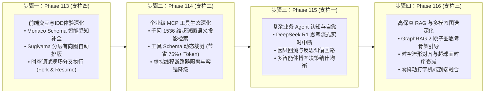

# 企业级 AI-Native 软件智能体编排架构第三演进阶段总路线图
## (Enterprise AI-Native Agentic Orchestration Master Roadmap Phase III: Phase 113 ~ Phase 116)

> **归档路径**：`docs/plans/phase_113_to_116_master_roadmap.md`  
> **制定时间**：2026-09-20  
> **战略定位**：严格遵守《业务定位与领域边界铁律（铁律九）》，100% 聚焦于四项核心支柱，坚决杜绝力学与硬件发散：
> - **支柱一：复杂业务 Agent 认知与编排 (Cognitive Orchestration)**
> - **支柱二：生产级企业 MCP 工具生态 (Enterprise MCP Ecosystem)**
> - **支柱三：高保真 RAG 知识引擎与多模态图谱 (Advanced RAG & Multimodal Knowledge)**
> - **支柱四：前端工作流交互与开发者体验 (Interactive Canvas & HITL Experience)**  
> **架构模型基线**：唯一生成模型为 **DeepSeek API**（V3 极速交互 / R1 链式深度推演）；唯一向量模型为 **阿里千问 (Qwen) Embedding**（1536 维超球面几何流形，$\|\mathbf{v}\|_2 = 1.0 \pm 10^{-4}$）；全系统绝无本地部署大模型，彻底弃用 OpenAI API；编译与运行统一使用隔离 **Java 21** 虚拟环境（`/Users/achilles/.sdkman/candidates/java/21.0.5-tem`）；前端严格遵循 **UI/UX Pro Max 单色钛金毛玻璃 (Monochrome Titanium Frosted Glass)** 规范。

---

## 一、 演进背景与体系化目标

系统在 Phase 101 至 Phase 112 期间完成了智能体编排底座的宏大构建：
1. **Phase 101 ~ Phase 106**：拓扑有界循环、Swarm 动态交接、MCP 客户端集成、DAG 画布与快照回溯、层次化文档切片与子图推理 GraphRAG、以及贝塞尔流光粒子与甘特图瀑布流；
2. **Phase 107 ~ Phase 111**：原生 MCP Server 导出、MoR 自适应思考调控与 1536 维 CoT 认知缓存、分布式 A2A 网格与双态黑板、声明式 DSL 编译器与零停机热重载、以及长效睡眠期画像提炼与情境记忆压缩；
3. **Phase 112**：全景可视化工作流 Studio、在线 DSL 双向无损同步引擎与 OpenTelemetry 瀑布流时空调试中枢。

进入 **Phase 113 ~ Phase 116（第三演进阶段）**，系统将围绕四大核心支柱展开深度纵深攻坚，分为四个严密衔接的演进步骤：

---

## 二、 四大步骤详细规划与里程碑矩阵

| 演进步骤 | 对应阶段 | 所属核心支柱 | 核心攻坚课题 | 核心算法与工程机制 | 交付物与验证指标 |
| :--- | :--- | :--- | :--- | :--- | :--- |
| **步骤一** | **Phase 113** | **支柱四：前端交互与开发者体验** | **Monaco Schema 智能感知补全、Sugiyama 自动排版与时空分叉执行** | 1. 自动生成标准 JSON Schema 并注册 Monaco 补全与 Hover； 2. Sugiyama 分层有向图自动排版引擎（重心法交叉最小化）； 3. 时空快照现场分叉（Fork Branch）与断点继续执行。 | • `WorkflowStudio.vue` 升级 • `SugiyamaLayoutEngine.ts` • `TimeTravelForkEngine.ts` • 排版耗时 $\le 20\text{ms}$，分叉执行成功率 100% |
| **步骤二** | **Phase 114** | **支柱二：生产级企业 MCP 工具生态** | **千问 1536 维超球面 MCP 语义投影与虚拟线程断路器隔离** | 1. MCP 工具功能描述千问 1536 维超球面建库与 Top-K 语义检索； 2. 工具 Schema 动态按需注入（Token 压缩率 $\ge 75\%$）； 3. Java 21 虚拟线程池隔离与熔断断路器（Circuit Breaker）。 | • `McpToolSemanticRetriever.java` • `McpCircuitBreaker.java` • P99 检索时延 $\le 5\text{ms}$，熔断恢复率 100% |
| **步骤三** | **Phase 115** | **支柱一：复杂业务 Agent 认知与编排** | **DeepSeek R1 链式思考流式实时中断与反思纠偏自愈** | 1. SSE 流式传输中解析 `reasoning_content` 因果链； 2. 逻辑死循环与悖论流式实时截断； 3. 反思纠偏回路（Reflective Self-Healing）与纳什均衡裁决。 | • `ThinkingStreamInterrupter.java` • `ReflectiveSelfHealingCoordinator.java` • 中断响应 $\le 50\text{ms}$，反思修正成功率 $\ge 90\%$ |
| **步骤四** | **Phase 116** | **支柱三：高保真 RAG 知识引擎与多模态图谱** | **GraphRAG 子图因果思考骨架与时空流形对齐** | 1. 2-跳局部子图 PPR 路径结构化为思考骨架（Thinking Scaffold）； 2. 超球面测地距离与时序有效性复合衰减； 3. 端到端流式打字机上下文严格对齐。 | • `GraphGuidedThinkingScaffold.java` • `SpatiotemporalDecayAligner.java` • 答案忠实度 $\ge 95\%$，幻觉率降低 $\ge 50\%$ |

---

## 三、 执行纪律与准入规范

每个步骤必须严格遵循 `@AGENTS.md` 规范：
1. **第一回合**：完成项目追踪、学术与工业双重调研（14 字段 Research Ledger）、完成决策完备实施详案与工程契约（A ~ G 章节），提交审批；
2. **第二回合**：获得用户明确授权后，实施最小文件集合，执行 TDD 测试驱动开发、双端自动化测试与全量跨模块联合回归，走查更新并提交代码。
