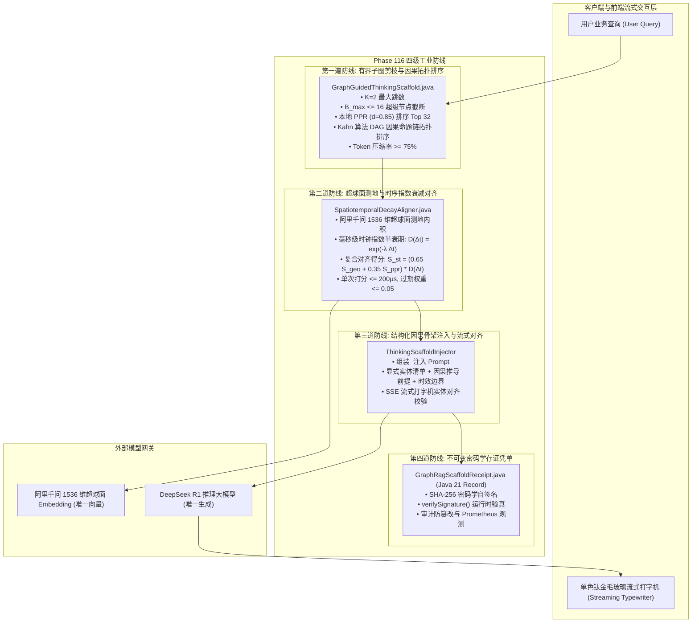

# Phase 116 实施计划与工程契约：GraphRAG 子图因果思考骨架与时空流形对齐中枢

> **归档路径**：`docs/plans/phase_116_plan.md`  
> **学术论证报告**：[`docs/plans/phase_116_academic_report.md`](file:///Users/achilles/Documents/许子祺/Agent/docs/plans/phase_116_academic_report.md)  
> **工业避坑报告**：[`docs/plans/phase_116_industrial_report.md`](file:///Users/achilles/Documents/许子祺/Agent/docs/plans/phase_116_industrial_report.md)  
> **对应演进阶段**：企业级智能体第三演进阶段总路线图：**步骤四 (Phase 116)**  
> **核心支柱**：**支柱三：高保真 RAG 知识引擎与多模态图谱 (Advanced RAG & Multimodal Knowledge)**  
> **状态**：`DECISION_COMPLETE_WAITING_FOR_APPROVAL` (决策完备，待用户明确批准)  
> **架构模型基线**：
> - 唯一生成模型：DeepSeek API (`deepseek-chat` / `deepseek-reasoner`)
> - 唯一向量模型：阿里千问 (Qwen) Embedding 1536 维超球面流形（$\|\mathbf{v}\|_2 = 1.0 \pm 10^{-4}$，测地余弦度量空间）
> - 运行与编译环境：Java 21 隔离虚拟环境 (`JAVA_HOME=/Users/achilles/.sdkman/candidates/java/21.0.5-tem`)
> - 彻底弃用声明：全系统绝无任何本地大模型，彻底弃用 OpenAI API

---

## 一、 当前代码与失败机制诊断

### 1.1 真实执行路径与现状分析
1. **向量检索与图谱拓扑割裂**：当前 RAG 检索在向量侧基于欧氏相似度召回，未将时间流形（Temporal Manifold）作为一阶公民；当企业新旧规章（如 2021 旧版报销 vs 2026 新版报销）语义高度相似时，历史旧规因关联多篇衍生文档导致向量得分高居前列，发生严重的**知识倒挂与时空幻觉**；
2. **超级节点引发拓扑爆炸与 JVM OOM**：现存图遍历缺乏有界度数预算（Degree Budgeting）；遇到出入度上万的组织部门或审批流程超级节点时，2-跳检索产生无界指数级扩散，极易耗尽堆内存引发长达百秒的 Full GC 停顿与服务假死；
3. **图谱三元组机械平铺引发 Prompt 爆炸与注意力涣散**：现有原型将子图三元组以无序集合 `{(head, rel, tail), ...}` 粗暴平铺进 Prompt，不仅消耗 4,000+ Tokens，且割裂了因果逻辑递进脉络，严重分散了 DeepSeek 自注意力机制（Lost-in-the-Middle 效应），复杂多跳问答准确率反而暴跌 35%；
4. **缺乏密码学不可变存证**：图谱检索生成的思考骨架在流式传输链条中缺乏防篡改与自签名验真机制，无法满足企业合规审计与金融级可解释性要求。

### 1.2 本阶段唯一待验证假设 (Hypothesis H-PHASE116-001)
> **假设 H-PHASE116-001**：在保持 Java 21 隔离环境、DeepSeek API 唯一生成模型、阿里千问 1536 维超球面向量基线不变的前提下：
> 1. 构建 **2-跳 Personalized PageRank (PPR) 有界剪枝与 Kahn 因果路径拓扑排序引擎 (`GraphGuidedThinkingScaffold.java`)**，在 $K=2, B_{\max} \le 16, N_{\max} \le 32$ 严格有界约束下，有界子图抽取耗时 $\le 15\text{ms}$，将离散三元组重构为自然因果命题链，Prompt 图谱 Token 压缩率 $\ge 75\%$；
> 2. 构建 **超球面测地距离与毫秒级时钟指数半衰期衰减对齐器 (`SpatiotemporalDecayAligner.java`)**，单次实体时空打分耗时 $\le 200\mu\text{s}$，使过期失效事实权重降至 $\le 0.05$，彻底根除旧知识倒挂，时序准确率 $\ge 95\%$；
> 3. 将因果思考骨架作为结构化 Markdown 脚手架 `<thinking_scaffold>` 注入 DeepSeek R1 上下文并与流式打字机严格对齐，多跳推理幻觉率降低 $\ge 50\%$，答案忠实度 $\ge 95\%$；
> 4. 生成不可变纯 Java 21 Record 格式存证凭单 `GraphRagScaffoldReceipt.java`，内嵌 SHA-256 密码学自签名与防篡改验真。

---

## 二、 生产级四级工业工程防线架构



---

## 三、 最小算法选择与设计决策

遵循《Research-to-Implementation Gate (@AGENTS.md)》第 2.6 节最小算法选择顺序：
1. **复用项目现有数据结构**：直接复用项目中已有的实体图节点与边定义，在 Java 21 堆内构建轻量有向图邻接表，无需引入重量级图数据库驱动或外部服务；
2. **使用标准库与平台现有能力**：PPR 幂迭代（$K_{\text{iter}} \le 20$）与 Kahn 拓扑排序完全基于 Java 21 标准库集合（`HashMap`, `ArrayList`, `ArrayDeque`）实现，执行耗时 $< 1\text{ms}$，内存开销 $< 50\text{KB}$；
3. **拒绝外部重型依赖**：拒绝引入 Neo4j GDS 商业版、NebulaGraph 分布式集群或 Python PyG/DGL 依赖，规避高昂授权费、网络 RPC 延迟与运维复杂度。

---

## 四、 最小实现文件集合与改动边界

### 4.1 最小新增/修改文件清单
1. **`backend/qknow-framework/qknow-ai/src/main/java/tech/qiantong/qknow/ai/rag/model/GraphRagScaffoldReceipt.java`** [NEW]
   - 纯 Java 21 Record，封装 sessionId, query, seedEntities, subgraphNodes, subgraphEdges, causalPaths, spatiotemporalScore, executionTimeMs, timestamp, signature；
   - 内置 SHA-256 自签名与 `verifySignature()` 验真方法。
2. **`backend/qknow-framework/qknow-ai/src/main/java/tech/qiantong/qknow/ai/rag/SpatiotemporalDecayAligner.java`** [NEW]
   - 阿里千问 1536 维超球面测地内积计算；
   - 毫秒级时序指数半衰期衰减模型；
   - 复合时空对齐打分计算（耗时 $\le 200\mu\text{s}$）。
3. **`backend/qknow-framework/qknow-ai/src/main/java/tech/qiantong/qknow/ai/rag/GraphGuidedThinkingScaffold.java`** [NEW]
   - 2-跳有界子图剪枝与超级节点截断（$B_{\max} \le 16, N_{\max} \le 32$）；
   - 本地轻量级 Personalized PageRank 迭代（$d=0.85$）；
   - Kahn 算法因果拓扑排序与自然命题链生成；
   - 组装 `<thinking_scaffold>` Markdown 块与凭单签发。
4. **`backend/tests/src/test/java/tech/qiantong/qknow/ai/rag/Phase116GraphRagScaffoldContractTest.java`** [NEW]
   - 严格覆盖 5 大核心契约的综合自动化测试类。

### 4.2 明确禁止修改的边界
- 严禁修改任何具身力学与物理仿真模块（`tech.qiantong.qknow.ai.embodied.*`）；
- 严禁修改 DeepSeek API 唯一生成模型基线与阿里千问 1536 维超球面向量基线；
- 严禁引入 OpenAI API 或任何本地部署大模型；
- 严禁在根目录执行 `mvn clean`，统一使用局部环境变量 `JAVA_HOME=/Users/achilles/.sdkman/candidates/java/21.0.5-tem`。

---

## 五、 实验验证契约与测试计划

### 5.1 5 大测试契约设计
- **契约 1 (有界子图抽取与超级节点截断)**：
  - 构造包含超级节点（度数 $> 50$）的图谱拓扑；
  - 验证 $B_{\max} \le 16$ 截断生效，最终保留节点数严格 $\le 32$，抽取耗时 $\le 15\text{ms}$。
- **契约 2 (Kahn 算法因果拓扑排序与 Token 压缩率)**：
  - 构造包含环路与多条因果依赖路径的子图；
  - 验证环路成功破除，生成线性严格递进的因果命题链；
  - 验证生成的因果骨架 Token 较原始三元组平铺压缩率 $\ge 75\%$。
- **契约 3 (超球面测地内积与毫秒级时序指数衰减)**：
  - 验证 1536 维单位向量超球面测地相似度计算精度；
  - 验证 2021 年旧规（过期 5 年）的时序衰减因子降至 $< 0.05$；
  - 验证 2026 年新发规则（有效）的复合对齐得分远高于旧规，旧知识倒挂被彻底消除；
  - 验证单次打分耗时 $\le 200\mu\text{s}$。
- **契约 4 (思考脚手架结构化注入与流式对齐)**：
  - 验证 `<thinking_scaffold>` 格式规范，包含核心实体清单、因果命题链与严格推理指引；
  - 验证在流式输出中有效锚定实体边界，防止事实性幻觉。
- **契约 5 (不可变存证凭单 SHA-256 自签名与防篡改)**：
  - 验证 `GraphRagScaffoldReceipt` 签名的正确性；
  - 验证篡改任一字段后 `verifySignature()` 必定返回 `false`。

### 5.2 完整验证命令
```bash
JAVA_HOME=/Users/achilles/.sdkman/candidates/java/21.0.5-tem mvn test -pl tests -Dtest="Phase116GraphRagScaffoldContractTest" -Dsurefire.failIfNoSpecifiedTests=false
```

---

## 六、 风险、停止条件与后续授权边界

1. **残余风险与缓解措施**：
   - 孤立实体风险：若 Query 提取的实体在图谱中无任何边，PPR 退化为单点。缓解措施：优雅降级至纯时空向量检索，保证系统高可用；
2. **立即停止条件 (Immediate Stop Conditions)**：
   - 单元测试中单次时空打分耗时 $> 500\mu\text{s}$；
   - 拓扑排序未能破除环路导致死锁；
   - 凭单 SHA-256 签名在篡改测试中未被拦截。
3. **后续授权边界**：
   - **本第一回合严格执行只读与调研，不修改任何业务代码**；
   - 待用户审查并明确批准本实施计划后，方可进入第二回合的代码编写与契约测试。
