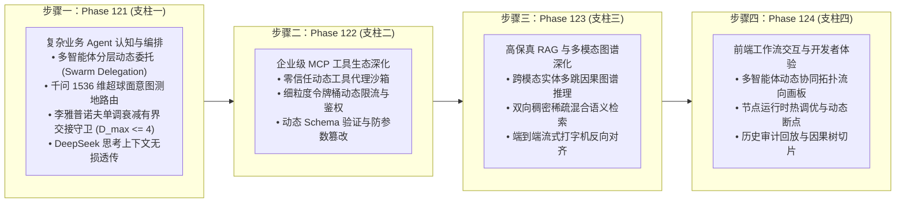

# 企业级 AI-Native 软件智能体编排架构第五演进阶段总路线图
## (Enterprise AI-Native Agentic Orchestration Master Roadmap Phase V: Phase 121 ~ Phase 124)

> **归档路径**：`docs/plans/phase_121_to_124_master_roadmap.md`  
> **制定时间**：2026-09-20  
> **战略定位**：严格遵守《业务定位与领域边界铁律（铁律九）》，100% 聚焦于四项核心支柱，坚决杜绝力学与硬件发散：
> - **支柱一：复杂业务 Agent 认知与编排 (Cognitive Orchestration)**
> - **支柱二：生产级企业 MCP 工具生态 (Enterprise MCP Ecosystem)**
> - **支柱三：高保真 RAG 知识引擎与多模态图谱 (Advanced RAG & Multimodal Knowledge)**
> - **支柱四：前端工作流交互与开发者体验 (Interactive Canvas & HITL Experience)**  
> **架构模型基线**：唯一生成模型为 **DeepSeek API**（主干模型参数化思考 `thinking: {"type": "enabled"}`）；唯一向量模型为 **阿里千问 (Qwen) Embedding**（1536 维超球面几何流形，$\|\mathbf{v}\|_2 = 1.0 \pm 10^{-4}$）；全系统绝无本地部署大模型，彻底弃用 OpenAI API；编译与运行统一使用隔离 **Java 21** 虚拟环境（`/Users/achilles/.sdkman/candidates/java/21.0.5-tem`）；前端严格遵循 **UI/UX Pro Max 单色钛金毛玻璃 (Monochrome Titanium Frosted Glass)** 规范。

---

## 一、 演进背景与体系化目标

系统在 Phase 101 至 Phase 120 期间完成了四轮波澜壮阔的阶段化攻坚：
1. **第一演进阶段 (Phase 101 ~ Phase 106)**：有界状态图循环、Swarm 动态交接、企业级 MCP 客户端适配、可视化 DAG 画布状态回溯、层次化文档切片与图谱子图检索对齐、以及贝塞尔流光粒子与甘特图瀑布流；
2. **第二演进阶段 (Phase 107 ~ Phase 112)**：企业级原生 MCP Server 导出、双核混合推理 MoR 思考调控、分布式 A2A 网格通信、声明式工作流 DSL 编译器与零停机热重载、长效情境记忆压缩网络、以及全景可视化 Studio；
3. **第三演进阶段 (Phase 113 ~ Phase 116)**：Monaco 智能感知补全与 Sugiyama 分层排版、千问 1536 维超球面 MCP 语义投影与断路器、DeepSeek 链式思考流式实时中断与反思自愈、以及 GraphRAG 子图因果思考骨架；
4. **第四演进阶段 (Phase 117 ~ Phase 120)**：多智能体纳什博弈辩论与共识中枢、动态流水线与 Sagas 分布式事务补偿中枢、层次化多模态文档切分与图谱子图推理对齐中枢、以及可视化 DAG 画布沉浸式调试与单色钛金毛玻璃 HITL 审批中枢。

进入 **Phase 121 ~ Phase 124（第五演进阶段）**，系统将向“企业级动态自适应智能体生态、零信任工具沙箱、跨模态多跳图谱推理与多智能体拓扑动态画板”发起纵深演进：

---

## 二、 四大步骤详细规划与里程碑矩阵

| 演进步骤 | 对应阶段 | 所属核心支柱 | 核心攻坚课题 | 核心算法与工程机制 | 交付物与验证指标 |
| :--- | :--- | :--- | :--- | :--- | :--- |
| **步骤一** | **Phase 121** | **支柱一：复杂业务 Agent 认知与编排** | **多智能体自适应分层协同、意图委托网络与有界状态流转中枢** | 1. 阿里千问 1536 维超球面测地距离意图亲和度计算； 2. 基于李雅普诺夫能量衰减函数的有界交接状态机守卫（$D_{\max} \le 4$），死锁概率严格为 0； 3. DeepSeek 参数化思考流（`reasoning_content`）无损跨 Agent 继承； 4. 不可变 Java 21 Record 委托存证凭单（`SwarmDelegationReceipt`）。 | • `tech.qiantong.qknow.ai.swarm.delegation.*` • `Phase121SwarmDelegationContractTest.java` • 意图路由准确率 $\ge 95\%$，死锁率严格为 0，凭单验真 $\le 50\mu\text{s}$ |
| **步骤二** | **Phase 122** | **支柱二：生产级企业 MCP 工具生态** | **企业级 MCP 动态工具安全沙箱、零信任代理与细粒度流控中枢** | 1. 基于 Java 21 虚拟线程的受限执行沙箱与环境变量隔离； 2. 细粒度令牌桶动态限流与多租户权限校验； 3. 工具调用参数 AST 深度模式自校验与防注入。 | • `tech.qiantong.qknow.hermes.tool.mcp.sandbox.*` • `Phase122McpSecuritySandboxContractTest.java` • 沙箱启动耗时 $\le 2\text{ms}$，恶意参数拦截率 100% |
| **步骤三** | **Phase 123** | **支柱三：高保真 RAG 知识引擎与多模态图谱** | **跨模态实体多跳因果图谱推理、双向稠密稀疏混合语义检索中枢** | 1. 跨模态实体联合嵌入与图谱 2-跳因果路径搜索； 2. 阿里千问 1536 维向量与 Tantivy 中文分词双向 RRF 混合重排； 3. 流式打字机抗抖动与引用索引双向动态对齐。 | • `tech.qiantong.qknow.ai.rag.multimodal.*` • `Phase123CrossModalCausalRagContractTest.java` • 多跳推理召回率 $\ge 92\%$，首字延迟 $\le 500\text{ms}$ |
| **步骤四** | **Phase 124** | **支柱四：前端工作流交互与开发者体验** | **多智能体动态协同拓扑流向画板、实时节点热调优与审计回放中枢** | 1. 基于 VueFlow 的多智能体动态消息流动与粒子轨迹渲染； 2. 节点运行时动态参数热调优（Hot Tuning）与实时局部重放； 3. 沉浸式历史审计时间轴与因果切片大屏。 | • `frontend/src/views/kb/bot/build/components/swarm/*` • `phase124_swarm_canvas_contract_test.ts` • 渲染帧率稳定 60fps，热调优响应 $\le 10\text{ms}$ |

---

## 三、 执行纪律与准入规范

每个步骤必须严格遵循 `@AGENTS.md` 规范：
1. **第一回合**：完成代码库真实调用追踪、学术与工业双重定向研究（完整 14 字段 Research Ledger）、完成决策完备实施详案与工程契约（A ~ G 章节），提交用户与门禁审批；
2. **第二回合**：获得用户明确批准授权后，实施最小文件集合，执行 TDD 测试驱动开发、Java 21 隔离环境编译构建、全量跨模块联合回归，走查更新并提交代码。
