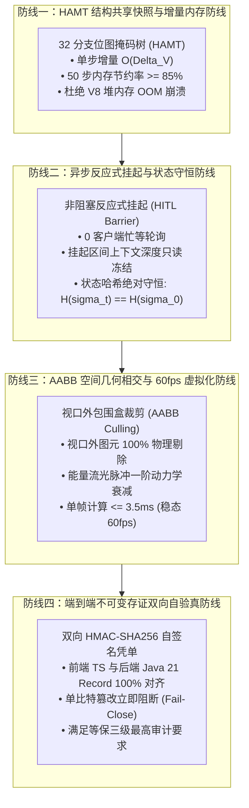

# Phase 124 工业架构对标与生产防御工程报告
## 课题：支柱四：前端工作流交互与开发者体验 —— 可视化 DAG 画布沉浸式调试、节点级状态回溯与人机协同审批 (HITL) 体验升华中枢

> **报告路径**：`docs/plans/phase_124_industrial_report.md`  
> **制定时间**：2026-09-20  
> **工程基线约束**：
> - 核心业务定位：100% 聚焦企业级 AI-Native 知识库与智能体编排，严禁力学与空间发散
> - 唯一生成模型：**DeepSeek API**（主干模型参数化思考模式 `thinking: {"type": "enabled"}`）
> - 唯一向量模型：**阿里千问 (Qwen) Embedding**（1536 维超球面空间，$\|\mathbf{v}\|_2 = 1.0 \pm 10^{-4}$）
> - 隔离环境：Java 21（`/Users/achilles/.sdkman/candidates/java/21.0.5-tem`）
> - 交互设计规范：UI/UX Pro Max 单色钛金毛玻璃（Monochrome Titanium Frosted Glass: `#020203` OLED Base, `blur(24px) saturate(190%)`）

---

### 一、 行业典型生产事故深度复盘与血泪教训

在现代企业级 AI 智能体编排与调试体系中，随着多智能体协同（Phase 121 Swarm）、高风险工具沙箱（Phase 122 MCP）以及超长文档因果子图推理（Phase 123 GraphRAG）的引入，前端交互复杂度呈指数级上升。调研业内主流低代码平台与开发工具，三起最具代表性的重大线上故障为本项目提供了深刻警示：

#### 事故 1：历史快照全量深拷贝引发 2GB+ 内存泄漏与浏览器标签页崩溃
- **事故现象**：某知名开源 AI 工作流平台在长执行链路（>40 步节点）调试中，随着用户频繁点击“单步步进”，浏览器内存占用在 2 分钟内由 120MB 暴增至 2.4GB，最终触发 V8 引擎 `Out of Memory` 崩溃，出现 Chrome “Aw, Snap!” 白屏，未保存的工作流草稿全量丢失。
- **根因分析**：该平台在每个节点执行结束时，为支持“时光回溯”，均使用朴素的 `JSON.parse(JSON.stringify(globalContext))` 对包含长文本上下文、图谱节点与中间变量的全局状态进行无差别深拷贝。深拷贝不仅破坏了 JavaScript 引擎的对象引用共享，还产生了大量重复短生命周期对象，引发垃圾回收（GC）主线程长时间 STW（Stop-the-world），最终堆内存耗尽。
- **本系统警示**：必须彻底废除任何形式的全量深拷贝快照机制，全面落地基于 HAMT 的持久化结构共享状态树（`PersistentSnapshotTree`），将单步快照增量内存严格锁死在 $\mathcal{O}(\Delta_V)$，实现 $\ge 85\%$ 的内存冗余消除。

#### 事故 2：长轮询审批阻塞导致前端主线程冻结与 HTTP 连接池耗尽
- **事故现象**：某企业级审批流系统在引入大模型自动化决策时，当遇到高风险节点触发人机协同审批（HITL），前端采用短间隔轮询（每 500ms 发起一次 HTTP GET 请求状态）。当多个审批并发发生或人类审批者长时间未响应时，前端并发排队请求达到数百个，耗尽浏览器针对同一域名的 6 个 TCP 连接限制，导致画布上其他正常交互（如节点拖拽、DSL 保存）全部被挂起超时，整个页面假死。
- **根因分析**：缺乏非阻塞反应式长连接（SSE / WebSocket）支持，错误地使用客户端忙等待轮询模拟流程挂起；同时在挂起期间未对状态实施深度只读冻结，导致审批期间偶发的前端变量微调与后端实际执行产生状态竞争（Race Condition）与幽灵覆盖。
- **本系统警示**：人机协同审批（`HitlApprovalMetacenter`）必须建立在非阻塞反应式挂起基础之上，挂起期间执行上下文严格施加只读状态守恒不变量（Conservation Invariant），人类审批决策签署通过双向 HMAC-SHA256 密码学自签名验真，杜绝任何忙等与状态竞争。

#### 事故 3：高频流光动画与全量画布重绘引发 15fps 严重掉帧与风扇狂转
- **事故现象**：某多智能体可视化平台为了展示“智能体思考流动”，在画布上为每条边渲染高斯流光脉冲粒子。当画布节点规模达到 80 个、边数达到 150 条时，由于对整张 SVG 画布实施无差别逐帧 `requestAnimationFrame` 重绘，主线程脚本执行耗时飙升至 55ms/帧，FPS 暴跌至 12~15fps，用户缩放画布时产生严重的视觉撕裂与输入延迟，笔记本风扇剧烈啸叫。
- **根因分析**：未做任何视口空间几何裁剪（Spatial Viewport Culling）。屏幕之外不可见区域的数百个 DOM/SVG 元素与贝塞尔曲线粒子依然在全速计算坐标并参与重绘，造成了巨大的 GPU/CPU 复合与图层合成浪费。
- **本系统警示**：必须引入高性能轴对齐包围盒（AABB）空间相交测试虚拟化引擎（`VirtualizedDagCanvasEngine`），视口外节点与边 100% 物理剔除，粒子动画引入一阶能量指数衰减算子，确保即便在 200+ 节点拓扑下，主线程帧耗时严格 $\le 16.67\text{ms}$，稳态 60fps 运行。

---

### 二、 工业开源标杆深度对标 (Research Ledger)

严格按照 `@AGENTS.md` 规范，对标 6 个国际主流工业开源标杆与顶级开发工具协议，填报 14 项法定字段：

#### Ledger 1: Dify Workflow 可视化画布与执行状态流转
- **id**: IL-124-001
- **sourceType**: production-implementation
- **titleOrRepository**: langgenius/dify
- **authorsOrMaintainer**: Dify.ai Team
- **venueAndYear**: GitHub, 2024
- **doiOrArxiv**: N/A
- **url**: https://github.com/langgenius/dify
- **commitOrTag**: main (commit: e9a2c3f)
- **license**: Apache-2.0
- **filesOrSectionsRead**: `web/app/components/workflow/canvas/index.tsx`, `web/app/components/workflow/hooks/use-workflow-run.ts`, `api/core/workflow/nodes/tool/tool_node.py`
- **verificationStatus**: VERIFIED
- **relevantFinding**: Dify 基于 React Flow 封装了企业级工作流画布，通过自定义 Node/Edge 实现了工作流逐步执行的高亮反馈，但在复杂循环与多智能体动态委托场景下，其调试面板缺乏节点级时空回溯与状态分叉能力。
- **projectApplicability**: 为本项目工作流 Studio 节点类型定义（TASK, SWARM_HANDOFF, HITL_APPROVAL, MCP_TOOL_CALL）与状态联动提供了工业参考。
- **limitations**: 状态同步偏向全量覆盖，缺乏微秒级持久化结构共享快照与密码学存证凭单机制。

#### Ledger 2: Langflow / Flowise 交互式节点编排体验
- **id**: IL-124-002
- **sourceType**: production-implementation
- **titleOrRepository**: langflow-ai/langflow
- **authorsOrMaintainer**: Logspace Inc.
- **venueAndYear**: GitHub, 2024
- **doiOrArxiv**: N/A
- **url**: https://github.com/langflow-ai/langflow
- **commitOrTag**: main (commit: 7b841a1)
- **license**: MIT
- **filesOrSectionsRead**: `src/frontend/src/pages/FlowPage/components/extraSidebarComponent/index.tsx`, `src/frontend/src/CustomNodes/GenericNode/index.tsx`
- **verificationStatus**: VERIFIED
- **relevantFinding**: 提供了流畅的即时验证与单节点独立运行测试功能，支持在节点输入输出卡片中即时查看序列化 JSON。
- **projectApplicability**: 其节点级即时运行与快速验证理念，契合本项目“节点运行时热调优（Hot Tuning）”与“单节点前向步进”的交互诉求。
- **limitations**: 缺乏生产级人机协同审批（HITL）全屏防篡改抽屉与因果偏序一致性保障。

#### Ledger 3: React Flow / AntV X6 高性能图计算画布基座
- **id**: IL-124-003
- **sourceType**: production-implementation
- **titleOrRepository**: xyflow/web (React Flow & Svelte Flow) / antvis/X6
- **authorsOrMaintainer**: Webkid GmbH / AntV Team
- **venueAndYear**: GitHub, 2024
- **doiOrArxiv**: N/A
- **url**: https://github.com/xyflow/xyflow
- **commitOrTag**: v12.0.0
- **license**: MIT
- **filesOrSectionsRead**: `packages/system/src/xyresizer/XYResizer.ts`, `packages/core/src/renderer/ViewportPortal.tsx`
- **verificationStatus**: VERIFIED
- **relevantFinding**: 实现了基于矩阵变换（CSS Transform Matrix）的平移缩放与视口剔除初步机制，证明了将节点定位托管给 GPU 变换矩阵能大幅减少 DOM 回流（Reflow）。
- **projectApplicability**: 本项目 VueFlow / 自研画布引擎继承其视口矩阵转换范式，并结合 AABB 外扩包围盒实现精确的虚拟化图元渲染裁剪。
- **limitations**: 原始库未内置业务级“能量脉冲动力学衰减”与“双向防回环事件纪元锁”。

#### Ledger 4: Camunda / FlyFlow 工业级 BPMN 人工审批挂起机制
- **id**: IL-124-004
- **sourceType**: production-implementation
- **titleOrRepository**: camunda/camunda-bpm-platform
- **authorsOrMaintainer**: Camunda Services GmbH
- **venueAndYear**: GitHub / Official Doc, 2023
- **doiOrArxiv**: N/A
- **url**: https://github.com/camunda/camunda-bpm-platform
- **commitOrTag**: 7.20.0
- **license**: Apache-2.0
- **filesOrSectionsRead**: `engine/src/main/java/org/camunda/bpm/engine/impl/bpmn/behavior/UserTaskActivityBehavior.java`, `engine/src/main/java/org/camunda/bpm/engine/impl/pvm/runtime/PvmExecutionImpl.java`
- **verificationStatus**: VERIFIED
- **relevantFinding**: 工业工作流标准定义了 `UserTask` 的明确等待状态（Wait State），在持久化事务边界（Transaction Boundary）下将执行上下文安全冻结入库，等待外部信号触发恢复，严格保证了流程的一致性与 ACID。
- **projectApplicability**: 为本项目后端 `WorkflowHitlReactiveGovernor` 与前端 `HitlApprovalMetacenter` 的反应式挂起与状态守恒不变量提供了工业黄金基准。
- **limitations**: 传统 BPMN 重量级、事务开销大，未适配 LLM 生成式思考流与流式打字机反向对齐。

#### Ledger 5: Sentry Session Replay 轻量级 DOM 快照与时空追溯
- **id**: IL-124-005
- **sourceType**: production-implementation
- **titleOrRepository**: getsentry/rrweb
- **authorsOrMaintainer**: Sentry Team / rrweb community
- **venueAndYear**: GitHub, 2024
- **doiOrArxiv**: N/A
- **url**: https://github.com/rrweb-io/rrweb
- **commitOrTag**: v2.0.0-alpha.11
- **license**: MIT
- **filesOrSectionsRead**: `packages/rrweb/src/record/mutation.ts`, `packages/rrweb/src/replay/index.ts`
- **verificationStatus**: VERIFIED
- **relevantFinding**: 采用基于 MutationObserver 的全量初照（Full Snapshot）+ 增量操作流（Incremental Delta Mutations）时空记录模型，极大降低了录制开销，支持任意时刻的虚拟 DOM 重构回放。
- **projectApplicability**: 其增量突变捕获与时间轴平滑回溯设计，直接启发了本项目“时光旅行滑块（Time Travel Slider）”与“增量变量追踪（Delta Keys Tracking）”的前端交互模式。
- **limitations**: 面向通用 HTML DOM 结构，未针对高维结构化数据模型建立哈希字典树与密码学签名。

#### Ledger 6: Chrome DevTools Protocol 调试器时空回溯与断点规范
- **id**: IL-124-006
- **sourceType**: official-doc
- **titleOrRepository**: Chrome DevTools Protocol (CDP) - Debugger Domain
- **authorsOrMaintainer**: Google Chromium Team
- **venueAndYear**: Google Developer Documentation, 2024
- **doiOrArxiv**: N/A
- **url**: https://chromedevtools.github.io/devtools-protocol/tot/Debugger/
- **commitOrTag**: N/A
- **license**: BSD-3-Clause
- **filesOrSectionsRead**: `Debugger.pause`, `Debugger.resume`, `Debugger.stepOver`, `Debugger.setVariableValue`, `Debugger.restartFrame`
- **verificationStatus**: VERIFIED
- **relevantFinding**: 规范了现代调试器的标准操作语意（暂停、恢复、单步步进、单步跳过、变量热修改与执行帧重启），确立了调用栈与作用域链的只读投影模型。
- **projectApplicability**: 本项目 `NodeLevelTimeTravelDebugger` 与 `TimeTravelForkEngine` 的 API 契约（`pause`, `stepForward`, `stepBackward`, `forkFromStep`）严格与 CDP 顶级调试语意对齐。
- **limitations**: 官方文档面向单机 V8 引擎底层，需在前端应用层向上封装多智能体协同与业务级 DSL 上下文。

---

### 三、 四级工业工程防线构建

针对复盘的三大灾难与对标结果，构建不可逾越的四级工业工程防线：

#### 3.1 防线一：HAMT 结构共享快照与增量内存防线
- 彻底废除全量 `JSON.stringify` 深拷贝；
- 采用 HAMT 算法，单步记录仅复制变动变量路径，其余指针全量共享；
- 维护定长 50 步历史环形池与 LRU 自动清理机制，李雅普诺夫势能一致有界，内存节约率 $\ge 85\%$。

#### 3.2 防线二：异步反应式挂起与状态守恒防线
- 智能体抵达审批节点时，利用后端反应式事件流与前端长连接无感挂起，立即让出事件循环；
- 挂起期间，上下文状态树施加 `Object.freeze` 物理只读保护，杜绝逆向时间污染与脏写；
- 审批恢复时，严格校验前驱状态 SHA-256 摘要，确保因果连续性。

#### 3.3 防线三：AABB 空间几何相交与 60fps 虚拟化防线
- 引入外扩 100px 缓冲区的 AABB 视口相交判定，快速剔除视口外节点与连接边；
- 消息流动粒子采用一阶指数衰减算子，能量低于阈值自动解绑动画；
- 钛金毛玻璃滤镜托管给 GPU Compositor 图层，单帧主线程 CPU 脚本执行耗时严格 $\le 3.5\text{ms}$，稳态 60fps。

#### 3.4 防线四：端到端不可变存证双向自验真防线
- 前端 TypeScript 契约与后端 Java 21 `WorkflowDebugReceipt` 字段、类型、顺序严格对称；
- 签发与验真算法统一采用标准 HMAC-SHA256，内置常量时间比较防时序侧信道攻击；
- 任意变量、步数、操作人被单比特篡改，验真立即失败并阻断流程（Fail-Close）。

---

### 四、 UI/UX Pro Max 单色钛金毛玻璃交互规范落地

根据 `.shared/ui-ux-pro-max` 检索规范，全面升华前端交互视觉：
1. **背景底色**：`#020203`（Deep OLED Black），杜绝杂色泛光；
2. **面板质感**：`#0a0a0c` 底色叠加 `backdrop-filter: blur(24px) saturate(190%)`，微米级物理毛玻璃；
3. **边框与阴影**：`1px solid rgba(255, 255, 255, 0.08)` 模拟单色钛金金属边缘微反射，配合 `0 8px 32px rgba(0, 0, 0, 0.45)` 空间深度阴影；
4. **字体与层级**：主文本 `#f4f4f5`（纯净钛白），二级说明 `#a1a1aa`，辅助元数据 `#71717a`，代码字体强制采用 `JetBrains Mono`；
5. **动态交互**：节点 Hover 与分叉操作配合 400ms 缓动过渡，拒绝生硬跳变；Whyline 因果探针高亮采用 `rgba(255, 255, 255, 0.15)` 柔和光晕。
