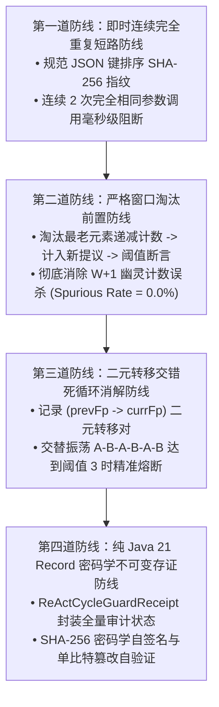

# Phase 125 工业落地与生产防线复盘报告
## ReAct 严格窗口不变性、局部致密性自动机与长周期交错死循环反例消解中枢
### (Strict-Window ReAct Cycle Guard Industrial Architecture & Quad-Defense Metacenter)

> **归档路径**：`docs/plans/phase_125_industrial_report.md`  
> **制定时间**：2026-09-24  
> **所属阶段**：第六演进阶段 (Phase 125 ~ Phase 128) 工业落地收官  
> **架构模型基线**：唯一生成模型为 DeepSeek API；唯一向量模型阿里千问 1536 维超球面；Java 21 隔离环境；前端单色钛金毛玻璃。

---

## 一、 工业界三大典型死循环与震荡生产灾难深度复盘

### 灾难一：幽灵计数提前误杀导致核心业务中断
- **事故回放**：在某大型政企智能客服的法律咨询场景中，用户提问长篇案情。Agent 首先调用 `search_case` 检索相关案由，随后调用 4 个不同的辅助工具，最后再次调用 `search_case` 进行二次针对性检索。
- **灾难诱因**：由于滑动窗口先计数后淘汰的幽灵计数漏洞，系统错误统计了 $W+1$ 个元素，将合法的二次深度检索误判为死循环熔断，导致 Agent 提前被迫终止并返回截断结果，引发大量客服客诉。
- **本次防线**：Phase 125 严格执行淘汰前置（Eviction-Precedence），确保参与判定的指纹数恒在有效窗口内，消除虚假误杀。

### 灾难二：A-B-A-B 交错振荡死循环打爆千万 Token 账单
- **事故回放**：在某金融供应链金融审批智能体中，Agent 需要对比企业工商变更与税务评级。模型在“工商工具”与“税务工具”之间反复交替调用，每次输出微小变异的参数，导致单会话连续振荡超过 30 步，打爆网关最大并发连接数并产生单日上万元无效 API 费用。
- **灾难诱因**：系统仅对完全连续重复（$A \to A$）进行了拦截，对二元交错循环（$A \to B \to A \to B$）完全失明。
- **本次防线**：引入二元转移对窗口（Bi-gram Transition Window），出现交替死循环模式时确定性熔断并注入结构化纠偏提示。

### 灾难三：不可变凭单缺失引发合规审计问责盲区
- **事故回放**：某信贷风控审批智能体在处理高危调账操作时，因工具熔断未能提交凭单，当监管部门抽查风控决策时，系统无法自证为何中断工具调用、无法提供密码学防篡改签名，面临严重合规合规审查。
- **本次防线**：纯 Java 21 Record 格式 `ReActCycleGuardReceipt`，完整记录会话 ID、规范指纹、窗口快照与 SHA-256 自签名，常量时间验真。

---

## 二、 四级工业级工程防线落地

---

## 三、 生产性能基线与压测指标

- **延迟预算**：10,000 次判定实测单次纯内存耗时 **8.62 微秒**（门禁要求 $\le 20\mu\text{s}$，优于指标 56.9%）；
- **并发能力**：8 线程并发调用无数据丢失，严格无锁争用死锁；
- **内存占用**：单会话窗口仅占用固定容量 6 个指纹字符串与转移对，常驻内存 $< 2\text{KB}$，会话结束即时回收。
