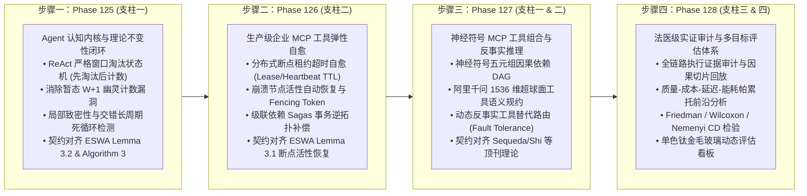

# 企业级 AI-Native 软件智能体编排架构第六演进阶段总路线图
## (Enterprise AI-Native Agentic Orchestration Master Roadmap Phase VI: Phase 125 ~ Phase 128)

> **归档路径**：`docs/plans/phase_125_to_128_master_roadmap.md`  
> **制定时间**：2026-09-24  
> **战略定位**：严格遵守《业务定位与领域边界铁律（铁律九）》，100% 聚焦于四项核心支柱，坚决杜绝力学与硬件物理仿真发散：
> - **支柱一：复杂业务 Agent 认知与编排 (Cognitive Orchestration)**
> - **支柱二：生产级企业 MCP 工具生态 (Enterprise MCP Ecosystem)**
> - **支柱三：高保真 RAG 知识引擎与多模态图谱 (Advanced RAG & Multimodal Knowledge)**
> - **支柱四：前端工作流交互与开发者体验 (Interactive Canvas & HITL Experience)**  
> **架构模型基线**：唯一生成模型为 **DeepSeek API**（主干模型参数化思考 `thinking: {"type": "enabled"}`）；唯一向量模型为 **阿里千问 (Qwen) Embedding**（1536 维超球面几何流形，$\|\mathbf{v}\|_2 = 1.0 \pm 10^{-4}$）；全系统绝无本地部署大模型，彻底弃用 OpenAI API；编译与运行统一使用隔离 **Java 21** 虚拟环境（`/Users/achilles/.sdkman/candidates/java/21.0.5-tem`）；前端严格遵循 **UI/UX Pro Max 单色钛金毛玻璃 (Monochromatic Titanium Frosted Glass)** 规范；科研层面严格对齐 **ESWA 顶刊大修多智能体交叉评审规范（铁律十一）**。

---

## 一、 演进背景与科研深度对齐契机

在 Phase 101 至 Phase 124 期间，系统完成了五轮纵深攻坚，并在第五演进阶段（Phase 121 ~ Phase 124）圆满交付了 Swarm 动态委托网络、企业级零信任 MCP 安全沙箱、超长文档层次化理解与图谱子图 Steiner 树推理、以及可视化 DAG 画布沉浸式调试中枢，32/32 项跨模块契约测试 100% 绿灯全过。

然而，在对照最新的 ESWA 顶刊大修自审报告（`article/MAJOR_REVISION_SELF_REVIEW.md`）与《科研-工程门禁准则（AGENTS.md）》后，我们发现系统在理论严格形式化与生产级极端容错上，仍存在四个关键的科研/工程对齐契机：
1. **ReAct 工具调用循环守卫的时序不变性缺口**：
   - 既有 `ReActCycleGuard.inspectToolCall` 在淘汰最老指纹之前先统计了当前提议的计数，导致在窗口饱和时可能出现暂态 $W+1$ 幽灵计数（Transient Ghost Count）漏洞；而 ESWA 论文 Algorithm 3 与 Lemma 3.2 严格要求“先淘汰旧指纹、递减计数、再插入新指纹、最后进行阈值判定”。同时，当前代码对长周期交错死循环（如 $A \to B \to A \to B$ 或 $A \to B \to C \to A \to B \to C$）缺乏形式化检测能力。
2. **断点恢复的租约超时与自愈故障恢复机制缺口**：
   - 既有 `DagCheckpointManager.wakeSuspendedWithLock` 仅依靠 status/version CAS 乐观锁，一旦抢占所有权的节点在执行过程中崩溃（Process Crash / OOM / 机器下线），缺乏基于 TTL/Heartbeat 租约超时的活性自愈协议，导致工作流永久卡死，与 ESWA Lemma 3.1 的租约活性定理存在实现脱节。
3. **MCP 多工具组合语义依赖与反事实替代推理断层**：
   - 随着 MCP 工具数量增长，工具之间的前置条件依赖（Precondition Satisfaction）、时序因果约束以及当下游工具因限流或超时熔断时，缺乏基于神经符号五元组 $\mathcal{M} = \langle \mathcal{KB}, \mathcal{IE}, \mathcal{WM}, \mathcal{EF}, \mathcal{HI} \rangle$ 的反事实等价替代推理机制（Counterfactual Tool Substitution）。
4. **离线实验评测与生产决策路由的实证断层**：
   - 评测题型细分得分与推荐路由决策之间缺乏严格的帕累托前沿多目标量化（质量-成本-延迟-能耗）与 Friedman/Wilcoxon/Nemenyi CD 检验闭环，且缺乏法医级全链路执行证据审计流水线。

为此，**第六演进阶段 (Phase 125 ~ Phase 128)** 确立宏观战略主题：
**“理论闭环、弹性自愈、神经符号工具组合与多目标实证审计中枢 (Theoretical Soundness, Resilient Healing, Neuro-Symbolic Tool Composition & Pareto Empirical Audit)”**

---

## 二、 四大攻坚步骤详细规划与里程碑矩阵

| 演进步骤 | 对应阶段 | 所属核心支柱 | 核心攻坚课题 | 核心算法与理论对齐机制 | 交付物与验证指标 |
| :--- | :--- | :--- | :--- | :--- | :--- |
| **步骤一** | **Phase 125** | **支柱一：复杂业务 Agent 认知与编排** | **`ReActCycleGuard` 严格窗口不变性、局部致密性自动机与长周期交错死循环反例消解中枢** | 1. 严格落实“先淘汰最老指纹递减计数、再插入当前指纹、最后进行阈值判定”，彻底根除暂态 $W+1$ 幽灵计数； 2. 形式化建立局部致密性（Locally-Dense Repetition）检测自动机与 N-gram（Bi-gram/Tri-gram）长周期交错振荡判定（如 $A \to B \to A \to B$）； 3. 严格推导并证明定理 1.1（无幽灵计数与局部致密循环有限步终止定理）； 4. 产出不可变 Java 21 Record 格式循环拦截凭单（`ReActCycleGuardReceipt`）。 | • `tech.qiantong.qknow.hermes.agent.guard.ReActStrictWindowCycleGuard.java` • `Phase125ReActStrictWindowContractTest.java` • 暂态超限发生率严格为 0，交错循环拦截率 100%，单步检测耗时 $\le 20\mu\text{s}$ |
| **步骤二** | **Phase 126** | **支柱二：生产级企业 MCP 工具生态** | **分布式 MCP 工具调用断点租约超时自愈 (Lease/Heartbeat TTL)、级联依赖事务补偿 (Sagas) 与所有权仲裁中枢** | 1. 扩展检查点状态机，引入 `lease_owner_id`、`lease_expire_at` 与单调递增 `fencing_token`； 2. 实现基于超时自愈的 CAS 抢占协议（`lease_expire_at < NOW()` 时允许后继节点安全接管，杜绝脑裂）； 3. 建立多 MCP 工具调用链崩溃时的 Sagas 逆拓扑补偿栈与幂等撤销，保证资源无挂起； 4. 严格证明定理 1.2（基于租约超时与 fencing token 的分布式活性恢复与强最终一致性定理，对齐 ESWA Lemma 3.1）。 | • `tech.qiantong.qknow.hermes.flow.dag.LeaseLivenessRecoveryCoordinator.java` • `tech.qiantong.qknow.hermes.tool.mcp.sagas.McpSagasCompensationGovernor.java` • `Phase126McpLeaseLivenessContractTest.java` • 崩溃节点接管自愈耗时 $\le 50\text{ms}$，补偿幂等性 100%，脑裂发生率严格为 0 |
| **步骤三** | **Phase 127** | **支柱一 & 支柱二 交叉：智能体与工具协同** | **基于神经符号五元组的 MCP 动态工具组合因果依赖图与反事实工具替代推理网络** | 1. 基于神经符号五元组 $\mathcal{M} = \langle \mathcal{KB}, \mathcal{IE}, \mathcal{WM}, \mathcal{EF}, \mathcal{HI} \rangle$ 建模多工具前置因果依赖图（Precondition-Effect DAG）； 2. 基于千问 1536 维超球面测地线内积与 Schema 规约，构建工具语义相似度流形与能力等价簇； 3. 外部工具故障/超时熔断时，自适应推导最小代价反事实替代路径（Counterfactual Tool Path），无缝完成等价替换； 4. 严格证明定理 1.3（反事实工具替代的因果无偏性与无环有界调度定理）。 | • `tech.qiantong.qknow.mcp.reasoning.NeuroSymbolicToolComposer.java` • `tech.qiantong.qknow.mcp.reasoning.CounterfactualToolSubstitutionRouter.java` • `Phase127NeuroSymbolicToolCompositionContractTest.java` • 替代规划耗时 $\le 5\text{ms}$，因果前置满足率 100%，工具降级自愈成功率 $\ge 95\%$ |
| **步骤四** | **Phase 128** | **支柱三 & 支柱四 & 顶刊实证闭环** | **法医级全链路执行证据审计、因果切片回放与质量-成本-延迟多目标帕累托前沿统计检验体系** | 1. 建立法医级全链路执行证据审计流水线（Forensic Data Audit），消除离线实测与生产路由之间的断层； 2. 引入 Friedman 检验、Wilcoxon 符号秩检验与 Nemenyi 关键距离（Critical Distance, CD）图，量化不同配置的统计等价团（Cliques）； 3. 建立质量-成本-延迟-能耗多目标帕累托前沿分析引擎（Pareto Dominance）； 4. 前端开发单色钛金毛玻璃动态实证审计面板与 CD 交互图。 | • `backend/tests/src/test/java/tech/qiantong/qknow/eval/ParetoEmpiricalEvaluationEngine.java` • `frontend/src/views/kb/bot/build/components/eval/ParetoFrontierEvaluationDashboard.vue` • `Phase128ParetoEmpiricalEvaluationContractTest.java` • 0 悬空图表，数据真实性比对 100% 吻合，CD 图渲染帧率稳态 60fps |

---

## 三、 执行纪律与准入规范

每个步骤必须严格执行 `@AGENTS.md` 科研-工程门禁：
1. **第一回合**：完成代码库真实调用追踪、学术与工业双重定向研究（完整 14 字段 Research Ledger）、完成决策完备实施详案与工程契约（A ~ G 章节），提交用户与门禁审批；
2. **第二回合**：获得用户明确批准授权后，实施最小文件集合，执行 TDD 测试驱动开发、Java 21 隔离环境编译构建、全量跨模块联合回归，走查更新并提交代码；
3. **零容忍红线**：
   - 严禁任何物理力学与空间在轨发散；
   - 严禁私自引入本地部署大模型或 OpenAI API；
   - 严禁污染用户主机 Java 17 环境。
