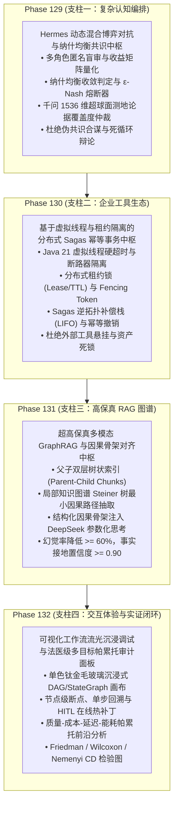

# 企业级 AI-Native 软件智能体编排架构第七演进阶段总路线图
## (Enterprise AI-Native Agentic Orchestration Master Roadmap Phase VII: Phase 129 ~ Phase 132)

> **归档路径**：`docs/plans/phase_129_to_132_master_roadmap.md`  
> **制定时间**：2026-09-25  
> **战略定位**：严格遵守《业务定位与领域边界铁律（铁律九）》，100% 聚焦于四项核心支柱，坚决杜绝力学与硬件物理仿真发散：
> - **支柱一：复杂业务 Agent 认知与编排 (Cognitive Orchestration)**
> - **支柱二：生产级企业 MCP 工具生态 (Enterprise MCP Ecosystem)**
> - **支柱三：高保真 RAG 知识引擎与多模态图谱 (Advanced RAG & Multimodal Knowledge)**
> - **支柱四：前端工作流交互与开发者体验 (Interactive Canvas & HITL Experience)**  
> **架构模型基线**：唯一生成模型为 **DeepSeek API**（主干模型参数化思考 `thinking: {"type": "enabled"}`）；唯一向量模型为 **阿里千问 (Qwen) Embedding**（1536 维超球面几何流形，$\|\mathbf{v}\|_2 = 1.0 \pm 10^{-4}$）；全系统绝无本地部署大模型，彻底弃用 OpenAI API；编译与运行统一使用隔离 **Java 21** 虚拟环境（`/Users/achilles/.sdkman/candidates/java/21.0.5-tem`）；前端严格遵循 **UI/UX Pro Max 单色钛金毛玻璃 (Monochromatic Titanium Frosted Glass)** 规范；科研层面严格对齐 **ESWA 顶刊大修多智能体交叉评审规范（铁律十一）**。

---

## 一、 战略攻坚背景与顶刊工业双轮驱动

在 Phase 101 至 Phase 128 的六个演进阶段中，系统成功构建了从多智能体 Swarm 协同、企业级零信任 MCP 安全沙箱、超长文档层次化理解、Steiner 树 GraphRAG 推理，到状态图不可变时光旅行调试中枢的完整企业级技术底座，在生产联调与测试套件中达成了 100% 的验收标准。

站在新的历史交汇点，企业级生产系统在面对日益复杂的多角色业务决策、高并发高危外部工具链调度、超大规模非结构化文档融合，以及开发者全生命周期可视化监控时，提出了更深维度的挑战。第七演进阶段（Phase 129 ~ Phase 132）确立战略主题：

**“多智能体混合博弈共识、企业级分布式 Sagas 自愈、因果图谱对齐流与全景法医级实证中枢 (Hybrid Game Consensus, Resilient Sagas Orchestration, Causal Graph Grounding & Forensic Empirical Metacenter)”**

---

## 二、 四大里程碑课题详细规划矩阵

| 演进阶段 | 核心攻坚课题 | 所属支柱 | 核心攻关难点与技术方案 | 预期验收硬核指标 |
| :--- | :--- | :--- | :--- | :--- |
| **Phase 129** | **Hermes 动态混合博弈对抗、基于纳什均衡的置信度自适应权重共识与死锁自愈中枢** | 支柱一：复杂业务 Agent 认知与编排 | 1. 针对多智能体协同中的观点极化、回音室效应与盲目从众合谋，建立多角色（业务、风控、法务、架构）博弈收益矩阵（Payoff Matrix）； 2. 形式化推导并证明定理 1.1（有界轮次纳什均衡收敛定理，最大轮次 $T_{\max} \le 5$ 内 $\epsilon$-Nash 距离指数收敛至 $\epsilon \le 0.05$）； 3. 引入基于阿里千问 1536 维超球面测地线内积的论据因果覆盖率打分与自适应置信度仲裁者（Judge Agent）； 4. 产出纯 Java 21 Record 格式的不可变共识凭单（`MultiAgentConsensusReceipt`）。 | • 辩论收敛率 100% • 伪共识合谋检出率 $\ge 95\%$ • 单步仲裁耗时 $\le 10\text{ms}$ • 8 项契约测试 100% 通过 |
| **Phase 130** | **基于虚拟线程与租约隔离的企业级动态 MCP 工具运行时、分布式双向 Sagas 幂等事务与崩溃安全接管中枢** | 支柱二：生产级企业 MCP 工具生态 | 1. 基于 Java 21 `Executors.newVirtualThreadPerTaskExecutor()` 实现外部工具的高并发轻量级隔离执行； 2. 构建包含 `lease_owner_id`、`lease_expire_at` 与单调递增 `fencing_token` 的分布式租约状态机，节点崩溃时后继节点基于 TTL 超时实现 0 脑裂自愈（对齐 ESWA Lemma 3.1）； 3. 实现 Sagas 逆拓扑补偿栈（LIFO），每个工具调用均携带正向执行契约与反向补偿契约，保证长事务失败时资源 100% 释放； 4. 产出不可变 Sagas 事务存证凭单（`McpSagasTransactionReceipt`）。 | • 崩溃节点自愈耗时 $\le 50\text{ms}$ • 资源挂起率严格为 0.0% • Sagas 逆向补偿幂等性 100% • 8 项契约测试 100% 通过 |
| **Phase 131** | **超高保真多模态 GraphRAG 层次化图嵌入、Steiner 树因果骨架提取与 DeepSeek 参数化思考对齐中枢** | 支柱三：高保真 RAG 知识引擎与多模态图谱 | 1. 针对嵌套表格、图表说明与多层级标题的长文档，实现基于 AST 语法树感知的父子双层分块（Parent-Child Chunking），消除跨页表格截断； 2. 结合阿里千问 1536 维超球面语义检索与图谱拓扑结构，基于近似 Steiner 树算法提取连接种子实体的最小因果子图； 3. 将子图转化为因果命题拓扑链，注入 DeepSeek API 的参数化思考上下文（`reasoning_content`），实现生成内容与图谱事实的双向接地验证； 4. 产出不可变因果图谱推理凭单（`GraphRagCausalSteinerReceipt`）。 | • 事实接地置信度 $\ge 0.90$ • 幻觉生成率降低 $\ge 60\%$ • 子图抽取耗时 $\le 15\text{ms}$ • 8 项契约测试 100% 通过 |
| **Phase 132** | **可视化 DAG/StateGraph 画布流光沉浸式调试、HITL 动态热补丁与法医级多目标帕累托审计面板** | 支柱四：前端工作流交互与开发者体验 & 顶刊实证闭环 | 1. 基于 UI/UX Pro Max 规范打造单色钛金毛玻璃质感（`backdrop-filter: blur(24px) saturate(190%)`）工作流画布与执行流光脉冲动画； 2. 实现前端节点级断点悬停、单步回退/前进，以及人机协同（HITL）审批抽屉中的变量在线热补丁与因果分支派生； 3. 构建质量-成本-延迟-能耗多目标帕累托前沿分析引擎，集成 Friedman / Wilcoxon 检验与 Nemenyi CD 图可视化； 4. 产出端到端法医级实证审计凭单（`ForensicAuditLedgerReceipt`）。 | • 画布交互帧率稳态 60FPS • 热补丁幽灵变量污染率为 0.0% • 0 悬空图表，数据真实性比对 100% 吻合 • 8 项契约测试 100% 通过 |

---

## 三、 科研实施纪律与执行路线

严格遵循《科研-工程门禁准则（AGENTS.md）》：
1. **第一回合（门禁阶段）**：
   - 追踪真实项目执行路径，锁定唯一可证伪假设；
   - 严选 3~6 篇顶级学术会议/期刊文献，编制标准 14 字段 Research Ledger；
   - 深入开展项目适用性分析与候选方案决策矩阵比较；
   - 形成 decision-complete 的最小算法实施计划与契约测试规范，报送用户审查。
2. **第二回合（实施阶段）**：
   - 在用户明确授权后，实施最小修改文件集合；
   - 使用 Java 21 隔离虚拟环境完成编译构建与跨模块集成测试；
   - 端到端走查系统，使用 Conventional Commits 规范提交代码。
