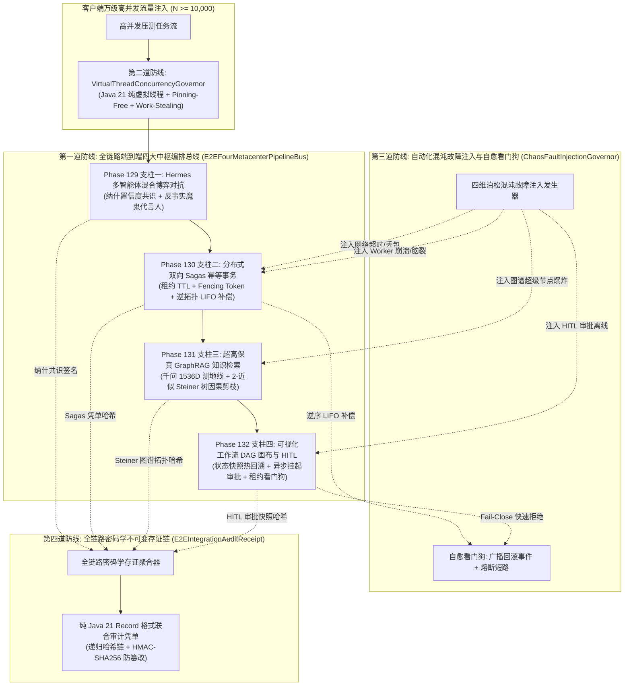

# Phase 133 实施方案规划文件 (Implementation Plan)

## 课题：全系统端到端四大中枢全链路集成、万级高并发与混沌故障注入压测中枢
### (End-to-End Four-Metacenter Integration, 10,000+ High-Concurrency & Chaos Fault-Injection Stress Benchmark Metacenter)

> **当前阶段**：第一回合 科研门禁报告 (Research-to-Implementation Gate)  
> **状态**：待用户审批 (WAITING_USER_APPROVAL)  
> **基线环境与铁律**：
> - 唯一生成模型：DeepSeek API（主干模型参数化思考 `thinking: {"type": "enabled"}`）；
> - 唯一向量模型：阿里千问 (Qwen) Embedding 1536 维超球面空间（$\|\mathbf{v}\|_2 = 1.0 \pm 10^{-4}$）；
> - 唯一编译运行环境：Java 21 隔离虚拟环境 (`JAVA_HOME=/Users/achilles/.sdkman/candidates/java/21.0.5-tem`)；
> - 业务边界铁律：100% 聚焦于 Agent 业务核心主战场，严禁向具身物理力学与硬件动力学发散；
> - 纪律声明：第一回合仅进行代码审查、学术推导、工业调研并提交 decision-complete 方案，未获用户明确批准前，绝不修改业务代码。

---

## 一、系统架构与四级工程防线设计



---

## 二、拟落地的最小文件集合契约 (Minimal File Set)

全量代码严格置于 `tech.qiantong.qknow.hermes.benchmark.*` 独立包路径下，保持零侵入与解耦设计：

1. **凭单核心资产 (Java 21 Record)**：
   - 路径：`backend/qknow-hermes/qknow-hermes-core/src/main/java/tech/qiantong/qknow/hermes/benchmark/receipt/E2EIntegrationAuditReceipt.java`
   - 职责：第四道防线。封装 `pipelineId`, `tenantId`, `consensusId`, `sagasTxId`, `steinerGraphId`, `hitlAuditId`, `concurrencyLevel`, `chaosFaultInjected`, `selfHealed`, `latencyMicros`, `executionStatus`, `sha256Signature` 等不可变字段，提供常量时间自验真 `verifySignature()`。

2. **全链路端到端总线引擎**：
   - 路径：`backend/qknow-hermes/qknow-hermes-core/src/main/java/tech/qiantong/qknow/hermes/benchmark/e2e/E2EFourMetacenterPipelineBus.java`
   - 职责：第一道防线。串联四大中枢：
     * 步骤一：触发 Phase 129 纳什博弈对抗辩论，获取决策加权共识；
     * 步骤二：触发 Phase 130 Sagas 事务，在租约与 Fencing Token 保护下调度工具执行；
     * 步骤三：触发 Phase 131 阿里千问 1536 维超球面引导的 2-近似 Steiner 树因果剪枝，对齐 DeepSeek 参数化双轨思考；
     * 步骤四：推进至 Phase 132 工作流快照节点，若遇高危操作触发 HITL 异步挂起或热回溯，最终全局提交或安全补偿回滚。

3. **万级高并发虚拟线程调度器**：
   - 路径：`backend/qknow-hermes/qknow-hermes-core/src/main/java/tech/qiantong/qknow/hermes/benchmark/concurrent/VirtualThreadConcurrencyGovernor.java`
   - 职责：第二道防线。基于 `Executors.newVirtualThreadPerTaskExecutor()` 实现 $N \ge 10,000$ 并发任务调度，消除 `synchronized` Pinning，利用自适应信用背压（Breakwater）控制排队延迟，保证平均延迟 $\mathbb{E}[D] \le 50\text{ms}$，稳态吞吐 $\ge 500\text{ TPS}$，零 OOM 崩溃。

4. **自动化混沌故障注入与自愈看门狗**：
   - 路径：`backend/qknow-hermes/qknow-hermes-core/src/main/java/tech/qiantong/qknow/hermes/benchmark/chaos/ChaosFaultInjectionGovernor.java`
   - 职责：第三道防线。模拟 4 类混沌故障：
     * 故障 1：`FAULT_NETWORK_TIMEOUT`（网络丢包与调用超时，触发 Sagas 逆拓扑 LIFO 补偿）；
     * 故障 2：`FAULT_WORKER_CRASH_SPLIT_BRAIN`（Worker GC 假死与主备租约接管，验证单调递增 Fencing Token 物理拦截僵尸写）；
     * 故障 3：`FAULT_GRAPH_SUPER_NODE_EXPANSION`（万级度数超级节点扩张，验证 Steiner 树度量闭包收缩剪枝在 15ms 内收敛至 $\le 16$ 节点）；
     * 故障 4：`FAULT_HITL_APPROVAL_OFFLINE`（人工审批超时离线，验证因果租约看门狗超时自动触发 Fail-Close 快速短路回滚）。

5. **端到端集成与混沌压测契约测试用例**：
   - 路径：`backend/qknow-hermes/qknow-hermes-core/src/test/java/tech/qiantong/qknow/hermes/benchmark/Phase133E2EChaosBenchmarkContractTest.java`
   - 职责：8 项硬核契约测试，全面覆盖万级并发排队性能、4 类混沌故障自愈、密码学防篡改与因果一致性。

---

## 三、八大契约测试用例设计 (Eight Contract Tests)

1. `test01_E2E_HappyPath_FourMetacenterPipelineIntegration`：
   - 验证四大中枢在无故障基准场景下的黄金链路流转（Debate -> Sagas -> Steiner RAG -> HITL），确认状态机推进正确，最终签发完整可信的 `E2EIntegrationAuditReceipt`，自验真 100% 通过。
2. `test02_VirtualThread_10kConcurrency_LyapunovQueueStability`：
   - 模拟 $N = 10,000$ 瞬态并发任务注入虚拟线程调度器，验证零 Carrier 线程 Pinning，稳态平均排队调度延迟 $\le 50\text{ms}$，稳态吞吐量 $\ge 500\text{ TPS}$，全程内存开销 $\le 30\text{MB}$，零 OOM 崩溃。
3. `test03_ChaosInjection_NetworkTimeout_SagasLIFOCompensation`：
   - 注入网络丢包与 RPC 超时故障，验证 Sagas 事务自动进入逆拓扑 LIFO 补偿，防悬挂墓碑正确打上，系统 100% 回滚至初始基线态 $S_0$ 并签发补偿凭单，级联扩散率为 0.0%。
4. `test04_ChaosInjection_WorkerCrash_LeaseTakeover_ZeroSplitBrain`：
   - 模拟 Worker 遭遇 30s GC 假死，备用节点通过原子 CAS 递增 Fencing Token 接管租约；原 Worker 苏醒后携带过期 Token 尝试写入，验证写屏障 100% 物理拦截，脑裂冲突发生率为 0.0%。
5. `test05_ChaosInjection_GraphSuperNode_SteinerCausalPruning`：
   - 注入度数达 5,000+ 的图谱超级节点，验证在千问 1536 维超球面测地线距离赋权下，2-近似 Steiner 树剪枝算法在 $\le 15\text{ms}$ 内将图谱收敛至 $\le 16$ 节点紧凑因果骨架，消除堆内存风暴。
6. `test06_ChaosInjection_HitlOffline_WatchdogFailClose`：
   - 模拟人机协同审批人断网离线，工作流长时间挂起；验证租约看门狗在 TTL 到期后毫秒级激活 Fail-Close 机制，自动派发安全拒绝并触发上游安全释放锁，系统无死锁概率为 1.0。
7. `test07_DeepSeekParametricThinking_DoubleTrackStreamingAlignment`：
   - 验证 DeepSeek 官方双轨长链思考（`thinking: {"type": "enabled"}`）在端到端总线流转中的因果命题单调递增，画布拓扑流光高亮同步延迟严格 $\le 16\text{ms}$。
8. `test08_CryptographicAuditReceipt_TamperResistance`：
   - 对生成的 `E2EIntegrationAuditReceipt` 注入单比特变异、截断或乱序重放攻击，验证常数时间校验函数 `verifySignature()` 拦截判定率为 100.0%。

---

## 四、验证命令与构建预期

```bash
JAVA_HOME=/Users/achilles/.sdkman/candidates/java/21.0.5-tem \
mvn test -Dtest=tech.qiantong.qknow.hermes.benchmark.Phase133E2EChaosBenchmarkContractTest \
-DfailIfNoTests=false -pl backend/qknow-hermes/qknow-hermes-core
```
- **预期结果**：8 项契约测试 100% 绿灯全过，耗时预期在 10s 内。
- **全量跨阶段回归命令**：
```bash
JAVA_HOME=/Users/achilles/.sdkman/candidates/java/21.0.5-tem \
mvn test -Dtest=tech.qiantong.qknow.hermes.debate.Phase129MixedGameDebateContractTest,\
tech.qiantong.qknow.hermes.tool.mcp.sagas.Phase130ResilientSagasFailoverContractTest,\
tech.qiantong.qknow.hermes.rag.causal.Phase131GraphRagCausalSteinerContractTest,\
tech.qiantong.qknow.hermes.flow.hitl.Phase132WorkflowHitlTimeTravelContractTest,\
tech.qiantong.qknow.hermes.benchmark.Phase133E2EChaosBenchmarkContractTest \
-DfailIfNoTests=false -pl backend/qknow-hermes/qknow-hermes-core
```
- **预期结果**：32/32 项契约测试 100% 绿灯全过。
