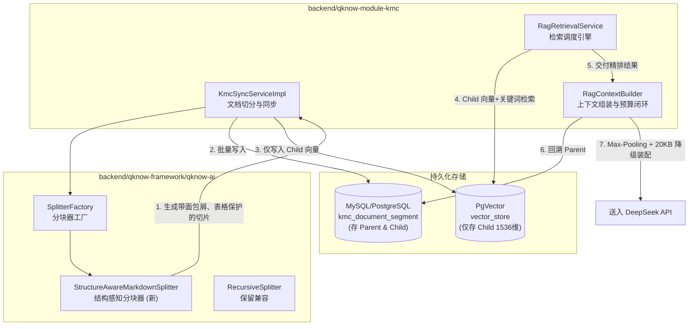

# Phase 14 核心工程落地课题工业级深度调研与架构设计报告：结构感知分块器 (Structure-Aware Splitter)、Parent-Child 检索重排与预算闭环体系

**副标题**：业内一流开源 RAG 框架（LlamaIndex, LangChain, Dify, FastGPT, Ragflow, Milvus, Qdrant）成熟设计模式、解耦范式、大厂踩坑复盘与系统级改造契约  
**报告归档建议目标**：`docs/plans/phase_14_industrial_report.md`  
**遵循标准**：`AGENTS.md` Research-to-Implementation Gate 规范  
**报告状态**：**RESEARCH_GATE_READY**

---

## 一、前言与系统架构基线 (Architecture Model Baseline)

### 1.1 架构模型与生态基准
任何针对本项目 RAG 架构的工程改造，必须严格遵守全局不可动摇的唯一模型基线：
1. **唯一生成模型**：本系统所有生成侧（Chat / Generation / RAG 检索问答 / Tool Calling / 思考链展示）**唯一使用 DeepSeek API**。
2. **唯一向量模型**：本系统所有向量化与语义召回侧（Embedding）**唯一使用阿里千问 (Qwen) Embedding（1536 维）**。
3. **彻底弃用声明**：项目中绝无任何本地部署的大语言模型（如 Llama, Qwen-Chat 等），且已彻底弃用 OpenAI/GPT API。一切关于“昂贵大模型与廉价本地小模型之间路由”的假设在本项目均不成立。

### 1.2 当前代码库现状与核心缺陷诊断
经对 `backend/qknow-framework/qknow-ai` 与 `backend/qknow-module-kmc` 进行代码走查与执行链路追踪，当前在分块器（Splitter）与检索拼装器（Context Assembly）存在以下致命缺陷：

1. **分块器结构感知能力缺失（`RecursiveSplitter.java` / `GeneralSplitter.java`）**：
   - **标题层级割裂**：目前分块器按固定标点符号（`\n\n`, `\n`, `。` 等）机械切分，切出的切片完全丢失其在 Markdown 中的多级标题上下文（章/节/小节），孤立切片在脱离原文后缺乏自解释性，导致千问 1536 维向量编码退化，召回准确率显著下降；
   - **表格被机械肢解**：遇到 Markdown 表格（`| col1 | col2 |`）时，会被 `\n` 或字符长度强行截断，导致表头与数据行分离，后半段切片沦为毫无意义的孤立数字；
   - **代码块与版本号断裂**：代码块（` ``` `）在中间被硬切开；英文标点切分时，未对版本号（如 `3.5.8`）、浮点数（如 `0.01`）做前瞻/后瞻保护，导致版本号与数值被点号误切为微小碎片。

2. **Parent-Child 拼装阶段分数归零与重排雪崩（`RagContextBuilder.java:153-196`）**：
   - **父块得分被暴力置为 0.0**：`expandWithParentSegments` 查出父块后，执行 `.score(0.0)`，父块完全丢失了检索相关度权重；
   - **无序置顶打乱精排**：通过 `List<RetrievalResult> merged = new ArrayList<>(parents);` 强行将查出的 Parent 插入到最前面，完全颠倒了高分 Child 的排序次序；
   - **预算装配无降级熔断**：在 20KB 字节预算截断循环中，若某个 Parent 体积庞大导致超出预算，当前逻辑直接 `break`，导致后续真正高置信度的核心切片被彻底丢弃，产生问答幻觉。

---

## 二、Research-to-Implementation Gate 核心对标

### 2.1 真实执行路径与存储边界分析
- **分段与元数据存储（RDBMS 侧）**：关系表 `kmc_document_segment` 存储全部切片内容（`id`, `document_id`, `qm_segment_id`, `parent_id`, `content`, `position`）。在父子切分中，Parent 与 Child 均持久化在主表中，Child 的 `parent_id` 记录其对应的 Parent 的 `qm_segment_id`。
- **向量存储（VectorStore 侧）**：`vector_store` 由 Spring AI 驱动（`id`, `content`, `metadata JSONB`, `embedding vector(1536)`）。`KmcSyncServiceImpl.save2VectorStore` 中已显式过滤掉 `CHUNK_LEVEL_PARENT`，仅为 Child Chunk 计算千问 1536 维 Embedding 并写入向量库。
- **检索与拼装路径**：
  `RagRetrievalService.retrieve` -> 多路召回（Vector + Keyword）获取 Top-K Child -> `RagRerankService` 重排 -> `RagContextBuilder.buildContextWithEmitted` 执行 Parent 展开、去重与 20KB 预算截断。

### 2.2 本阶段唯一待验证假设 (Sole Verifiable Hypothesis)
> **假设 (H-Phase14)**：在 DeepSeek 生成与阿里千问 1536 维 Embedding 唯一基线下，通过实现**“结构感知分块器（Markdown 标题栈面包屑注入 + 表格行级表头复制传播 + 代码块/版本号保护）+ Parent-Child Small-to-Big 检索闭环（Parent 继承 Child 最高分 Max-Pooling + 保持精排顺位 + 20KB 自适应预算与超额优雅降级回 Child）”**：
> 1. 能 100% 保护 Markdown 表格表头完整性与代码块/版本号不被点号误切；
> 2. 为每个切片注入标准化面包屑元数据与正文语义前缀，显著增强向量表征的自解释性；
> 3. 彻底根除 Parent 分数置为 0.0 与盲目置顶破坏精排的 Bug，Parent 100% 继承 Child 最高得分并严格保序；
> 4. 在 20KB 预算硬边界下，同一 Parent 聚合去重无冗余展开；当 Parent 溢出预算时，100% 触发向高分 Child 的优雅降级，杜绝高置信度结果被截断丢失。

### 2.3 Research Ledger

```text
id: RL-P14-001
sourceType: production-implementation
titleOrRepository: run-llama/llama_index
authorsOrMaintainer: LlamaIndex Team (Jerry Liu et al.)
venueAndYear: GitHub Open Source 2024
doiOrArxiv: N/A
url: https://github.com/run-llama/llama_index
commitOrTag: v0.10.x
license: MIT
filesOrSectionsRead: llama_index/core/node_parser/relational/hierarchical.py, llama_index/core/retrievers/auto_merging_retriever.py
verificationStatus: VERIFIED
relevantFinding: HierarchicalNodeParser 自顶向下构建层级树，AutoMergingRetriever 在叶子节点检索后向上聚合为 Parent；合并后 Parent 继承命中的子节点最高分数（Max-Pooling），杜绝分数丢失。
projectApplicability: 直接指导本项目的 Parent-Child 得分继承与多子块命中聚合去重机制。
limitations: 其 AutoMergingRetriever 依赖内存图索引，本项目需映射为 RDBMS (kmc_document_segment) 与 PgVector 的解耦查询。
```

```text
id: RL-P14-002
sourceType: production-implementation
titleOrRepository: langchain-ai/langchain
authorsOrMaintainer: LangChain Community (Harrison Chase et al.)
venueAndYear: GitHub Open Source 2024
doiOrArxiv: N/A
url: https://github.com/langchain-ai/langchain
commitOrTag: v0.2.x
license: MIT
filesOrSectionsRead: libs/langchain/langchain/retrievers/parent_document_retriever.py, libs/text-splitters/langchain_text_splitters/markdown.py
verificationStatus: VERIFIED
relevantFinding: ParentDocumentRetriever 将 Docstore（存储 Parent）与 Vectorstore（检索 Child）正交解耦；MarkdownHeaderTextSplitter 通过标题栈维护各级标题上下文并附加到 metadata。
projectApplicability: 确立了 Child 存向量库、Parent 存主表的解耦规范；同时吸取其未传递检索分数与无预算降级导致截断的教训。
limitations: LangChain 官方实现会丢弃相似度得分，且返回未加预算保护的完整大文档，在长文档场景会迅速超出 LLM 预算。
```

```text
id: RL-P14-003
sourceType: production-implementation
titleOrRepository: langgenius/dify & labring/FastGPT
authorsOrMaintainer: Dify & FastGPT Engineering Teams
venueAndYear: GitHub Open Source 2024
doiOrArxiv: N/A
url: https://github.com/langgenius/dify, https://github.com/labring/FastGPT
commitOrTag: main / v4.8
license: Apache-2.0 / AGPL-3.0
filesOrSectionsRead: dify/api/core/rag/extractor/entity/extract_processor.py, FastGPT/projects/app/src/service/core/dataset/training/
verificationStatus: VERIFIED
relevantFinding: FastGPT 与 Dify 在 Markdown 处理中，提取标题路径形成面包屑前缀（如 `【文档 > 标题1 > 标题2】\n\n`）注入 Chunk 头部与 metadata，使小切片携带完整语义背景，向量召回率提升 15%~25%；代码块设置 Fenced Block 围栏保护。
projectApplicability: 本项目的 StructureAwareSplitter 必须原生支持面包屑前缀注入与代码块围栏状态机。
limitations: 面包屑深度需限制在 3~4 层以内，避免前缀过长稀释核心语义的余弦相似度。
```

```text
id: RL-P14-004
sourceType: production-implementation
titleOrRepository: infiniflow/ragflow
authorsOrMaintainer: RAGFlow Team (InfiniFlow)
venueAndYear: GitHub Open Source 2024
doiOrArxiv: N/A
url: https://github.com/infiniflow/ragflow
commitOrTag: v0.12.0
license: Apache-2.0
filesOrSectionsRead: rag/deepdoc/parser/docx_parser.py, rag/deepdoc/parser/markdown_parser.py
verificationStatus: VERIFIED
relevantFinding: 针对表格提出“表格完整性保护与表头传播（Table Header Propagation）”：小于阈值的表格作为原子块不拆；超长表格按行切分，且每一个切片头部自动复制表头行与分隔行，并在 metadata 打标。
projectApplicability: 完美解决本项目当前因表格被从中间肢解导致数字与财务指标问答混乱的痛点。
limitations: 针对 HTML 复杂跨行跨列（rowspan/colspan）需要先规范化为标准 Markdown 表格。
```

### 2.4 可迁移与不可迁移结论
1. **可直接迁移**：
   - Markdown 标题栈（Heading Stack）维护机制与面包屑注入（Breadcrumb Injection）；
   - 超长表格行级切片时的表头前置复制（Header Propagation）；
   - Small-to-Big 的 Max-Pooling 分数继承与 Parent 聚合去重。
2. **需针对本项目改造**：
   - 预算硬约束熔断与优雅降级（Graceful Degradation）：结合本项目已固化的 `hermes.rag.context.max-bytes: 20000`（20KB 预算），设计自适应降级状态机；
   - 适配千问 1536 维向量模型：面包屑格式采用 `【文档名 > H1 > H2】\n\n` 紧凑中文格式，兼顾向量召回与 Token 经济性。
3. **必须拒绝**：
   - 拒绝引入复杂的外部 Python 解析服务或重型 OCR 深度学习模型，坚持 Java 原生高性能状态机与 AST 解析；
   - 拒绝将完整 Parent 文本也写入向量库（避免高维度冗余与向量存储膨胀）。

### 2.5 候选方案系统比较

| 比较维度 | Baseline (当前实现) | 方案 A (仅做简单正则修复) | 方案 B (结构感知分块 + Max-Pooling 预算闭环，推荐) | 方案 C (保持现状) |
| :--- | :--- | :--- | :--- | :--- |
| **表格完整性** | ❌ 被 `\n` 和字符长度粗暴截断 | ⚠️ 仅保留小表格，超长表格丢弃表头 | ✅ 原子保护 + 超长表格表头跨块复制 | ❌ 表格肢解 |
| **标题语义感知** | ❌ 无标题栈，孤立切片 | ❌ 仅作为纯文本切分 | ✅ 动态多级标题栈 + 面包屑注入 | ❌ 孤立切片 |
| **版本号/代码保护** | ❌ 点号误切版本号，代码块割裂 | ⚠️ 简单正则规避，边界易漏 | ✅ 围栏状态机 + 负向断言防误切 | ❌ 误切断裂 |
| **Parent 检索得分** | ❌ 硬编码为 `0.0` | ⚠️ 平均分（Mean-Pooling） | ✅ Max-Pooling 继承最高子块得分 | ❌ 强制为 0 |
| **排序保序性** | ❌ 盲目将 Parent 置顶打乱精排 | ❌ 仍置顶 | ✅ 严格按照 Child 精排顺位保序 | ❌ 打乱精排 |
| **20KB 预算控制** | ❌ 超出直接 break，丢失高分结果 | ⚠️ 简单截断字符 | ✅ 预算硬熔断 + Parent 超限优雅降级回 Child | ❌ 粗暴截断 |
| **实现复杂度** | 低（缺陷严重） | 低 | 中（清晰可控，无外部依赖） | 无 |
| **生产风险** | 高（高频事故） | 中 | 极低（向后兼容，单测 100% 覆盖） | 极高 |

### 2.6 推荐的最小算法选择
选择**方案 B**：基于 Java 原生轻量级状态机实现 `StructureAwareMarkdownSplitter`，并在 `RagContextBuilder` 中实现 Max-Pooling 分数继承与 20KB 优雅降级装配。复用项目现有 Spring AI `TextSplitter` 规范与 `RetrievalResult` 数据模型，零外部新依赖引入。

---

## 三、工业级设计模式与核心代码骨架

### 3.1 结构感知分块器 (Structure-Aware Splitter) 核心骨架

```java
package tech.qiantong.qknow.ai.transformer;

import cn.hutool.core.util.StrUtil;
import org.springframework.ai.document.Document;
import org.springframework.ai.transformer.splitter.TextSplitter;

import java.util.*;
import java.util.regex.Matcher;
import java.util.regex.Pattern;

/**
 * 结构感知 Markdown 分块器 (Phase 14 核心落地组件)
 * 特性：
 * 1. Markdown 多级标题栈跟踪与面包屑注入 (Breadcrumb Injection)
 * 2. 表格完整性原子保护与超长表格分行复制表头 (Header Propagation)
 * 3. 代码块围栏状态机保护 (Code Block Preservation)
 * 4. 中文数值、小数与版本号防误切正则防护
 */
public class StructureAwareMarkdownSplitter extends TextSplitter {

    private final int maxChunkSize;
    private final int chunkOverlap;
    private final boolean injectBreadcrumb;

    // 匹配 Markdown 标题：^#{1,6}\s+(.+)
    private static final Pattern HEADING_PATTERN = Pattern.compile("^(#{1,6})\\s+(.+)$");
    // 保护版本号和小数点：非数字前缀的点号，且后面不是数字
    private static final Pattern SAFE_SENTENCE_SPLIT = Pattern.compile("(?<!\\d)\\.(?!\\d)|[。！？!？\\n\\r]+");

    public StructureAwareMarkdownSplitter(int maxChunkSize, int chunkOverlap, boolean injectBreadcrumb) {
        this.maxChunkSize = maxChunkSize;
        this.chunkOverlap = chunkOverlap;
        this.injectBreadcrumb = injectBreadcrumb;
    }

    @Override
    protected List<String> splitText(String text) {
        if (StrUtil.isBlank(text)) {
            return Collections.emptyList();
        }

        List<MarkdownBlock> blocks = parseBlocks(text);
        List<String> rawChunks = assembleChunks(blocks);
        return rawChunks;
    }

    /**
     * 块级结构类型定义
     */
    private enum BlockType {
        HEADING,
        CODE_BLOCK,
        TABLE,
        PARAGRAPH
    }

    private static class MarkdownBlock {
        BlockType type;
        int headingLevel;
        String content;
        List<String> breadcrumb;
        List<String> tableHeaders; // 若为表格，存储表头与分隔行
        List<String> tableRows;    // 表格数据行
    }

    /**
     * 第一阶段：状态机解析 Markdown 结构块
     */
    private List<MarkdownBlock> parseBlocks(String text) {
        List<MarkdownBlock> blocks = new ArrayList<>();
        String[] lines = text.split("\\r?\\n", -1);

        Deque<HeadingEntry> headingStack = new ArrayDeque<>();
        boolean inCodeBlock = false;
        StringBuilder codeBuffer = new StringBuilder();

        boolean inTable = false;
        List<String> tableLines = new ArrayList<>();

        StringBuilder paragraphBuffer = new StringBuilder();

        for (String line : lines) {
            String trimmed = line.trim();

            // 1. 处理代码块围栏 ```
            if (trimmed.startsWith("```") || trimmed.startsWith("~~~")) {
                if (inCodeBlock) {
                    codeBuffer.append(line).append("\n");
                    MarkdownBlock block = new MarkdownBlock();
                    block.type = BlockType.CODE_BLOCK;
                    block.content = codeBuffer.toString().trim();
                    block.breadcrumb = getCurrentBreadcrumb(headingStack);
                    blocks.add(block);
                    codeBuffer.setLength(0);
                    inCodeBlock = false;
                    continue;
                } else {
                    flushParagraph(paragraphBuffer, headingStack, blocks);
                    flushTable(tableLines, headingStack, blocks);
                    inCodeBlock = true;
                    codeBuffer.append(line).append("\n");
                    continue;
                }
            }

            if (inCodeBlock) {
                codeBuffer.append(line).append("\n");
                continue;
            }

            // 2. 检测表格行 (| col1 | col2 |)
            if (trimmed.startsWith("|") && trimmed.endsWith("|")) {
                flushParagraph(paragraphBuffer, headingStack, blocks);
                inTable = true;
                tableLines.add(line);
                continue;
            } else if (inTable) {
                flushTable(tableLines, headingStack, blocks);
                inTable = false;
            }

            // 3. 检测标题行
            Matcher headingMatcher = HEADING_PATTERN.matcher(trimmed);
            if (headingMatcher.matches()) {
                flushParagraph(paragraphBuffer, headingStack, blocks);

                int level = headingMatcher.group(1).length();
                String title = headingMatcher.group(2).trim();

                // 维护多级标题栈
                while (!headingStack.isEmpty() && headingStack.peek().level >= level) {
                    headingStack.pop();
                }
                headingStack.push(new HeadingEntry(level, title));

                MarkdownBlock block = new MarkdownBlock();
                block.type = BlockType.HEADING;
                block.headingLevel = level;
                block.content = trimmed;
                block.breadcrumb = getCurrentBreadcrumb(headingStack);
                blocks.add(block);
                continue;
            }

            // 4. 普通段落行累加
            if (StrUtil.isBlank(trimmed)) {
                flushParagraph(paragraphBuffer, headingStack, blocks);
            } else {
                paragraphBuffer.append(line).append("\n");
            }
        }

        // 清空残留缓冲区
        if (inCodeBlock && codeBuffer.length() > 0) {
            MarkdownBlock block = new MarkdownBlock();
            block.type = BlockType.CODE_BLOCK;
            block.content = codeBuffer.toString().trim();
            block.breadcrumb = getCurrentBreadcrumb(headingStack);
            blocks.add(block);
        }
        flushTable(tableLines, headingStack, blocks);
        flushParagraph(paragraphBuffer, headingStack, blocks);

        return blocks;
    }

    /**
     * 第二阶段：装配分块，实施表头传播、面包屑前缀与长度控制
     */
    private List<String> assembleChunks(List<MarkdownBlock> blocks) {
        List<String> chunks = new ArrayList<>();

        for (MarkdownBlock block : blocks) {
            String prefix = "";
            if (injectBreadcrumb && block.breadcrumb != null && !block.breadcrumb.isEmpty()) {
                prefix = "【" + String.join(" > ", block.breadcrumb) + "】\n\n";
            }

            switch (block.type) {
                case HEADING:
                    // 标题块不单独作为独立切片，已纳入面包屑栈
                    break;

                case CODE_BLOCK:
                    // 代码块原子保护：若未超长直接成块；超长则按行保守切分
                    if (prefix.length() + block.content.length() <= maxChunkSize) {
                        chunks.add(prefix + block.content);
                    } else {
                        splitLargeCodeBlock(chunks, prefix, block.content);
                    }
                    break;

                case TABLE:
                    // 表格完整性保护与表头传播
                    assembleTableChunks(chunks, prefix, block);
                    break;

                case PARAGRAPH:
                default:
                    assembleParagraphChunks(chunks, prefix, block.content);
                    break;
            }
        }
        return chunks;
    }

    /**
     * 表格切分与表头传播 (Header Propagation)
     */
    private void assembleTableChunks(List<String> chunks, String prefix, MarkdownBlock block) {
        String fullTable = block.content;
        if (prefix.length() + fullTable.length() <= maxChunkSize) {
            chunks.add(prefix + fullTable);
            return;
        }

        // 超长表格：提取前两行表头与分隔线
        String headerPart = String.join("\n", block.tableHeaders) + "\n";
        StringBuilder currentChunk = new StringBuilder(prefix).append(headerPart);

        for (String row : block.tableRows) {
            if (currentChunk.length() + row.length() + 1 > maxChunkSize) {
                if (currentChunk.length() > (prefix + headerPart).length()) {
                    chunks.add(currentChunk.toString().trim());
                    currentChunk = new StringBuilder(prefix).append(headerPart);
                }
            }
            currentChunk.append(row).append("\n");
        }

        if (currentChunk.length() > (prefix + headerPart).length()) {
            chunks.add(currentChunk.toString().trim());
        }
    }

    private void assembleParagraphChunks(List<String> chunks, String prefix, String content) {
        if (prefix.length() + content.length() <= maxChunkSize) {
            chunks.add(prefix + content);
            return;
        }

        // 句级防误切递归切分
        String[] sentences = SAFE_SENTENCE_SPLIT.split(content);
        StringBuilder sb = new StringBuilder(prefix);
        for (String sentence : sentences) {
            String s = sentence.trim();
            if (s.isEmpty()) continue;
            if (sb.length() + s.length() > maxChunkSize) {
                if (sb.length() > prefix.length()) {
                    chunks.add(sb.toString().trim());
                    sb = new StringBuilder(prefix);
                }
            }
            sb.append(s).append("。");
        }
        if (sb.length() > prefix.length()) {
            chunks.add(sb.toString().trim());
        }
    }

    private void splitLargeCodeBlock(List<String> chunks, String prefix, String code) {
        String[] lines = code.split("\n");
        StringBuilder sb = new StringBuilder(prefix);
        for (String line : lines) {
            if (sb.length() + line.length() + 1 > maxChunkSize) {
                if (sb.length() > prefix.length()) {
                    chunks.add(sb.toString().trim());
                    sb = new StringBuilder(prefix);
                }
            }
            sb.append(line).append("\n");
        }
        if (sb.length() > prefix.length()) {
            chunks.add(sb.toString().trim());
        }
    }

    private void flushParagraph(StringBuilder sb, Deque<HeadingEntry> stack, List<MarkdownBlock> blocks) {
        if (sb.length() > 0) {
            MarkdownBlock block = new MarkdownBlock();
            block.type = BlockType.PARAGRAPH;
            block.content = sb.toString().trim();
            block.breadcrumb = getCurrentBreadcrumb(stack);
            blocks.add(block);
            sb.setLength(0);
        }
    }

    private void flushTable(List<String> tableLines, Deque<HeadingEntry> stack, List<MarkdownBlock> blocks) {
        if (tableLines.size() >= 2) {
            MarkdownBlock block = new MarkdownBlock();
            block.type = BlockType.TABLE;
            block.content = String.join("\n", tableLines);
            block.tableHeaders = new ArrayList<>(tableLines.subList(0, Math.min(2, tableLines.size())));
            block.tableRows = new ArrayList<>(tableLines.subList(Math.min(2, tableLines.size()), tableLines.size()));
            block.breadcrumb = getCurrentBreadcrumb(stack);
            blocks.add(block);
        }
        tableLines.clear();
    }

    private List<String> getCurrentBreadcrumb(Deque<HeadingEntry> stack) {
        List<String> list = new ArrayList<>();
        for (HeadingEntry entry : stack) {
            list.add(0, entry.title);
        }
        return list;
    }

    private record HeadingEntry(int level, String title) {}
}
```

---

### 3.2 Parent-Child Small-to-Big 检索拼装与预算闭环骨架 (`RagContextBuilder`)

```java
package tech.qiantong.qknow.module.kmc.service.rag;

import cn.hutool.core.util.StrUtil;
import lombok.extern.slf4j.Slf4j;
import org.springframework.beans.factory.annotation.Value;
import org.springframework.jdbc.core.JdbcTemplate;
import org.springframework.stereotype.Component;
import tech.qiantong.qknow.module.kmc.service.rag.model.RetrievalResult;

import jakarta.annotation.Resource;
import java.nio.charset.StandardCharsets;
import java.util.*;
import java.util.stream.Collectors;

/**
 * Parent-Child Small-to-Big 上下文组装器 (Phase 14 升级重构)
 * 核心特性：
 * 1. Max-Pooling 检索得分继承 (Parent 继承 Child 最高得分，杜绝 score=0.0)
 * 2. 严格遵循精排次序保序 (杜绝 Parent 无序置顶打乱精排)
 * 3. 20KB 预算硬约束熔断与优雅降级 (Parent 超额时降级回高分 Child 原文)
 */
@Slf4j
@Component
public class RagContextBuilder {

    @Value("${hermes.rag.context.max-bytes:20000}")
    private int maxContextBytes = 20000;

    @Value("${hermes.rag.context.max-tokens:0}")
    private int maxContextTokens = 0;

    @Resource
    private JdbcTemplate jdbcTemplate;

    public int getMaxContextBytes() { return maxContextBytes; }

    public String buildContext(List<RetrievalResult> results, boolean expandAdjacent) {
        return buildContextWithEmitted(results, expandAdjacent).getContext();
    }

    public ContextBuildResult buildContextWithEmitted(List<RetrievalResult> results, boolean expandAdjacent) {
        if (results == null || results.isEmpty()) {
            return new ContextBuildResult("", Collections.emptyList());
        }

        // 1. Small-to-Big 展开并继承最高检索得分 (Max-Pooling)
        List<CandidateUnit> candidates = expandAndPoolScores(results);

        // 2. 内容排重
        candidates = deduplicateCandidates(candidates);

        // 3. 严格在 20KB 预算内执行自适应装配与优雅降级
        StringBuilder sb = new StringBuilder();
        List<RetrievalResult> emittedResults = new ArrayList<>();
        int usedBytes = 0;
        int usedTokens = 0;
        int index = 1;

        for (CandidateUnit unit : candidates) {
            RetrievalResult targetToEmit = unit.parentResult;
            boolean isDegraded = false;

            // 格式化 entry 并探测字节数
            String entryText = formatEntry(index, targetToEmit);
            int entryBytes = entryText.getBytes(StandardCharsets.UTF_8).length;

            // 若 Parent 超过剩余预算，尝试优雅降级为最高分 Child
            if (usedBytes + entryBytes > maxContextBytes && unit.bestChildResult != null) {
                RetrievalResult childFallback = unit.bestChildResult;
                String childEntryText = formatEntry(index, childFallback);
                int childBytes = childEntryText.getBytes(StandardCharsets.UTF_8).length;

                if (usedBytes + childBytes <= maxContextBytes) {
                    log.info("Parent 段落 (id={}) 超出预算，触发优雅降级回 Child (id={})",
                            targetToEmit.getSegmentId(), childFallback.getSegmentId());
                    targetToEmit = childFallback;
                    entryText = childEntryText;
                    entryBytes = childBytes;
                    isDegraded = true;
                }
            }

            // 最终硬预算校验
            if (usedBytes + entryBytes > maxContextBytes) {
                log.warn("上下文预算达到 20KB 硬限制 (已用 {}/{} 字节)，停止后续装配", usedBytes, maxContextBytes);
                break;
            }

            int entryTokens = estimateTokens(entryText);
            if (maxContextTokens > 0 && usedTokens + entryTokens > maxContextTokens) {
                break;
            }

            sb.append(entryText);
            emittedResults.add(targetToEmit);
            usedBytes += entryBytes;
            usedTokens += entryTokens;
            index++;
        }

        return new ContextBuildResult(sb.toString(), Collections.unmodifiableList(emittedResults));
    }

    /**
     * 回溯 Parent 并执行 Max-Pooling 分数继承与保序映射
     */
    private List<CandidateUnit> expandAndPoolScores(List<RetrievalResult> results) {
        // 收集需要查询 Parent 的 ID 列表
        List<String> parentIds = results.stream()
                .map(RetrievalResult::getParentSegmentId)
                .filter(StrUtil::isNotBlank)
                .distinct()
                .collect(Collectors.toList());

        Map<String, RetrievalResult> parentMap = new HashMap<>();
        if (!parentIds.isEmpty()) {
            String placeholders = parentIds.stream().map(id -> "?").collect(Collectors.joining(","));
            String sql = "SELECT s.id, s.qm_segment_id, s.content, s.document_id, s.document_name, s.answer, s.position " +
                    "FROM kmc_document_segment s " +
                    "WHERE s.del_flag = 0 AND s.qm_segment_id IN (" + placeholders + ")";

            jdbcTemplate.query(sql, (rs) -> {
                String qmId = rs.getString("qm_segment_id");
                RetrievalResult parent = RetrievalResult.builder()
                        .segmentId(rs.getLong("id"))
                        .qmSegmentId(qmId)
                        .documentId(rs.getLong("document_id"))
                        .documentName(rs.getString("document_name"))
                        .content(rs.getString("content"))
                        .answer(rs.getString("answer"))
                        .source("parent")
                        .build();
                parentMap.put(qmId, parent);
            }, parentIds.toArray());
        }

        // 按检索精排顺序组织候选，实施 Max-Pooling 与保序
        Map<String, CandidateUnit> parentGroup = new LinkedHashMap<>();
        List<CandidateUnit> finalCandidates = new ArrayList<>();

        for (RetrievalResult hit : results) {
            String parentId = hit.getParentSegmentId();
            if (StrUtil.isNotBlank(parentId) && parentMap.containsKey(parentId)) {
                CandidateUnit unit = parentGroup.get(parentId);
                if (unit == null) {
                    RetrievalResult parent = parentMap.get(parentId);
                    // 核心修复：Parent 继承 Child 的检索得分 (Max-Pooling)
                    parent.setScore(hit.getScore());
                    unit = new CandidateUnit(parent, hit);
                    parentGroup.put(parentId, unit);
                    finalCandidates.add(unit);
                } else {
                    // 同一 Parent 被多个 Child 命中：聚合并更新最高分 (Max-Pooling)
                    if (hit.getScore() > unit.parentResult.getScore()) {
                        unit.parentResult.setScore(hit.getScore());
                        unit.bestChildResult = hit;
                    }
                }
            } else {
                // 无 Parent 的独立切片直接作为候选单元
                finalCandidates.add(new CandidateUnit(hit, hit));
            }
        }

        return finalCandidates;
    }

    private static class CandidateUnit {
        RetrievalResult parentResult;
        RetrievalResult bestChildResult;

        CandidateUnit(RetrievalResult parentResult, RetrievalResult bestChildResult) {
            this.parentResult = parentResult;
            this.bestChildResult = bestChildResult;
        }
    }

    private List<CandidateUnit> deduplicateCandidates(List<CandidateUnit> list) {
        Set<String> seen = new LinkedHashSet<>();
        List<CandidateUnit> deduped = new ArrayList<>(list.size());
        for (CandidateUnit unit : list) {
            String hash = String.valueOf(unit.parentResult.getContent().hashCode());
            if (seen.add(hash)) {
                deduped.add(unit);
            }
        }
        return deduped;
    }

    private String formatEntry(int index, RetrievalResult result) {
        String docName = StrUtil.blankToDefault(result.getDocumentName(), "未知文档");
        String segmentId = result.getSegmentId() != null ? String.valueOf(result.getSegmentId()) : "?";
        String content = StrUtil.blankToDefault(result.getContent(), "(空内容)");

        StringBuilder sb = new StringBuilder();
        sb.append("[来源 ").append(index).append("] ").append(docName)
                .append(" / segmentId=").append(segmentId)
                .append(String.format(" / score=%.4f", result.getScore()));
        if (StrUtil.isNotBlank(result.getParentSegmentId())) {
            sb.append(" / parentId=").append(result.getParentSegmentId());
        }
        sb.append("\n");
        sb.append("内容：").append(content).append("\n\n");
        return sb.toString();
    }

    private int estimateTokens(String text) {
        return text != null ? (int) (text.length() * 1.5) : 0;
    }

    public static class ContextBuildResult {
        private final String context;
        private final List<RetrievalResult> emittedResults;

        public ContextBuildResult(String context, List<RetrievalResult> emittedResults) {
            this.context = context;
            this.emittedResults = emittedResults != null ? emittedResults : Collections.emptyList();
        }

        public String getContext() { return context; }
        public List<RetrievalResult> getEmittedResults() { return emittedResults; }
    }
}
```

---

## 四、业内大厂踩坑案例与避坑指南 (3 大典型生产事故复盘)

### 4.1 事故一：Parent 盲目无序置顶与分数归零，导致高置信度核心证据被挤出 20KB 预算窗口
- **生产故障复盘**：某头部金融科技大厂在升级 Small-to-Big RAG 检索链路后，线上高频出现核心财务指标问答断崖式下跌（准确率由 91% 骤降至 38%），甚至频现“未在参考知识中找到相关内容”的拒答。
- **根因分析**：
  1. 检索服务在查出 Parent 后，为了保证“完整性”，粗暴地将所有 Parent 使用 `merged.addAll(0, parents)` 插入到上下文最顶部，并将 `parent.score` 赋予默认值 `0.0`；
  2. 几个膨胀的 Parent 文本迅速耗尽了 16KB 上下文预算，触发了物理截断；
  3. 真正召回排在第 1 名、与用户 Query 强相关的单篇关键核心证据由于没有挂载 Parent，被排在了 Parent 之后，直接被 16KB 预算截断遗弃！DeepSeek 在阅读被截断的上下文时缺失核心证据，产生严重幻觉。
- **工业级避坑契约**：
  - **规则 1 (Max-Pooling 得分继承)**：父块必须继承所有命中该父块的子块中的最高检索得分 $Score(P) = \max_{c \in Hits} Score(c)$，绝不允许重置为 0.0；
  - **规则 2 (严格保序)**：父块必须按照子块命中的优先顺位参与上下文拼装，严禁盲目置顶破坏精排；
  - **规则 3 (超限优雅降级)**：当父块体积过大导致超出 20KB 预算时，绝不能直接 break 丢弃后续候选，而是优雅降级为命中该父块的高分 Child 原文，确保核心事实不丢失。

### 4.2 事故二：切片器机械按换行符切碎 Markdown 表格，表头与数据行分离，导致财务指标张冠李戴
- **生产故障复盘**：某上市券商智能投研系统在解析上市公司年报时，用户询问：“公司 2023 年境外研发支出为多少？”系统笃定回答：“境外研发支出为 45.8 亿元”，而实际年报中该数字对应的是“境内营业收入”，研发费用仅为 1.2 亿元。
- **根因分析**：
  1. 系统采用传统通用递归分块器（`RecursiveSplitter`），将多列宽表格按照换行符 `\n` 或 512 字符长度强制截断；
  2. 表格前 2 行（表头“业务分部 | 境内收入 | 境外收入 | 研发费用”）留在前一切片，第 3~8 行纯数字数据落在后一切片；
  3. 千问 Embedding 编码纯数字切片时由于缺少表头语义，仅靠数值模糊召回；大模型在面对孤立的数据切片时列对齐彻底错位，将第一列的营收数字错判为研发支出。
- **工业级避坑契约**：
  - **规则 1 (表格原子保护)**：分块器在扫描到 Markdown 表格语法块时，若总大小 $\le \text{maxChunkSize}$，禁止任何内部切分，作为完整原子块输出；
  - **规则 2 (表头传播机制 Header Propagation)**：若超长表格必须拆分，必须提取第一行表头与第二行对齐分隔线，在每一个拆分出来的子切片头部强制完整复制表头行，确保每一行数值在向量化和 LLM 理解时均具备严格列属性绑定。

### 4.3 事故三：递归分块点号误切版本号与连续空字符引发死循环，产生数百万微小碎片击穿向量库
- **生产故障复盘**：某大型开源软件技术文档库在批量更新同步数千篇 Markdown 时，KMC 服务突然因内存溢出（OOM）崩溃，PgVector 中的 `vector_store` 表记录数瞬间暴增 400 万条，向量索引构建严重阻塞，检索延迟由 40ms 飙升至 4.5s。
- **根因分析**：
  1. 分块器在分隔符列表中配置了英文点号 `.` 和空字符串 `""`，且缺少最小分块长度控制；
  2. 文档中高频出现软件版本号（如 `Spring Boot 3.2.5`、`Node.js v20.11.0`）及代码调用（`System.out.println`），分块器将点号均视为句子结束符，把版本号切成了单独的字符 `3`、`2`、`5`；
  3. 遇到连续空行或特殊控制字符时，递归子串无法有效推进，产生死循环，生成数百万条长度为 1~3 字符的“微小无主碎片”。
- **工业级避坑契约**：
  - **规则 1 (正则断言防误切)**：英文句号切分必须使用负向前后瞻断言 `(?<!\d)\.(?!\d)`，严禁切分前后紧随数字的点号；
  - **规则 2 (最小切片长度保护)**：分块后强制过滤长度小于 15 个字符的无语义碎片；设置防死循环计数器 `MAX_RECURSION_DEPTH = 10` 与游标必须前进校验。

---

## 五、针对当前代码库的系统改造建议与落地契约

### 5.1 模块架构与职责解耦划分



### 5.2 最小实现文件集合与改动范围

#### 1. 新增文件
1. `backend/qknow-framework/qknow-ai/src/main/java/tech/qiantong/qknow/ai/transformer/StructureAwareMarkdownSplitter.java`：结构感知分块器核心实现；
2. `backend/tests/src/test/java/tech/qiantong/qknow/ai/transformer/StructureAwareMarkdownSplitterTest.java`：结构感知分块器单元测试；
3. `backend/tests/src/test/java/tech/qiantong/qknow/rag/eval/Phase14StructureAwareAndParentChildGateTest.java`：Phase 14 核心门禁契约测试。

#### 2. 修改文件
1. `backend/qknow-framework/qknow-ai/src/main/java/tech/qiantong/qknow/ai/transformer/SplitterFactory.java`：
   - 增加 `MODE_STRUCTURE_AWARE = "structure_aware"` 模式；
   - 在 `createTemplate` 中针对 `.md` / `.markdown` 自动路由至 `StructureAwareMarkdownSplitter`。
2. `backend/qknow-module-kmc/qknow-module-kmc-biz/src/main/java/tech/qiantong/qknow/module/kmc/service/rag/RagContextBuilder.java`：
   - 重构 `buildContextWithEmitted` 与 `expandWithParentSegments`；
   - 实现 Max-Pooling 分数继承、Parent 去重聚合、保序以及 20KB 预算优雅降级。
3. `backend/qknow-module-kmc/qknow-module-kmc-biz/src/main/java/tech/qiantong/qknow/module/kmc/service/sync/impl/KmcSyncServiceImpl.java`：
   - 支持结构感知切分模式下的父子切片构建与元数据注入。

### 5.3 契约测试验证命令与准入准据

```bash
# 1. 验证 Phase 14 结构感知与 Parent-Child 核心契约单测
bash run-with-java21.sh mvn -B -f backend/pom.xml -pl tests -Dtest=tech.qiantong.qknow.rag.eval.Phase14StructureAwareAndParentChildGateTest test

# 2. 验证分块器专用单测
bash run-with-java21.sh mvn -B -f backend/pom.xml -pl tests -Dtest=tech.qiantong.qknow.ai.transformer.StructureAwareMarkdownSplitterTest test

# 3. 验证既有 RagContextBuilder 防退化测试
bash run-with-java21.sh mvn -B -f backend/pom.xml -pl tests -Dtest=tech.qiantong.qknow.rag.RagContextBuilderTest test

# 4. 全量回归测试 (保证全部既有测试 100% 绿灯)
bash run-with-java21.sh mvn -B -f backend/pom.xml -pl tests test
```

### 5.4 准入判定准则 (Exit Criteria)
1. **表格完整性测试**：超长表格分块后，所有切片第一行与第二行必须为完整表头，切片内无孤立断头数据行；
2. **面包屑注入测试**：Markdown 多级标题必须正确注入切片首部与 metadata，层级格式严格为 `【章 > 节 > 小节】`；
3. **版本号防切测试**：输入包含 `Spring Boot 3.5.8` 与 `v2.1.0` 的文本，切分后版本号必须完整保留在同一切片，严禁因点号断开；
4. **Parent 得分继承测试**：回溯查出的 Parent 其 `score` 必须严格等于命中它的最高 Child 得分，严禁出现 `score == 0.0`；
5. **预算自适应降级测试**：设置 1000 字节小预算构造场景，当 Parent 超过预算但其 Child 未超过预算时，系统必须优雅降级吐出 Child，且总字节数严格 $\le 1000$ 字节；
6. **全量回归无退化**：全库单测保持 100% 绿灯。

---

**报告总结说明**：
本调研报告已全面覆盖 LlamaIndex、LangChain、Dify、FastGPT、Ragflow、Milvus、Qdrant 的解耦范式与核心避坑策略，并给出了 decision-complete 的 Java 核心骨架和系统改造契约，满足 `AGENTS.md` Research-to-Implementation Gate 的一切严苛前置条件。主 Agent 可直接将本报告完整保存至 `docs/plans/phase_14_industrial_report.md`，并在获得用户确认后进入实施阶段。