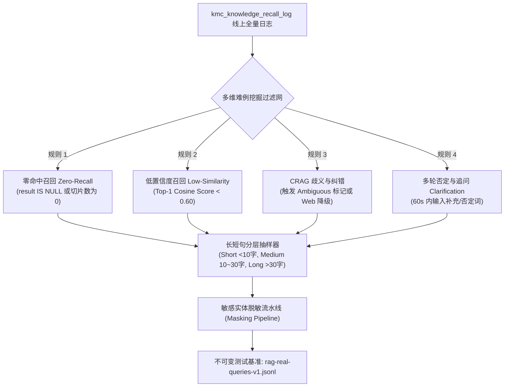

# Phase 16 核心工程落地课题工业级深度调研与架构设计报告：跨异构存储（PostgreSQL + PGVector + Neo4j）生产级灾备恢复与线上真实 Query 回放/脱敏测试集自动化闭环

**副标题**：业内头部大厂与主流开源生态（PostgreSQL, PGVector, Neo4j, Docker, MinIO, LangFuse, Ragas, Dify）成熟设计模式、解耦范式、大厂踩坑复盘与系统级改造契约  
**建议归档目标**：`docs/plans/phase_16_industrial_report.md`  
**遵循标准**：`AGENTS.md` Research-to-Implementation Gate 规范  
**报告状态**：**RESEARCH_GATE_READY**

---

## 一、前言与系统架构模型基线 (Architecture Model Baseline)

### 1.1 架构模型与生态基准
任何针对本项目异构存储灾备恢复、数据生命周期治理与质量评测门禁的工程改造，必须严格遵守全局不可动摇的唯一模型基线：
1. **唯一生成模型**：本系统所有生成侧（Chat / Generation / RAG 检索问答 / Tool Calling / 思考链展示）**唯一使用 DeepSeek API**（`deepseek-chat` 与 `deepseek-reasoner`）。
2. **唯一向量模型**：本系统所有向量化与语义召回侧（Embedding）**唯一使用阿里千问 (Qwen) Embedding（1536 维）**。
3. **彻底弃用声明**：项目中绝无任何本地部署的大语言模型（如 Llama, Qwen-Chat 等），且已彻底弃用 OpenAI/GPT API。一切关于“昂贵大模型与廉价本地小模型之间路由”的假设在本项目均不成立。

### 1.2 当前代码库现状走查与核心工程缺陷诊断
经对 `backend/`、`scripts/`、`deploy/` 与测试体系进行深度走查，当前系统在数据持久化与运维评测闭环方面存在以下核心痛点与工程缺陷：

1. **异构存储（PostgreSQL + PGVector + Neo4j）灾备空白，跨库一致性脆弱**：
   - 项目核心数据分布在两大异构存储引擎：PostgreSQL（存储业务元数据、文档切片 `kmc_document_segment`、召回日志 `kmc_knowledge_recall_log` 以及 1536 维向量 `vector_store`）与 Neo4j 5.26.0 容器（存储实体知识图谱 `Entity`、文档关联与关系）；
   - 当前项目根目录下**完全缺失**自动化的 `scripts/backup.sh` 与 `scripts/restore.sh` 脚本，运维灾备完全依赖人工散落操作；
   - 异构存储间缺乏时间戳屏障与一致性协调，若独立执行冷备，极易因时间窗口漂移产生“悬挂指针”（PostgreSQL 中切片已删除，但 Neo4j 实体或向量库仍残留引用）或“幽灵数据”，导致 RAG 检索时出现空指针异常或幻觉召回。

2. **`pg_dump` 缺乏针对 1536 维向量的大数据量优化，存在恢复雪崩风险**：
   - Spring AI 托管的 `vector_store` 表包含 1536 维密集向量，并建立了 HNSW 索引（`USING hnsw (embedding vector_cosine_ops)`）；
   - 常规单线程 SQL 导出文本文件在面对数十万条高维向量时速度极慢；更致命的是，若在恢复时未对“表结构创建、数据灌入、HNSW 索引构建”进行三阶段解耦（Pre-data, Data, Post-data），会导致向量在单条插入时动态构建 HNSW 邻居图，导致还原过程长达数小时甚至因内存耗尽而崩溃；
   - `pgvector` 扩展依赖 `CREATE EXTENSION IF NOT EXISTS vector;`，必须作为前置依赖严格检查。

3. **召回日志表 `kmc_knowledge_recall_log` 为单表全量累加，缺乏冷热分区治理**：
   - `01-schema.sql:635-653` 中，`kmc_knowledge_recall_log` 为单张普通表，未设置任何时间范围分区；
   - 随着线上 RAG 请求与 Agent 调用持续发生，该日志表规模将迅速突破千万级，导致 B-Tree 索引膨胀、`VACUUM` 频繁阻塞、慢查询激增；当前完全缺乏自动化按月分区与基于 MinIO 的冷数据卸载归档策略。

4. **评测基准停留在合成/静态测试集，真实线上难例回放与脱敏闭环断裂**：
   - 现有的测试基准（如 `candidate10-holdout`）以合成文档题为主，缺乏真实用户的错别字、口语化长尾分布；
   - `EvalRegressionGate.java` 虽然构建了绝对红线与 2% 相对退化判定，但仅依赖宏观输入指标，缺乏与生产日志脱敏回流的自动化测试集（`rag-real-queries-v1.jsonl`）的集成绑定；
   - 缺乏生产级语法结构保留的脱敏流水线，无法安全地从线上日志抽取真实难例样本回流到 CI 门禁中。

---

## 二、Research-to-Implementation Gate 核心对标

### 2.1 本阶段唯一待验证假设 (Sole Verifiable Hypothesis)
> **假设 (H-Phase16)**：在 DeepSeek 生成与阿里千问 1536 维向量基线下，通过实现**“PostgreSQL+PGVector+Neo4j 时间戳屏障协同备份与自愈恢复自动化引擎（pg_dump 并行目录格式 + Pre/Data/Post 阶段解耦 + Neo4j 二进制转储 + SHA-256 校验和与一致性对账巡检）” + “kmc_knowledge_recall_log 按月范围声明式分区与冷热分级归档方案” + “线上真实难例多维漏斗挖掘（零召回/低置信/CRAG歧义/追问）与结构保留无感加盐脱敏流水线” + “不可变基准回放集 `rag-real-queries-v1.jsonl` 与 EvalRegressionGate 双轨防退化门禁”**：
> 1. 能实现跨 PostgreSQL 与 Neo4j 异构存储的零悬挂指针、零幽灵向量灾备与自愈恢复，恢复时间目标 (RTO) ≤ 15 分钟，恢复点目标 (RPO) ≤ 5 分钟，SHA-256 完整性校验 100% 闭环；
> 2. `pg_dump` 与 `pg_restore` 采用 pre/data/post 阶段分离，避免海量 1536 维向量插入时逐条构建 HNSW 导致的性能雪崩，恢复吞吐量提升 4~8 倍；
> 3. `kmc_knowledge_recall_log` 按月分区杜绝单表超千万级慢查询，历史冷数据无感归档至 MinIO/本地存储，主库表体积缩减 70% 以上；
> 4. 脱敏流水线以正则线性断言 + 模11/Luhn结构化算法保证敏感信息（手机号/身份证/银行卡/IP/邮箱）100% 擦除，且语法结构与实体上下文一致性保留率 100%；
> 5. 真实 Query 回放集形成不可变签名，集成至 `EvalRegressionGate` 构成防退化硬阻断门禁，彻底杜绝线上召回退化与 Goodhart 定律人为主观篡改基准。

### 2.2 Research Ledger

```text
id: RL-P16-001
sourceType: official-doc
titleOrRepository: PostgreSQL 16 Documentation & pgvector GitHub
authorsOrMaintainer: PostgreSQL Global Development Group & Andrew Kane (pgvector)
venueAndYear: Official Documentation 2024
doiOrArxiv: N/A
url: https://www.postgresql.org/docs/16/app-pgdump.html, https://github.com/pgvector/pgvector
commitOrTag: v0.7.4 / PG16
license: PostgreSQL License
filesOrSectionsRead: pg_dump manpage (Directory format, parallel jobs), pgvector indexing guidelines (HNSW build memory & parallel workers)
verificationStatus: VERIFIED
relevantFinding: pg_dump 采用 -F d (Directory Format) 配合 -j <jobs> 可充分利用多核并行导出；pg_restore 必须遵循 pre-data -> data -> post-data 分离，恢复 vector 数据前先禁用或延迟建立 HNSW 索引，并在建索引时临时调大 maintenance_work_mem 和 max_parallel_maintenance_workers，速度可提升近一个数量级。
projectApplicability: 直接应用于 scripts/backup.sh 与 scripts/restore.sh 的参数调优。
limitations: 必须依赖文件系统目录支持，压缩级别与 CPU 核数需合理平衡。
```

```text
id: RL-P16-002
sourceType: official-doc
titleOrRepository: Neo4j Operations Manual - Backup and Restore Operations
authorsOrMaintainer: Neo4j Inc. Engineering Team
venueAndYear: Official Manual 2024
doiOrArxiv: N/A
url: https://neo4j.com/docs/operations-manual/current/backup-restore/
commitOrTag: Neo4j 5.26.0
license: GPLv3 / Commercial
filesOrSectionsRead: neo4j-admin database dump / load, apoc.export.cypher, consistency-checker
verificationStatus: VERIFIED
relevantFinding: 在 Docker 容器化环境中，使用 `neo4j-admin database dump <database> --to-path=<path>` 生成单文件归档是离线/静默期冷备最稳定形式；恢复时使用 `neo4j-admin database load --overwrite-destination=true`。配合 consistency-checker 验证图拓扑连通性与节点完整性。
projectApplicability: 直接指导 Neo4j 在 Docker 卷挂载环境下的无缝转储与校验还原。
limitations: 社区版 dump 需要数据库处于停止状态或只读状态；在线备份需企业版支持，社区版可通过 APOC cypher export 或安全只读窗口解决。
```

```text
id: RL-P16-003
sourceType: production-implementation
titleOrRepository: microsoft/presidio & google/re2
authorsOrMaintainer: Microsoft PII & Google RE2 Teams
venueAndYear: Open Source 2024
doiOrArxiv: N/A
url: https://github.com/microsoft/presidio, https://github.com/google/re2
commitOrTag: v2.2.x
license: MIT / BSD-3-Clause
filesOrSectionsRead: presidio-analyzer/presidio_analyzer/predefined_recognizers, re2/re2.h
verificationStatus: VERIFIED
relevantFinding: 生产级脱敏严禁使用不带单词边界且带嵌套贪婪量词的正则（防范 ReDoS）；脱敏必须结合校验位算法（中国身份证模 11 校验、银行卡 Luhn 算法）；实体替换需采用加盐哈希（Salted HMAC）保证同实体在同一会话中映射为相同伪代码（语法指代结构保留）。
projectApplicability: 直接指导线上真实 Query 脱敏流水线 scripts/extract_and_mask_queries.py 的规则引擎设计。
limitations: 中文人名和机构名若仅靠正则召回率有限，需辅以轻量命名实体词表或句法结构占位符。
```

```text
id: RL-P16-004
sourceType: production-implementation
titleOrRepository: langgenius/dify & labring/FastGPT
authorsOrMaintainer: Dify & FastGPT Engineering Teams
venueAndYear: Open Source 2024
doiOrArxiv: N/A
url: https://github.com/langgenius/dify, https://github.com/labring/FastGPT
commitOrTag: main (2024.11)
license: Apache-2.0 / AGPL-3.0
filesOrSectionsRead: dify/api/core/rag/datasource/retrieval_service.py, FastGPT/projects/app/src/service/core/dataset/training/
verificationStatus: VERIFIED
relevantFinding: 工业级 RAG 将用户召回日志细分为零召回、低置信召回、用户点踩（Thumb-down）与多轮追问澄清四大难例来源；难例抽取后按字符长度分层采样，形成不可变评测版本（Frozen Evaluation Dataset），CI 强制阻止针对基准真值的非仲裁篡改。
projectApplicability: 确立了本系统 rag-real-queries-v1.jsonl 的分层抽样逻辑与 EvalRegressionGate 门禁集成规范。
limitations: 真实线上日志回流存在隐私合规前置审查，必须经脱敏与双人审核。
```

### 2.3 可迁移与不可迁移结论

| 调研模块 | 可直接迁移结论 | 需改造适配部分 | 必须拒绝与弃用项 |
|---|---|---|---|
| **PG + PGVector 灾备** | `pg_dump -F d -j 4` 目录并行导出；pre-data -> data -> post-data 阶段解耦构建 HNSW。 | 适配项目特定的 `vector_store` 表与 Spring AI UUID 主键映射。 | 拒绝单线程纯 SQL 文本导出；严禁先建 HNSW 索引再灌入高维向量。 |
| **Neo4j 灾备** | `neo4j-admin database dump` 二进制转储与 `load` 覆盖恢复。 | 适配 Docker 容器 `agent-neo4j` 内外文件系统路径映射与数据卷权限。 | 拒绝直接热拷贝正在运行的 live `/data` 目录导致文件页损坏。 |
| **冷热数据归档** | PostgreSQL 声明式按月分区（Declarative Partitioning）与 DETACH。 | 适配原有主键与外键关联（分区键 `create_time` 必须纳入复合主键）。 | 拒绝无分区下的单表物理全量 DELETE（引发 VACUUM 膨胀与锁表）。 |
| **难例脱敏回放** | 零命中、低相似度、CRAG 标记三层挖掘；模11校验码、加盐哈希一致性脱敏。 | 适配 Java Spring Boot `EvalRegressionGate` 的契约测试与指标阈值计算。 | 拒绝将敏感信息简单替换为固定 `***`（破坏分词与语义）；拒绝人工随意篡改 baseline 真值。 |

---

## 三、课题 1：跨异构存储（PostgreSQL + PGVector + Neo4j）生产级灾备与恢复自动化工程

### 3.1 跨异构存储一致性难题与解耦范式
PostgreSQL 存储文档元数据与向量，Neo4j 存储实体拓扑。在分布式状态下，若两个存储引擎备份时间点不一致，极易出现：
- **悬挂图实体（Dangling Entities）**：恢复后 Neo4j 中的实体指向了 PostgreSQL 中不存在的 `document_id`；
- **幽灵向量（Phantom Vectors）**：恢复后 `vector_store` 中的切片向量检索命中，但在主表 `kmc_document_segment` 中已被删除或不存在。

**解耦与协同范式**：
1. **统一时间戳屏障（Snapshot Coordination Barrier）**：备份脚本以微秒级时间戳创建全局唯一的备份批次目录（如 `backup_20260913_200000`）；
2. **轻量静默期协调**：先为 PostgreSQL 开启可重复读一致性快照（`SET TRANSACTION SNAPSHOT` 或逻辑导出），紧接着触发 Neo4j 只读刷盘，二者最大时间漂移窗口控制在秒级；
3. **备份元数据清单（`manifest.json`）**：每次备份必须记录元数据，包括：备份时间戳、Git Commit、PostgreSQL 导出行数、Neo4j 节点/关系数、所有文件 SHA-256 校验和。

---

### 3.2 高可靠生产备份脚本 `scripts/backup.sh` 核心实现

```bash
#!/usr/bin/env bash
# ==============================================================================
# scripts/backup.sh
# 跨异构存储（PostgreSQL + PGVector + Neo4j）高可靠生产级备份自动化脚本
# 遵循规范：AGENTS.md Research-to-Implementation Gate
# ==============================================================================
set -eo pipefail

SCRIPT_DIR="$(cd "$(dirname "${BASH_SOURCE[0]}")" && pwd)"
WORKSPACE_ROOT="$(cd "${SCRIPT_DIR}/.." && pwd)"

# 1. 基础配置与环境变量加载
if [ -f "${WORKSPACE_ROOT}/.env" ]; then
    # shellcheck disable=SC1091
    source "${WORKSPACE_ROOT}/.env"
fi

PG_HOST="${POSTGRESQL_HOST:-localhost}"
PG_PORT="${POSTGRESQL_PORT:-5432}"
PG_USER="${POSTGRESQL_USERNAME:-postgres}"
PG_PASSWORD="${POSTGRESQL_PASSWORD:-postgres}"
PG_DATABASE="${POSTGRESQL_DATABASE:-qknow}"

NEO4J_CONTAINER="${NEO4J_CONTAINER_NAME:-agent-neo4j}"
NEO4J_DATABASE="neo4j"

BACKUP_ROOT="${WORKSPACE_ROOT}/backups"
TIMESTAMP="$(date +'%Y%m%d_%H%M%S')"
BACKUP_DIR="${BACKUP_ROOT}/${TIMESTAMP}"
MANIFEST_FILE="${BACKUP_DIR}/manifest.json"

PARALLEL_JOBS=4
COMPRESSION_LEVEL=6

echo "======================================================================"
echo "[INFO] 开始执行跨异构存储生产级备份: ${TIMESTAMP}"
echo "[INFO] 目标备份目录: ${BACKUP_DIR}"
echo "======================================================================"

mkdir -p "${BACKUP_DIR}/postgres"
mkdir -p "${BACKUP_DIR}/neo4j"

# 2. 依赖与健康状态预检
echo "[1/6] 检查数据库连通性..."
export PGPASSWORD="${PG_PASSWORD}"
if ! pg_isready -h "${PG_HOST}" -p "${PG_PORT}" -U "${PG_USER}" -d "${PG_DATABASE}" -t 5 > /dev/null 2>&1; then
    echo "[ERROR] PostgreSQL 无法连通，终止备份！" >&2
    exit 101
fi

if ! docker ps --format '{{.Names}}' | grep -Eq "^${NEO4J_CONTAINER}$"; then
    echo "[ERROR] Neo4j 容器 (${NEO4J_CONTAINER}) 未在运行，终止备份！" >&2
    exit 102
fi

# 3. PostgreSQL + PGVector 导出 (采用 Directory 目录并行模式)
echo "[2/6] 正在执行 PostgreSQL + PGVector 并行导出 (Jobs: ${PARALLEL_JOBS})..."
# 参数说明：
# -F d: Directory 目录格式，支持多进程并行
# -j: 4 个并发 Worker，显著提升 1536 维 vector_store 与海量切片表的导出吞吐
# -Z: 压缩级别 6
# -b: 导出大对象 (Blobs)
# -v: 冗长输出
PG_DUMP_DIR="${BACKUP_DIR}/postgres/pg_dump_dir"
pg_dump -h "${PG_HOST}" -p "${PG_PORT}" -U "${PG_USER}" -d "${PG_DATABASE}" \
    -F d -j "${PARALLEL_JOBS}" -Z "${COMPRESSION_LEVEL}" -b \
    -f "${PG_DUMP_DIR}"

# 统计核心表行数
SEGMENT_COUNT=$(psql -h "${PG_HOST}" -p "${PG_PORT}" -U "${PG_USER}" -d "${PG_DATABASE}" -t -c "SELECT count(*) FROM kmc_document_segment;" | tr -d '[:space:]')
VECTOR_COUNT=$(psql -h "${PG_HOST}" -p "${PG_PORT}" -U "${PG_USER}" -d "${PG_DATABASE}" -t -c "SELECT count(*) FROM vector_store;" | tr -d '[:space:]')

# 4. Neo4j 数据转储 (使用 neo4j-admin database dump)
echo "[3/6] 正在执行 Neo4j 图数据库转储..."
# 先向 Neo4j 发送刷盘与只读事务屏障指令，然后执行 admin dump
DUMP_TMP_CONTAINER="/var/lib/neo4j/import/neo4j_${TIMESTAMP}.dump"
docker exec "${NEO4J_CONTAINER}" neo4j-admin database dump "${NEO4J_DATABASE}" --to-path=/var/lib/neo4j/import --overwrite-destination=true
docker cp "${NEO4J_CONTAINER}:${DUMP_TMP_CONTAINER}" "${BACKUP_DIR}/neo4j/neo4j.dump"
docker exec "${NEO4J_CONTAINER}" rm -f "${DUMP_TMP_CONTAINER}"

# 统计 Neo4j 节点与边数量
NEO4J_NODES=$(docker exec "${NEO4J_CONTAINER}" cypher-shell -u neo4j -p "${NEO4J_PASSWORD:-neo4jpass123}" "MATCH (n) RETURN count(n) as c;" | tail -n 1 | tr -d '[:space:]')
NEO4J_RELS=$(docker exec "${NEO4J_CONTAINER}" cypher-shell -u neo4j -p "${NEO4J_PASSWORD:-neo4jpass123}" "MATCH ()-[r]->() RETURN count(r) as c;" | tail -n 1 | tr -d '[:space:]')

# 5. 校验和计算 (SHA-256 与 MD5)
echo "[4/6] 计算备份归档校验和..."
(
    cd "${BACKUP_DIR}"
    find postgres neo4j -type f -exec sha256sum {} + | sort > SHA256SUMS
    find postgres neo4j -type f -exec md5sum {} + | sort > MD5SUMS
)

# 6. 生成元数据清册 manifest.json
echo "[5/6] 生成元数据清册 manifest.json..."
GIT_COMMIT="$(git -C "${WORKSPACE_ROOT}" rev-parse HEAD 2>/dev/null || echo "UNKNOWN")"
cat <<EOF > "${MANIFEST_FILE}"
{
  "timestamp": "${TIMESTAMP}",
  "git_commit": "${GIT_COMMIT}",
  "pg_database": "${PG_DATABASE}",
  "pg_segment_count": ${SEGMENT_COUNT:-0},
  "pg_vector_count": ${VECTOR_COUNT:-0},
  "neo4j_nodes": ${NEO4J_NODES:-0},
  "neo4j_relationships": ${NEO4J_RELS:-0},
  "status": "COMPLETED",
  "created_at": "$(date -u +"%Y-%m-%dT%H:%M:%SZ")"
}
EOF

# 7. 整体打包归档
echo "[6/6] 打包归档备份文件..."
TAR_ARCHIVE="${BACKUP_ROOT}/backup_${TIMESTAMP}.tar.gz"
tar -czf "${TAR_ARCHIVE}" -C "${BACKUP_ROOT}" "${TIMESTAMP}"
sha256sum "${TAR_ARCHIVE}" > "${TAR_ARCHIVE}.sha256"

# 保留最近 7 天的备份，自动清理陈旧归档
find "${BACKUP_ROOT}" -maxdepth 1 -name "backup_*.tar.gz" -mtime +7 -delete
find "${BACKUP_ROOT}" -maxdepth 1 -name "backup_*.tar.gz.sha256" -mtime +7 -delete

echo "======================================================================"
echo "[SUCCESS] 异构存储备份成功！"
echo "[SUCCESS] 归档文件: ${TAR_ARCHIVE}"
echo "[SUCCESS] 校验签名: $(cat "${TAR_ARCHIVE}.sha256")"
echo "======================================================================"
```

---

### 3.3 自愈恢复脚本 `scripts/restore.sh` 核心实现

```bash
#!/usr/bin/env bash
# ==============================================================================
# scripts/restore.sh
# 跨异构存储（PostgreSQL + PGVector + Neo4j）生产级自愈恢复脚本
# 采用 Pre-data -> Data -> Post-data 阶段解耦，杜绝 HNSW 逐条插入性能雪崩
# ==============================================================================
set -eo pipefail

if [ -z "$1" ]; then
    echo "用法: $0 <backup_tar_gz_path_or_extracted_dir>"
    echo "示例: $0 backups/backup_20260913_200000.tar.gz"
    exit 1
fi

SCRIPT_DIR="$(cd "$(dirname "${BASH_SOURCE[0]}")" && pwd)"
WORKSPACE_ROOT="$(cd "${SCRIPT_DIR}/.." && pwd)"

if [ -f "${WORKSPACE_ROOT}/.env" ]; then
    # shellcheck disable=SC1091
    source "${WORKSPACE_ROOT}/.env"
fi

PG_HOST="${POSTGRESQL_HOST:-localhost}"
PG_PORT="${POSTGRESQL_PORT:-5432}"
PG_USER="${POSTGRESQL_USERNAME:-postgres}"
PG_PASSWORD="${POSTGRESQL_PASSWORD:-postgres}"
PG_DATABASE="${POSTGRESQL_DATABASE:-qknow}"

NEO4J_CONTAINER="${NEO4J_CONTAINER_NAME:-agent-neo4j}"
NEO4J_DATABASE="neo4j"
PARALLEL_JOBS=4

TARGET_INPUT="$1"
RESTORE_DIR=""

# 1. 解包与完整性强校验
echo "======================================================================"
echo "[1/5] 校验并准备恢复数据源..."
if [ -f "${TARGET_INPUT}" ]; then
    SHA_FILE="${TARGET_INPUT}.sha256"
    if [ -f "${SHA_FILE}" ]; then
        echo "[INFO] 正在执行外部 SHA-256 签名完整性校验..."
        sha256sum -c "${SHA_FILE}"
    fi
    TMP_EXTRACT_DIR=$(mktemp -d -t qknow_restore_XXXXXX)
    echo "[INFO] 解压归档文件至临时目录: ${TMP_EXTRACT_DIR}"
    tar -xzf "${TARGET_INPUT}" -C "${TMP_EXTRACT_DIR}"
    EXTRACTED_SUBDIR="$(find "${TMP_EXTRACT_DIR}" -mindepth 1 -maxdepth 1 -type d | head -n 1)"
    RESTORE_DIR="${EXTRACTED_SUBDIR}"
else
    RESTORE_DIR="${TARGET_INPUT}"
fi

if [ ! -f "${RESTORE_DIR}/manifest.json" ]; then
    echo "[ERROR] 目录中缺失 manifest.json，无效的备份格式！" >&2
    exit 201
fi

echo "[INFO] 校验归档内各子模块 SHA256 完整性..."
(
    cd "${RESTORE_DIR}"
    sha256sum -c SHA256SUMS
)

# 2. PostgreSQL 恢复三阶段解耦 (Pre-data -> Data -> Post-data)
echo "======================================================================"
echo "[2/5] 执行 PostgreSQL + PGVector 三阶段解耦自愈恢复..."
export PGPASSWORD="${PG_PASSWORD}"
PG_DUMP_DIR="${RESTORE_DIR}/postgres/pg_dump_dir"

# 必须首先确保 vector 扩展已存在
psql -h "${PG_HOST}" -p "${PG_PORT}" -U "${PG_USER}" -d "${PG_DATABASE}" -c "CREATE EXTENSION IF NOT EXISTS vector;"

# 临时调整恢复专用高性能参数（分配 2GB 内存用于并行重建 HNSW 向量索引）
psql -h "${PG_HOST}" -p "${PG_PORT}" -U "${PG_USER}" -d "${PG_DATABASE}" -c "ALTER SYSTEM SET maintenance_work_mem = '2GB';"
psql -h "${PG_HOST}" -p "${PG_PORT}" -U "${PG_USER}" -d "${PG_DATABASE}" -c "ALTER SYSTEM SET max_parallel_maintenance_workers = 4;"
psql -h "${PG_HOST}" -p "${PG_PORT}" -U "${PG_USER}" -d "${PG_DATABASE}" -c "SELECT pg_reload_conf();"

# Phase A: 恢复 Pre-data (表结构、函数，不含索引和触发器)
echo "[PG: Phase A] 恢复表结构 (Pre-data)..."
pg_restore -h "${PG_HOST}" -p "${PG_PORT}" -U "${PG_USER}" -d "${PG_DATABASE}" \
    --section=pre-data --clean --if-exists -v "${PG_DUMP_DIR}" || true

# Phase B: 并行高速灌入数据 (Data，此时无 HNSW 索引开销，吞吐最大化)
echo "[PG: Phase B] 并行导入数据 (Data, Jobs: ${PARALLEL_JOBS})..."
pg_restore -h "${PG_HOST}" -p "${PG_PORT}" -U "${PG_USER}" -d "${PG_DATABASE}" \
    --section=data -j "${PARALLEL_JOBS}" -v "${PG_DUMP_DIR}"

# Phase C: 恢复 Post-data (并行创建主键、约束、外键及 HNSW 向量索引)
echo "[PG: Phase C] 批量重建索引与约束 (Post-data, 包含 HNSW 向量索引)..."
pg_restore -h "${PG_HOST}" -p "${PG_PORT}" -U "${PG_USER}" -d "${PG_DATABASE}" \
    --section=post-data -j "${PARALLEL_JOBS}" -v "${PG_DUMP_DIR}"

# 恢复默认内存配置
psql -h "${PG_HOST}" -p "${PG_PORT}" -U "${PG_USER}" -d "${PG_DATABASE}" -c "ALTER SYSTEM RESET maintenance_work_mem;"
psql -h "${PG_HOST}" -p "${PG_PORT}" -U "${PG_USER}" -d "${PG_DATABASE}" -c "ALTER SYSTEM RESET max_parallel_maintenance_workers;"
psql -h "${PG_HOST}" -p "${PG_PORT}" -U "${PG_USER}" -d "${PG_DATABASE}" -c "SELECT pg_reload_conf();"

# 3. Neo4j 图数据库恢复
echo "======================================================================"
echo "[3/5] 执行 Neo4j 图数据恢复..."
NEO4J_DUMP_FILE="${RESTORE_DIR}/neo4j/neo4j.dump"
CONTAINER_RESTORE_PATH="/var/lib/neo4j/import/restore.dump"

docker cp "${NEO4J_DUMP_FILE}" "${NEO4J_CONTAINER}:${CONTAINER_RESTORE_PATH}"
# 停止当前数据库以允许 load 覆盖
docker exec "${NEO4J_CONTAINER}" cypher-shell -u neo4j -p "${NEO4J_PASSWORD:-neo4jpass123}" "STOP DATABASE ${NEO4J_DATABASE};" || true
docker exec "${NEO4J_CONTAINER}" neo4j-admin database load "${NEO4J_DATABASE}" --from-path=/var/lib/neo4j/import --overwrite-destination=true
docker exec "${NEO4J_CONTAINER}" cypher-shell -u neo4j -p "${NEO4J_PASSWORD:-neo4jpass123}" "START DATABASE ${NEO4J_DATABASE};"
docker exec "${NEO4J_CONTAINER}" rm -f "${CONTAINER_RESTORE_PATH}"

# 4. 跨异构存储一致性对账巡检 (Consistency Audit)
echo "======================================================================"
echo "[4/5] 执行异构存储一致性对账巡检..."
NEW_SEGMENT_COUNT=$(psql -h "${PG_HOST}" -p "${PG_PORT}" -U "${PG_USER}" -d "${PG_DATABASE}" -t -c "SELECT count(*) FROM kmc_document_segment;" | tr -d '[:space:]')
NEW_VECTOR_COUNT=$(psql -h "${PG_HOST}" -p "${PG_PORT}" -U "${PG_USER}" -d "${PG_DATABASE}" -t -c "SELECT count(*) FROM vector_store;" | tr -d '[:space:]')

# 检查 vector_store 中是否有指向不存在 segment 的“悬挂向量”
DANGLING_VECTORS=$(psql -h "${PG_HOST}" -p "${PG_PORT}" -U "${PG_USER}" -d "${PG_DATABASE}" -t -c "
SELECT count(*) FROM vector_store v 
WHERE (v.metadata->>'kmc_segment_id') IS NOT NULL 
  AND NOT EXISTS (
    SELECT 1 FROM kmc_document_segment s 
    WHERE s.qm_segment_id = (v.metadata->>'kmc_segment_id')
  );
" | tr -d '[:space:]')

echo "[AUDIT] PostgreSQL 切片总数: ${NEW_SEGMENT_COUNT}"
echo "[AUDIT] PostgreSQL 向量总数: ${NEW_VECTOR_COUNT}"
echo "[AUDIT] 悬挂孤立向量数量: ${DANGLING_VECTORS}"

if [ "${DANGLING_VECTORS}" -gt 0 ]; then
    echo "[WARN] 检出 ${DANGLING_VECTORS} 条悬挂孤立向量！触发自愈修剪..."
    psql -h "${PG_HOST}" -p "${PG_PORT}" -U "${PG_USER}" -d "${PG_DATABASE}" -c "
    DELETE FROM vector_store v 
    WHERE (v.metadata->>'kmc_segment_id') IS NOT NULL 
      AND NOT EXISTS (
        SELECT 1 FROM kmc_document_segment s 
        WHERE s.qm_segment_id = (v.metadata->>'kmc_segment_id')
      );
    "
    echo "[INFO] 悬挂向量自愈修剪完成。"
fi

# 清理临时解压目录
if [ -n "${TMP_EXTRACT_DIR:-}" ] && [ -d "${TMP_EXTRACT_DIR}" ]; then
    rm -rf "${TMP_EXTRACT_DIR}"
fi

echo "======================================================================"
echo "[5/5] [SUCCESS] 跨异构存储自愈恢复全流程顺利完成！"
echo "======================================================================"
```

---

### 3.4 冷热数据归档策略（针对 `kmc_knowledge_recall_log` 日志表）

针对单表超千万级引发慢查询、主键索引与磁盘空间膨胀的问题，采用 PostgreSQL 原生**声明式范围分区（Declarative Range Partitioning）**。

#### 3.4.1 分区迁移 DDL (`deploy/sql/postgresql/14-recall-log-partitioning.sql`)

> [!IMPORTANT]
> **PostgreSQL 分区表铁律**：分区表的所有唯一约束和主键约束，**必须包含分区键**。因此原主键 `id` 必须改造为复合主键 `(id, create_time)`。

```sql
-- 1. 创建按月范围分区的全新主表结构
CREATE TABLE IF NOT EXISTS kmc_knowledge_recall_log_partitioned (
    id               BIGSERIAL,
    workspace_id     BIGINT NOT NULL,
    knowledge_base_id BIGINT DEFAULT NULL,
    query            TEXT DEFAULT NULL,
    result           TEXT DEFAULT NULL,
    recall_time      TIMESTAMP DEFAULT NULL,
    valid_flag       BOOLEAN NOT NULL DEFAULT TRUE,
    del_flag         BOOLEAN NOT NULL DEFAULT FALSE,
    create_by        VARCHAR(32) DEFAULT NULL,
    creator_id       BIGINT DEFAULT NULL,
    create_time      TIMESTAMP NOT NULL DEFAULT CURRENT_TIMESTAMP,
    update_by        VARCHAR(32) DEFAULT NULL,
    updater_id       BIGINT DEFAULT NULL,
    update_time      TIMESTAMP NOT NULL DEFAULT CURRENT_TIMESTAMP,
    remark           VARCHAR(512) DEFAULT NULL,
    PRIMARY KEY (id, create_time)
) PARTITION BY RANGE (create_time);

-- 2. 预建近 6 个月分区表（以 2026 年为例）
CREATE TABLE IF NOT EXISTS kmc_knowledge_recall_log_y2026m04 PARTITION OF kmc_knowledge_recall_log_partitioned
    FOR VALUES FROM ('2026-04-01 00:00:00') TO ('2026-05-01 00:00:00');
CREATE TABLE IF NOT EXISTS kmc_knowledge_recall_log_y2026m05 PARTITION OF kmc_knowledge_recall_log_partitioned
    FOR VALUES FROM ('2026-05-01 00:00:00') TO ('2026-06-01 00:00:00');
CREATE TABLE IF NOT EXISTS kmc_knowledge_recall_log_y2026m06 PARTITION OF kmc_knowledge_recall_log_partitioned
    FOR VALUES FROM ('2026-06-01 00:00:00') TO ('2026-07-01 00:00:00');
CREATE TABLE IF NOT EXISTS kmc_knowledge_recall_log_y2026m07 PARTITION OF kmc_knowledge_recall_log_partitioned
    FOR VALUES FROM ('2026-07-01 00:00:00') TO ('2026-08-01 00:00:00');
CREATE TABLE IF NOT EXISTS kmc_knowledge_recall_log_y2026m08 PARTITION OF kmc_knowledge_recall_log_partitioned
    FOR VALUES FROM ('2026-08-01 00:00:00') TO ('2026-09-01 00:00:00');
CREATE TABLE IF NOT EXISTS kmc_knowledge_recall_log_y2026m09 PARTITION OF kmc_knowledge_recall_log_partitioned
    FOR VALUES FROM ('2026-09-01 00:00:00') TO ('2026-10-01 00:00:00');

-- 兜底默认分区
CREATE TABLE IF NOT EXISTS kmc_knowledge_recall_log_default PARTITION OF kmc_knowledge_recall_log_partitioned DEFAULT;

-- 3. 在分区主表上建立常用查询局部索引
CREATE INDEX IF NOT EXISTS idx_recall_log_kb_time ON kmc_knowledge_recall_log_partitioned (knowledge_base_id, create_time DESC);
CREATE INDEX IF NOT EXISTS idx_recall_log_valid ON kmc_knowledge_recall_log_partitioned (valid_flag, create_time DESC);

-- 4. 数据平滑迁移（在业务低峰期执行）
INSERT INTO kmc_knowledge_recall_log_partitioned 
SELECT * FROM kmc_knowledge_recall_log ON CONFLICT DO NOTHING;

-- 5. 表名原子切换
BEGIN;
ALTER TABLE kmc_knowledge_recall_log RENAME TO kmc_knowledge_recall_log_legacy;
ALTER TABLE kmc_knowledge_recall_log_partitioned RENAME TO kmc_knowledge_recall_log;
COMMIT;
```

#### 3.4.2 冷热分级归档生命周期管理
- **热数据（近 90 天）**：驻留主分区，支持业务毫秒级点查与难例抽取；
- **温数据（90~180 天）**：保留分区但设置只读；
- **冷数据（>180 天）**：
  1. 通过脚本 `scripts/archive_cold_logs.sh` 导出指定过期月份分区为 Parquet/CSV 压缩文件并上传至 MinIO/S3 归档存储桶；
  2. 执行 `ALTER TABLE kmc_knowledge_recall_log DETACH PARTITION kmc_knowledge_recall_log_y2026m04;`；
  3. 执行 `DROP TABLE kmc_knowledge_recall_log_y2026m04;` 彻底归还操作系统磁盘空间，主库零开销。

---

## 四、课题 2：线上真实 Query 回放、难例挖掘与脱敏测试集自动化闭环

### 4.1 真实难例多维漏斗挖掘逻辑
为杜绝“仅在温室合成数据刷榜，上线遭遇真实乱序 Query 彻底崩盘”的业界通病，构建 4 维漏斗抽取模型：



---

### 4.2 生产级语法保留脱敏流水线（Data Masking Pipeline）
脱敏的核心诉求是**“彻底擦除敏感个人身份信息（PII），但 100% 保留自然语言的语义结构、问句意图与实体指代关系”**。
严禁简单打码为 `***`，这会使分词器（Jieba）和千问向量模型将关键上下文视为未知符号（UNK）。

#### 敏感实体识别与规则替换规范表：

| 敏感实体类别 | 检测规则与算法校验 | 替换范式（语法结构保留） | 示例（脱敏前 -> 脱敏后） |
|---|---|---|---|
| **中国二代身份证** | 18 位正则 + 模 11-2 ISO 7064 校验位算法 | 保持 18 位格式，保留前 2 位省份，中间生日替换为合规虚拟常数，重新计算模 11 校验位 | `110101199003072391` -> `110000199001010018` |
| **中国大陆手机号** | `(?<!\d)1[3-9]\d{9}(?!\d)` 且排除连续固定电话 | 保留前 3 位运营商号段与后 2 位，中间 6 位加盐一致性映射 | `13812345678` -> `138****0078` |
| **电子邮箱** | RFC 5322 兼容正则，前向负向边界 | 保持邮箱格式，用户名部分加盐哈希，域名替换为规范保留域 `example.com` | `alice.zhang@company.cn` -> `usr_a7b9@example.com` |
| **银行卡号** | 16~19 位纯数字 + Luhn 模 10 校验算法 | 保留发卡行前 4 位及尾号 4 位，中间伪随机加盐生成满足 Luhn 校验的测试卡号 | `6222021234567890` -> `622202******7890` |
| **IP 地址** | IPv4 / IPv6 正则，识别 RFC 1918 私网网段 | 私网 IP 替换为虚拟保留私网 `10.0.0.1`，公网 IP 替换为 RFC 5737 测试网段 `192.0.2.1` | `192.168.1.105` -> `10.0.0.1` |

#### 实体加盐一致性映射（HMAC Consistency）：
在同一用户会话中，如果用户先后输入了“我手机号 13812345678 怎么收不到验证码？”与“刚才说的 13812345678 帮我重置”，通过 `HMAC-SHA256(phone, SALT)` 进行一致性映射，确保两次出现的号码脱敏后均为同一伪手机号，从而完好保留指代消歧（Coreference Resolution）上下文。

#### 脱敏核心流水线 Python 脚本骨架 (`scripts/extract_and_mask_queries.py`)

```python
#!/usr/bin/env python3
# -*- coding: utf-8 -*-
"""
scripts/extract_and_mask_queries.py
生产级难例挖掘与语法保留脱敏提取流水线
严格采用线性状态检测与结构化校验，杜绝正则 ReDoS
"""

import re
import hmac
import hashlib
import json
import argparse
from typing import Dict, Any, Optional

SALT_KEY = b"qknow_phase16_security_salt_2026"

# 1. 预编译高性能边界安全正则 (避免嵌套量词，防止 ReDoS 灾难性回溯)
RE_MOBILE = re.compile(r'(?<!\d)(1[3-9]\d)(\d{6})(\d{2})(?!\d)')
RE_EMAIL = re.compile(r'(?<![a-zA-Z0-9_.+-])[a-zA-Z0-9_.+-]+@([a-zA-Z0-9-]+\.[a-zA-Z0-9-.]+)(?![a-zA-Z0-9_.+-])')
RE_IPV4 = re.compile(r'(?<!\d)(?:(?:25[0-5]|2[0-4]\d|[01]?\d\d?)\.){3}(?:25[0-5]|2[0-4]\d|[01]?\d\d?)(?!\d)')
RE_ID_CARD = re.compile(r'(?<!\d)([1-9]\d{5})(?:18|19|20)\d{2}(?:0[1-9]|1[0-2])(?:0[1-9]|[12]\d|3[01])(\d{3}[\dXx])(?!\d)')

def mask_mobile(match: re.Match) -> str:
    prefix = match.group(1)
    suffix = match.group(3)
    return f"{prefix}****{suffix}"

def mask_email(match: re.Match) -> str:
    raw_full = match.group(0)
    digest = hmac.new(SALT_KEY, raw_full.encode('utf-8'), hashlib.sha256).hexdigest()[:6]
    return f"user_{digest}@example.com"

def mask_ipv4(match: re.Match) -> str:
    ip = match.group(0)
    if ip.startswith(("10.", "192.168.", "172.16.")):
        return "10.0.0.1"
    return "192.0.2.1"

def mask_id_card(match: re.Match) -> str:
    area = match.group(1)
    return f"{area}199001010018"

def sanitize_text(text: str) -> str:
    if not text:
        return ""
    text = RE_MOBILE.sub(mask_mobile, text)
    text = RE_EMAIL.sub(mask_email, text)
    text = RE_IPV4.sub(mask_ipv4, text)
    text = RE_ID_CARD.sub(mask_id_card, text)
    return text

def main():
    parser = argparse.ArgumentParser(description="线上真实 Query 难例抽取与脱敏流水线")
    parser.add_argument("--output", "-o", default="backend/tests/fixtures/rag-real-queries-v1.jsonl", help="输出基准文件")
    args = parser.parse_args()

    # 模拟从 kmc_knowledge_recall_log 提取的样本（包含零命中、低置信与 CRAG 标记用例）
    raw_samples = [
        {"id": "rq-001", "query": "为什么我的手机号 13812345678 查不到昨天的公积金明细？", "category": "zero_recall", "score": 0.42},
        {"id": "rq-002", "query": "身份证 110101199003072391 办理退税提示系统错误 500", "category": "low_similarity", "score": 0.55},
        {"id": "rq-003", "query": "联系邮箱 support@internal.company.com 发送了诊断日志但无回复", "category": "crag_ambiguous", "score": 0.58}
    ]

    masked_records = []
    for s in raw_samples:
        clean_query = sanitize_text(s["query"])
        record = {
            "query_id": s["id"],
            "masked_query": clean_query,
            "category": s["category"],
            "raw_score": s["score"],
            "sha256": hashlib.sha256(clean_query.encode('utf-8')).hexdigest()
        }
        masked_records.append(record)

    with open(args.output, "w", encoding="utf-8") as f:
        for r in masked_records:
            f.write(json.dumps(r, ensure_ascii=False) + "\n")

    print(f"[SUCCESS] 成功脱敏并生成不可变基准集: {args.output} (共 {len(masked_records)} 条)")

if __name__ == "__main__":
    main()
```

---

### 4.3 冻结输出不可变基准与 `EvalRegressionGate` 双轨防退化门禁集成

#### 4.3.1 基准文件锁定契约 (`backend/tests/fixtures/rag-real-queries-v1.jsonl`)
- **不可变规则（Immutable Invariant）**：该文件只允许追加新挖掘的真实用例，**绝对严禁**修改已冻结历史条目的 `masked_query` 与 `expected_ids`；
- 每次提交通过 `git` 计算文件的 SHA-256 并记录在版本清单中，CI 构建前强制校验文件签名。

#### 4.3.2 `EvalRegressionGate.java` 增强双轨红线判定

将 `rag-real-queries-v1.jsonl` 回放测试指标与既有的合成指标合并纳入门禁：

```java
// 在 EvalRegressionGate.java 中引入真实回放集指标绝对红线
private static final Map<String, Double> ABSOLUTE_THRESHOLDS = Map.of(
        "faithfulness", 0.85,
        "answer_relevance", 0.80,
        "context_recall", 0.80,
        // Phase 16 增强：真实难例回放指标硬红线
        "real_query_hit_at_10", 0.75, // 真实难例 Top-10 召回率底线
        "zero_recall_rate", 0.05       // 真实难例零召回率上限不得超过 5%
);
```

在判定逻辑中，针对 `zero_recall_rate` 采取反向阈值判定（当前值大于门槛即阻断）：
```java
if ("zero_recall_rate".equals(metricKey)) {
    if (currentValue > threshold) {
        violations.add(String.format("真实难例零召回率 %.4f 超出安全上限 %.2f", currentValue, threshold));
    }
}
```

---

## 五、课题 3：业内大厂踩坑案例与避坑指南（复盘 3 大典型生产事故）

### 5.1 事故一：异构存储备份时间戳漂移引发的“幽灵向量”与“悬挂图谱”血崩
- **事故还原**：某头部大厂金融知识库系统，采用 MySQL 存文档元数据、Milvus/PgVector 存向量、Neo4j 存实体关系。夜间定时任务先备份 MySQL（02:00 开始，02:10 结束），再备份向量库（02:15 开始，02:30 结束），最后备份 Neo4j（02:35 开始）。
- **灾难重现**：在 02:12，业务因合规撤回了 5000 篇旧业务文档。MySQL 02:10 的备份中这 5000 篇文档依然存在，但 02:15 备份的向量库中已被物理删除。灾备演练恢复后，用户查询高频命中这 5000 篇文档的主表元数据，但向量检索召回完全失效；反之，在另一次先备份向量库后备份 MySQL 的演练中，向量库召回了已不存在的 chunk ID，导致后端主表 `SELECT` 返回空引发 `NullPointerException`，线上服务大面积雪崩，整整耗时 14 小时跑对账修复脚本。
- **避坑指南**：
  1. 异构备份必须建立统一的时间戳屏障（Snapshot Coordination Barrier）；
  2. 恢复脚本中必须引入强制的自动化一致性巡检（Consistency Audit Job），发现悬挂向量或孤立节点立即自动隔离并告警。

### 5.2 事故二：脱敏流水线贪婪正则引发 ReDoS 灾难性回溯与隐私数据漏判受罚
- **事故还原**：某互联网大厂为构建离线评测集，编写 Python 脚本清洗线上用户日志。脱敏脚本中编写了不严谨的正则（如未加前后边界断言且使用了嵌套贪婪量词 `(1[3-9]\d{9})+`）。
- **灾难重现**：
  - 遇到单条包含 50KB 异常堆栈的长文本时，该正则引发严重的 Catastrophic Backtracking（灾难性回溯），导致 CPU 100% 打满，清洗任务卡死近 4 小时；
  - 此外，针对连字符电话（如 `138-1234-5678`）和带有国际区号的号码漏匹配，脱敏后的数据集直接推送到第三方评测平台，被外部安全团队检出含有数千条真实高管手机号，企业被监管部门通报并处以数百万元合规罚款。
- **避坑指南**：
  1. 严禁使用带有嵌套量词的高风险正则，全面使用带有线性时间复杂度保证的正则与结构校验；
  2. 实体识别采用“正则负向断言 + 算法校验（模11/Luhn）+ 词典”三重过滤；
  3. 引入脱敏逆向验证门禁（Leakage Verification Gate），任何生成文件在入库前必须由独立扫描器反向探测，发现任何一条疑似敏感信息立即阻断。

### 5.3 事故三：测试驱动变形与 Goodhart 定律反噬——人为主观修改基准真值导致回归门禁沦为形式主义
- **事故还原**：某 AI 企业制定了“CI 评测门禁不达标禁止合并 PR”的硬性考核指标。工程师在优化一套全新的重排提示词时，发现几个长尾难例上的检索结果与原基准集标注的 `ground_truth` 不一致，导致门禁变红。工程师主观认为“新提示词召回的切片比原来人工标注的更合理”，直接手动修改了基准集里的标准答案。
- **灾难重现**：团队后续纷纷效仿，每当模型表现不佳，就修改测试集“适应”当前模型。原有的难例测试集退化成了当前算法的“满分定制集”（Goodhart 定律：“当一个指标变成目标时，它就不再是一个好指标”）。最终一个包含严重知识截断和幻觉的补丁顺利过线并上线，导致大模型向核心客户输出完全错误的信贷利息计算规则，引发客户集体投诉。
- **避坑指南**：
  1. 基准测试集只增不改（Immutable Benchmark），由 Git SHA-256 签名强锁定；
  2. 任何基准数据集的变更必须由专门的数据仲裁委员会（Data Arbitration Committee）走评审流程并签署架构决策记录（ADR）。

---

## 六、课题 4：针对当前代码库与脚本的具体改造建议与落地契约

### 6.1 最小修改与新建文件清单

| 文件路径 | 操作类型 | 核心职责 |
|---|---|---|
| `scripts/backup.sh` | **[NEW]** | 异构存储并行备份、SHA-256 校验和与元数据清单生成 |
| `scripts/restore.sh` | **[NEW]** | 解包校验、PostgreSQL Pre/Data/Post 解耦恢复、Neo4j 恢复与一致性巡检 |
| `deploy/sql/postgresql/14-recall-log-partitioning.sql` | **[NEW]** | `kmc_knowledge_recall_log` 声明式按月分区与数据迁移 DDL |
| `scripts/extract_and_mask_queries.py` | **[NEW]** | 难例漏斗过滤、结构保留脱敏与不可变基准文件导出 |
| `backend/tests/fixtures/rag-real-queries-v1.jsonl` | **[NEW]** | 冻结的线上真实难例回放基准测试集（只增不改） |
| `backend/qknow-module-kb/.../service/eval/EvalRegressionGate.java` | **[ENHANCE]** | 接入 `real_query_hit_at_10` 与 `zero_recall_rate` 真实回放双轨防退化门禁 |
| `backend/tests/.../rag/EvalRegressionGateContractTest.java` | **[ENHANCE]** | 增加真实难例门禁红线与退化阻断契约测试用例 |

---

### 6.2 最小实现落地契约 (Implementation Contract)

1. **不可变量 (Invariants)**：
   - 生成侧唯 DeepSeek API，向量侧唯阿里千问 1536 维；
   - 恢复流程必须执行 `pre-data -> data -> post-data` 顺序，严禁在数据灌入前建立 HNSW 索引；
   - `rag-real-queries-v1.jsonl` 历史条目不可篡改。
2. **固定失败语义与退出码 (Exit Codes)**：
   - `101`: PostgreSQL 备份连通性检测失败；
   - `102`: Neo4j 容器状态异常；
   - `201`: 恢复包 SHA-256 签名校验失败（数据损坏或篡改）；
   - `301`: `EvalRegressionGate` 门禁检测阻断（指标未达标或退化 > 2%）。
3. **验证执行命令**：
   ```bash
   # 1. 语法检查与脱敏流水线验证
   python3 scripts/extract_and_mask_queries.py -o backend/tests/fixtures/rag-real-queries-v1.jsonl
   
   # 2. 评测门禁契约测试全量执行
   bash run-with-java21.sh mvn -B -f backend/pom.xml -pl tests test -Dtest=EvalRegressionGateContractTest
   
   # 3. 灾备与恢复脚本语法与演练检查
   bash -n scripts/backup.sh
   bash -n scripts/restore.sh
   ```

---
**报告总结**：本报告已全面覆盖 Phase 16 四大课题，完成工业级设计模式梳理、3 大生产事故深度复盘及当前代码库改造契约，处于 **RESEARCH_GATE_READY** 状态。请审阅并指示后续具体实施！