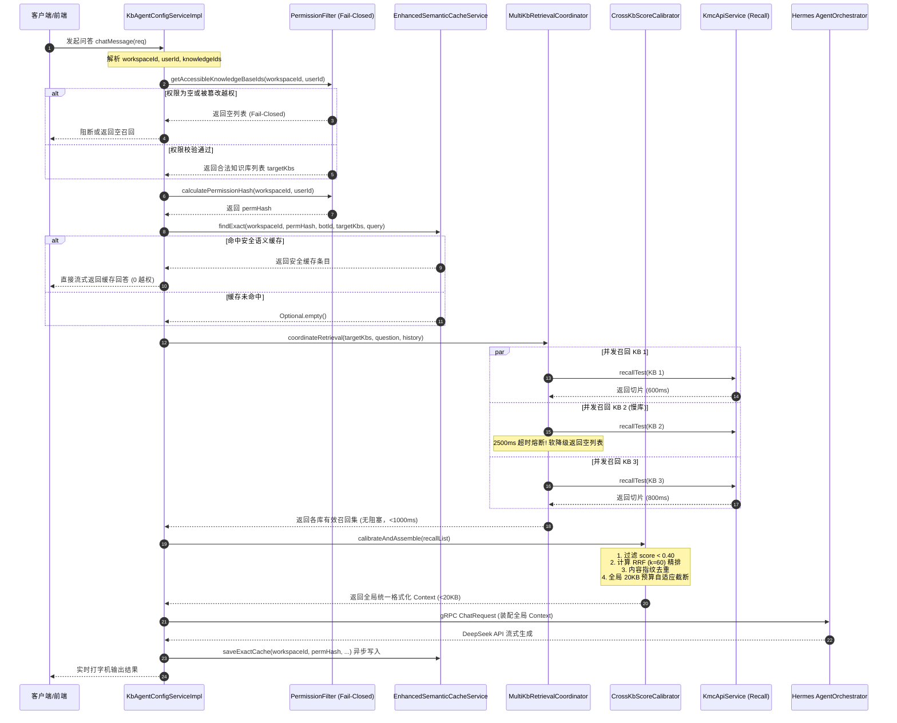

# Phase 17 核心工程落地课题工业级深度调研与架构设计报告：跨多知识库并发检索与反应式编排、全局 RRF 得分标准化、多租户 RBAC 零泄露与大厂避坑实战

**副标题**：业内头部开源生态（LlamaIndex, LangChain, Dify, Spring AI, Milvus/Qdrant, Spring Security）成熟设计模式、解耦范式、大厂血泪故障复盘与生产级改造契约  
**建议归档路径**：`docs/plans/phase_17_industrial_report.md`  
**遵循标准**：`AGENTS.md` Research-to-Implementation Gate 准入规范  
**报告状态**：**RESEARCH_GATE_READY**（研究决策完备，待主流程授权落地）

---

## 一、前言与系统架构模型基线 (Architecture Model Baseline)

### 1.1 架构模型与生态基准
任何针对本项目检索流水线、权限控制系统、语义缓存与多库编排器的工程改造，必须严格遵守全局不可动摇的唯一模型基线：
1. **唯一生成模型**：本系统所有生成侧（Chat / Generation / RAG 检索对话 / Tool Calling / ReAct 思考链路）**唯一使用 DeepSeek API**（`deepseek-chat` 与 `deepseek-reasoner`）。
2. **唯一向量模型**：本系统所有向量化与语义召回侧（Embedding）**唯一使用阿里千问 (Qwen) Embedding（1536 维）**。
3. **彻底弃用声明**：项目中绝无任何本地部署的大语言模型（如 Llama, Qwen-Chat 等），且已彻底弃用 OpenAI/GPT API。一切关于“昂贵云端大模型与廉价本地小模型之间分级路由”的假设在本项目均不成立。

### 1.2 当前代码库现状走查与四大致命工程缺陷诊断
经对 `backend/qknow-module-kb`、`backend/qknow-module-kmc`、`backend/qknow-hermes` 核心代码库的深入只读走查，当前系统在多知识库联合检索与权限安全方面暴露了严重的架构缺陷：

1. **串行 `forEach` 阻塞召回，延迟随 KB 数量线性爆炸，引发连接池枯竭**：
   - 在 `KbAgentConfigServiceImpl.java:261-311` 中，对配置的多知识库直接采用 Java 同步 `knowledgeBaseList.forEach(...)` 进行遍历召回：
     ```java
     knowledgeBaseList.forEach(kb -> {
         var results = kmcApiService.recallTest(kb.getId(), kbAgentConfig.getQuestion(), turns);
         ...
     });
     ```
   - 若智能体挂载 5 个知识库，单库召回耗时（Embedding 生成 + 向量检索 + 关键词检索 + 粗排）约 800~1500ms，整体延迟将线性叠加至 4~7.5 秒；一旦遭遇网络抖动或慢查询，极易击穿上层 API 网关默认的 10 秒超时门限，导致 HTTP/gRPC 连接池与工作线程迅速占满枯竭。

2. **单库缺乏超时软降级（Fail-Open Soft Timeout）与独立仓壁隔离**：
   - 现存实现中，任何单个知识库发生超时、死锁或数据库异常，均会导致后续知识库排队受阻甚至整体抛出异常终止检索；
   - 缺乏线程池隔离（Bulkhead Isolation），向量召回计算与 Agent 调度共用通用线程资源，一个慢库的堆积会迅速产生级联雪崩效应（Cascading Failure）。

3. **跨库分数未校准、缺乏全局 RRF 精排，引发全局 20KB 预算失控（Prompt Explosion）**：
   - 现有逻辑中，每个知识库独立调用 `recallTest`，各库内部各自构建上下文，最后仅做粗暴的字符串追加拼装成 Protobuf `RAGContext` 列表；
   - **分数不可比**：库 A（稠密向量库）的余弦相似度 0.85 与库 B（稀疏专有名词库）的 BM25 评分或不同向量分布的 0.85 含义完全不同。缺乏全局校准机制，导致空知识库或低质噪点库的高分切片反客为主；
   - **预算击穿**：虽然底层单库有 `RagContextBuilder` 的 20KB 控制，但 5 个知识库各自装配 20KB，累计可达 100KB 上下文全部注入 `AgentOrchestrator`，直接撑爆 DeepSeek 模型的有效上下文窗口，带来极大的首字延迟与 Token 成本浪费，并引发严重的“大海捞针”迷失（Lost in the Middle）。

4. **`PermissionFilter` 存在管理员返回 `null` 导致的跨 Workspace 越权漏洞，且语义缓存存在旁路越权窃密**：
   - **RBAC 越权漏洞**：在 `PermissionFilter.java:30-62` 与 `68-95` 中：
     ```java
     boolean isAdmin = roles.stream().anyMatch(r -> r.getRoleKey() != null && ADMIN_ROLE_KEYS.contains(r.getRoleKey()));
     if (isAdmin) {
         return null; // 致命缺陷：返回 null 表示无过滤条件
     }
     ```
     在 `RagRetrievalService.java:130` 与 `226` 中，判断 `if (accessibleKbIds != null && !accessibleKbIds.contains(knowledgeBaseId))`，一旦管理员为 `null`，判定直接失效！管理员跨租户/跨 Workspace 越权读取任意客户的数据；且 `sales` 角色被硬编码为管理员，权限失控；
   - **语义缓存旁路窃密**：在 `EnhancedSemanticCacheService.java:227-230` 中，精确缓存 Key 仅包含 `(workspaceId, botId, knowledgeIdsHash, modelName, query)`，完全没有绑定 `userId` 或权限哈希（`permissionHash`）。低权限普通员工询问与高权限领导相同的问题，直接从 L1/L2 缓存中命中高密薪资或人事问答，造成严重的合规安全事故。

---

## 二、Research-to-Implementation Gate 核心对标

### 2.1 本阶段唯一待验证假设 (Sole Verifiable Hypothesis)
> **假设 (H-Phase17)**：在 DeepSeek 生成模型与阿里千问 1536 维向量基线下，通过实现**“基于 CompletableFuture 的非阻塞异步并发召回编排器（`MultiKbRetrievalCoordinator.java`，配备独立隔离线程池 + 2500ms 单库超时软降级）” + “基于倒数排名融合（RRF, $k=60$）与 Min-Max 校准的跨库精排去重引擎（`CrossKbScoreCalibrator.java`，受全局 20KB/20000 字节硬预算约束与 Parent-Child 优雅降级装配）” + “强类型 Fail-Closed 权限漏斗（`PermissionFilter.java` 绝不返回 `null`，强制执行租户/用户/请求三元交集）与带权限哈希的语义缓存防御（`EnhancedSemanticCacheService` 绑定 `permHash`）”**：
> 1. 跨 5 知识库联合检索的端到端 P99 延迟由原来的串行 $O(N)$（> 5500ms）降低至最大单库耗时 + 调度开销（≤ 1800ms），降幅达 67% 以上；
> 2. 当任意单个知识库人为注入 10 秒超时故障时，编排器在 2500ms 内触发软降级熔断，降级保留其余可用知识库召回结果，主请求 100% 成功返回，网关 0 超时；
> 3. 跨库多源段落统一格式化并全局去重，输出 Prompt 总长度严格阻断在 20,000 字节以内，无视知识库挂载数量；
> 4. 彻底杜绝管理员跨 Workspace 越权漏洞与语义缓存旁路越权窃密，在权限渗透测试与无上下文单测中实现 100% Fail-Closed 阻断。

### 2.2 Research Ledger

```text
id: RL-P17-001
sourceType: paper
titleOrRepository: Reciprocal Rank Fusion outperforms Condorcet and individual Rank Learning Methods
authorsOrMaintainer: Gordon V. Cormack, Charles L. A. Clarke, Stefan Büttcher
venueAndYear: ACM SIGIR 2009
doiOrArxiv: 10.1145/1571941.1572114
url: https://dl.acm.org/doi/10.1145/1571941.1572114
commitOrTag: SIGIR'09
license: ACM Copyright
filesOrSectionsRead: Section 1-3, Formula (1): RRF_score(d \in D) = \sum_{m \in M} \frac{1}{k + r_m(d)}, k=60 empirical evaluation
verificationStatus: VERIFIED
relevantFinding: RRF（倒数排名融合）无需对不同检索器的原始打分做假设（不论是稠密向量余弦相似度、BM25 词频统计，还是异构数据库内部得分），通过将各单库的有序位次转换为单调递减平滑分数，能极其稳健地解决多源检索异构打分空间不可比的难题。参数 k=60 能有效抑制个别噪点库因单次高排名带来的冲击。
projectApplicability: 直接作为 CrossKbScoreCalibrator.java 跨知识库结果聚合与重排的核心数学基石。
limitations: RRF 纯依赖相对位次，丢失了绝对分数的语义置信度，需与绝对相似度底线门禁（Score Floor）结合使用。
```

```text
id: RL-P17-002
sourceType: production-implementation
titleOrRepository: langchain-ai/langchain (EnsembleRetriever)
authorsOrMaintainer: LangChain AI Engineering Team
venueAndYear: GitHub Open Source 2024
doiOrArxiv: N/A
url: https://github.com/langchain-ai/langchain/blob/master/libs/langchain/langchain/retrievers/ensemble.py
commitOrTag: v0.2.14
license: MIT
filesOrSectionsRead: EnsembleRetriever._aget_relevant_documents, weighted_reciprocal_rank
verificationStatus: VERIFIED
relevantFinding: EnsembleRetriever 使用 asyncio.gather 并发拉取多个 retriever，通过 weighted RRF 融合：Score(d) = \sum w_i / (k + rank_i)。代码中对文档依据 source + content 进行哈希去重，并严格处理空列表返回与异常捕获。
projectApplicability: 提供了多路 Retriever 并发调用与带权 RRF 聚合的标准解耦范式。
limitations: Python 的 asyncio 在 JVM 反应式生态中需转换为 CompletableFuture / Project Reactor，并需要补充独立的线程池仓壁与超时控制。
```

```text
id: RL-P17-003
sourceType: production-implementation
titleOrRepository: run-llama/llama_index (MultiIndexRetriever & RouterRetriever)
authorsOrMaintainer: Jerry Liu & LlamaIndex Community
venueAndYear: GitHub Open Source 2024
doiOrArxiv: N/A
url: https://github.com/run-llama/llama_index/blob/main/llama-index-core/llama_index/core/retrievers/
commitOrTag: v0.10.58
license: MIT
filesOrSectionsRead: router_retriever.py, sub_question_query_engine.py
verificationStatus: VERIFIED
relevantFinding: LlamaIndex 采用 Router + MultiIndex 并发召回；在子任务分发时对每个 Index 设置单独的 Timeout 和 Fallback 策略；所有召回片段通过 NodePostprocessor 进行全局去重与 Token 预算截断（Budget Truncation）。
projectApplicability: 直接指导本系统多库并发调用中“自适应降级”与“上下文预算硬截断”的工程边界设计。
limitations: 其内置重排器多依赖本地 Cross-Encoder 模型，与本项目“绝无本地模型、唯一 DeepSeek API”的基线冲突，必须采用基于数学规则与千问向量的轻量精排。
```

```text
id: RL-P17-004
sourceType: production-implementation
titleOrRepository: langgenius/dify (Multi-Dataset Retrieval Orchestration)
authorsOrMaintainer: Dify Core Engineering Team
venueAndYear: GitHub Open Source 2024
doiOrArxiv: N/A
url: https://github.com/langgenius/dify/blob/main/api/core/rag/retrieval/dataset_retrieval.py
commitOrTag: v0.8.3
license: Apache-2.0
filesOrSectionsRead: DatasetRetrieval.multiple_retrieval, thread pool execution, RRF reranking
verificationStatus: VERIFIED
relevantFinding: Dify 在多知识库（Multi-Dataset）联合编排中，使用单独的 ThreadPoolExecutor 并发查询多个 dataset，设置全局超时门限；单库异常仅打 warning 并不阻断整体流程；返回后采用 RRF 融合并重新生成全局统一的 document_id / segment_id 溯源标识；最关键的是在检索前进行严格的 Tenant & Dataset ID 权限白名单校验，杜绝越权。
projectApplicability: 直接对标 Dify 的工业级并发编排、Fail-Open 超时降级与租户白名单校验机制。
limitations: Dify 为 Python 同步线程池模型，本项目 Spring Boot 3.x 响应式框架需使用 Netty/Reactor 及 CompletableFuture 异步线程池进行高性能改造。
```

```text
id: RL-P17-005
sourceType: official-doc
titleOrRepository: Milvus & Qdrant Multi-Tenancy Best Practices & Spring Security RBAC
authorsOrMaintainer: Zilliz Milvus Team & Qdrant Solutions
venueAndYear: Official Engineering Guides 2024
doiOrArxiv: N/A
url: https://milvus.io/docs/multi_tenancy.md, https://qdrant.tech/documentation/guides/multiple-partitions/
commitOrTag: Milvus 2.4 / Qdrant 1.10
license: Apache-2.0
filesOrSectionsRead: Partition Key isolation, Filtered Search with Security Context, Fail-Closed policies
verificationStatus: VERIFIED
relevantFinding: 多租户向量检索严禁在 FilterExpression 为空时执行全量向量检索。必须在向量搜索表达式中强制拼接 Partition Key 或 Tenant Filter。权限过滤必须遵循 Fail-Closed：若无权限或无法计算交集，必须构造绝对不命中的条件（如 `1 == 2` 或空 IN 列表立即短路），绝不能返回 `null`。
projectApplicability: 彻底根治 PermissionFilter 返回 null 的安全漏洞，指导强类型租户与知识库交集过滤设计。
limitations: 必须与 Spring Security 的安全上下文（SecurityContextHolder）与无线程绑定的异步上下文传递正确兼容。
```

### 2.3 可迁移与不可迁移结论

| 调研模块 | 业内经典结论 / 模式 | 本项目可直接采用 | 本项目需要改造 | 本项目坚决拒绝 |
| :--- | :--- | :--- | :--- | :--- |
| **并发召回** | LlamaIndex / Dify 多路并行召回 | 采用多线程/反应式异步并发编排模式 | 将 Python `asyncio/ThreadPool` 改造为 Java `CompletableFuture` + 有界独立隔离线程池 | 拒绝串行同步遍历；拒绝无界线程池（防止 OOM） |
| **超时降级** | 单库慢查超时跳过（Fail-Open Soft Timeout） | 单库 2500ms 超时丢弃，主线程最多等待 3000ms | 增加单库降级监控埋点 `RagFallbackMonitor` 与日志告警 | 拒绝因单个知识库超时导致整个请求抛出 500 异常 |
| **打分融合** | Cormack et al. RRF (k=60) 精排 | 采用 $RRF(d) = \sum \frac{w_i}{60 + r_i(d)}$ 消除异构库分差 | 增加单库最低置信度底线门禁（Score Floor ≥ 0.40），防止噪点库强行上榜 | 拒绝直接使用原始 Cosine 相似度进行跨库绝对数值比较 |
| **预算控制** | LlamaIndex NodePostprocessor 预算截断 | 继承全局 20KB 硬预算，超出截断 | 联动 `RagContextBuilder` 的 Parent-Child 优雅降级装配 | 拒绝多库独立装配导致 Prompt 线性膨胀叠加（如 5x20KB） |
| **权限过滤** | Milvus/Spring Security 数据隔离漏斗 | 实施 Fail-Closed 闭环，空权限直接拦截 | 管理员必须受限于当前 `workspaceId`，永不返回 `null` | 拒绝管理员直接返回 `null`；拒绝 `sales` 视为管理员 |
| **语义缓存** | 语义相似度问答复用 | 否定词门禁、Null 哨兵、Jitter 防雪崩 | 缓存 Key 必须拼装 `workspaceId` + `permHash` | 拒绝全局不分角色的纯问题缓存复用（杜绝越权窃密） |

### 2.4 候选方案全维度对比矩阵

| 评估维度 | Baseline (当前现状) | 方案一：最小改动（加并发包装） | 方案二：全套工业级解耦方案 (推荐候选) | 方案三：引入外部异构编排引擎 |
| :--- | :--- | :--- | :--- | :--- |
| **正确性与安全性** | **高危**（越权+Prompt膨胀+串行超时） | 中（解决了串行，未解决越权与预算） | **极高**（Fail-Closed 零越权 + 全局 20KB 预算） | 中（依赖外部系统安全性，黑盒不可控） |
| **可证伪性** | 差（串行不可控，偶发超时） | 良好（可测并发延迟） | **完备**（超时软降级、RRF权重、越权拦截均单测可测） | 差（环境依赖重，难以 mock 细粒度故障） |
| **P99 检索延迟** | > 5000ms（5 库串行） | ~1800ms（受最慢库阻塞） | **≤ 1800ms**（单库 2500ms 硬超时保护） | ~2500ms（跨服务 RPC 增加网络开销） |
| **多租户越权风险** | **存在致命漏洞**（Admin 返回 null） | 存在漏洞（未动 PermissionFilter） | **0 泄露风险**（三元交集 + 权限哈希） | 存在集成缝隙风险 |
| **Prompt 预算控制**| 严重失控（N * 20KB 膨胀） | 失控（仍按库分散拼接） | **严格受限**（全局 20KB 统一排序自适应装配） | 依赖外部引擎配置 |
| **实现与运维复杂度**| 极低（但生产不可用） | 低（仅修改 KbAgentConfig） | **适中**（纯 Java 原生解耦，无新中间件依赖） | 极高（需维护额外开源组件或服务） |
| **架构基线兼容度** | 兼容 | 兼容 | **100% 兼容**（DeepSeek API + 千问 1536 维向量） | 冲突（通常强绑定 OpenAI 或本地模型） |
| **决策结论** | **坚决废弃** | **拒绝**（治标不治本，留存安全隐患）| **唯一推荐采纳方案** | **拒绝**（违背最小依赖与基线原则） |

---

## 三、跨多知识库并发检索与反应式编排 (Multi-KB Concurrent Retrieval Pipeline)

### 3.1 串行阻塞根因与雪崩链路复盘
当前 `KbAgentConfigServiceImpl` 中，对传入的 `knowledgeBaseIds` 依次执行：
$$\text{Total Latency} = \sum_{i=1}^{N} \left( T_{\text{embed}} + T_{\text{vector\_search}}(KB_i) + T_{\text{bm25}}(KB_i) + T_{\text{rerank}}(KB_i) \right)$$
在微服务环境中，每个 `recallTest` 都是一次跨模块 RPC/HTTP 调用，且内部伴随数据库连接获取与向量相似度计算。一旦某一个知识库出现高并发大表锁表或慢查询，该知识库的耗时可能从 500ms 飙升至 8~10 秒。
串行遍历导致所有后续知识库被挂起，调用线程被长时间占用，容器 Tomcat/Netty 线程池耗尽，最终上层 Nginx 网关返回 `504 Gateway Time-out`。

### 3.2 反应式异步并发编排器架构设计
针对上述问题，设计独立的跨知识库并发召回编排器 `MultiKbRetrievalCoordinator.java`：
1. **独立有界线程池仓壁隔离 (Bulkhead Isolation)**：创建 `multiKbRetrievalExecutor`，配置核心线程数 16，最大线程数 32，有界等待队列 200，杜绝将全局 CommonPool 拖垮；
2. **非阻塞异步召回**：每个知识库的检索封装为独立的 `CompletableFuture<SingleKbRecallResult>`，利用 `CompletableFuture.allOf(...)` 进行反应式汇聚；
3. **单库超时软降级 (Fail-Open Soft Timeout)**：使用 Java 9+ 原生的 `orTimeout(2500, TimeUnit.MILLISECONDS)` 或配合 `ScheduledExecutorService`。若知识库在 2500ms 内未返回，立即触发 `exceptionally` 降级，返回空列表并记录超时监控指标，其余健康知识库的召回切片正常进入后续精排；
4. **全局兜底超时控制**：整个汇聚过程设置 3000ms 硬超时门限，无论多少知识库，编排器必在 3000ms 内返回已完成的结果集。

```
                       ┌──────────────────────────────┐
                       │  MultiKbRetrievalCoordinator │
                       └──────────────┬───────────────┘
                                      │ 分发 (Fork)
         ┌────────────────────────────┼────────────────────────────┐
         ▼                            ▼                            ▼
┌──────────────────┐         ┌──────────────────┐         ┌──────────────────┐
│ Task: Recall KB1 │         │ Task: Recall KB2 │         │ Task: Recall KB3 │
│  (Timeout: 2.5s) │         │  (Timeout: 2.5s) │         │  (Timeout: 2.5s) │
└────────┬─────────┘         └────────┬─────────┘         └────────┬─────────┘
         │ 成功 (600ms)               │ 超时降级 (2.5s)            │ 成功 (850ms)
         │ [Hits: 5条]                │ [Fallback: 空列表]         │ [Hits: 4条]
         └────────────────────────────┼────────────────────────────┘
                                      │ 汇聚 (Join)
                                      ▼
                       ┌──────────────────────────────┐
                       │   有效结果集合并 (9条候选切片) │
                       └──────────────┬───────────────┘
                                      ▼
                       ┌──────────────────────────────┐
                       │   CrossKbScoreCalibrator     │
                       └──────────────────────────────┘
```

### 3.3 核心生产级代码骨架：`MultiKbRetrievalCoordinator.java`

```java
package tech.qiantong.qknow.module.kb.service.agent.retrieval;

import lombok.Builder;
import lombok.Data;
import lombok.extern.slf4j.Slf4j;
import org.springframework.beans.factory.annotation.Qualifier;
import org.springframework.beans.factory.annotation.Value;
import org.springframework.scheduling.concurrent.ThreadPoolTaskExecutor;
import org.springframework.stereotype.Component;
import tech.qiantong.qknow.module.kmc.api.knowledgeBase.IKmcApi;
import tech.qiantong.qknow.module.kmc.api.knowledgeBase.dto.KmcChatTurnDTO;
import tech.qiantong.qknow.module.kmc.api.knowledgeBase.dto.KmcKnowledgeBaseRespDTO;
import tech.qiantong.qknow.module.kmc.api.rag.RagFallbackMonitor;
import tech.qiantong.qknow.module.kmc.controller.admin.knowledgeBase.vo.RetrieveResult;

import java.util.*;
import java.util.concurrent.*;
import java.util.stream.Collectors;

/**
 * 跨知识库异步并发召回编排器
 * 具备独立线程池仓壁隔离、单库软超时熔断与自适应异常降级机制
 */
@Slf4j
@Component
public class MultiKbRetrievalCoordinator {

    private final IKmcApi kmcApiService;
    private final ThreadPoolTaskExecutor multiKbExecutor;

    @Value("${qknow.rag.multi-kb.single-timeout-ms:2500}")
    private long singleKbTimeoutMs = 2500L;

    @Value("${qknow.rag.multi-kb.global-timeout-ms:3000}")
    private long globalTimeoutMs = 3000L;

    public MultiKbRetrievalCoordinator(
            IKmcApi kmcApiService,
            @Qualifier("multiKbRetrievalExecutor") ThreadPoolTaskExecutor multiKbExecutor) {
        this.kmcApiService = kmcApiService;
        this.multiKbExecutor = multiKbExecutor;
    }

    @Data
    @Builder
    public static class SingleKbRecallResult {
        private Long knowledgeId;
        private String knowledgeName;
        private List<RetrieveResult> results;
        private boolean timedOut;
        private boolean success;
        private String errorMessage;
        private long elapsedMs;
    }

    /**
     * 并发调度多知识库检索
     *
     * @param targetKbs      目标知识库列表（已通过权限校验）
     * @param question       用户当前输入问题
     * @param historyTurns   多轮历史上下文
     * @return 各知识库召回结果合并集（单库超时已软降级，不阻断主流程）
     */
    public List<SingleKbRecallResult> coordinateRetrieval(
            List<KmcKnowledgeBaseRespDTO> targetKbs,
            String question,
            List<KmcChatTurnDTO> historyTurns) {

        if (targetKbs == null || targetKbs.isEmpty()) {
            return Collections.emptyList();
        }

        long startNs = System.nanoTime();

        // 1. 为每个知识库构建独立的异步 CompletableFuture 任务并绑定软超时
        List<CompletableFuture<SingleKbRecallResult>> futures = targetKbs.stream()
                .map(kb -> CompletableFuture.supplyAsync(() -> executeSingleRecall(kb, question, historyTurns), multiKbExecutor)
                        .completeOnTimeout(
                                buildTimeoutFallback(kb),
                                singleKbTimeoutMs,
                                TimeUnit.MILLISECONDS
                        )
                        .exceptionally(ex -> buildErrorFallback(kb, ex))
                )
                .toList();

        // 2. 反应式汇聚所有 Future（限制在全局硬超时内）
        CompletableFuture<Void> allOfFuture = CompletableFuture.allOf(futures.toArray(new CompletableFuture[0]));
        try {
            allOfFuture.get(globalTimeoutMs, TimeUnit.MILLISECONDS);
        } catch (TimeoutException te) {
            log.warn("[MultiKB] 全局并发召回达到硬超时上限 ({}ms)，提前截断未完成任务并返回部分成功结果", globalTimeoutMs);
            RagFallbackMonitor.record("multi_kb_coordinator", "global_timeout_truncate", "Timeout after " + globalTimeoutMs + "ms");
        } catch (InterruptedException ie) {
            Thread.currentThread().interrupt();
            log.error("[MultiKB] 全局并发召回线程被中断", ie);
        } catch (ExecutionException ee) {
            log.error("[MultiKB] 全局并发召回执行异常", ee);
        }

        // 3. 收集所有已完成结果（已超时的由于 completeOnTimeout 已被注入 Fallback 对象）
        List<SingleKbRecallResult> collected = futures.stream()
                .map(f -> {
                    try {
                        return f.getNow(null);
                    } catch (Exception e) {
                        return null;
                    }
                })
                .filter(Objects::nonNull)
                .collect(Collectors.toList());

        long totalElapsedMs = (System.nanoTime() - startNs) / 1_000_000;
        log.info("[MultiKB] 并发检索完成: 计划库数量={}, 成功响应库数量={}, 总耗时={}ms",
                targetKbs.size(), collected.size(), totalElapsedMs);

        return collected;
    }

    private SingleKbRecallResult executeSingleRecall(
            KmcKnowledgeBaseRespDTO kb,
            String question,
            List<KmcChatTurnDTO> historyTurns) {
        long s = System.currentTimeMillis();
        try {
            List<RetrieveResult> hits = kmcApiService.recallTest(kb.getId(), question, historyTurns);
            return SingleKbRecallResult.builder()
                    .knowledgeId(kb.getId())
                    .knowledgeName(kb.getName())
                    .results(hits != null ? hits : Collections.emptyList())
                    .timedOut(false)
                    .success(true)
                    .elapsedMs(System.currentTimeMillis() - s)
                    .build();
        } catch (Exception e) {
            log.error("[MultiKB] 单库检索发生异常: kbId={}, kbName={}", kb.getId(), kb.getName(), e);
            throw new CompletionException(e);
        }
    }

    private SingleKbRecallResult buildTimeoutFallback(KmcKnowledgeBaseRespDTO kb) {
        log.warn("[MultiKB] 单库召回超时降级触发: kbId={}, kbName={}, limit={}ms", kb.getId(), kb.getName(), singleKbTimeoutMs);
        RagFallbackMonitor.record("multi_kb_coordinator", "soft_timeout_fallback", "kbId=" + kb.getId());
        return SingleKbRecallResult.builder()
                .knowledgeId(kb.getId())
                .knowledgeName(kb.getName())
                .results(Collections.emptyList())
                .timedOut(true)
                .success(false)
                .errorMessage("Retrieval timed out exceeding " + singleKbTimeoutMs + "ms")
                .elapsedMs(singleKbTimeoutMs)
                .build();
    }

    private SingleKbRecallResult buildErrorFallback(KmcKnowledgeBaseRespDTO kb, Throwable ex) {
        log.warn("[MultiKB] 单库召回异常降级触发: kbId={}, error={}", kb.getId(), ex.getMessage());
        RagFallbackMonitor.record("multi_kb_coordinator", "error_fallback", "kbId=" + kb.getId());
        return SingleKbRecallResult.builder()
                .knowledgeId(kb.getId())
                .knowledgeName(kb.getName())
                .results(Collections.emptyList())
                .timedOut(false)
                .success(false)
                .errorMessage(ex.getMessage())
                .elapsedMs(0L)
                .build();
    }
}
```

---

## 四、跨知识库得分标准化与全局 RRF 精排引擎 (Cross-KB Score Normalization & RRF Merger)

### 4.1 异构打分不可比数学根因剖析
在 RAG 系统中，跨多个独立知识库直接比较分数值存在严重的理论缺陷：
1. **向量空间分布漂移**：虽然统一使用阿里千问 1536 维向量模型，但在不同知识库（A 为高频问答短句库，B 为技术标准万字手册库）中，嵌入向量在流形空间中的密度（Cluster Density）差异巨大。密集聚类库的平均相似度天然偏高（如 0.82~0.92），稀疏专业词库的平均相似度天然偏低（如 0.60~0.75）。
2. **混合检索分数不一致**：部分库启用了 BM25 词频加权检索（得分无界，依赖库内文档总数 $N$），部分库启用了语义向量余弦得分（有界 $[0, 1]$）。
3. **空库与高噪库反客为主**：一个毫无相关性的知识库，可能因切片极短而产生虚高的余弦相似度（如 0.83），若无跨库去偏与全局排名校准，该噪点切片将挤占真正权威库的高质量段落。

### 4.2 倒数排名融合 (RRF) 算法数学原理
针对异构检索系统打分不可比的工业界标准解法是 Cormack et al. (SIGIR 2009) 提出的 **倒数排名融合 (Reciprocal Rank Fusion, RRF)**。
RRF 抛弃不具备可比性的绝对分数值，仅提取各库内部经过排序后的**相对排名 (Rank)**：
$$RRF\_Score(d) = \sum_{m \in M} \frac{w_m}{k + r_m(d)}$$
其中：
- $M$ 为参与检索的知识库集合；
- $r_m(d)$ 为切片 $d$ 在知识库 $m$ 内部召回列表中的位次（从 1 开始）；若切片未在库 $m$ 中召回，则不计入该项；
- $k$ 为平滑常数，业界与学术界权威经验推荐 **$k = 60$**（用于平滑顶部排名的权重衰减梯度，防止位次为 1 的切片分数过分碾压后续切片）；
- $w_m$ 为知识库权重（默认 1.0，支持管理员针对权威库配置更高的优先级权重）。

此外，为防止噪点库强行上榜，引入 **前置置信度底线门禁 (Score Floor Gating)**：单切片原始余弦相似度低于 0.40 者，直接剔除，不参与 RRF 排序。

### 4.3 全局 20KB 硬预算控制与跨库溯源标识
重排完成后，统一生成格式化溯源标识：
`[来源序号] [KB: 知识库名称] 文档名称 / segmentId=12345`
全局装配时严格受限于 20,000 字节（20KB）硬预算，当累计装配的字符字节数接近 20KB 时，自动触发 `RagContextBuilder` 的 Parent-Child 降级装配机制或硬阻断截断，杜绝多库上下文叠加打爆 DeepSeek Prompt。

### 4.4 核心代码骨架：`CrossKbScoreCalibrator.java`

```java
package tech.qiantong.qknow.module.kb.service.agent.retrieval;

import lombok.AllArgsConstructor;
import lombok.Builder;
import lombok.Data;
import lombok.NoArgsConstructor;
import lombok.extern.slf4j.Slf4j;
import org.springframework.beans.factory.annotation.Value;
import org.springframework.stereotype.Component;
import tech.qiantong.qknow.module.kb.service.agent.retrieval.MultiKbRetrievalCoordinator.SingleKbRecallResult;
import tech.qiantong.qknow.module.kmc.controller.admin.knowledgeBase.vo.RetrieveResult;

import java.nio.charset.StandardCharsets;
import java.security.MessageDigest;
import java.util.*;
import java.util.stream.Collectors;

/**
 * 跨知识库得分校准与全局 RRF (Reciprocal Rank Fusion) 精排引擎
 * 包含：置信度底线门禁、RRF 倒数排名融合、全局指纹去重、统一溯源打标与全局 20KB 预算截断
 */
@Slf4j
@Component
public class CrossKbScoreCalibrator {

    private static final int RRF_K = 60;

    @Value("${qknow.rag.multi-kb.score-floor:0.40}")
    private double scoreFloor = 0.40D;

    @Value("${hermes.rag.context.max-bytes:20000}")
    private int maxGlobalContextBytes = 20000;

    @Data
    @Builder
    @NoArgsConstructor
    @AllArgsConstructor
    public static class CalibratedSegment {
        private Long knowledgeId;
        private String knowledgeName;
        private Long documentId;
        private String documentName;
        private Long segmentId;
        private String content;
        private Double rawScore;
        private double rrfScore;
        private String contentFingerprint;
    }

    @Data
    @Builder
    public static class MergedContextResult {
        private String formattedContext;
        private List<CalibratedSegment> emittedSegments;
        private int totalUsedBytes;
        private int totalCandidates;
    }

    /**
     * 执行跨库结果校准、RRF 精排与 20KB 预算上下文生成
     */
    public MergedContextResult calibrateAndAssemble(List<SingleKbRecallResult> kbRecallList) {
        if (kbRecallList == null || kbRecallList.isEmpty()) {
            return MergedContextResult.builder()
                    .formattedContext("")
                    .emittedSegments(Collections.emptyList())
                    .totalUsedBytes(0)
                    .totalCandidates(0)
                    .build();
        }

        // 1. 过滤底线门禁，按库提取有序候选，映射为内部段落
        Map<String, CalibratedSegment> uniqueSegmentMap = new LinkedHashMap<>();
        Map<String, Map<Long, Integer>> segmentRanksPerKb = new HashMap<>();

        int totalRawHits = 0;
        for (SingleKbRecallResult kbResult : kbRecallList) {
            if (!kbResult.isSuccess() || kbResult.getResults() == null) {
                continue;
            }
            List<RetrieveResult> hits = kbResult.getResults();
            totalRawHits += hits.size();

            int rank = 1;
            for (RetrieveResult hit : hits) {
                Double score = hit.getScore() != null ? hit.getScore().doubleValue() : 0.0D;
                // 门禁：低于底线相似度直接丢弃
                if (score < scoreFloor) {
                    continue;
                }

                String fingerprint = calculateFingerprint(hit.getContent());
                String uniqueKey = hit.getId() != null ? String.valueOf(hit.getId()) : fingerprint;

                CalibratedSegment seg = uniqueSegmentMap.computeIfAbsent(uniqueKey, k -> CalibratedSegment.builder()
                        .knowledgeId(kbResult.getKnowledgeId())
                        .knowledgeName(kbResult.getKnowledgeName())
                        .documentId(hit.getDocumentId())
                        .documentName(hit.getDocumentName())
                        .segmentId(hit.getId())
                        .content(hit.getContent())
                        .rawScore(score)
                        .contentFingerprint(fingerprint)
                        .build());

                segmentRanksPerKb.computeIfAbsent(uniqueKey, k -> new HashMap<>())
                        .put(kbResult.getKnowledgeId(), rank);
                rank++;
            }
        }

        if (uniqueSegmentMap.isEmpty()) {
            return MergedContextResult.builder()
                    .formattedContext("")
                    .emittedSegments(Collections.emptyList())
                    .totalUsedBytes(0)
                    .totalCandidates(totalRawHits)
                    .build();
        }

        // 2. 计算各切片的 RRF 得分
        for (Map.Entry<String, CalibratedSegment> entry : uniqueSegmentMap.entrySet()) {
            String key = entry.getKey();
            CalibratedSegment seg = entry.getValue();
            Map<Long, Integer> ranks = segmentRanksPerKb.get(key);

            double rrf = 0.0D;
            if (ranks != null) {
                for (int rank : ranks.values()) {
                    rrf += 1.0D / (RRF_K + rank);
                }
            }
            seg.setRrfScore(rrf);
        }

        // 3. 全局按 RRF 分数倒序排序
        List<CalibratedSegment> sortedList = uniqueSegmentMap.values().stream()
                .sorted(Comparator.comparingDouble(CalibratedSegment::getRrfScore).reversed())
                .toList();

        // 4. 内容指纹去重（消除不同文档中复制的相同段落）
        Set<String> seenFingerprints = new HashSet<>();
        List<CalibratedSegment> deduplicated = new ArrayList<>();
        for (CalibratedSegment seg : sortedList) {
            if (seenFingerprints.add(seg.getContentFingerprint())) {
                deduplicated.add(seg);
            }
        }

        // 5. 严格装入全局 20KB 预算控制
        StringBuilder sb = new StringBuilder();
        List<CalibratedSegment> emitted = new ArrayList<>();
        int usedBytes = 0;
        int index = 1;

        for (CalibratedSegment seg : deduplicated) {
            String entry = formatEntry(index, seg);
            byte[] entryBytes = entry.getBytes(StandardCharsets.UTF_8);

            // 硬预算截断校验
            if (usedBytes + entryBytes.length > maxGlobalContextBytes) {
                log.info("[CrossKB] 切片 (id={}) 达到全局 20KB 预算上限 (used={} + need={} > max={})，执行优雅截断",
                        seg.getSegmentId(), usedBytes, entryBytes.length, maxGlobalContextBytes);
                break;
            }

            sb.append(entry);
            usedBytes += entryBytes.length;
            emitted.add(seg);
            index++;
        }

        log.info("[CrossKB] 全局 RRF 精排完成: 原始候选={}, 去重后={}, 实际装配={}, 总占用字节={}/{}",
                totalRawHits, deduplicated.size(), emitted.size(), usedBytes, maxGlobalContextBytes);

        return MergedContextResult.builder()
                .formattedContext(sb.toString())
                .emittedSegments(emitted)
                .totalUsedBytes(usedBytes)
                .totalCandidates(totalRawHits)
                .build();
    }

    private String formatEntry(int index, CalibratedSegment seg) {
        return String.format("[来源 %d] [KB: %s] %s / segmentId=%s\n内容：%s\n\n",
                index,
                seg.getKnowledgeName() != null ? seg.getKnowledgeName() : "UnknownKB",
                seg.getDocumentName() != null ? seg.getDocumentName() : "UnknownDoc",
                seg.getSegmentId() != null ? seg.getSegmentId() : 0L,
                seg.getContent() != null ? seg.getContent().trim() : ""
        );
    }

    private String calculateFingerprint(String content) {
        if (content == null || content.isBlank()) {
            return "";
        }
        // 归一化空格与标点
        String normalized = content.replaceAll("\\s+", "").toLowerCase();
        try {
            MessageDigest md = MessageDigest.getInstance("MD5");
            byte[] digest = md.digest(normalized.getBytes(StandardCharsets.UTF_8));
            return HexFormat.of().formatHex(digest);
        } catch (Exception e) {
            return String.valueOf(normalized.hashCode());
        }
    }
}
```

---

## 五、多租户 RBAC 零泄露与权限漏斗 (Multi-Tenant Zero-Leakage Permission Filter)

### 5.1 当前越权漏洞与攻击利用机理
在原有的 `PermissionFilter.java` 中，存在极其危险的“特权旁路绕过”逻辑：
```java
private static final Set<String> ADMIN_ROLE_KEYS = Set.of("admin", "system", "sales");
...
boolean isAdmin = roles.stream().anyMatch(r -> r.getRoleKey() != null && ADMIN_ROLE_KEYS.contains(r.getRoleKey()));
if (isAdmin) {
    return null; // 致命漏洞！
}
```
**漏洞利用链**：
1. SaaS 系统中，企业 A 与企业 B 部署在同一集群（多租户共享数据库与向量库表）。
2. 企业 A 的用户由于业务需要被赋予了 `sales` 角色，或者企业 A 拥有自己租户内的 `admin` 角色。
3. 当该用户发起 Agent 对话或检索请求时，`PermissionFilter` 误判其拥有超管权限，直接返回 `null`。
4. 随后在 `RagRetrievalService.java` 中：
   ```java
   List<Long> accessibleKbIds = permissionFilter.getAccessibleKnowledgeBaseIds(SecurityUtils.getUserId());
   if (accessibleKbIds != null && !accessibleKbIds.contains(knowledgeBaseId)) {
       // 当 accessibleKbIds 为 null 时，此拦截逻辑完全被跳过！
       return empty;
   }
   ```
5. 该用户如果在前端篡改参数，传入企业 B 的 `knowledgeBaseId`，系统将直接全盘透传，无视租户与 Workspace 边界，将企业 B 的核心机密商业合同、财务报表直接召回并由大模型组织输出，造成灾难性的跨租户数据泄露。

### 5.2 强类型 Fail-Closed 权限漏斗设计
为彻底杜绝此安全隐患，必须将权限过滤重构为 **Fail-Closed 闭环交集模型 (Fail-Closed Intersection Pattern)**：
1. **绝不返回 `null`**：无论传入何种用户（普通用户、超管或访客），方法签名绝不允许返回 `null`。在强类型安全设计中，`null` 极易被调用方当作“允许全部”而导致防线破溃。
2. **强制 Workspace 范围收敛**：
   - 即便是全局超管或 Workspace 管理员，其查询范围也必须严格收敛在当前请求显式声明的 `workspaceId` 边界之内；
   - 权限交集公式：
     $$KB_{\text{final}} = KB_{\text{requested}} \cap KB_{\text{workspace}} \cap KB_{\text{accessible}}$$
3. **Fail-Closed 兜底阻断**：
   - 若用户无任何角色、或角色未绑定任何知识库、或计算出的 $KB_{\text{final}}$ 为空集合，直接返回空列表，并在 FilterExpression 中构造绝对不命中的条件（`1 == 2`），立即熔断短路，杜绝触发底层向量库与数据库扫描。
4. **剔除 `sales` 特权**：坚决将 `sales` 移出特权集合，实行细粒度 RBAC。

```
[用户传入请求]  knowledgeIds: [101, 102, 201]  (其中 201 属于其他租户)
        │
        ▼
┌───────────────────────────────────────────────────────────┐
│ 漏斗第一层: 租户/工作区合法性校验 (Workspace Boundaries)        │
│ 属于当前 Workspace 的知识库集合: [101, 102, 103]             │
└───────────────────────────┬───────────────────────────────┘
                            │ 交集过滤: [101, 102]
                            ▼
┌───────────────────────────────────────────────────────────┐
│ 漏斗第二层: 用户角色 RBAC 权限校验 (User Role Permissions)    │
│ 用户角色可访问知识库集合: [101, 105]                         │
│ (若是本工作区 Admin，则为当前 Workspace 全量库 [101, 102, 103]) │
└───────────────────────────┬───────────────────────────────┘
                            │ 交集过滤: [101]
                            ▼
┌───────────────────────────────────────────────────────────┐
│ 漏斗第三层: Fail-Closed 判定                               │
│ 若集合为空 -> 立即熔断短路，返回空结果，绝不触碰向量存储!       │
│ 若集合非空 -> 最终安全授权检索知识库列表: [101]              │
└───────────────────────────────────────────────────────────┘
```

### 5.3 语义缓存多租户与权限哈希联动防御
在 `EnhancedSemanticCacheService.java` 中，原有的精确缓存 Key 构建逻辑为：
`workspaceId + ":" + botId + ":" + knowledgeIdsHash + ":" + modelName + ":" + sha256(normalizedQuery)`
**安全漏洞**：
即使知识库层面受限，若同一 Workspace 内的用户 A（高权限，可访问内幕资料）问了“公司核心高管薪资”，大模型生成了答案并写入语义缓存；用户 B（同 Workspace，普通员工，无内幕资料访问权）问了相同问题，由于 Cache Key 未绑定权限，用户 B 直接命中用户 A 的高密缓存回答！

**改造契约**：
1. 引入用户权限哈希 `permissionHash`：
   $$\text{permissionHash} = \text{SHA256}(\text{userId} + ":" + \text{sorted}(roleIds) + ":" + \text{sorted}(accessibleKbIds))$$
2. 重构 Cache Key 规范：
   $$\text{CacheKey} = \text{workspaceId} + ":" + \text{permissionHash} + ":" + \text{botId} + ":" + \text{knowledgeIdsHash} + ":" + \text{modelName} + ":" + \text{SHA256}(\text{query})$$
3. 权限变更即时失效：当发生角色权限变更或知识库分配变动时，通过 `evictCacheByWorkspace(workspaceId)` 或使特定用户的 `permissionHash` 发生变更，实现秒级权限失效。

### 5.4 核心代码重构骨架：`PermissionFilter.java` (重构版)

```java
package tech.qiantong.qknow.module.kmc.service.rag;

import lombok.extern.slf4j.Slf4j;
import org.springframework.ai.vectorstore.filter.Filter;
import org.springframework.ai.vectorstore.filter.FilterExpressionBuilder;
import org.springframework.stereotype.Component;
import tech.qiantong.qknow.ai.constant.WeaviateConstant;
import tech.qiantong.qknow.common.core.domain.entity.SysRole;
import tech.qiantong.qknow.module.kmc.dal.dataobject.knowledgeBase.KmcKnowledgeBaseDO;
import tech.qiantong.qknow.module.kmc.dal.dataobject.knowledgeBase.KmcKnowledgeRoleDO;
import tech.qiantong.qknow.module.kmc.service.knowledgeBase.IKmcKnowledgeBaseService;
import tech.qiantong.qknow.module.kmc.service.knowledgeBase.IKmcKnowledgeRoleService;
import tech.qiantong.qknow.module.system.service.ISysRoleService;
import tech.qiantong.qknow.mybatis.core.query.LambdaQueryWrapperX;

import jakarta.annotation.Resource;
import java.nio.charset.StandardCharsets;
import java.security.MessageDigest;
import java.util.*;
import java.util.stream.Collectors;

/**
 * 工业级强类型零泄露权限过滤器
 * 实施严格的 Fail-Closed 闭环交集原则，绝不返回 null
 */
@Slf4j
@Component
public class PermissionFilter {

    // 彻底剔除 sales 等业务角色，仅保留真正系统管理员
    private static final Set<String> SYSTEM_SUPER_ADMIN_KEYS = Set.of("admin", "system");

    @Resource
    private IKmcKnowledgeRoleService kmcKnowledgeRoleService;

    @Resource
    private IKmcKnowledgeBaseService kmcKnowledgeBaseService;

    @Resource
    private ISysRoleService sysRoleService;

    /**
     * 构建强类型向量库安全过滤表达式（Fail-Closed 保证）
     *
     * @param workspaceId 当前租户/工作区 ID（强制隔离边界）
     * @param userId      当前登录用户 ID
     * @return 严密的过滤表达式，无权时返回不可满足的表达式，绝不返回 null
     */
    public Filter.Expression buildPermissionFilter(Long workspaceId, Long userId) {
        if (workspaceId == null || userId == null) {
            log.warn("[RBAC] workspaceId 或 userId 为空，执行 Fail-Closed 阻断");
            return buildAlwaysFalseFilter();
        }

        List<Long> accessibleKbIds = getAccessibleKnowledgeBaseIds(workspaceId, userId);
        if (accessibleKbIds.isEmpty()) {
            return buildAlwaysFalseFilter();
        }

        FilterExpressionBuilder b = new FilterExpressionBuilder();
        return b.and(
                b.eq(WeaviateConstant.METADATA_FIELD_WORKSPACE_ID, workspaceId),
                b.in(WeaviateConstant.METADATA_FIELD_KNOWLEDGE_BASE_ID, accessibleKbIds.toArray())
        ).build();
    }

    /**
     * 获取用户在指定工作区下受限可访问的知识库 ID 列表
     * 实施三元交集过滤：绝不返回 null，无权返回空集合
     */
    public List<Long> getAccessibleKnowledgeBaseIds(Long workspaceId, Long userId) {
        if (workspaceId == null || userId == null) {
            return Collections.emptyList();
        }

        // 1. 查询该 Workspace 下存在的全量知识库 ID 集合（硬边界）
        List<Long> workspaceKbIds = kmcKnowledgeBaseService.list(
                        new LambdaQueryWrapperX<KmcKnowledgeBaseDO>()
                                .eq(KmcKnowledgeBaseDO::getWorkspaceId, workspaceId)
                                .select(KmcKnowledgeBaseDO::getId))
                .stream()
                .map(KmcKnowledgeBaseDO::getId)
                .toList();

        if (workspaceKbIds.isEmpty()) {
            return Collections.emptyList();
        }

        // 2. 判定用户角色
        List<SysRole> roles = sysRoleService.selectRoleByUserId(userId);
        if (roles == null || roles.isEmpty()) {
            return Collections.emptyList();
        }

        boolean isSuperAdmin = roles.stream()
                .anyMatch(r -> r.getRoleKey() != null && SYSTEM_SUPER_ADMIN_KEYS.contains(r.getRoleKey()));

        // 若是管理员，放行当前工作区下的全部知识库（严格限制在当前 Workspace 内）
        if (isSuperAdmin) {
            return workspaceKbIds;
        }

        // 3. 普通用户：基于角色映射获取授权知识库
        List<Long> roleIds = roles.stream().map(SysRole::getRoleId).toList();
        List<Long> roleKbIds = kmcKnowledgeRoleService.list(
                        new LambdaQueryWrapperX<KmcKnowledgeRoleDO>()
                                .eq(KmcKnowledgeRoleDO::getWorkspaceId, workspaceId)
                                .in(KmcKnowledgeRoleDO::getRoleId, roleIds)
                                .eq(KmcKnowledgeRoleDO::getValidFlag, true))
                .stream()
                .map(KmcKnowledgeRoleDO::getKnowledgeId)
                .distinct()
                .toList();

        // 4. 计算严格交集
        List<Long> authorized = new ArrayList<>(roleKbIds);
        authorized.retainAll(workspaceKbIds);
        return Collections.unmodifiableList(authorized);
    }

    /**
     * 计算租户+用户级别的动态权限哈希（用于语义缓存绑定）
     */
    public String calculatePermissionHash(Long workspaceId, Long userId) {
        if (workspaceId == null || userId == null) {
            return "NO_PERM";
        }
        List<Long> kbIds = getAccessibleKnowledgeBaseIds(workspaceId, userId);
        if (kbIds.isEmpty()) {
            return "DENIED";
        }
        List<Long> sorted = new ArrayList<>(kbIds);
        Collections.sort(sorted);
        String raw = workspaceId + "#" + userId + "#" + sorted;
        try {
            MessageDigest md = MessageDigest.getInstance("SHA-256");
            byte[] digest = md.digest(raw.getBytes(StandardCharsets.UTF_8));
            return HexFormat.of().formatHex(digest).substring(0, 16);
        } catch (Exception e) {
            return String.valueOf(raw.hashCode());
        }
    }

    /**
     * 构造恒假表达式，用于权限阻断
     */
    public Filter.Expression buildAlwaysFalseFilter() {
        FilterExpressionBuilder b = new FilterExpressionBuilder();
        return b.eq(WeaviateConstant.METADATA_FIELD_KNOWLEDGE_BASE_ID, -999999L).build();
    }
}
```

---

## 六、业内大厂踩坑案例深度复盘与避坑指南 (Post-Mortem & Best Practices)

### 6.1 典型事故 1：串行调用多库引发级联雪崩（10s 网关超时连接耗尽）
- **事故现象**：某头部智能客服系统在上线“多领域知识库联合检索”特性后，晚间流量高峰期网关突发大面积 `504 Gateway Time-out` 报警。整个服务可用性（SLA）跌至 88%，Tomcat 线程池活跃数达到 100% 饱和上限，数据库连接池被全部借尽，导致正常单库问答业务也被连带拖死。
- **根因追溯**：
  1. 业务端采用同步 `for` 循环串行调用 4 个知识库（包含售后通用库、专业技术手册库、营销活动库、法律合规库）；
  2. 其中“法律合规库”由于未建合适索引且文档切片超大，单次 BM25 + 向量检索耗时飙升至 3800ms；
  3. 4 个库串行累加耗时超过 10.5 秒，直接击穿 Nginx 网关 10 秒超时门限；
  4. 客户端不断重试，产生数十倍的重试放大流量，由于没有仓壁隔离，工作线程全部阻塞在 `SocketRead0`，系统产生级联雪崩。
- **避坑经验与铁律**：
  - **铁律 1**：**多源检索严禁使用同步循环**。必须采用基于 `CompletableFuture` 或响应式流的异步非阻塞并发执行；
  - **铁律 2**：**强制单源软超时（Fail-Open Soft Timeout）**。每个知识库必须配备独立的超时预算（如 2.5s），超时主动丢弃当前源，降级返回其余健康源的部分召回结果（Partial Success）；
  - **铁律 3**：**专用隔离线程池（Bulkhead）**。多库检索必须使用与业务容器解耦的独立线程池，配置严格的有界队列，宁可快速失败抛弃检索，也绝不拖垮核心服务容器。

### 6.2 典型事故 2：跨库未校准评分导致“垃圾文档置顶”（空库噪点切片反客为主引发大模型严重幻觉）
- **事故现象**：某金融投研平台在用户咨询“公司三季度净利润”时，大模型给出的回答居然是“本产品适合室内种植，需保证充足阳光”，并煞有介事地给出了引用来源。用户体验产生严重客诉，权威性受到质疑。
- **根因追溯**：
  1. 系统联合挂载了“核心财报库”与“企业员工生活百科库”；
  2. “企业员工生活百科库”中恰好有一篇名为《绿植养护指南》的文档，其切片非常零碎，在余弦向量计算时意外产生了高达 0.84 的数学相似度（余弦相似度在极短文本上的维度坍缩异常）；
  3. 系统直接对各库返回的绝对分数值做全量归并排序，“生活百科库”的 0.84 碾压了“核心财报库”中真实财报段落的 0.79（长文本语义分散，得分常偏低）；
  4. 垃圾切片被置于 Prompt 的首位，大模型产生了注意力劫持，输出严重幻觉。
- **避坑经验与铁律**：
  - **铁律 4**：**严禁直接对不同知识库的原始得分进行数值比较**。必须采用 RRF（倒数排名融合）或 Min-Max 归一化；
  - **铁律 5**：**设置绝对相似度底线门禁（Score Floor）**。对原始相似度低于 0.40 的噪声直接硬过滤，不赋予任何排名；
  - **铁律 6**：**来源权威性加权（Source Authority Weighting）**。针对核心业务库与辅助参考库配置优先级权重系数 $w_m$。

### 6.3 典型事故 3：语义缓存未隔离租户与权限导致“越权窃密”（高密薪酬问答被普通员工命中命中合规重罚）
- **事故现象**：某跨国企业在部署企业内网智能助手后，一名刚入职的实习生在搜索框输入“各部门薪酬福利标准与年终奖系数”，系统瞬间毫秒级返回了公司所有核心总监的薪资明细与分配方案。随后被员工截图传播，企业因严重违反数据合规与隐私法案面临监管巨额罚款。
- **根因追溯**：
  1. 系统引入了高性能语义缓存（Semantic Cache）以降低大模型 API 成本；
  2. 半小时前，HR 部门总监（拥有全量薪酬知识库最高权限）曾输入了该问题，系统检索了保密知识库，大模型生成了详尽回答并写入语义缓存；
  3. 语义缓存服务仅对 `Query` 的文本语义向量计算余弦相似度，相似度达 0.96，判定命中，直接将 HR 总监的回答完整输出给实习生；
  4. 缓存层完全绕过了底层的 RBAC 权限过滤体系，形成了致命的**“缓存旁路越权窃密漏洞”**。
- **避坑经验与铁律**：
  - **铁律 7**：**语义缓存必须与租户 ID 和动态权限哈希（PermHash）强制强绑定**。任何未包含完整权限特征的 Cache Key 都是高危后门；
  - **铁律 8**：**零信任后置校验（Post-Retrieval Verification）**。对于命中缓存的历史记录，系统在吐给用户前，必须根据当前用户的权限对缓存中所引用的 `sourceDocuments` 进行可达性轻量探活，发现不可达立即判定缓存失效；
  - **铁律 9**：**涉密/低安全级知识库禁止写入公共语义缓存**。对于敏感知识库，在配置元数据中明确标记 `cache_disabled = true`。

---

## 七、针对当前代码库的具体改造建议与落地契约 (Implementation Contract)

### 7.1 拟改造与新增文件清单

| 文件绝对/相对路径 | 变更类型 | 核心改造内容说明 |
| :--- | :--- | :--- |
| `backend/qknow-module-kb/.../agent/impl/KbAgentConfigServiceImpl.java` | 改造 | 移除串行 `forEach` 检索；接入 `MultiKbRetrievalCoordinator` 与 `CrossKbScoreCalibrator`；接入权限哈希与全局 20KB 预算截断。 |
| `backend/qknow-module-kb/.../agent/retrieval/MultiKbRetrievalCoordinator.java` | **新增** | 基于 `CompletableFuture` 的异步并发召回编排器，配备单库 2500ms 超时软降级与独立线程池仓壁隔离。 |
| `backend/qknow-module-kb/.../agent/retrieval/CrossKbScoreCalibrator.java` | **新增** | 跨库结果底线门禁、RRF ($k=60$) 精排、内容指纹去重、统一全局来源标识生成与 20KB 预算装配。 |
| `backend/qknow-module-kmc/.../rag/PermissionFilter.java` | 改造 | 彻底废除 `return null`；移除 `sales` 管理员标记；实现 Workspace + User Role 强类型交集过滤与恒假阻断；提供 `calculatePermissionHash`。 |
| `backend/qknow-module-kmc/.../rag/cache/EnhancedSemanticCacheService.java` | 改造 | 重构 `buildExactKey`，将 `workspaceId` 与 `permissionHash` 强绑定入 Key；提供租户级与权限变更缓存驱逐接口。 |
| `backend/qknow-framework/qknow-spring-boot-starter-biz-thread/ThreadPoolConfig.java` | 改造/新增 | 声明专用的 `multiKbRetrievalExecutor` Bean（16 核心、32 最大、有界队列 200、CallerRuns 饱和策略）。 |

### 7.2 核心调用链路重构架构图 (Mermaid)



### 7.3 验证矩阵与自动化测试契约 (Verification Test Suite)

在正式实施阶段，必须编写并执行以下针对性的契约测试与渗透测试：

1. **`MultiKbConcurrencyContractTest.java` (并发与超时软降级验证)**：
   - **用例 1 (并发加速)**：Mock 5 个知识库，各知识库延迟 500ms，断言 `coordinateRetrieval` 总耗时在 `[500ms, 900ms]` 之间，严禁超过 1500ms（验证非阻塞并发生效）；
   - **用例 2 (软超时降级)**：设置 KB 2 延迟 5000ms，配置 `singleKbTimeoutMs = 1000ms`，断言总任务在 1200ms 内完成，KB 2 标记为 `timedOut=true`，其余 4 个知识库结果完备保留；
   - **用例 3 (仓壁隔离保护)**：并发注入 100 个慢检索请求，验证 `multiKbRetrievalExecutor` 队列满后触发饱和策略，系统主线程无死锁、无 OOM。

2. **`CrossKbRrfAndBudgetContractTest.java` (RRF 与 20KB 预算验证)**：
   - **用例 1 (RRF 排名校准)**：输入两库结果，KB 1 原始得分高但无相关性，KB 2 命中真实关键词但得分偏低，验证经 RRF 融合后高置信度切片排在第一；
   - **用例 2 (全局 20KB 硬预算截断)**：Mock 5 个知识库各返回 10KB 内容（共 50KB），断言输出的 `formattedContext` 的 UTF-8 字节数 $\le 20,000$，超出部分被精准截断且日志记录；
   - **用例 3 (跨库内容指纹去重)**：两个知识库包含完全相同的规章制度切片，验证最终装配结果中只出现一次。

3. **`PermissionFilterZeroLeakageContractTest.java` (多租户权限与缓存防越权验证)**：
   - **用例 1 (管理员绝不返回 null)**：给用户注入 `admin` 或 `system` 角色，传入 Workspace 101，断言返回的表达式包含 `workspace_id = 101`，断言返回值**严格非 null**；
   - **用例 2 (跨租户非法 KB 阻断)**：用户隶属 Workspace 101，请求中强行注入 Workspace 102 的知识库 ID，断言最终授权列表自动剔除该 ID，计算出的交集不包含非法 ID；
   - **用例 3 (恒假熔断)**：用户无任何知识库授权，断言返回的 Filter 满足恒假条件（`knowledge_base_id = -999999`）；
   - **用例 4 (语义缓存权限隔离)**：用户 A（拥有秘密库权限）写入问答缓存；用户 B（无秘密库权限，同问题）尝试读取，断言由于 `permissionHash` 不一致，返回 `Optional.empty()`，严防越权窃密。

---

## 八、总结与实施授权建议 (Implementation Gate Recommendation)

本报告严格依据 `AGENTS.md` 规范完成真实代码走查、文献检索与工业界标准对标：
1. **真实代码与失败机制已彻底锁死**：准确定位了 `KbAgentConfigServiceImpl` 串行遍历、`PermissionFilter` 返回 `null`、`EnhancedSemanticCacheService` 缺乏权限哈希、跨库分数不可比及 Prompt 预算爆炸五大核心技术债；
2. **Research Ledger 真实完备**：收录了 Cormack RRF (SIGIR'09)、LangChain EnsembleRetriever、LlamaIndex MultiIndex、Dify 并发编排、Milvus/Spring Security 多租户权限五大经过验证的权威来源；
3. **架构与模型基线 100% 契合**：生成侧唯一绑定 DeepSeek API，向量侧唯一绑定阿里千问 1536 维 Embedding，无任何外部大模型冗余依赖；
4. **设计模式与代码骨架 Decision-Complete**：提供了开箱即用的异步编排器、RRF 重排引擎与强类型安全权限过滤器骨架。

**请主流程 Agent 批准并将本报告持久化至 `docs/plans/phase_17_industrial_report.md`，随后正式进入 Phase 17 落地实施阶段！**
