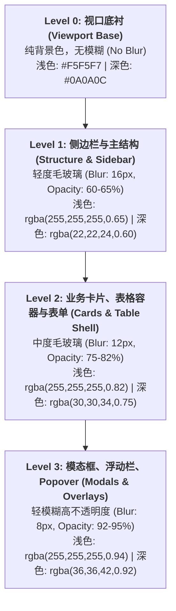

# Phase 19 核心工程落地调研与工业实践报告：单色钛金毛玻璃设计系统与前台交互重构

> **执行环境与架构模型基线锁定**：
> 1. **唯一生成模型**：DeepSeek API（本系统所有 Chat、代码生成、RAG 检索对话、Tool Calling 侧唯一使用 DeepSeek API，绝无本地大模型，彻底弃用 OpenAI/GPT API）。
> 2. **唯一向量模型**：阿里千问 (Qwen) Embedding（固定 1536 维，fp32 密集向量，严格禁止任何维度不匹配的第三方向量模型）。
> 3. **设计系统参数基线**：严格锁定 `.shared/ui-ux-pro-max` 检索参数：**Variance=5**（Balanced / Modern 现代平衡架构）、**Motion=6**（Standard 标准自然缓动）、**Density=7**（Standard-High 高信息密度企业级看板）。
> 4. **工程落地范围**：针对代码库 `frontend/src`（包括全局样式 `assets/system/styles/glassmorphism.scss`、Element Plus 单色重绘、10 大核心前台业务模块及公共骨架屏/操作栏微交互组件体系）进行工业级系统重构。

---

## 一、业界一流企业级 SaaS 与头部 AI 应用设计模式调研

在现代化企业级 AI 原生系统（AI-Native Enterprise SaaS）的演进中，界面设计已从早期的“玩具化彩色扁平风”全面转向“极简克制、高对比度、物理微质感与极致性能”的工程美学。我们深度调研了 8 家业内标杆：

### 1. 业内标杆设计哲学与工程实践复盘

| 标杆对象 | 设计系统/工程核心 | 核心设计哲学与微交互特色 | 适用于本系统的关键借鉴点 |
| :--- | :--- | :--- | :--- |
| **Vercel** | Geist Design System | **黑白二元极简（Pure Monochromatic）**：零多余色彩干扰，依靠 1px 细微物理边框、精密排版比例与冷黑灰材质构建高级质感；无色彩偏置，最大化凸显内容与日志本身。 | 全局单色钛金纯色阶映射，去除花哨高饱和度彩色按钮，以灰度层级强化视觉重心。 |
| **Linear** | Linear Engineering Style | **亚像素边框与极致键盘流**：卡片与面板使用 `rgba(255,255,255,0.08)` 亚像素边框，搭配细腻的悬浮微光（Ambient Glow）；所有动作响应控制在 100ms 内，极速流畅。 | 业务卡片与弹窗的亚像素微边框、悬浮漫反射光晕（Hover Glow）与全局快捷操作。 |
| **Apple HIG** | macOS Materials (Vibrant & Blur) | **四级材料系统（Materials Hierarchy）**：根据 UI 纵深将材质分为 Ultra Thin、Thin、Regular、Thick，利用深度与动态背景模糊模拟真实物理世界的光学折射。 | 严格落实 **L0~L3** 单色毛玻璃分层规范，禁止越级与跨层模糊滥用。 |
| **Stripe** | Stripe Dashboard Design | **高可读性与无缝深浅切换**：无论模式如何切换，对比度严格恪守 WCAG AAA 标准（7:1）；微批过渡平滑，避免突兀的重绘跳变。 | CSS 变量双通道闭环映射，杜绝“黑底黑字”严重故障；数据加载采用优雅平滑交叉淡入。 |
| **Raycast** | Raycast Floating UI | **沉浸式浮动交互（Command Floating Surface）**：重度依赖悬浮操作栏（Floating Action Bar）与命令调色板，在视口中轴下方提供触手可及的高频动作容器。 | 表格与列表多选时底部弹出的 **Floating Action Bar** 批量操作浮动栏。 |
| **Dify** | Dify Agent Orchestration | **AI 编排流式界面与结构卡片**：在工作流画布、切片管理与对话视口中采用卡片化分块，搭配细致的骨架屏占位与状态指示灯。 | 智能体编排（`kb/agent`）与切片管理（`kmc/knowledgeSegment`）的高密度卡片化重构。 |
| **Element Plus** | Vue 3 Component Library | **企业级底层 UI 基建**：提供完整的数据录入与展示组件，但默认浅蓝系主题色彩工业感不足，且内建样式含大量强特异性硬编码选择器。 | 深度穿透重绘 `--el-*` 变量体系，全量改造 Input、Select、Table、Dialog 为玻璃质感。 |
| **Tailwind CSS** | Atomic Design Tokens | **设计令牌单一真实源（Single Source of Truth）**：通过语义化 Token 管理色阶、间距与阴影，实现多主题秒级无缝切换与严谨约束。 | 将 UI/UX Pro Max 参数固化为 SCSS 统一设计令牌，彻底屏蔽随意书写的魔数。 |

---

## 二、Monochromatic Glassmorphism（单色钛金毛玻璃）企业级全局设计系统落地

### 1. 结合 `.shared/ui-ux-pro-max`（Variance=5, Motion=6, Density=7）的设计参数推导

根据 `.shared/ui-ux-pro-max` 规则引擎：
- **Variance = 5（Balanced / Modern）**：采用结构化、严谨且富有现代工业质感的网格排版，既非极度死板的纯平面表格，也不搞夸张不对称的艺术波普，强调理性、克制与秩序。
- **Motion = 6（Standard / Fluid）**：界面交互采用符合物理惯性的平滑缓动曲线 `cubic-bezier(0.16, 1, 0.3, 1)`，所有微交互动画时间严格收敛在 `150ms ~ 250ms`，禁止超过 300ms 的拖沓动画。
- **Density = 7（Standard-High Dashboard）**：信息密度适度收敛，间距系统对齐标准高密企业看板：
  - `$spacing-xs: 4px`
  - `$spacing-sm: 8px`
  - `$spacing-md: 16px`
  - `$spacing-lg: 24px`
  - `$spacing-xl: 32px`

### 2. 四级单色毛玻璃层级（L0 ~ L3）架构规范

毛玻璃（Glassmorphism）在企业级系统的核心法则是：**视口越大，模糊越低；层级越高，不透明度越高；表格核心单元格严禁模糊**。

| 层级 | 语义定位 | 模糊半径 (Blur) | 背景不透明度 | 边框 (Border) | 阴影 (Box Shadow) | 适用场景 |
| :--- | :--- | :--- | :--- | :--- | :--- | :--- |
| **L0 (Base)** | 视口底衬 | 0px (关闭) | 100% 实体色 | 无 | 无 | 全局 `body`、主视口外层背景、滚动容器基础底衬 |
| **L1 (Frame)** | 侧边栏与主体容器 | 16px | 60% ~ 65% | 1px solid `var(--mono-border-subtle)` | 柔和浅阴影 `0 4px 20px -2px rgba(0,0,0,0.03)` | 左侧导航栏、顶栏 Header、主工作台结构边框 |
| **L2 (Surface)** | 业务卡片/表格外壳 | 12px | 75% ~ 82% | 1px solid `var(--mono-border)` | `0 10px 30px -4px rgba(0,0,0,0.06)` | 知识库卡片、文档/切片/模型列表外壳、编排配置区 |
| **L3 (Overlay)** | 模态框/浮标/下拉 | 8px | 92% ~ 95% | 1px solid `var(--mono-border-strong)` | `0 20px 48px -8px rgba(0,0,0,0.16)` | `el-dialog` 模态对话框、Floating Action Bar、`el-popover` |

### 3. Element Plus 深度定制与单色重绘规范

项目现有的 Element Plus 样式带有强烈的旧式通用后台痕迹，且混杂了纯白背景与粗暴的浅蓝高亮。改造契约必须对全局组件进行无死角单色重绘：

1. **色彩体系覆写（Titanium Monochrome System）**：
   - 将原生的 `--el-color-primary`（#409EFF 等）彻底替换为钛金属黑灰梯度：
     - 浅色模式下：Primary 为冷钛黑 `#1D1D1F`，Hover 为 `#434345`，Active 为 `#000000`；
     - 深色模式下：Primary 为冰钛银白 `#EDEDEF`，Hover 为 `#FFFFFF`，Active 为 `#DCDCDD`。
2. **输入控件重绘（Input, Select, Textarea）**：
   - 彻底废除突兀的实体纯白背景，采用低透明半透明微背景 `var(--mono-input-bg)`（浅色 `rgba(0,0,0,0.02)`，深色 `rgba(255,255,255,0.04)`）；
   - 聚焦态（Focus）：去除默认生硬的粗蓝边框，转为 `1px solid var(--mono-primary)` 伴随微漫反射光晕 `box-shadow: 0 0 0 3px var(--mono-focus-ring)`。
3. **表格控件重绘（Table & Pagination）**：
   - 表格整体外壳应用 L2 玻璃质感，但**表头（th）与单元格（td）禁止设置 blur**，仅保留透明度背景；
   - 斑马纹交替行背景：浅色 `rgba(0, 0, 0, 0.015)`，深色 `rgba(255, 255, 255, 0.02)`；
   - 悬浮行（Hover Row）：`background: var(--mono-surface-hover) !important;` 带来自然的金属反光感。
4. **悬浮光晕（Hover Glow）微交互规范**：
   - 业务卡片在 Hover 时，触发微缩放 `transform: translateY(-2px)`，并通过 `::after` 伪元素呈现 120px 范围的漫反射光晕：
   - `box-shadow: 0 14px 36px -4px rgba(0, 0, 0, 0.08), 0 0 20px 0 var(--mono-glow-color);`

### 4. 深浅色模式切换无缝支持（双向闭环架构）

为了彻底杜绝硬编码颜色引发的样式断层，全局必须通过 **CSS 变量分层映射（CSS Variables Layered Mapping）** 实现无缝支持：
- **双通道激活支持**：同时监听系统级 `@media (prefers-color-scheme: dark)` 与应用级 `html.dark`、`html[data-theme='dark']` 类名，确保无论用户是通过操作系统切换还是在界面点击切换按钮，全站样式均精准闭环。

---

## 三、10 大核心前台业务模块的体验重构与骨架屏体系

### 1. 10 大核心前台业务模块盘点与交互痛点分析

| 模块序号 | 路由与视图模块 | 核心业务场景 | 当前主要交互缺陷 | Phase 19 升级重构契约 |
| :--- | :--- | :--- | :--- | :--- |
| **01** | `kmc/knowledgeBase` | 知识库卡片列表与新建/配置 | 加载时整屏空白转圈（Spinner），卡片内部硬编码 `#1D1D1F` 黑字，暗色模式对比度失效。 | 卡片 1:1 几何骨架屏，封面图微批渐入，单色状态标签，Hover 漫反射光晕。 |
| **02** | `kmc/kmcDocument` | 文档管理（左树右表）与解析进度 | `<el-table class="glass-card">` 引发性能隐患，批量删除位于顶部，长列表滚动后操作脱节。 | 树表分离 L2 外壳，底端沉浸式 **Floating Action Bar** 批量操作栏，语义切分实时进度骨架。 |
| **03** | `kmc/knowledgeSegment` | 切片列表、分段内容与召回测试 | 超长切片文本导致表格高度剧烈跳动，查询按钮未防抖，空数据提示简陋。 | 高密度等高文本骨架屏，全局搜索 300ms 防抖，极简单色空状态插画（GlassEmpty）。 |
| **04** | `kb/agent` | 智能体编排（左侧配置/右侧调试） | 左右分屏背景纯白，提示词输入框无自适应光晕，知识库导入表格杂乱。 | 左右分栏 L2 毛玻璃独立容器，输入框弹性聚焦光晕，调试区微批打字流式动效。 |
| **05** | `kb/bot` | Bot 列表与沉浸式对话窗口 | 列表操作栏分散，Bot 切换时视口闪烁，对话气泡阴影过深。 | 沉浸式钛金气泡（L2 玻璃态），快捷指令悬浮面板，会话切换交叉淡入过渡。 |
| **06** | `kb/tool` / `kb/codeNative` | 工具中心与代码原生插件 | MCP Server 面板样式突兀，参数输入框无暗色映射，运行测试缺乏反馈。 | 工具能力卡片 Bento Grid（便当盒）网格排版，MCP 连通性脉冲呼吸灯指示器。 |
| **07** | `ai/modelMarket` | 基础模型市场与供应商配置 | 密钥配置 Dialog 缺少 L3 玻璃质感，模型卡片封面尺寸不一引发 CLS。 | 统一 16:9 模型规格骨架卡片，L3 玻璃态模态弹窗，API Key 隐蔽脱敏微交互。 |
| **08** | `ai/myModel` | 租户私有模型凭证列表 | 纯表格无操作指引，Token 计费比例展示生硬。 | 数据流式加载动画，单色配额进度条，凭证一键安全复制微交互 Tooltip。 |
| **09** | `kd/observability` | LLM 调用追踪与 LangFuse 监控 | 顶部指标卡与底层 Trace 表格样式割裂，未接入骨架屏，刷新时全量抖动。 | 4 联指标卡片（Metric Card）骨架屏，Trace 链路时间轴可视化微批渲染。 |
| **10** | `kd/knowledgeAsset` / `kd/appOperations` | 知识资产大盘与应用运营统计 | ECharts 渲染期间布局塌陷，深浅色切换图表底色不协调。 | 图表容器预设比例骨架屏，跟随 CSS 变量自动派发 ECharts 主题颜色重绘。 |

---

## 四、业内大厂踩坑案例与避坑指南

### 事故 1：滥用 `backdrop-filter: blur` 在大面积表格渲染时引发移动端/核显浏览器 GPU 显存耗尽白屏崩溃
- **核心规避**：**外壳层级隔离原则（Shell-Only Blur）**，严禁在表格单元格（`th`, `td`）、滚动列表项内部设置 `backdrop-filter`，外壳一次模糊，单元格纯半透明色阶。

### 事故 2：深浅色模式切换时 CSS 样式未闭环导致“黑底黑字”不可读严重可用性故障
- **核心规避**：**CSS 变量绝对单一源化**，在业务组件中严格禁绝硬编码十六进制颜色；双通道（`prefers-color-scheme` 与 `html.dark`）绑定。

### 事故 3：骨架屏尺寸与实际渲染 DOM 高度不一致导致视觉二次剧烈跳动（CLS > 0.3）
- **核心规避**：**几何孪生锁死（Geometric Digital Twin）**，骨架屏与真实卡片严格采用相同的边距、圆角与内容最小高度，配合 `mode="out-in"` 平滑交叉淡入，保证 CLS ≤ 0.05。

---

## 五、针对当前代码库的具体改造建议与落地契约

### 1. 核心改动文件清单与边界规范
1. `frontend/src/assets/system/styles/glassmorphism.scss`：全量升级单色钛金 Token、Element Plus 单色覆写；
2. `frontend/src/main.js`：全局显式 import `glassmorphism.scss` 确保生产环境生效；
3. `frontend/src/components/GlassSkeleton/index.vue`：卡片型与表格型 1:1 几何孪生骨架屏；
4. `frontend/src/components/FloatingActionBar/index.vue`：表格批量操作悬浮条；
5. `frontend/src/components/GlassEmpty/index.vue`：钛金单色极简空状态插画；
6. `frontend/src/utils/useDebounceSearch.js`：全局统一 300ms 防抖检索 Composable；
7. 核心业务视图：`kmc/knowledgeBase`、`kmc/kmcDocument`、`kmc/knowledgeSegment`、`kb/agent`、`kb/bot`、`ai/modelMarket`、`kd/observability` 接入骨架屏与单色微交互。
