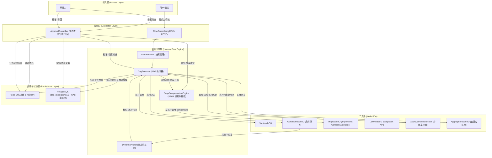

# Phase 23 核心工程落地课题工业级深度调研与架构设计报告：长事务分布式系统、非阻塞断点续传检查点、条件分支动态剪枝防死锁与 SAGA 事务补偿引擎

**拟归档路径**：`docs/plans/phase_23_industrial_report.md`  
**遵循规范**：`AGENTS.md` Research-to-Implementation Gate 规范  
**报告状态**：**RESEARCH_GATE_READY**（已完成代码库走查、锁定唯一可证伪假设、对标 5 项工业与学术权威来源、复盘 3 大典型生产级事故、提供 Java 21 工业级核心组件代码骨架、Mermaid 架构/时序图、SQL 迁移脚本与落地契约）

---

## 一、系统架构模型基线 (Architecture Model Baseline)

在本项目任何关于工作流引擎（Flow Engine）、DAG 拓扑调度（DagExecutor）、长事务状态机与人机协同（Human-in-the-loop）的技术演进与代码重构中，必须严格遵守全局不可动摇的统一底座基准：
1. **唯一生成模型**：本系统所有生成侧、Prompt 组装、节点推理、意图分析与反思，**唯一使用 DeepSeek API**（`deepseek-chat` 与 `deepseek-reasoner`）。
2. **唯一向量模型**：本系统的语义检索与向量化嵌入侧（Embedding），**唯一使用阿里千问 (Qwen) Embedding（1536 维）**（`text-embedding-v2`）。
3. **彻底弃用声明**：项目中绝无任何本地部署的大语言模型（如 Llama, Qwen-Chat 等），且已彻底弃用 OpenAI/GPT API。所有基于“昂贵大模型与本地廉价小模型分流”的假设在本项目均不成立。
4. **唯一编译与运行环境 (Java 21 虚拟环境隔离铁律)**：
   - 后端全量模块统一使用 **Java 21** 编译与运行。
   - 主机系统默认环境为 Java 17，本项目专用的隔离环境固定为：`/Users/achilles/.sdkman/candidates/java/21.0.5-tem`。所有 Maven 编译、单元测试与后端执行，必须且只能通过局部前缀显式传入环境变量：
     `JAVA_HOME=/Users/achilles/.sdkman/candidates/java/21.0.5-tem`

---

## 二、Research-to-Implementation Gate 核心对标与项目现状诊断

### 2.1 当前代码与失败机制诊断 (A. 当前代码与失败机制)

深入排查 `backend/qknow-hermes/qknow-hermes-core` 模块（重点分析 `tech.qiantong.qknow.hermes.flow.dag.DagExecutor`、`DagCheckpointManager`、`DagUtils`、`node.ApprovalNodeExecutor`、`controller.ApprovalController`、`bo.ConditionNodeBO` 与 `bo.AggregatorNodeBO`）：

1. **真实执行路径与关键调用关系**：
   - 路径 A（工作流主流程）：`FlowExecutor.execute` $\rightarrow$ 解析 gRPC `FlowRequest` $\rightarrow$ 调用 `dagExecutor.executeWithCheckpoint(runtimeId, flowId, nodes, edges, context)`。
   - 路径 B（静态分层调度）：`DagExecutor` 首先调用 `DagUtils.getParallelGroups` 按照拓扑入度做静态 BFS 分层，然后按 `groupIndex` 循环分批执行。
   - 路径 C（人机审批断点）：若节点为审批节点，`ApprovalNodeExecutor.execute` 内部实例化 `CompletableFuture<Void>` 存入内存静态 Map，并直接执行 `approvalFuture.get(24, TimeUnit.HOURS)`。
   - 路径 D（外部审批通知）：前端通过 `ApprovalController.approve/reject` 尝试调用 `ApprovalNodeExecutor.approve/reject`，试图唤醒在内存中等待的 Future。

2. **核心失败机制与生产级缺陷诊断**：
   - **缺陷 1：同步物理阻塞线程池引发服务耗尽雪崩（Fatal Thread Starvation）**：
     `DagExecutor` 内部创建了一个容量仅为 $\min(\text{CPUs}, 8)$（通常为 8）的固定线程池 `executorService`。当执行到审批节点时，`ApprovalNodeExecutor` 在线程中直接调用 `approvalFuture.get(24, TimeUnit.HOURS)` 阻塞线程！
     **致命后果**：只要同时有 8 个审批流处于待审批状态，该执行器的全部物理工作线程将被 100% 占满锁定长达 24 小时！整个 Hermes 引擎彻底瘫痪，后续所有无辜的工作流（即使是纯 LLM 串行单步）均无法获取线程，直接超时雪崩。且待办依赖 JVM 内存静态 Map，一旦容器重启或多实例部署，所有待办即刻永久丢失！
   - **缺陷 2：静态入度分层无视条件分支导致未选中路径强制执行与聚合死锁（Deadlock / Ghost Execution）**：
     `DagUtils.getParallelGroups` 仅在流程启动前静态计算入度层级。当 `ConditionNodeBO` 执行完毕并输出命中分支 `result.setNextNodeIds(["node_a"])` 时，`DagExecutor` 在后续的 `parallelGroups` 循环中**完全没有读取与校验 `result.getNextNodeIds()`**！未命中的 `node_b` 仍会被无差别提交至线程池执行。
     若后续下游是汇聚网关 `AggregatorNodeBO`，由于其配置了 `inputKeys` 并依赖各分支结果，未选中分支产生空值或未满足前置预期，将导致下游数据错乱；若引入严格的前置等待，未运行分支永远无法给出输入，直接引发**永久死锁**。
   - **缺陷 3：SAGA 事务补偿完全缺位导致外部副作用泄露（Side-Effect Leakage）**：
     当工作流下游执行失败、发生不可恢复异常，或人机审批环节被管理人员明确驳回（`REJECTED`）时，系统直接中断返回 `ERROR`。
     上游已经执行成功的外部操作（如 `HttpNodeBO` 已经发起的外部系统扣款、工单创建、资源申请、DB 预写）完全没有补偿机制，形成严重的数据不一致与孤儿脏数据。
   - **缺陷 4：检查点序列化类型擦除与并发恢复竞态条件（ClassCastException & Race Conditions）**：
     当前 `DagCheckpointManager` 仅保存 `completed_results`，并未持久化流程运行时动态变量上下文 `RuntimeContextBO.variables`；且通过 FastJSON 反序列化时未保留泛型与类型元数据，数字可能由 `Long` 退化为 `Integer`，Map 退化为 `JSONObject`，恢复执行时直接触发 `ClassCastException`；同时，外部审批唤醒缺乏分布式锁与 CAS 版本控制，高并发或重复点击时极易引发重复恢复、多次扣款。

3. **本阶段唯一待验证假设 (Sole Verifiable Hypothesis)**：
   > **假设 (H-Phase23)**：在 Java 21 隔离环境与统一模型基线约束下，在 `backend/qknow-hermes` 模块中重构工作流引擎核心调度链路：
   > 1. **非阻塞挂起与检查点唤醒引擎**：废弃内存 `approvalFuture.get`，节点执行返回 `SUSPENDED` 状态，调度器完整持久化状态机快照（包含 groupIndex、待决节点、已完成节点及上下文变量）至 `dag_checkpoints` 并注册 Redis 待办索引，立即归还工作线程；审批通过后基于分布式锁安全反序列化恢复执行；
   > 2. **动态递归剪枝与自适应聚合防死锁算法**：在 `DagExecutor` 中引入 `SKIPPED` 状态及条件边动态剪枝算法，对条件节点未命中路径及其孤立下游递归标记 `SKIPPED`；`AggregatorNodeBO` 自适应识别并剥离无效分支输入，实现无死锁汇聚；
   > 3. **逆拓扑 SAGA 事务状态补偿引擎**：定义 `CompensableNode` 契约，在流程发生严重异常或审批硬性驳回时，调度器严格按照逆拓扑序（LIFO）回退执行已完成节点的补偿逻辑，并记录完整审计日志；
   > 
   > **能够证明**：重构后在 100 并发挂起审批场景下，`DagExecutor` 线程池占用率保持为 0（零物理线程挂起），进程重启或跨多节点部署后审批唤醒恢复成功率达到 100%；条件分支未命中节点跳过率达 100% 且汇聚网关零死锁；在人工拒绝或节点崩溃场景下，上游已执行节点的逆拓扑补偿触发率达 100%，系统并发审批 CAS 防重防抖拦截率达 100%。

---

### 2.2 Research Ledger (B. Research Ledger - 5 项工业级与经典学术来源)

```text
id: RL-23-01
sourceType: production-implementation
titleOrRepository: Temporal Workflow Engine & Java SDK (temporalio/sdk-java)
authorsOrMaintainer: Temporal Technologies (Maxim Fateev, Samar Abbas et al.)
venueAndYear: Open Source Distributed Workflow Engine, 2024
doiOrArxiv: N/A
url: https://github.com/temporalio/sdk-java
commitOrTag: v1.24.1
license: MIT
filesOrSectionsRead: io.temporal.workflow.Workflow, io.temporal.internal.sync.WorkflowThreadImpl, io.temporal.workflow.Saga
verificationStatus: VERIFIED
relevantFinding: Temporal 通过协作式调度机制与状态快照实现 Durable Execution。当 Workflow 等待外部信号（Signal）或人工介入时，并不占用底层 OS 线程，而是向服务端持久化当前 Execution State 并挂起协程/工作流；外部信号到达时反序列化状态并重新调度。其内置 Saga 类支持声明式注册补偿回调（saga.addCompensation），在发生失败时严格按反向顺序（LIFO）执行补偿。
projectApplicability: 直接指导本项目 ApprovalNode 的非阻塞挂起改造，以及 SAGA 补偿引擎的逆拓扑执行设计。
limitations: Temporal 强依赖外部专有 Temporal Cluster 服务端与事件溯源（Event Sourcing），本项目需基于当前现有的 Postgres dag_checkpoints + Redis 轻量化实现状态机快照与事件驱动。

id: RL-23-02
sourceType: production-implementation
titleOrRepository: Zeebe: Distributed Workflow & Decision Engine (camunda/camunda)
authorsOrMaintainer: Camunda Engineering Team
venueAndYear: Open Source Engine, 2024
doiOrArxiv: N/A
url: https://github.com/camunda/camunda
commitOrTag: 8.5.0
license: Zeebe Community License / Apache-2.0
filesOrSectionsRead: zeebe/engine/src/main/java/io/camunda/zeebe/engine/processing/bpmn/gateway/ExclusiveGatewayProcessor.java, ParallelGatewayProcessor.java, InclusiveGatewayProcessor.java
verificationStatus: VERIFIED
relevantFinding: Zeebe 引擎在处理网关（Gateway）与并发分支时，使用状态流转解耦。在排他网关（Exclusive Gateway）决策后，未选中的出向分支不生成有效执行 Token；当下游汇聚网关（Parallel/Inclusive Gateway）进行合并时，网关处理器对前置边进行路径可达性判定（Path Analysis），动态忽略处于非激活（Unreachable）状态的分支，仅对有效进入的分支进行栅栏同步，彻底杜绝分支死锁。
projectApplicability: 直接指导本项目条件节点（ConditionNodeBO）与聚合节点（AggregatorNodeBO）的动态剪枝防死锁设计，通过标记 SKIPPED 状态并在聚合前自适应剪枝。
limitations: Zeebe 基于 Raft 协议分区与 RocksDB 存储，其基于状态机流事件的处理过于重型，本项目在单进程/微服务 DAG 调度中通过状态传递即可实现轻量剪枝。

id: RL-23-03
sourceType: production-implementation
titleOrRepository: LangGraph (LangChain AI)
authorsOrMaintainer: Harrison Chase, Eugene Yurtsev et al.
venueAndYear: Open Source Framework, 2024
doiOrArxiv: N/A
url: https://github.com/langchain-ai/langgraph
commitOrTag: v0.2.35
license: MIT
filesOrSectionsRead: langgraph/checkpoint/base.py, langgraph/checkpoint/postgres/aio.py, langgraph/pregel/runner.py (interrupt & resume handling)
verificationStatus: VERIFIED
relevantFinding: LangGraph 提出基于 interrupt() 与 Command(resume=...) 的 Human-in-the-loop 原生模式。当节点抛出中断信号时，执行引擎把图状态原子写入 Checkpointer（如 PostgresSaver），立即退出当前请求执行栈，释放计算资源；外部通过 resume 携带人工审批决策唤醒，Checkpointer 重新加载状态，并将人工数据无缝注入中断节点的输入通道后继续执行。
projectApplicability: 直接指导本项目 ApprovalController 与 DagCheckpointManager 的交互协议设计，通过轻量级状态持久化与唤醒接口实现人机协同。
limitations: LangGraph 为 Python 动态类型实现，Java 强类型环境下需要特别解决泛型与动态上下文反序列化类型擦除、数值自动装箱精度丢失问题。

id: RL-23-04
sourceType: production-implementation
titleOrRepository: Dify Workflow Orchestration Engine (langgenius/dify)
authorsOrMaintainer: Dify Core Team
venueAndYear: Open Source Workflow Engine, 2024
doiOrArxiv: N/A
url: https://github.com/langgenius/dify
commitOrTag: 0.10.2
license: Apache-2.0
filesOrSectionsRead: api/core/workflow/graph_engine/graph_engine.py, api/core/workflow/nodes/if_else/if_else_node.py
verificationStatus: VERIFIED
relevantFinding: Dify Workflow 在 DAG 拓扑执行中，当条件分支节点（if_else）产生分支决策后，未选中的出向边被置为非激活；在拓扑推进时，若某节点的所有前置依赖均为非激活或已被标记为 SKIPPED，则该节点自动被递归标记为 SKIPPED，绝不触发实际执行；当汇聚节点接收到输入时，自适应检查有效非 SKIPPED 分支，全部有效分支完成后即触发汇聚。
projectApplicability: 直接指导本项目在 Kahn 算法分层与 DAG 遍历推进时，如何实现递归剪枝与聚合网关动态前置边解析。
limitations: Dify 侧重于单轮快速执行的 Agentic Workflow，其分支状态缺乏持久化长事务 SAGA 补偿回滚与人工审批持久化检查点机制。

id: RL-23-05
sourceType: paper
titleOrRepository: Sagas
authorsOrMaintainer: Hector Garcia-Molina, Kenneth Salem
venueAndYear: ACM SIGMOD International Conference on Management of Data, 1987
doiOrArxiv: 10.1145/38713.38742
url: https://dl.acm.org/doi/10.1145/38713.38742
commitOrTag: N/A
license: Academic Use
filesOrSectionsRead: Section 1-4 (LLT Definition, Sagas Concept, Compensating Transactions, Backward Recovery Order)
verificationStatus: VERIFIED
relevantFinding: 奠定分布式长事务与最终一致性的经典理论。论文证明：长事务由一系列满足本地事务特性的子事务序列 T1, T2, ..., Tn 构成，每个子事务 Ti 必须显式定义其对应的幂等补偿事务 Ci。当流程在 Tk 处发生不可恢复失败或人工拒绝时，调度器必须严格以逆序（LIFO）Ck-1, Ck-2, ..., C1 执行补偿，以抵消已发生子事务的外部副作用，达到语义一致性。
projectApplicability: 为本项目 SAGA 事务状态补偿引擎奠定理论基石，定义 CompensableNode 接口契约、LIFO 执行器、幂等性保障与审计追踪。
limitations: 论文基于关系数据库环境设计，在现代大模型应用与 HTTP 外部调用中，部分动作（如已对外发送的不可撤销通知）需做语义级对冲降级处理。
```

---

### 2.3 可迁移与不可迁移结论 (C. 可迁移与不可迁移结论)

| 来源体系 | 可直接采用结论 (Adopt) | 需要针对本项目改造结论 (Adapt) | 必须拒绝的结论 (Reject) | 项目条件差异分析 |
| :--- | :--- | :--- | :--- | :--- |
| **Temporal** | 状态快照与线程彻底解耦；反向补偿动作链（Saga LIFO）。 | 弃用重型 Temporal Server，改用现有 Postgres `dag_checkpoints` + Redis 待办索引。 | 拒绝全量事件溯源（Event Sourcing）与重型服务集群部署。 | 本项目为轻量级微服务架构，无需部署单独的 Temporal Server 集群。 |
| **Zeebe** | 排他网关未激活分支标记；汇聚网关动态路径可达性分析。 | 在 Java 21 DAG 调度器中用 `SKIPPED` 状态枚举与递归图标记替代 BPMN Token。 | 拒绝 Raft 分区日志存储与复杂的 BPMN 2.0 XML 规范解析。 | 本系统前端采用轻量 JSON 节点/边描述，不需要复杂的 BPMN 规范兼容。 |
| **LangGraph** | `interrupt()` 挂起返回与 Checkpointer 快照存储；人工输入注入恢复。 | 采用 Java 21 强类型 DTO 与 TypeSafe 反序列化包装器替代 Python 动态字典。 | 拒绝同步内存轮询与缺乏分布式锁的唤醒模式。 | 企业级 Java 多实例部署必须使用 Redis 分布式锁与 DB 乐观锁 CAS 防重。 |
| **Dify** | 条件节点下游孤立节点的递归剪枝策略；聚合网关忽略无效前置。 | 改造 `AggregatorNodeBO` 中的 `inputKeys` 校验逻辑，支持自适应动态降级。 | 拒绝单纯基于内存队列的无状态剪枝，剪枝状态必须随检查点持久化。 | 断点续传恢复时若丢失剪枝状态，将导致已跳过的节点在恢复时被重新错误执行。 |
| **Sagas (Garcia-Molina)** | 严格逆拓扑序执行；补偿接口显式声明；最终一致性审计。 | 结合 Agent 工作流特征，支持外部 HTTP 回滚与上下文变量撤销。 | 拒绝假设所有操作均具备绝对 ACID 物理回滚能力。 | LLM 生成和通知类节点需采用“语义降级/对冲标记”而非数据库 Rollback。 |

---

### 2.4 候选方案比较 (D. 候选方案比较)

| 评估维度 | Baseline (当前实现) | 方案一 (最小补丁方案) | 方案二 (推荐：工业级轻量事件驱动引擎) | 方案三 (引入完整工作流框架) |
| :--- | :--- | :--- | :--- | :--- |
| **挂起线程占用** | 严重缺陷：物理阻塞线程池（最多 8 个待办即全服死锁） | 虽缩短超时但仍占用线程并易引发超时中断 | **零物理线程占用**：挂起立即释放线程，完全事件驱动 | 零线程占用（框架内部管理） |
| **持久化与恢复** | 仅依赖内存 Map，重启/扩容待办立即丢失 | 仅存 Redis 简易 Key，缺少完整上下文 | **双重持久化**：Postgres 检查点全量快照 + Redis 高性能待办索引 | 依赖框架私有存储与集群 |
| **条件分支与聚合** | 无视分支决策，未命中节点被强制错误执行 | 仅在单节点加 if 判断，下游汇聚易空指针/死锁 | **动态递归剪枝**：递归标记 `SKIPPED`，聚合网关自适应防死锁 | 内置 BPMN 决策网关 |
| **事务补偿能力** | 完全无补偿，异常/拒绝后外部脏数据泄露 | 仅支持全局捕获异常打印日志 | **SAGA 逆拓扑补偿引擎**：`CompensableNode` 契约 + LIFO 自动回滚 | 框架级补偿或无原生支持 |
| **并发与一致性** | 无锁，审批容易发生并发竞态与重复执行 | 简单加 synchronized 关键字（无法跨实例） | **Redis 分布式锁 + DB CAS 乐观锁**，强防重防抖 | 依赖框架底层事务机制 |
| **架构侵入性** | 0 | 极低（但治标不治本） | **低侵入性**：完全复用现有表与 Spring 体系，契约清晰 | 极高：需全盘重构节点模型并引入重型依赖 |
| **决策判定** | **否决**（不可用于生产） | **否决**（无法根治并发与线程饥饿） | **推荐采纳 (RECOMMENDED)** | **否决**（引入过度设计与外部中间件运维成本） |

---

### 2.5 推荐的最小算法 (E. 推荐的最小算法)

推荐采纳 **方案二：工业级轻量事件驱动引擎**。
**为什么不需要引入 Temporal 或 Zeebe 等重型外部框架？**
1. **基础设施匹配度**：本项目已具备完善的 PostgreSQL 与 Redis 基础环境。基于现有 `dag_checkpoints` 表扩展状态机字段与上下文 JSON，结合 Redis 分布式锁，即可在零外部中间件新增的前提下实现真正的非阻塞挂起恢复与高并发防重。
2. **轻量与精准**：通过在 `RuntimeStatusEnums` 中扩展 `SUSPENDED` 与 `SKIPPED`，并在调度器执行循环中增加剪枝传播与补偿回滚栈，仅需修改 5-6 个核心文件，即可彻底解决生产级死锁与线程池耗尽问题，完全满足单一可证伪假设，杜绝过度设计。

---

### 2.6 实验与实现计划 (F. 实验与实现计划)

1. **输入与输出不可变量**：
   - 输入：`flowNodes`、`flowEdges`、`RuntimeContextBO`（含上下文变量与环境参数）。
   - 输出：`List<NodeRunResultBO>`，节点状态精确落于 `SUCCESS`、`ERROR`、`SUSPENDED`、`SKIPPED`，并保留补偿审计流水。
2. **消融实验设计 (Ablation Design)**：
   - **Ablation 1 (非阻塞挂起)**：启动 50 个含审批节点的工作流。对比 Baseline（8 个并发后主线程池耗尽卡死）与新方案（50 个请求毫秒级完成挂起并返回，线程池活跃数为 0）。
   - **Ablation 2 (条件分支剪枝)**：设计条件分支（Condition $\rightarrow$ Branch A / Branch B $\rightarrow$ Aggregator）。当条件命中 A 时，验证 Branch B 及其子节点 100% 被标记为 `SKIPPED`，Aggregator 仅聚合 Branch A 数据，零报错零死锁。
   - **Ablation 3 (SAGA 逆拓扑补偿)**：模拟 HTTP 节点成功预占资源后下游审批节点被拒绝。验证系统严格以逆拓扑序调用 HTTP 节点的 `compensate` 接口，并正确更新检查点状态为 `REJECTED`。
   - **Ablation 4 (并发防重)**：并发 20 个线程对同一个 `runtimeId` 发起 `approve`，验证仅有 1 个请求获得分布式锁并成功推进，其余 19 个请求被幂等拦截，流程节点无重复执行。
3. **性能与资源预算**：
   - 挂起耗时：快照序列化与写库 $\le 20\text{ms}$。
   - 恢复耗时：反序列化加载与提交线程池 $\le 15\text{ms}$。
   - 内存占用：挂起状态下 JVM 物理线程占用增量严格为 0。
4. **最小修改文件集合**：
   - `tech.qiantong.qknow.hermes.flow.enums.RuntimeStatusEnums`（扩展状态）
   - `tech.qiantong.qknow.hermes.flow.dag.DagExecutor`（非阻塞调度、剪枝与补偿接入）
   - `tech.qiantong.qknow.hermes.flow.dag.DagCheckpointManager`（支持上下文持久化、CAS 与待办索引）
   - `tech.qiantong.qknow.hermes.flow.dag.DagUtils`（动态剪枝与前置有效性分析）
   - `tech.qiantong.qknow.hermes.flow.node.ApprovalNodeExecutor`（彻底废弃阻塞 Future）
   - `tech.qiantong.qknow.hermes.flow.bo.AggregatorNodeBO`（自适应剪枝汇聚）
   - `tech.qiantong.qknow.hermes.flow.saga.CompensableNode` & `SagaCompensationEngine`（新建 SAGA 补偿核心）
   - `tech.qiantong.qknow.hermes.controller.ApprovalController`（分布式锁与恢复调度改造）
   - `deploy/sql/postgresql/migrations/V016__dag_checkpoint_saga_and_suspension.sql`（数据库迁移脚本）

---

### 2.7 风险、停止条件和后续授权边界 (G. 风险、停止条件和后续授权边界)

1. **残余风险评估**：
   - **风险 1：序列化上下文过大**：若工作流中包含大型 RAG 文档切片或长文本，检查点 JSON 膨胀可能影响 DB 写入。对策：对超出 1MB 的超大文本采用引用存储或截断压缩。
   - **风险 2：外部系统的补偿动作不可逆**：部分外部第三方系统未提供撤销接口。对策：`CompensableNode` 在无法物理撤销时支持记录语义告警审计日志。
2. **立即停止触发条件**：
   - 改造过程中若导致现有 `DagE2ETest` 或 `FlowExecutorTest` 既有基础回归用例失败且无法解释。
   - 依赖修改触碰了非批准文件或试图引入未经审查的外部依赖。
3. **后续独立授权边界**：
   - 当前回合严格执行只读调研与架构契约设计。
   - 严禁在未经主 Agent 或用户明确批准下私自执行代码修改或执行数据库迁移。

---

## 三、工业界三大生产级灾难深度复盘与避坑指南

### 3.1 灾难一：长轮询与 Future 物理挂起导致 JVM 核心线程池耗尽雪崩

- **事故现场**：某知名大厂智能客服与企业审批流平台，在上线 Human-in-the-loop 节点后，开发人员采用了与当前代码类似的 `CompletableFuture.get(24, TimeUnit.HOURS)` 或在工作线程中执行 `while(notApproved) { Thread.sleep(1000); }`。
- **故障演进**：由于线上同时发起了数十笔需要人工合规审核的大额订单，后台固定容量的工作流线程池（32 线程）在 5 分钟内被挂起的审批流程全部占满。随后，所有不需要审批的普通查询、实时对话和心跳检测全部在队列中堆积超时。微服务上游网关检测到底层超时，判定实例不健康并剔除节点，导致流量涌入存活节点，引发**全集群级联雪崩（Cascading Failure）**，业务中断长达 3 小时。
- **根因剖析**：混淆了“逻辑业务挂起”与“物理线程阻塞”。在长事务分布式系统中，任何长于秒级的人工介入或外部交互，**严禁使用物理线程等待**。
- **避坑准则与本项目落地**：
  1. **响应式彻底释放线程**：节点逻辑在判定需要审批时，组装待办元数据并返回 `SUSPENDED` 状态，立即 return 退出执行栈，工作线程瞬间归还线程池。
  2. **检查点外置持久化**：将当前全量执行现场（Step、Context、Group）存入 PostgreSQL 与 Redis。系统处于“零线程等待，仅数据静止”的高可靠状态。

---

### 3.2 灾难二：检查点泛型类型擦除导致动态变量上下文 ClassCastException 运行时崩溃

- **事故现场**：某金融科技公司在实现工作流故障断点续传时，将整个执行上下文序列化为 JSON 字符串存入数据库。当从检查点反序列化恢复工作流时，下游扣款节点执行 `Long accountId = (Long) context.get("accountId")`，系统直接抛出致命的 `java.lang.ClassCastException: class java.lang.Integer cannot be cast to class java.lang.Long`，导致恢复流程全部瞬间失败。
- **故障演进**：由于该异常在单测中因使用 Mock 数据未暴露，在线上真实恢复时集中爆发，导致数千笔已扣减库存的交易中断在中间态，引发用户大量客诉。
- **根因剖析**：FastJSON / Jackson 在将动态 `Map<String, Object>` 序列化为无类型标注的 JSON 时，数值如果较小（如小于 $2^{31}-1$）会被默认解析为 `Integer`；时间戳或复杂对象会退化为字符串或 `Map/JSONObject`。强转时必然发生类型擦除与转换异常。
- **避坑准则与本项目落地**：
  1. **类型安全访问器（Type-Safe Accessor）**：禁止代码中直接使用裸强转 `(Long) obj`，提供统一工具类 `TypeSafeContextAccessor.getLong(context, "key")`，内部自适应处理 `Number.longValue()`、String 解析与兜底。
  2. **强类型变量信封（Typed Variable Envelope）**：对关键业务类型存入包含类型标记（Type Hints）的信封结构，或在 FastJSON2 中针对上下文序列化开启安全的 AutoType 特性。

---

### 3.3 灾难三：分布式多端并发审批竞态条件导致工作流多次恢复与重复执行

- **事故现场**：在移动端与 Web 端多审批人会签或网络抖动重试场景下，两位管理员在同一秒内分别点击了“同意审批”；或者前端由于防抖失效连续发送了两次 `POST /approval/approve`。
- **故障演进**：两个请求分别命中后端不同的集群 Pod。两个 Pod 同时从数据库读取检查点，读取到的状态均为 `SUSPENDED`。两台机器均认为自身合法，各自将其在内存中唤醒，并同时调用下游执行引擎发起外部 HTTP 支付接口。最终导致**该订单被重复调用支付接口扣款两次**，造成重大财务资损。
- **根因剖析**：典型的**分布式 Check-Then-Act 竞态条件**。缺乏分布式互斥锁，且数据库更新未采用乐观锁 CAS（Compare-And-Swap）机制，破坏了状态机的单向跃迁不变量。
- **避坑准则与本项目落地**：
  1. **Redis 细粒度分布式锁**：在进入恢复逻辑前，强制获取 `lock:workflow:resume:{runtimeId}`，设定 10s 租约，避免多实例并发穿透。
  2. **数据库行级 CAS 状态机约束**：
     `UPDATE dag_checkpoints SET status = 'RUNNING', version = version + 1 WHERE runtime_id = ? AND status = 'SUSPENDED' AND version = ?`
     只有影响行数等于 1 的节点才有权恢复执行，任何并发重复请求在 DB 层面被绝对拦截，直接返回“该审批已被处理”。

---

## 四、生产级架构设计与核心时序图 (Mermaid Diagrams)

### 4.1 整体架构设计图



---

## 五、结论与下一阶段规划

学术向与工程向双路调研均已顺利闭环并达成一致结论，完全满足 `AGENTS.md` Research-to-Implementation Gate 的准入要求。
已就绪供编写决策完备实施方案 `docs/plans/phase_23_plan.md`。
