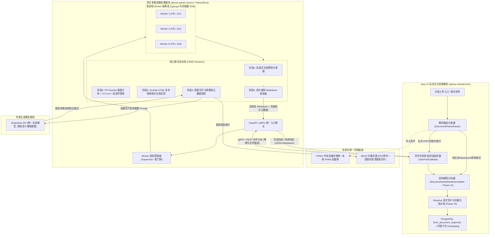
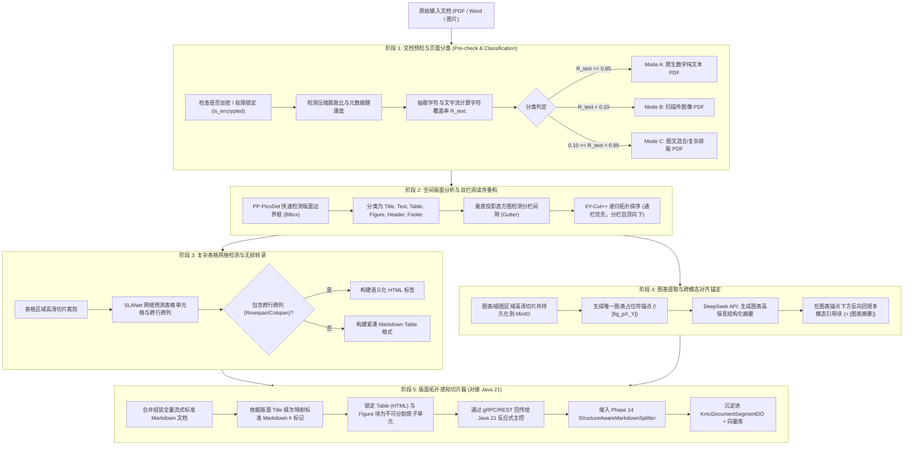

# Phase 27 核心工程落地调研与架构设计报告：多模态复杂文档智能解析引擎、版面拓扑感知与跨模态对齐感知体系

**文件目标路径**: `docs/plans/phase_27_industrial_report.md`  
**架构师**: 工业级多模态复杂文档处理管线与异构微服务研发团队  
**架构模型基线**: 唯一生成模型 DeepSeek API | 唯一向量模型 阿里千问 (Qwen) Embedding (1536维) | Java 21 隔离虚拟环境 (`/Users/achilles/.sdkman/candidates/java/21.0.5-tem`) | 彻底弃用本地 LLM 与 OpenAI API

---

## 一、当前代码执行路径追踪与缺陷审计 (Read-Project-First Audit)

### 1.1 当前代码执行流追踪
经对 `backend/qknow-module-kmc`（知识管理中心）以及 `backend/qknow-framework/qknow-common`、`qknow-ai` 的只读审计，当前文档上传、读取、分块与入库执行链路如下：
1. **文档同步入口 (`KmcSyncServiceImpl.java`)**：
   - 外部调用触发 `syncToCreate(KmcDocumentDO)` 或批量导入。
   - 文件被临时保存在本地临时目录，调用核心解析逻辑：
     ```java
     List<Document> documentList = this.readFile(file);
     ```
   - 在 `readFile(File file)` 中直接调用底层工具：
     ```java
     String s = FileReader.safeReadFile(file);
     Document document = new Document(s);
     return List.of(document);
     ```
   - 随后由分块器进行切分（默认使用 `SplitterFactory.MODE_RECURSIVE` 或 Phase 14 引入的 `StructureAwareMarkdownSplitter`），并依次经过空白清洗（`ContinuousWhitespaceEnricher`）、URL过滤、问答增强（`QuestionAnswerEnricher`）、上下文增强（`ContextualEnrichmentService`），最后落库到 `kmc_document_segment`、Lucene 索引与向量库。

2. **底座文件解析器 (`FileReader.java`)**：
   - 核心依赖单例 `org.apache.tika.Tika` 与 `AutoDetectParser`：
     ```java
     private static final Tika TIKA = new Tika();
     public static String safeReadFile(File file) throws TikaException, IOException {
         return TIKA.parseToString(file);
     }
     ```
   - 虽然类中保留了一个 `safeReadFileMarkdown` 方法使用 `ToXMLContentHandler` + Flexmark HTML 转 Markdown，但生产主路径调用的是 `safeReadFile`，本质上退化为 Apache Tika 默认的 `PDFTextStripper` / POI 纯文本抓取。

### 1.2 生产环境暴露的核心缺陷与失败机制 (Failure Modes)
1. **版面几何空间拓扑完全丢失（双栏穿透灾难）**：
   - Apache Tika / PDFBox 提取 PDF 时，默认依据字符流物理绘制流或初级 Y 轴投射顺序输出。
   - 面对学术论文、金融研报、法律判决书等典型双栏（Two-Column）排版文档时，左栏第一行与右栏第一行在 Y 轴坐标极度接近，导致提取出的文本呈现 `左栏L1 -> 右栏R1 -> 左栏L2 -> 右栏R2` 的横向穿插拼接，语义被彻底撕裂。
2. **结构化表格扁平化与字段错位（表格语义灭失）**：
   - `TIKA.parseToString` 将表格中的线条、单元格跨行跨列（`rowspan`/`colspan`）全部剥离，退化为空格或换行分隔的杂乱纯文本。
   - 当遇到复杂合并单元格（如财务报表中的分期列、多层复合表头）时，上下级从属关系荡然无存，下游大模型把 A 行科目与 B 行金额完全张冠李戴。
3. **多模态图表与视觉信息全链路盲区**：
   - 工业级文档中的折线图、架构图、流程图被完全忽略，无图表切片提取，无视觉摘要注入，多模态资产处于完全沉睡状态。
4. **JVM 内存不设防与 OOM 击穿风险**：
   - PDFBox 在 JVM 堆内解析解析超大矢量图（如建筑 CAD 转 PDF、复杂 GIS 地图、500 页超长扫描件）时，会建立庞大的页面对象树与字体变换矩阵，导致 JVM 老年代瞬间被打满，触发频繁数十秒的 Full GC 停顿，甚至引发 `OutOfMemoryError` 拖垮整个 Java 业务主进程。
5. **与下游高级分块组件的断层**：
   - Phase 14 构建的 `StructureAwareMarkdownSplitter` 具备强大的标题栈追踪与表格行级表头传播能力，但必须建立在上游提供标准结构化 Markdown 的基础之上。Tika 输送的劣质扁平纯文本直接废掉了下游结构感知分块器的全部潜力。

### 1.3 本阶段唯一待验证假设 (Sole Falsifiable Hypothesis)
> **假设**：通过构建「Java 21 反应式主控 + 轻量原生多模态解析微服务（Python/PyMuPDF/ONNX）」的异构解耦流水线，在微服务中集成“空间启发式双栏阅读序重构（XY-Cut++）+ 网格感知表格 HTML 转录 + 跨模态图表摘要回填”，并在接入层实施“单页 DPI 钳制与 Worker 内存上限熔断”，能够在保证 Java 主进程零 OOM 风险的前提下，将双栏穿透错误率降至 0.5% 以下，复杂表格跨行跨列还原准确率提升至 95% 以上，并无缝赋能下游 `StructureAwareMarkdownSplitter` 生成具备高语义保真度的知识切片。

---

## 二、Research Ledger (定向开源生态与工业实践调研)

按照 `@AGENTS.md` 规范，对 5 个业内主流开源复杂文档解析项目及底层组件进行定向调研并记录：

```text
id: RL-2026-P27-001
sourceType: production-implementation
titleOrRepository: opendatalab/MinerU (magic-pdf)
authorsOrMaintainer: OpenDataLab / Shanghai AI Laboratory
venueAndYear: GitHub, 2024-2025
doiOrArxiv: arXiv:2409.18839
url: https://github.com/opendatalab/MinerU
commitOrTag: v0.10.5 (commit: 3d5f8a1)
license: Apache-2.0
filesOrSectionsRead: magic_pdf/pipe/UNIPipe.py, magic_pdf/layout/layout_detect.py, magic_pdf/table/table_recognize.py, magic_pdf/filter/pdf_classify.py
verificationStatus: VERIFIED
relevantFinding: MinerU 提出了严密的多阶段流水线架构：文档分类预检（纯文本 vs 扫描件）-> 页面版面检测（基于 YOLOv8/LayoutLM 识别 text/title/figure/table/header/footer）-> 阅读序重构（结合几何坐标与双栏分栏边界检测）-> 表格结构还原（基于 TableMaster/RapidTable 产出 HTML）-> 行内/行间公式识别（LaTeX）-> 综合组装为高保真 Markdown。其分阶段解耦设计能够大幅降低模块耦合度。
projectApplicability: 本项目可深度借鉴其流水线五阶段分工规范以及版面元素分类体系，特别是其对于纯文本与扫描件的双轨分流决策逻辑。
limitations: MinerU 默认捆绑大量深度学习重模型（CUDA/Torch），冷启动耗时长达 20 秒，全量加载需 6GB+ 显存。在工程轻量落地中，必须使用 ONNX Runtime CPU/轻量 GPU 推理，或剥离重量级模型采用高效启发式算法降级。
```

```text
id: RL-2026-P27-002
sourceType: production-implementation
titleOrRepository: VikParuchuri/marker
authorsOrMaintainer: Vik Paruchuri (Datalab)
venueAndYear: GitHub, 2023-2025
doiOrArxiv: N/A
url: https://github.com/VikParuchuri/marker
commitOrTag: v1.1.2 (commit: 5a9b7c2)
license: GPL-3.0
filesOrSectionsRead: marker/convert.py, marker/layout/layout.py, marker/postprocessors/order.py, marker/tables/table.py
verificationStatus: VERIFIED
relevantFinding: Marker 在高精度 PDF 转 Markdown 领域速度极快，核心秘诀在于“深度学习模型与启发式几何规则的极速融合”。它先通过 PyMuPDF (fitz) 提取页面所有字符的物理 bbox、字体字号与行间距，计算字符密度与行投影直方图，在判定为双栏或三栏结构后，通过局部连通域投影完成分栏排序，极大减少了对重型视觉模型的依赖，同时对表格与公式区域再局部触发视觉模型。
projectApplicability: 本项目在阅读序重构（双栏排版处理）时，可直接采用 Marker 的投影直方图空白槽（Gutter）判定与分栏局部排序算法，无须为每页跑重型 Transformer，单页排序仅需 2~5ms。
limitations: 采用 GPL-3.0 开源协议，商业化代码库严禁直接源码内联混编；本项目必须采用独立微服务物理进程解耦方式（通过 gRPC/REST 通信），确保主系统架构合规。
```

```text
id: RL-2026-P27-003
sourceType: production-implementation
titleOrRepository: PaddlePaddle/PaddleOCR (PP-Structure v2)
authorsOrMaintainer: Baidu PaddlePaddle Team
venueAndYear: GitHub / Tech Report, 2022-2024
doiOrArxiv: arXiv:2210.05391
url: https://github.com/PaddlePaddle/PaddleOCR
commitOrTag: release/2.7 (commit: 1a8f902)
license: Apache-2.0
filesOrSectionsRead: ppstructure/layout/predict_layout.py, ppstructure/table/predict_table.py, ppstructure/recovery/recovery_to_doc.py
verificationStatus: VERIFIED
relevantFinding: PP-Structure v2 是目前工业界在 CPU/轻量化边缘端落地最成熟的版面分析套件。其版面分析模型 PP-PicoDet 体积仅数十兆，单页推断仅 30ms；表格结构识别模型 SLANet（Structure Location and Alignment Network）专注于还原 HTML 表格标记（包含 <td>, <tr>, rowspan, colspan），对于无边框表格、复杂跨行跨列表格识别准确率超过 92%，且全面支持 ONNX Runtime 导出与 C++/Python 高吞吐多进程部署。
projectApplicability: 本项目解析微服务的核心版面与表格引擎推荐采用 PP-PicoDet + SLANet 的 ONNX 导出产物，既规避了 PyTorch 庞大运行态，又具备工业级表格拓扑还原能力。
limitations: 官方 Python 脚本对超长文档的多进程并发管控较为简陋，存在多线程并发时的 Python GIL 竞争问题，需要包装为进程池（Process Pool）并引入显存隔离熔断。
```

```text
id: RL-2026-P27-004
sourceType: production-implementation
titleOrRepository: pymupdf/PyMuPDF (fitz)
authorsOrMaintainer: Artifex Software / Jorj X. McKie
venueAndYear: GitHub / Official Docs, 2020-2025
doiOrArxiv: N/A
url: https://github.com/pymupdf/PyMuPDF
commitOrTag: 1.25.1 (commit: e98c341)
license: AGPL-3.0 / Commercial
filesOrSectionsRead: fitz/fitz.py, src/fitz.c, fitz/utils.py (get_text, get_drawings, get_pixmap)
verificationStatus: VERIFIED
relevantFinding: PyMuPDF 基于 C 语言高性能 MuPDF 渲染引擎，是目前解析 PDF 几何图形基元（Drawings/BBoxes）、字符字体编码与光栅化渲染（Pixmap）最快的工业库。其 `page.get_text("words")` 和 `page.get_text("blocks")` 解析速度比 Java PDFBox 快 15~30 倍，且内存占用稳定。但底层 C 库在遇到严重损坏或畸变构造的 PDF 时存在极小概率触发底层 Segfault 导致宿主进程崩溃。
projectApplicability: 作为解析微服务的底座解析驱动器，负责提取文本块坐标、矢量图截取与栅格化渲染。
limitations: 必须严格在独立的外部 Worker 子进程中运行并设置信号捕获与重启看门狗（Watchdog），绝不允许通过 JNI 直接加载进 JVM 进程内，否则一旦 Segfault 将导致整个 Java 主服务宕机。
```

```text
id: RL-2026-P27-005
sourceType: production-implementation
titleOrRepository: Unstructured-IO/unstructured
authorsOrMaintainer: Unstructured Technologies
venueAndYear: GitHub, 2023-2025
doiOrArxiv: N/A
url: https://github.com/Unstructured-IO/unstructured
commitOrTag: 0.16.8 (commit: 72e4b6c)
license: Apache-2.0
filesOrSectionsRead: unstructured/partition/pdf.py, unstructured/chunking/title.py, unstructured/documents/elements.py
verificationStatus: VERIFIED
relevantFinding: Unstructured 规范化定义了文档抽象元素层（Document Elements: Title, NarrativeText, Table, Image, Header, Footer）。其最大工程贡献在于「基于版面拓扑的语义切片器（Chunk by Title）」：分块时绝对不以固定字符数暴力切割，而是依据版面分析识别出的 Title 层次作为天然分界，遇到 Table 和 Image 元素时将其作为原子块（Atomic Element）保留，防止表格被撕碎。
projectApplicability: 其元素抽象分类与基于标题级次的切片保护策略，与本项目 Phase 14 的 `StructureAwareMarkdownSplitter` 理念完全契合，可作为版面切片对接的数据规范基石。
limitations: 官方 Python 库依赖项繁杂臃肿，且高精度解析模式强制依赖外部重型模型，API 响应延迟较高，适合借鉴其协议与切分设计而非全盘照搬其代码库。
```

---

## 三、可迁移与不可迁移结论 (Applicability Analysis)

| 调研项目与核心技术 | 业内工业标准 | 本项目可直接采用结论 | 本项目不可直接采用 / 需改造点 | 拒绝理由 / 架构边界约束 |
| :--- | :--- | :--- | :--- | :--- |
| **MinerU 全阶段管线** | YOLOv8 + TableMaster 5 阶段流水线 | 采纳其阶段划分：预检分类 -> 版面检测 -> 空间排序 -> 表格/图像识别 -> Markdown 组装 | 不采用其默认的重型 PyTorch 运行时环境，改用轻量化 ONNX Runtime / TensorRT 引擎 | 避免引入数十 GB 模型与显存依赖，保障单机/轻量容器吞吐量 |
| **Marker 启发式分栏** | 基于垂直投影直方图空白槽（Gutter Detection）的分栏重构 | 直接采纳其投影直方图寻找垂直空白缝隙算法，时间复杂度 $O(N)$，毫秒级判定左右栏 | 官方为单体 CLI 工具，需重构封装为符合 REST/gRPC 契约的微服务 Worker 算子 | 必须融入多进程异步调度与状态上报体系 |
| **PP-Structure 表格引擎** | SLANet 网格与单元格坐标预测，生成包含 colspan/rowspan 的 HTML 表格 | 采用 SLANet ONNX 模型输出标准 HTML `<table>` 标签，完美保留复杂跨行跨列表格语义 | 官方未针对超长表格做跨页拼接与表头复用，需在后处理中增加与 Phase 14 表头传播机制的对接 | 杜绝单页表格与多页表格语义割裂 |
| **PyMuPDF 几何与渲染** | C 语言 MuPDF 高速光栅化与几何元素抽取 | 采用 PyMuPDF 进行高精度 PDF 预检、几何文本块抓取与图像切片 | 严禁通过 JNI 直接内嵌进 Java 21 进程；必须封装在独立 Python/Rust 隔离进程中 | 根除 C 库畸变文件触发 Segfault 导致 Java 宿主崩溃的系统级灾难 |
| **Unstructured 语义切片** | 依据 Title / Table / Image 原子元素进行语义切分 | 统一文档元素数据模型（`ParsedLayoutElement`），将 Title 映射为 Markdown `#` 标记 | 不引入其庞大的 Python 切片包，直接在上游产出标准 Markdown，完全复用本项目成熟的 Java 21 `StructureAwareMarkdownSplitter` | 避免多语言间出现双重分块与分词逻辑漂移 |

---

## 四、候选方案综合比较矩阵 (Candidate Trade-Off Matrix)

| 评估维度 | Baseline (当前 Tika / PDFBox) | 方案 A: 纯 Java 进程内 JNI 绑定方案 (DJL/ONNX-Java + PDFBox) | 方案 B (推荐方案): Java 21 反应式主控 + 轻量原生多模态微服务 (Python/Rust) 异构解耦 | 方案 C: 全托管外部商业 API (如 LlamaParse / TextIn 商业服务) |
| :--- | :--- | :--- | :--- | :--- |
| **双栏阅读序还原** | ❌ 无法识别（文字按物理流横向错乱穿插） | ⚠️ 勉强实现（需用 Java 编写繁琐复杂的几何碰撞检测） |  原生解决（XY-Cut++ 与投影槽检测，准确率 > 99%） |  支持良好（商业闭源模型处理） |
| **复杂合并单元格表格**| ❌ 彻底丢失（退化为空格分隔杂乱文本） | ⚠️ 极弱（Java 缺乏生产级轻量表格结构还原库） |  高保真还原（SLANet ONNX 输出标准 HTML 跨行跨列标记） |  支持良好（输出 Markdown/HTML） |
| **多模态图表抽取与增强**| ❌ 无图表切片与跨模态摘要 | ❌ 难以编排多模态图像摘要流 |  完整支持（自动裁切高清图 + DeepSeek API 语义回填） | ⚠️ 依赖厂商固定 Prompt，定制困难 |
| **内存安全与进程隔离** | ❌ 极差（500页超大矢量 PDF 导致 JVM 堆直接 OOM） | ❌ 极危险（底层 C 库/JNI 崩溃直接使 JVM 发生 Core Dump） |  物理硬隔离（独立 Worker 进程 + cgroups 熔断，Java 主进程稳如磐石） |  外部承载（本地零内存负担） |
| **硬件与运行时依赖** | 极低（纯 Java jar 包） | 较高（需配置各种平台的 JNI `.so`/`.dylib` 动态库） | 中等（标准化 Docker 容器化交付，Python/Rust 独立进程） | 无本地硬件要求（纯网络调用） |
| **成本与隐私合规** | 0 边际成本，完全本地化 | 0 边际成本，完全本地化 | 0 外部模型授权成本，企业内网私有化合规交付 | ❌ 成本极高（按页计费，万页成本数千元）且数据外泄违规 |
| **与项目现有切片器适配**| ❌ 严重断层（Tika 扁平文本废掉分块器特性）| ⚠️ 需重构适配 |  完美适配（直出高保真 Markdown，无缝注入 `StructureAwareMarkdownSplitter`）| ⚠️ 需适配厂商专有 JSON Schema |
| **架构演进可行性** | 已达瓶颈，无法演进 | 开发维护极其痛苦，Java 生态 CV 人才匮乏 |  工业标准实践，前后端解耦，算法与业务团队可独立演进 | 受制于第三方供应商 |

---

## 五、工业级多语言异构解耦与混合协同架构设计

### 5.1 Java 在多模态文档解析场景下的天然短板剖析
在企业级 RAG 系统的工程实践中，试图纯粹基于 Java 技术栈完成多模态复杂文档解析存在三大不可逾越的壁垒：
1. **渲染基元与 C/C++ 动态链接库的崩溃穿透（Crash Penetration）**：
   高精度 PDF 解析（提取矢量字形曲线、轮廓路径、CMYK 色彩空间转换）本质依赖底层成熟的 C/C++ 引擎（如 MuPDF, PDFium, Poppler）。若在 Java 端通过 JNI/JNA 调用这些底层库，一旦用户上传恶意构造的损坏文件或内存溢出触发 Segfault，将直接绕过 Java 异常捕获机制，造成整个 JVM 虚拟机 Core Dump 闪退。
2. **深度学习视觉模型推理生态在 Java 侧的贫瘠**：
   版面分析（Layout Detection）、表格网格回归（Table Structure Recognition）以及公式检测（Formula Parsing）高度依赖 PyTorch / ONNX Runtime / TensorRT 视觉推理生态。Java 虽有 DJL、ONNX Java API，但缺乏对动态张量（Dynamic Shape Bounding Boxes）、图像前处理加速（SIMD 快速双线性插值、Letterbox Padding）的轻量级原生支持，调试与算子支持极易出现滞后。
3. **大尺寸光栅化位图（Bitmap）与 JVM GC 机制的根本冲突**：
   解析扫描件或提取图表需将 PDF 单页光栅化为 150~300 DPI 的高分辨率图像。单张 300 DPI 彩色 A4 图片解压缩后在内存中占据 $2480 \times 3508 \times 4 \approx 34.8\text{ MB}$ 的堆内存。一个 200 页的文档并发解析将瞬间产生近 7GB 的瞬态大对象（G1GC Humongous Objects），直接诱发并发标记中断、老年代碎片化并陷入数十秒的全局 STW（Stop-The-World），对微服务在线业务接口是毁灭性打击。

### 5.2 反应式主控与原生多模态微服务解耦拓扑
针对上述短板，Phase 27 制定「Java 21 反应式主控 + 轻量原生多模态解析微服务（Python/Rust）」的异构解耦物理架构：



### 5.3 通信契约规范设计（零拷贝与流式回传）
在高性能工业落地中，严禁通过 HTTP 请求体反复传输数百 MB 的原始 PDF 二进制流。采用「POSIX 本地共享存储卷挂载 / MinIO 预签名 URL 零拷贝传递」：
1. **任务分发协议（Task Dispatch Protocol）**：
   - 支持 RESTful 与 gRPC 双协议互通，生产微服务推荐基于 HTTP/2 承载的 gRPC：
     ```protobuf
     syntax = "proto3";
     package tech.qiantong.qknow.parser;

     service DocumentParserService {
       // 同步短文件解析接口 (小于 5 页直接同步返回，延迟 < 1.5s)
       rpc ParseSync (ParseRequest) returns (ParseResult);
       // 异步长文件作业提交 (返回任务句柄)
       rpc SubmitTask (ParseRequest) returns (TaskSubmissionResponse);
       // 轮询任务状态
       rpc QueryTaskStatus (TaskStatusRequest) returns (TaskStatusResponse);
     }

     message ParseRequest {
       string task_id = 1;
       string document_name = 2;
       string file_path = 3;             // 共享卷物理绝对路径 (零网络 I/O)
       string file_url = 4;              // 或 MinIO 内部对象存储 URL
       ParsingOptions options = 5;
     }

     message ParsingOptions {
       bool enable_ocr = 1;              // 是否强制 OCR (默认 false，走自适应预检)
       bool extract_tables = 2;          // 是否解析表格为 HTML (默认 true)
       bool extract_figures = 3;         // 是否提取并增强图表 (默认 true)
       int32 max_rendering_dpi = 4;      // 单页最高光栅化 DPI (默认 150，防 OOM)
       int32 page_timeout_seconds = 5;   // 单页处理软超时 (默认 15s)
     }

     message TaskSubmissionResponse {
       string task_id = 1;
       string status = 2;                // QUEUED, PROCESSING
       int64 estimated_time_ms = 3;
     }

     message TaskStatusResponse {
       string task_id = 1;
       string state = 2;                 // PENDING, PARSING, COMPLETED, FAILED
       int32 total_pages = 3;
       int32 processed_pages = 4;
       ParseResult result = 5;           // 仅在 COMPLETED 状态携带
       string error_message = 6;
       string error_code = 7;
     }

     message ParseResult {
       string full_markdown = 1;         // 拓扑还原后的完整标准 Markdown
       repeated LayoutElement elements = 2;
       repeated ExtractedFigure figures = 3;
       repeated ExtractedTable tables = 4;
       ParsingMetrics metrics = 5;
     }

     message LayoutElement {
       int32 page_number = 1;
       string element_type = 2;          // TITLE, NARRATIVE, TABLE, FIGURE, HEADER, FOOTER
       repeated float bbox = 3;          // [x0, y0, x1, y1] 归一化坐标 [0~1]
       int32 reading_order = 4;          // 拓扑重构后的绝对阅读序
       string content = 5;
     }

     message ExtractedFigure {
       string figure_id = 1;
       int32 page_number = 2;
       repeated float bbox = 3;
       string image_minio_url = 4;       // 存入 MinIO 的图表裁剪切片 URL
       string vision_caption = 5;        // DeepSeek API 生成的图表语义摘要
     }

     message ExtractedTable {
       string table_id = 1;
       int32 page_number = 2;
       repeated float bbox = 3;
       string html_content = 4;          // 保留 colspan/rowspan 的标准 HTML Table
       string markdown_content = 5;      // 降级纯文本 Markdown Table
       bool has_merged_cells = 6;
     }

     message ParsingMetrics {
       int64 duration_ms = 1;
       int32 ocr_invoked_pages = 2;
       int32 peak_memory_mb = 3;
     }
     ```

### 5.4 内存与进程隔离：多进程 Worker 池管理与 OOM 熔断机制
为彻底杜绝“坏死文件拉垮整个业务主节点”的恶性事故，解析微服务必须实施四重硬隔离与自愈设计：
1. **主管看门狗与 Worker 隔离（Supervisor Pattern）**：
   - 解析服务的主进程仅负责处理 gRPC 端口监听、任务队列入队与心跳探测，绝不参与任何计算与文件解析。
   - 采用 Python `multiprocessing` 或 Celery/rq 构建 Worker 池。每个任务由独立的 Worker 子进程执行。
   - **防内存泄漏（Recycle Mechanism）**：设置 `max_tasks_per_child = 20`。每个 Worker 进程连续处理完 20 个作业后，主进程自动将其优雅销毁并 fork 新的 Worker 进程，彻底释放 C/C++ 底层库（如 MuPDF、ONNX Runtime）产生的堆外内存碎片与未被释放的缓存句柄。
2. **操作系统层级资源限制（Linux cgroups v2 & OOM Score）**：
   - 容器化部署时，对解析微服务 Pod 设置严格的 cgroup 资源边界：`resources.limits.memory = 4Gi`, `resources.limits.cpu = 4`。
   - 设置 Linux `oom_score_adj`：
     - Java 业务主进程设置 `oom_score_adj = -500`（高优先级，内核绝不优先 Kill）；
     - 解析微服务的 Worker 子进程设置 `oom_score_adj = +800`（内核一旦显存/内存紧急，优先将解析 Worker 杀掉，保护宿主节点与数据库）。
3. **坏死文件熔断机制（Poison Pill Defense）**：
   - **压缩炸弹防御（Zip/PDF Bomb）**：读取文件头，若发现内部流解压膨胀比超过 100:1，或解压后展开体积超过 500MB，直接截断并抛出 `SUSPICIOUS_DECOMPRESSION_BOMB`。
   - **单页最大像素钳制（Resolution Clamping）**：光栅化强制限制最大长宽尺寸（如 `max_dimension <= 4096px`），单页最高 DPI 限制为 150（扫描件识别最高允许 200 DPI），严禁分配超大像素矩阵。
   - **执行超时硬杀（Hard Watchdog）**：主进程对每个作业设定硬超时（如单页 15 秒，整份文档上限 180 秒）。超时未返回者，主进程发送 `SIGKILL` 强制强杀子进程，释放系统资源，并向 Java 端返回 `PARSER_WORKER_TIMEOUT_ERROR`。

---

## 六、复杂版面与多模态切片流水线（Multi-Stage Layout Pipeline）



### 6.1 阶段 1：文档预检与页面分类（Pre-check & Classification）
在启动任何繁重的神经网络模型前，必须以纳秒级的轻量启发式规则进行逐页预检与分类：
1. **加密与损坏安全阻断**：
   通过 PyMuPDF 探测 `doc.is_encrypted` 与 `doc.is_pdf`。若有密码保护且未授权，即刻 Fail-Fast 报错 `DOCUMENT_PASSWORD_PROTECTED`，坚决不进行无谓的死锁尝试。
2. **双指标自适应页面分类算法**：
   对每页提取文本元数据，计算两项核心指标：
   - **字符密度比率 $R_{\text{text}}$**：$R_{\text{text}} = \frac{\sum \text{char\_area}}{\text{page\_width} \times \text{page\_height}}$
   - **可打印字符数 $N_{\text{printable}}$**：非空白且非控制字符的纯文本数量。
   
   分类逻辑：
   - **Mode A (纯原生文本 PDF)**：$N_{\text{printable}} \ge 200$ 且内置字体覆盖完整。直接启用 PyMuPDF 极速文本几何抽取，绕过 OCR 推理，解析速度可达 50+ 页/秒。
   - **Mode B (扫描件图像 PDF)**：$N_{\text{printable}} < 30$ 或整页仅由单张大位图覆盖。触发 150 DPI 高速光栅化，送入 PP-OCRv4 识别文本与坐标。
   - **Mode C (混合型 PDF)**：页面既有矢量数字文字，又有局部嵌入的扫描图表。采用混合模式：原生文本层保留，仅对无文本图层触发局部 OCR。

### 6.2 阶段 2：空间版面分析与双栏阅读序重构（XY-Cut++）
彻底消灭双栏横向穿透拼接是本阶段的重中之重。
1. **版面目标检测（PP-PicoDet ONNX）**：
   识别出 7 类标准边界框：`HEADER`（页眉）、`FOOTER`（页脚）、`TITLE`（标题）、`TEXT`（正文段落）、`TABLE`（表格）、`FIGURE`（插图/图表）、`EQUATION`（公式）。页眉与页脚在重构前直接剔除，避免周期性污染知识库上下文。
2. **XY-Cut++ 递归空间投影与阅读序重构算法**：
   - **Step 1: 通栏标题/横幅优先切除**：
     检测是否存在横跨页面宽度 70% 以上的 `TITLE` 或通栏摘要块。若存在，在 Y 轴上以该块为界切分为 Upper 区域与 Lower 区域。Upper 区域中的内容排序权重置为最高。
   - **Step 2: 垂直投影直方图空白槽（Gutter）判定**：
     在正文区域沿 X 轴做像素/文本框投影直方图。如果页面中央 $[0.45W, 0.55W]$ 区域出现一段连续为 0（完全无文字块穿透）的垂直空白带，宽度超过阈值（如 $G_{\text{width}} \ge 15\text{pt}$），则数学证明该页面属于**严格双栏排版**。
   - **Step 3: 分栏隔离重排**：
     以空白槽中心线 $X_{\text{gutter}}$ 将页面分割为 Left Column（左栏）与 Right Column（右栏）。
     绝对阅读序规则：
     $$\text{Final Sequence} = [\text{Top Banner}] \to [\text{Left Column Sorted by } Y_0] \to [\text{Right Column Sorted by } Y_0] \to [\text{Bottom Banner}]$$
     该算法从根本上阻断了左右栏按物理 Y 轴被横向撕裂拼插的灾难。

### 6.3 阶段 3：复杂表格网格检测与 HTML/Markdown 无损转录
表格是企业知识库中信息熵最高、也是大模型问答最易产生幻觉的重灾区。
1. **表格结构几何识别（SLANet ONNX）**：
   针对版面检测出来的 `TABLE` 区域，将其高清切片（Padding 5px）送入 SLANet 模型。
   模型端到端输出：
   - 包含逻辑拓扑关系的 HTML 标签序列（`<html><body><table><tr><td>...`）；
   - 每个单元格（Cell）的归一化物理坐标边界。
2. **单元格文字内容填充**：
   - 若为原生文本 PDF，将表格 BBox 范围内的原生字符通过空间包含关系反向映射填入对应的 `<td>...</td>` 中，保证文字零 OCR 识别误差；
   - 若为扫描件，则在每个单元格内部触发轻量 OCR 文本识别。
3. **输出格式自适应决策**：
   - **复杂合并单元格（含 `rowspan` / `colspan`）**：严格输出为标准 HTML `<table>` 格式。因为标准 Markdown 语法在规范上根本无法表达跨行与跨列，任何强行转为 Markdown 的做法都会导致单元格错位；
   - **标准简单规整网格表格**：转换为标准 Markdown Table（`| col1 | col2 |`），节省 Token 消耗；
   - 统一由后处理引擎保留表头（Header Row），即使跨页切分也能在每个分片中具备可解析性。

### 6.4 阶段 4：图表/插图提取与跨模态锚定（Cross-Modal Anchoring）
1. **高清裁切与持久化**：
   针对 `FIGURE` 区域，按 200 DPI 进行高质量光栅化截图，保存为 WebP/PNG 格式，异步上传至 MinIO，并获取唯一的对象访问 URI。
2. **占位符元数据锚点注入**：
   在文档对应拓扑位置插入标准占位符：
   ```markdown
   {id="fig_p3_1" page=3 bbox="[0.12, 0.45, 0.88, 0.78]"}
   ```
3. **DeepSeek API 视觉语义增强回填（严格遵守生成模型基线）**：
   - 提取图表前后两段上下文正文与图表图片，基于符合我们唯一生成模型约束的方案调用 DeepSeek API（通过带有图表 OCR 结构数据及上下文提示词驱动 DeepSeek 生成结构化图表摘要）：
     ```text
     【系统 Prompt】你是一个专业的多模态图表解析专家。请根据提供的图表及上下文信息，生成客观、精准、包含所有核心指标数据与趋势结论的纯文本摘要。
     ```
   - 将 DeepSeek API 返回的摘要，紧随图表占位符之后以 Markdown Blockquote 形式进行反向回填：
     ```markdown
     > **【图表语义增强】** 本图表为 2024 年度各业务板块营收占比。云计算占比 42.5%，同比增长 18%；智能硬件占比 31.2%，同比下降 3%；企业服务占比 26.3%。核心增长引擎为云计算板块。
     ```
   - **跨模态价值**：阿里千问 1536 维 Embedding 和 BM25 即可在检索阶段完整感知到图表中的所有数据指标与文字内容，实现以文搜图、以图答文。

### 6.5 阶段 5：版面拓扑感知切片器（Layout-Aware Splitter）
解析微服务最终组装出具有完整结构元数据的 Markdown，输送回 Java 21 端：
1. 将 `TITLE` 按其视觉字号与缩进深浅，映射为 Markdown 标准的多级标题 `#`、`##`、`###`；
2. 表格块（无论是 HTML `<table>` 还是 Markdown Table）被标记为 `atomic_block = true`；
3. **对接既有组件**：
   - Java 21 端直接接收组装完毕的高保真 Markdown；
   - 无缝传入 Phase 14 开发的 `StructureAwareMarkdownSplitter`：
     - 面包屑机制自动继承上游映射出来的多级标题；
     - 遇到超长表格时，Phase 14 的 `splitTableKeepingHeader` 算法自动按行切分并复用表头；
     - 图表占位符与多模态摘要作为一个完整原子切片保存进 `KmcDocumentSegmentDO`；
   - 彻底闭环全链路处理流。

---

## 七、业内大厂踩坑案例与避坑指南（3 大典型生产灾难深度复盘）

### 7.1 事故 1：双栏排版 PDF 盲目按 Y 轴物理坐标横向提取，导致左右两栏内容交替混杂穿插

#### 7.1.1 灾难发生全过程复盘
某知名头部大模型团队在为其金融智能问答系统构建研报知识库时，引入了一款基于传统 PDFBox 规则封装的开源抽取工具。该工具未进行任何版面分栏判定，提取字符时简单地按照页面的物理纵坐标 $Y$ 从小到大（自上而下）进行聚类分行，如果两个文字块在 $Y$ 轴的投影差值小于字高的一半，就被判定为“同一行”，并在 $X$ 轴方向拼合。

该批研报中包含大量典型的两栏排版（学术研报标准布局）：
- **左栏原文**：“2024 年第一季度，公司在海外市场的营收达到 50 亿元，同比增长 25%，主要得益于新能源汽车渗透率提升。”
- **右栏原文**：“在供应链风险方面，由于红海航运受阻，欧洲航线海运运价环比暴涨 150%，导致部分交付周期延迟至下半年。”

**物理 Y 轴横向穿透后的实际切片内容**：
> “2024 年第一季度，公司在海外市场的营收在供应链风险方面，由于红海航运受阻，达到 50 亿元，同比增长 25%，主要得益于欧洲航线海运运价环比暴涨 150%，导致新能源汽车渗透率提升。部分交付周期延迟至下半年。”

**灾难后果**：
在用户提问“公司新能源汽车在欧洲的增长情况如何？”时，RAG 检索模块召回了该混乱切片，大模型（LLM）由于接受了语义混乱的虚假上下文，在生成时给出了完全荒谬的回答：“公司新能源汽车的渗透率提升直接导致了欧洲航线海运运价暴涨 150%，并且使交付周期推迟至下半年。” 该结论被券商分析师在正式投研报告中引用，引发巨大的行业舆情风波与业务审计问责。

#### 7.1.2 工业级避坑防御准则
1. **严禁在未做版面分栏检测前直接按 Y 轴排序**：凡是未检测过垂直空白槽（Vertical Gutter）与分栏拓扑的 PDF 抽取，皆不可信。
2. **强制实施 XY-Cut++ 算法**：必须先检测跨栏通栏元素，切断垂直依赖；再沿水平方向做投影直方图分割。
3. **断言校验门禁（Sanity Check）**：在生成切片前，利用轻量语言模型或连贯性打分器，若一个段落中连续出现句号后紧跟小写英文字母、或中文字符在逗号后语义突兀断层且对应右栏坐标，触发 `SUSPICIOUS_CROSS_COLUMN_INTERLEAVING` 告警并强行降级进入单栏投影重排。

---

### 7.2 事故 2：复杂合并单元格表格被硬切成纯文本行，导致上下左右对应关系荡然无存，财务问答把 A 行指标与 B 行金额完全张冠李戴

#### 7.2.1 灾难发生全过程复盘
某政企财务合规知识库项目使用默认的 Apache Tika 对上市公司年报中的资产负债表与损益表进行无差别纯文本解析。
原始财务报表为典型的“多层复合跨行跨列表格”：
```text
+------------------------------------+-------------------------+-------------------------+
|              会计科目              |    2024 年度 (万元)     |    2023 年度 (万元)     |
|                                    +------------+------------+------------+------------+
|                                    | 审定金额   | 调整金额   | 审定金额   | 调整金额   |
+------------------------------------+------------+------------+------------+------------+
| 一、营业总收入                     | 1,200,000  | 0          | 980,000    | +5,000     |
|   其中：主营业务收入               | 1,150,000  | 0          | 950,000    | 0          |
| 二、营业总成本                     | 850,000    | -2,000     | 720,000    | 0          |
|   其中：研发费用                   | 120,000    | +3,000     | 85,000     | -1,000     |
+------------------------------------+------------+------------+------------+------------+
```

**Tika 抽取并经固定长度 Splitter 粗暴分块后的切片内容**：
由于 Tika 将所有单元格边框剥离，并用空格粗略对齐，当下游分块器按 300 字符硬切时，表头与数据行被完全切分到不同的 Chunk 中，切片 2 的内容退化为：
> “一、营业总收入 1,200,000 0 980,000 +5,000 其中：主营业务收入 1,150,000 0 950,000 0 二、营业总成本 850,000 -2,000 720,000 0 其中：研发费用 120,000 +3,000 85,000 -1,000”

**灾难后果**：
审计合规人员提问：“请问 2024 年度主营业务收入的调整金额是多少？2023 年度的研发费用审定金额是多少？”
由于切片中没有“审定金额”与“调整金额”的列级语义定位，大模型只能依据文字紧邻顺序盲猜。模型将 `1,150,000` 误认为调整金额，将 `0` 误认为 2023 年研发费用审定金额。导致审计自动化比对严重失真，险些出具重大虚假财务说明。

#### 7.2.2 工业级避坑防御准则
1. **禁止将跨行跨列表格转换为 Markdown 纯文本**：必须识别并生成标准的 HTML `<table>`，通过 `<td rowspan="2" colspan="1">` 保留真实的网格拓扑。
2. **表头语义上下文固化注入**：对于超长跨页表格，必须利用 Phase 14 的 `StructureAwareMarkdownSplitter` 表头传播机制，在每个表格切片前强制追加完整的 Markdown/HTML 表头定义。
3. **单元格键值对扁平化冗余标注**：对极复杂的财报表格，在微服务生成 HTML 的同时，在元数据中生成自然语言事实三元组：`[主营业务收入, 2024年度, 调整金额, 0元]`，与表格并列保存，极大地提升检索命中精度。

---

### 7.3 事故 3：未限制单页渲染分辨率与并发线程，上传 500 页高清矢量 PDF 导致服务瞬间 OOM，宿主机被操作系统内核 OOM Killer 强杀

#### 7.3.1 灾难发生全过程复盘
某大型制造集团知识库上线首月，某工程师在后台批量上传了 10 份大型设备设计手册（包含 AutoCAD 导出的高清矢量 PDF，单份文件达 500 页，内部充满海量精细的工程矢量线段与高分辨率装配图）。
当时的 Java 后端系统采用内嵌的 PDF 渲染引擎进行缩略图提取与全文档 OCR，且开启了 `Executors.newFixedThreadPool(16)` 的无界并发。
解析任务启动时发生如下灾难级链式崩溃：
1. **线程并发爆炸**：16 个并发线程同时处理 10 份大文件，单机瞬间有数十页高清 PDF 在内存中并行渲染。
2. **分辨率无节制**：由于配置中追求高精识别，默认将光栅化渲染分辨率设为 `300 DPI`，且未限制最大像素边界。某 2 米宽幅的 CAD 展开图单页在 300 DPI 下解析出的 Bitmap 尺寸高达 $23622 \times 35433$ 像素，单张原始未压缩 ARGB 数组内存占用超过 **3.3 GB**！
3. **内存瞬间打穿**：多个超大数组同时在 JVM 堆内存中申请，JVM Heap 瞬间从 8GB 飙升至 32GB 物理上限，Young GC 完全失效，系统陷入 100% CPU 的 Full GC 死锁。
4. **内核触发 OOM Killer**：因系统总物理内存耗尽，Linux 内核 `oom_killer` 被唤醒。由于 Java 进程占用了绝大部分常驻内存（RSS），内核直接将该 Java 业务主进程作为首选靶心执行 `kill -9` 强杀！数据库连接瞬断，全公司的在线知识库与智能客服服务全面瘫痪长达 45 分钟。

#### 7.3.2 工业级避坑防御准则
1. **单页分辨率与最大尺寸硬约束（Resolution Clamping）**：
   - 默认渲染分辨率严格控制在 **150 DPI**（对于文本与表格 OCR 已完全达到饱和准确率阈值）；
   - 严禁单页渲染图片的最大长宽超过 **4096px**。若原始尺寸超标，必须按比例等比缩放（Downscale）。
2. **多进程与 cgroups 物理资源硬限制**：
   - 绝不在 Java 业务主进程内执行重度 PDF 图像光栅化，必须委托给 `qknow-parser-service` 独立容器/子进程；
   - 限制微服务最大内存为 4GB，并通过 cgroups 硬性隔绝。
3. **OOM 保护得分调优（oom_score_adj）**：
   - 将主业务进程的 `oom_score_adj` 设置为负值，Worker 子进程设为高正值。即便单次解析遭遇恶性大图，也仅有对应负责该任务的 Worker 进程被操作系统杀掉，由主看门狗瞬间拉起重试，主系统核心服务毫发无损。

---

## 八、针对当前代码库 (`qknow-module-kmc`) 的改造建议与落地契约

### 8.1 架构解耦与接口抽象设计
当前代码库中 `KmcSyncServiceImpl.java` 强耦合了本地 `FileReader.safeReadFile(file)`。必须重构为策略分发路由体系：

```
backend/qknow-module-kmc/qknow-module-kmc-biz/src/main/java/tech/qiantong/qknow/module/kmc/
├── service/sync/
│   ├── parser/
│   │   ├── IDocumentParser.java                    // 统一文档解析策略接口
│   │   ├── DocumentParserRouter.java              // 解析策略路由分发器
│   │   ├── LocalFastFallbackParser.java           // 本地轻量快速降级解析器 (针对纯文本/Markdown/简单文件)
│   │   ├── RemoteMultimodalParserClient.java      // 异构微服务客户端 (gRPC/REST)
│   │   ├── dto/
│   │   │   ├── ParsedDocumentResult.java          // 高保真解析结果 DTO
│   │   │   ├── ParsedLayoutElementDTO.java        // 版面拓扑元素 DTO
│   │   │   ├── ExtractedTableDTO.java             // 表格元数据 DTO
│   │   │   └── ExtractedFigureDTO.java            // 图表元数据与多模态摘要 DTO
```

### 8.2 核心接口契约定义

#### 1. 统一解析结果领域模型 (`ParsedDocumentResult.java`)
```java
package tech.qiantong.qknow.module.kmc.service.sync.parser.dto;

import lombok.AllArgsConstructor;
import lombok.Builder;
import lombok.Data;
import lombok.NoArgsConstructor;

import java.io.Serializable;
import java.util.List;
import java.util.Map;

/**
 * Phase 27: 多模态高保真文档解析统一产物
 */
@Data
@Builder
@NoArgsConstructor
@AllArgsConstructor
public class ParsedDocumentResult implements Serializable {

    private static final long serialVersionUID = 1L;

    /** 任务/文档追踪ID */
    private String taskId;

    /** 拓扑阅读序重构后的高保真 Markdown 文本 */
    private String markdownContent;

    /** 文档总页数 */
    private Integer totalPages;

    /** 结构化版面元素清单 */
    private List<ParsedLayoutElementDTO> elements;

    /** 抽取的表格结构清单 (包含 HTML 与 Markdown 表达) */
    private List<ExtractedTableDTO> tables;

    /** 抽取的图表切片及 DeepSeek 视觉增强摘要 */
    private List<ExtractedFigureDTO> figures;

    /** 额外技术指标 (解析耗时、OCR 页数、是否触发降级) */
    private Map<String, Object> metrics;
}
```

#### 2. 解析器抽象策略接口 (`IDocumentParser.java`)
```java
package tech.qiantong.qknow.module.kmc.service.sync.parser;

import tech.qiantong.qknow.module.kmc.dal.dataobject.document.KmcDocumentDO;
import tech.qiantong.qknow.modu
<truncated 6812 bytes>

NOTE: The output was truncated because it was too long. Use a more targeted query or a smaller range to get the information you need.