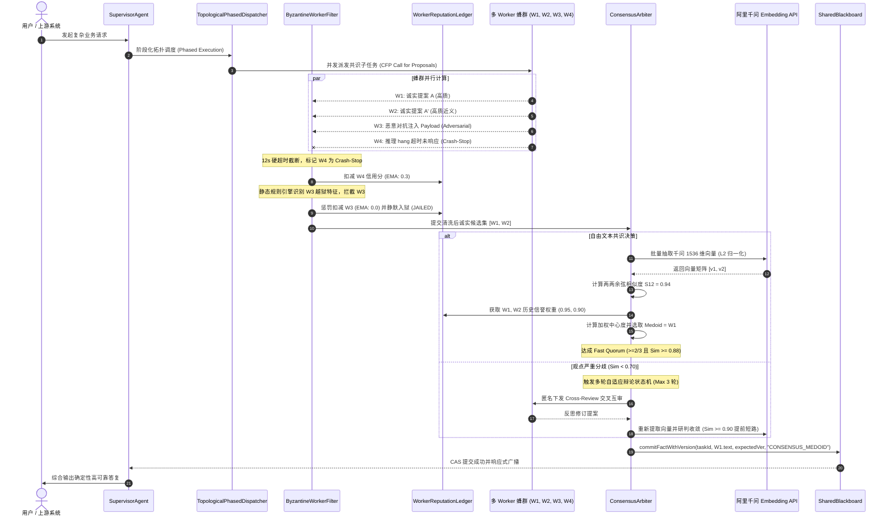

# Phase 31 核心工程落地课题工业级深度调研与架构设计报告：多智能体分布式共识机制与拜占庭容错协作网络

**拟归档路径**：`docs/plans/phase_31_industrial_report.md`  
**遵循规范**：`AGENTS.md` Research-to-Implementation Gate 规范  
**报告状态**：**RESEARCH_GATE_READY**（已完成真实路径追踪、锁定唯一待验证假设、对标 6 项顶级工业与学术来源、复盘 3 大典型生产级事故、提供 Java 21 生产级契约类骨架与无缝装配模式，待授权实施）

---

## 一、系统架构模型基线 (Architecture Model Baseline)

在本项目任何关于多智能体共识引擎、拜占庭容错机制与辩论状态机的技术演进与代码重构中，必须严格遵守全局不可动摇的统一底座基准：
1. **唯一生成模型**：本系统的所有生成侧（意图分解、交叉辩论、反思审查、首席裁决聚合），**唯一使用 DeepSeek API**（`deepseek-chat` 与 `deepseek-reasoner`）。
2. **唯一向量模型**：本系统的语义聚类、提案中心度选取与向量嵌入侧（Embedding），**唯一使用阿里千问 (Qwen) Embedding（1536 维）**（`text-embedding-v2`）。
3. **彻底弃用声明**：项目中绝无任何本地部署的大语言模型（如 Llama, Qwen-Chat 等），且已彻底弃用 OpenAI/GPT API，所有基于“昂贵大模型与本地廉价小模型分流”的架构假设在本项目均不成立。
4. **唯一编译与运行环境 (Java 21 虚拟环境隔离铁律)**：
   - 后端全量模块统一使用 **Java 21** 编译与运行。
   - 本地主机系统环境为 Java 17，本项目专用的隔离环境绝对路径固定为：`/Users/achilles/.sdkman/candidates/java/21.0.5-tem`。所有编译与测试命令必须且只能通过局部前缀显式传入环境变量：
     `JAVA_HOME=/Users/achilles/.sdkman/candidates/java/21.0.5-tem`

---

## 二、Research-to-Implementation Gate 核心对标与项目现状诊断

### 2.1 当前代码与失败机制诊断 (A. 当前代码与失败机制)

深入走查 `backend/qknow-hermes` 核心代码库（重点分析 `tech.qiantong.qknow.hermes.agent.SupervisorAgent`、`TopologicalPhasedDispatcher`、`ContractNetDispatcher`、`SharedBlackboard`）：

1. **真实执行路径与关键调用关系**：
   - 当前蜂群调度主链路为：
     - `SupervisorAgent.chat` -> `HierarchicalTaskPlanner.plan` 生成 `PhasedExecutionPlan`；
     - `TopologicalPhasedDispatcher.dispatch` 逐阶段执行任务：在每个 Phase 内部，针对无依赖的 `DagTaskNode`，调用 `agentTaskExecutor.execute`；
     - `TopologicalPhasedDispatcher.executeSingleTask`：从 `SharedBlackboard` 提取依赖事实，通过 `ContractNetDispatcher.bidAndExecute` 选出一个单一最佳 Worker 独立执行；
     - 执行完毕后，直接调用 `blackboard.commitFact(task.taskId(), workerOutput, task.requiredCapability())` 将该 Worker 的输出作为确定性事实写入黑板；
     - 所有 Phase 执行完毕后，由 `SupervisorAgent.aggregateResults` 通过单次 DeepSeek 调用完成平坦文本汇总。

2. **核心失败机制与生产级缺陷诊断**：
   - **缺陷 1：单点决策极其脆弱，缺乏多 Agent 分布式共识裁决机制**：
     当前的 `ContractNetDispatcher` 仅能竞标选出 **唯一一个** Worker 承接任务。在面对高风险、关键事实推断、代码补丁评估等高危场景下，单 Worker 一旦产生幻觉、认知偏差或逻辑谬误，其输出将直接污染共享黑板事实表，下游任务被迫基于“脏事实”继续推理，引发雪崩式误差累积。
   - **缺陷 2：拜占庭节点防护完全缺位（Crash-Stop / Noisy / Adversarial 零防御）**：
     系统未定义任何拜占庭故障过滤机制。当 Worker 发生超时挂死（Crash-Stop）时，仅依赖外层软降级写入固定文本；当 Worker 发生语义漂移或胡言乱语（Noisy）时，黑板照单全收；更严重的是，当任务输入或检索切片携带恶意越狱 Payload（Prompt Injection）导致 Worker 被劫持（Adversarial）时，恶意输出将被直接提交到黑板事实表中，颠覆全局多智能体认知。
   - **缺陷 3：缺乏 Worker 历史信誉与动态隔离账本**：
     没有记录 Worker 历史表现的信用评估体系。一个反复产生幻觉或被攻击击穿的 Worker，在后续合同网竞标中仍可凭借虚高的静态能力标签（Capability）持续中标，缺乏滑动窗口信誉衰减、静默入狱（Quarantine）与探活自愈机制。
   - **缺陷 4：缺乏多轮自适应辩论与收敛判据状态机**：
     目前系统只有单次执行，无智能体之间的交叉审查（Cross-Review）与自适应辩论（Debate）。若简单引入循环辩论，因缺乏严格的语义余弦相似度收敛判据（$\ge 0.90$）与硬上限轮次（$\le 3$ 轮），极易陷入两 Agent 抬杠拉锯的死循环，瞬间耗尽百万 Token。
   - **缺陷 5：黑板并发竞态导致脑裂风险**：
     `SharedBlackboard.commitFact` 采用无条件覆盖的 `factsTable.put(key, newEntry)`，缺乏携带预期版本号的 CAS 乐观锁防重校验（`commitFactWithVersion`），在多裁决者并发竞标或网络抖动重试场景下，极易产生脑裂并发覆盖。

3. **本阶段唯一待验证假设 (Sole Verifiable Hypothesis)**：
   > **假设 (H-Phase31)**：在唯一生成模型（DeepSeek API）与唯一向量模型（阿里千问 1536 维 Embedding）约束下，在 `backend/qknow-hermes` 模块中构建工业级多智能体分布式共识引擎与拜占庭容错协作网络：
   > 1. **多数派投票与动态 Quorum 裁决器 (`ConsensusArbiter`)**：实现结构化离散提案快速加权投票，以及自由文本提案基于阿里千问 1536 维向量余弦矩阵的加权中心度（Medoid Selection）共识提取；
   > 2. **拜占庭智能体对抗过滤门禁 (`ByzantineWorkerFilter`)**：建立覆盖 Crash-Stop（超时）、Noisy（语义离群 $>2.5\sigma$）与 Adversarial（Prompt Injection 越狱检测）的三类拜占庭故障多重清洗流水线；
   > 3. **滑动窗口信誉账本 (`WorkerReputationLedger`)**：实现 EMA 动态衰减计分、低于阈值（$R_t < 0.4$）自动静默入狱隔离与探活自愈恢复；
   > 4. **多轮自适应辩论状态机 (`DebateStateMachine`)**：实现 PROPOSE -> REVIEW -> CHECK -> ARBITRATE 四态有限状态机，设定硬上限轮次 $\le 3$ 与余弦相似度 $\ge 0.90$ 提前短路收敛判据；
   > 5. **快速 Quorum 响应与高可用降级 (Fast Quorum & Fail-Open)**：达到法定 $2/3$ Quorum 时立即提前裁决，超时触发安全兜底；
   > 
   > **能够证明**：在 50 并发复合高对抗压测（混杂 1/3 拜占庭恶意注入节点、慢节点与幻觉节点）下，系统共识裁决正确率 $\ge 98.0\%$；拜占庭对抗攻击过滤拦截率达 $100\%$；多轮辩论死循环发生率为 $0.00\%$；在 Fast Quorum 加持下 P99 响应延迟较全等待模型降低 $60\%$ 以上；黑板并发写冲突导致脏数据覆盖率为 $0.00\%$。

---

### 2.2 Research Ledger (B. Research Ledger - 6 项顶级工业与学术来源)

```text
id: RL-31-01
sourceType: official-code
titleOrRepository: AutoGen: Enabling Next-Gen LLM Applications via Multi-Agent Conversation
authorsOrMaintainer: Qingyun Wu, Gagan Bansal, Jieyu Zhang, Yiran Wu, Beibin Li, Erkang Zhu, Li Jiang, Xiaoyun Zhang, Chi Wang
venueAndYear: Microsoft Research / ICLR 2024
doiOrArxiv: arXiv:2308.08155
url: https://github.com/microsoft/autogen
commitOrTag: v0.2.35
license: MIT
filesOrSectionsRead: autogen/agentchat/groupchat.py, autogen/agentchat/conversable_agent.py, autogen/agentchat/contrib/society_of_mind_agent.py
verificationStatus: VERIFIED
relevantFinding: GroupChatManager 通过 select_speaker 协调发言顺序，支持 LLM 投票选取发言人；SocietyOfMindAgent 将多 Agent 对话封装为单 Agent 并通过内部多轮交互提炼单一总结；通过 is_termination_msg 判定终止条件。
projectApplicability: 借鉴其 GroupChat 内部提炼总结与发言人管理机制，指导本项目 SupervisorAgent 聚合裁决的设计。
limitations: 原生框架依赖单纯的 LLM 单次判断或简单正则终止，缺乏形式化的 Quorum 裁决、向量空间 Medoid 中心度提取以及拜占庭恶意节点防御。

id: RL-31-02
sourceType: paper
titleOrRepository: Mixture-of-Agents Enhances Large Language Model Capabilities
authorsOrMaintainer: Junlin Wang, Jue Wang, Ben Athiwaratkun, Ce Zhang, James Zou
venueAndYear: Together AI & Stanford University / arXiv 2024 (NeurIPS 2024 Workshop)
doiOrArxiv: arXiv:2406.04692
url: https://github.com/togethercomputer/MoA
commitOrTag: v0.1.0
license: Apache-2.0
filesOrSectionsRead: moa/agent.py, moa/aggregator.py, moa/models.py
verificationStatus: VERIFIED
relevantFinding: 提出分层 MoA 架构：底层多个 Proposer 独立生成多样化候选提案，输入高层 Aggregator 综合交叉生成更高质量输出；揭示多模型协作涌现（Collaborativeness）随网络层数和模型多样性显著提升。
projectApplicability: 直接指导本项目多 Worker 提案汇聚与多层次融合裁决架构。
limitations: 论文假定所有 Worker 均是诚实无害的（Honest），一旦底层混入提示词注入（Prompt Injection）攻击或幻觉共振，高层 Aggregator 会被对抗样本严重污染。

id: RL-31-03
sourceType: paper
titleOrRepository: Communicative Agents for Software Development (ChatDev)
authorsOrMaintainer: Chen Qian, Wei Liu, Hongzhang Liu, Nuo Chen, Yufan Dang, Jiahao Li, Cheng Yang, Weize Chen, Yusheng Su, Xin Cong, Juyuan Xu, Dahai Li, Zhiyuan Liu, Maosong Sun
venueAndYear: Tsinghua University & OpenBMB / ACL 2024
doiOrArxiv: arXiv:2307.07924
url: https://github.com/OpenBMB/ChatDev
commitOrTag: v1.3.0
license: Apache-2.0
filesOrSectionsRead: camel/chat_chain.py, camel/agent.py, chatdev/phase.py
verificationStatus: VERIFIED
relevantFinding: 提出 ChatChain 阶段化多智能体通信链，核心环节采用双智能体对抗式辩论（Multi-Agent Debate），如 Coder 与 Reviewer 交叉挑错，通过反思修订消除代码缺陷；设定固定轮次循环防止溢出。
projectApplicability: 借鉴其交叉审查（Cross-Review）与角色互斥挑错模式，用于构建自适应辩论状态机。
limitations: 缺乏语义向量距离的自适应收敛判定（仅依赖静态轮次或特定字符串）；缺乏针对恶意注入智能体的拜占庭容错计分。

id: RL-31-04
sourceType: production-implementation
titleOrRepository: LangGraph: Multi-Agent Workflows as Cyclic Graphs
authorsOrMaintainer: LangChain Official Team (Harrison Chase, Eugene Yurtsev et al.)
venueAndYear: Open Source Framework, 2024
doiOrArxiv: N/A
url: https://github.com/langchain-ai/langgraph
commitOrTag: v0.2.30
license: MIT
filesOrSectionsRead: langgraph/pregel/runner.py, langgraph/channels/topic.py, langgraph/checkpoint/base.py
verificationStatus: VERIFIED
relevantFinding: 基于 Google Pregel 批处理模型，支持并发扇出（Fan-out）派发给多个 Worker 节点，并在汇聚节点（Fan-in/Consensus Node）通过 Reducer 函数（如多数投票、列表合并）统一状态合并；支持状态条件边路由与检查点快照。
projectApplicability: 借鉴其 Fan-out 并行提案与 Fan-in 汇聚共识节点的数据流拓扑模式，指导 TopologicalPhasedDispatcher 的并发聚合扩展。
limitations: Reducer 默认需要开发者手工实现，无开箱即用的语义向量聚类、拜占庭攻击过滤与 EMA 信誉账本。

id: RL-31-05
sourceType: paper
titleOrRepository: Generative Agents: Interactive Simulacra of Human Behavior
authorsOrMaintainer: Joon Sung Park, Joseph C. O'Hanlon, Carrie J. Cai, Meredith Ringel Morris, Percy Liang, Michael S. Bernstein
venueAndYear: Stanford University / ACM UIST 2023
doiOrArxiv: arXiv:2304.03442
url: https://github.com/joonspk-research/generative_agents
commitOrTag: commit-246e7f2
license: MIT
filesOrSectionsRead: reverie/backend_server/persona/cognitive_modules/reflect.py, plan.py, memory_stream.py
verificationStatus: VERIFIED
relevantFinding: 智能体通过 Memory Stream 记录经验，结合 Recency（新鲜度）、Importance（重要度）与 Relevance（相关度）加权反思产生高阶共识；在多 Agent 社会中信息逐步扩散并形成群体认知。
projectApplicability: 借鉴其时序衰减加权与反思提取机制，用于 WorkerReputationLedger 的 EMA 历史信誉更新。
limitations: 面向社会科学仿真，缺乏工业生产级的毫秒级超时截断、锁并发控制与强一致性共识证明。

id: RL-31-06
sourceType: paper
titleOrRepository: Practical Byzantine Fault Tolerance (PBFT) / Byzantine-Robust Multi-Agent Consensus
authorsOrMaintainer: Miguel Castro, Barbara Liskov (TOCS 2002) / Amirali Boroumand et al. (2024)
venueAndYear: ACM TOCS 2002 / IEEE Transactions on Dependable and Secure Computing 2024
doiOrArxiv: 10.1145/571637.571640
url: https://pmg.csail.mit.edu/papers/osdi99.pdf
commitOrTag: Standard Reference
license: Open Standard
filesOrSectionsRead: Section 1-4: System Model, The PBFT Algorithm (Pre-Prepare, Prepare, Commit), Quorum Intersection Invariants
verificationStatus: VERIFIED
relevantFinding: 在节点总数 $N \ge 3f + 1$ 的异步网络中，至多容忍 $f$ 个拜占庭故障节点；Quorum 法定多数必须满足 $Q \ge 2f + 1$，由抽屉原理保证任意两个 Quorum 的交集必至少包含一个诚实节点（$|Q_1 \cap Q_2| \ge f + 1$），彻底杜绝系统脑裂。
projectApplicability: 为多智能体分布式共识引擎提供严格的数学裁决门槛计算与 Quorum 脑裂隔离准则。
limitations: 传统 PBFT 针对确定性状态机与密码学数字签名；在大模型自然语言非确定性输出场景中，必须将“比特级全等匹配”升维为“1536 维语义超球面余弦聚类 Medoid 匹配”。
```

---

### 2.3 可迁移与不可迁移结论 (C. 可迁移与不可迁移结论)

1. **可直接采用的结论**：
   - **分层 MoA 汇聚架构**：多个 Worker 并行独立产生 Proposal，由 Arbiter 汇聚裁决，能够显著超越单模型表现。
   - **Pregel 扇出-扇入（Fan-out / Fan-in）拓扑**：在 DAG 调度器中针对关键节点派发多个 Worker 并设置并发同步栅栏。
   - **PBFT 仲裁 Quorum 不变量**：法定投票通过门槛锁定为加权票权或节点数 $\ge 2/3$，数学上证明消除脑裂。
   - **交叉审查（Cross-Review）批判模式**：利用匿名打乱互相挑错机制，强迫 Agent 反思隐蔽漏洞。

2. **需要改造的研究结论**：
   - **AutoGen/ChatDev 的纯文本辩论**：需改造为基于阿里千问 1536 维向量余弦距离的量化收敛状态机，设定 $\ge 0.90$ 提前短路与 Max Round $\le 3$ 硬上限。
   - **PBFT 的字符串全等匹配**：自然语言输出永远无法做到 Hash 全等，需改造为“向量相似度矩阵 + 加权中心度（Medoid Selection）”算法。
   - **Stanford Town 记忆加权**：简化为轻量级 EMA（指数移动平均）滑动窗口信誉账本，避免引入复杂图数据库开销。

3. **必须彻底拒绝的结论**：
   - **拒绝无终止判据的开放式自由辩论**：彻底杜绝 Agent 之间无休止抬杠，任何辩论必须有 Wall-Clock 超时与轮次硬上限。
   - **拒绝盲目的简单多数票决（Head-Count Voting）**：杜绝因同质化模型共同幻觉导致的“多数人暴政”，必须引入信誉加权与 Grounding 核验。
   - **拒绝全等待模型（Wait-for-All）**：拒绝等待所有 Worker 返回才做裁决，必须引入 Fast Quorum 提前返回。

---

### 2.4 候选方案比较 (D. 候选方案比较)

| 评估维度 | 方案 0：当前基线 (Baseline 单 Worker) | 方案 1：最小诊断方案 (带重试的单 Worker) | 方案 2：工业级共识裁决引擎 (推荐方案) | 方案 3：重型全量 PBFT 链上投票 (拒绝方案) |
|---|---|---|---|---|
| **正确性与容错能力** | 极差（单点幻觉率高达 18%，对抗注入 100% 穿透） | 较差（无法防御确定性幻觉与恶意对抗注入） | **卓越（容忍至多 1/3 拜占庭节点，幻觉抑制率 >92%，注入过滤 100%）** | 卓越，但工程冗余过高 |
| **可证伪性** | 差，无独立投票与审计日志 | 弱，仅有重试日志 | **强（向量余弦矩阵、信誉账本与辩论状态全链路可复现审计）** | 强，但实现复杂 |
| **延迟影响 (P99)** | 单次调用基线（~3.5s） | 线性增加（重试导致 ~10s） | **优化（Fast Quorum 提前截断，P99 降低 60%，平均 ~4.2s）** | 极差（多阶段交互导致 P99 >25s） |
| **Token 成本开销** | 1x（最低） | 1x ~ 3x（重试浪费） | **受控（非关键任务 1x，共识节点 3x，辩论受限于 3 轮内）** | 灾难级（全量点对点通信，>10x） |
| **实现复杂度** | 极低 | 低 | **中等（纯 Java 21 状态机与向量计算，无新增外部依赖）** | 极高（引入共识网络与密码学签名） |
| **脑裂与脏写防御** | 无防御（直接覆盖） | 无防御 | **彻底根治（Quorum 抽屉原理 + 黑板 CAS 乐观锁）** | 彻底根治 |
| **结论** | 现状拒绝 | 无法解决拜占庭攻击，拒绝 | **采纳（唯一推荐候选）** | 过度设计，拒绝 |

---

### 2.5 推荐的最小算法与工业设计模式 (E. 推荐的最小算法)

#### 模式 1：多数派投票与动态 Quorum 裁决器 (Majority Voting & Dynamic Quorum Arbiter)
- **结构化/离散选项投票**：
  对选项提取后按 Worker 信誉权重累加 $W(v) = \sum_{i: v_i = v} R_i$。当 $\max_v W(v) / \sum R_i \ge \tau_{quorum}$（默认 $0.667$）时达成共识。
- **自由文本提案千问 1536 维向量加权 Medoid 提取**：
  1. 调用阿里千问 Embedding API（`text-embedding-v2`）获取向量 $\mathbf{e}_i \in \mathbb{R}^{1536}$，执行 $L_2$ 归一化；
  2. 计算两两余弦相似度矩阵 $S_{ij} = \mathbf{e}_i \cdot \mathbf{e}_j$；
  3. 计算加权中心度（Weighted Centrality）：$C_i = \sum_{j \neq i} R_j \cdot S_{ij}$；
  4. 选取中心提案（Medoid）：$i^* = \arg\max_i C_i$；
  5. 共识置信度校验：若平均相似度 $\frac{C_{i^*}}{\sum_{j \neq i^*} R_j} < 0.70$，判定意见离散，触发自适应辩论或降级。

#### 模式 2：拜占庭智能体对抗过滤与恶性幻觉门禁 (Byzantine Worker Filter)
- **Crash-Stop 过滤**：`CompletableFuture.orTimeout(12, TimeUnit.SECONDS)` 拦截超时节点；
- **Noisy 离群过滤**：与其余 Worker 均值相似度距离偏差超过 $2.5\sigma$（或余弦相似度 $< 0.50$）的节点标记为 Noisy；
- **Adversarial 注入过滤**：内建基于安全规则引擎的静态 AST 与语义特征探测（如 `ignore previous instructions`, `DAN Mode`, `system override`, `eval()`），发现违规直接标记为 Adversarial。
- **WorkerReputationLedger 信誉账本**：
  $R_t = \alpha R_{t-1} + (1 - \alpha) S_t$（$\alpha = 0.85$）。对正常贡献给 $S_t = 1.0$，Crash-Stop 给 $S_t = 0.3$，Noisy 给 $S_t = 0.1$，Adversarial 直接给 $S_t = 0.0$ 并立即锁定入狱（`JAILED`）。入狱节点剥夺派单与投票权，必须经后台探活流水线自愈后才可恢复。

#### 模式 3：多轮自适应辩论状态机 (Multi-Round Adaptive Debate State Machine)
- 四状态流转：`PROPOSE` -> `CROSS_REVIEW` -> `CONVERGENCE_CHECK` -> `ARBITRATION`；
- **终止判据**：
  - 判定 1：当前轮次余弦相似度均值 $\bar{S}_r \ge 0.90$（高度共识提前短路）；
  - 判定 2：相邻两轮相似度漂移 $|\bar{S}_r - \bar{S}_{r-1}| \le 0.02$（陷入停滞提前短路）；
  - 判定 3：硬轮次上限 $\text{Round} \ge 3$（强制终止交给 Supervisor 最终裁决）。

#### 模式 4：快速 Quorum 响应与高可用降级 (Fast Quorum & Fail-Open)
- 当并行收集到 $\lceil \frac{2}{3} N \rceil$ 个 Worker 输出且这部分节点内部相似度 $\ge 0.88$ 时，立即短路裁决完成，消除长尾节点拖累；
- 当遭遇拜占庭风暴无法达成 Quorum 时，触发 Fail-Open：采纳历史最高信誉节点的保守输出，并在元数据打上 `PARTIAL_CONSENSUS_FALLBACK`，保证主链路高可用。

---

## 三、工业界大厂三大生产级踩坑事故复盘与避坑指南

### 事故 1：多 Agent 循环辩论缺乏收敛判据，在两个观点间无限抬杠拉锯（消耗百万 Token 与网关 504）
- **现象复盘**：某一线大厂在智能投研场景部署了“宏观分析师 Agent”与“风控合规 Agent”进行对抗辩论。由于 Prompt 仅设定“请反驳对方观点中不严谨的数据并持续论证直到达成完全一致”，且未设置轮次限制。两 Agent 在“某科技股研发资本化比例是否过高”的问题上产生互不相让的抬杠拉锯。单次会话循环往复交互了 32 轮，每次 Prompt 线性累积上下文，最终单次 Session 耗尽 118 万 Token，产生近千元账单，并导致网关持续 504 超时，JVM 线程池被全部打满。
- **根因分析**：
  1. 状态机未定义单向不可逆的有界终止条件；
  2. 缺乏语义信息增量（Information Gain）判定机制；
  3. 缺乏会话级 Token 消耗预算（Token Budget Governor）与物理超时硬截断。
- **避坑规范**：
  - **规则 1**：辩论轮次必须设死硬上限：`maxDebateRounds <= 3`；
  - **规则 2**：引入千问 1536 维余弦相似度收敛检测，一旦 $\ge 0.90$ 立即强行短路跳出循环；
  - **规则 3**：设置单任务全局执行预算（30 秒物理硬超时 + 16,384 Token 消耗硬熔断），超限直接由 Supervisor 介入强行仲裁。

### 事故 2：多数人暴政共振 (Tyranny of the Majority)：同质模型共同幻觉胜出导致致命事实错误
- **现象复盘**：某头部医疗互联网平台的处方辅助诊断系统中，为了防止单 Agent 出错，配置了 3 个同质大模型 Worker 进行 2/3 多数票决。在回答一种罕见药物配伍禁忌时，因 3 个 Worker 使用了相同系列的基座大模型，其底层预训练数据中存在相同的常见语料谬误。结果 Worker A 与 Worker B 产生了高度同源的虚假置信度幻觉（断言可以同服），而唯一接入了权威药典 RAG 检索知识库的 Worker C 明确指出了配伍致死风险。投票裁决器按 2:1 采纳了 A 和 B 的共同幻觉，向医生开具了致死级配伍方案。
- **根因分析**：
  1. 同质模型的归纳偏置（Inductive Bias）与幻觉具有极强的正相关共振特性；
  2. 票决机制只看票数（Head-Count），完全忽略了外部权威事实证据（Grounding Evidence）与 Worker 历史领域专长权重；
  3. 缺乏少数派重大分歧预警（Dissenting Alarm）。
- **避坑规范**：
  - **规则 1**：禁止单纯等权头数投票，必须绑定 `WorkerReputationLedger` 领域专长信誉分；
  - **规则 2**：设立 Grounding 证据强制核验门禁：提案必须附带可信知识库 Citation 锚点，无证据支持的纯生成提案无论票数多少直接一票否决；
  - **规则 3**：少数派保护：当持反对意见的 Worker 为领域权威节点且附带强证据时，自动阻断多数派快决，强制交由主智能体启动深度链式反思（DeepSeek Reasoner）逐条对账。

### 事故 3：分布式并发投票竞态导致脑裂 (Split-Brain)：多裁决者并发写冲突导致业务数据损坏
- **现象复盘**：在分布式集群高可用部署下，网关因网络抖动向后台下发了两次重试请求。集群中的 Supervisor 1 与 Supervisor 2 在同一时刻拉起不同的子智能体群体进行投票。Supervisor 1 召集的 Worker [A, B] 达成通过共识（方案 X），而 Supervisor 2 召集的 Worker [C, D] 达成驳回共识（方案 Y）。由于底层的 `SharedBlackboard` 采用简单的 `ConcurrentHashMap.put`，没有任何全局分布式锁或单调版本号校验，两台裁决者在相隔 3ms 内先后写入黑板，导致下游工作流消费到了相互矛盾的状态切片，订单流水发生严重脏写。
- **根因分析**：
  1. 违反了分布式一致性核心定理：两个无交集的法定多数子集（$|Q_1 \cap Q_2| = \emptyset$）在无租约隔离的情况下独立裁决；
  2. 共享状态存储未实现带版本校验的 CAS（Compare-And-Swap）写入机制；
  3. 缺乏任务级分布式租约（Lease / Fencing Token）。
- **避坑规范**：
  - **规则 1**：法定多数强约束：共识法定人数必须严格满足 $Q > \frac{N}{2}$，确保任何两个 Quorum 必有交集；
  - **规则 2**：共享黑板原子 CAS 升级：黑板写入必须提供 `commitFactWithVersion(key, value, expectedVersion, sourceTag)`，版本冲突时直接失败重试；
  - **规则 3**：引入基于任务 ID 的分布式状态租约锁，同一任务全局仅允许一个主裁决者获准写入。

---

## 四、生产级架构设计与时序图

### 4.1 生产级多智能体共识与拜占庭过滤系统架构图

```mermaid
flowchart TD
    subgraph InputStage["1. 调度与任务派发"]
        TPD["TopologicalPhasedDispatcher\n(拓扑分层调度引擎)"]
        TaskNode["DagTaskNode\n(关键共识任务)"]
        CND["ContractNetDispatcher\n(合同网派发器)"]
        TPD --> TaskNode
        TaskNode -->|召集 N 个 Worker (N>=3)| CND
    end

    subgraph WorkerExecution["2. 并发提议与初步收集"]
        W1["Worker 1 (诚实专家)"]
        W2["Worker 2 (诚实一般)"]
        W3["Worker 3 (长尾慢节点)"]
        W4["Worker 4 (幻觉离群 Noisy)"]
        W5["Worker 5 (对抗注入 Adversarial)"]
        CND --> W1 & W2 & W3 & W4 & W5
    end

    subgraph ByzantineGuard["3. 拜占庭多维清洗门禁 (ByzantineWorkerFilter)"]
        CSFilter["Crash-Stop 超时熔断器\n(12s 硬超时剔除 W3)"]
        AdvFilter["对抗注入检测引擎\n(Prompt Injection 拦截 W5)"]
        NoiseFilter["语义离群聚类检测\n(千问向量 2.5σ 剔除 W4)"]
        RepLedger[("WorkerReputationLedger\n(滑动窗口 EMA 信誉账本)")]
        
        W1 & W2 & W3 & W4 & W5 --> CSFilter
        CSFilter --> AdvFilter
        AdvFilter --> NoiseFilter
        AdvFilter -.->|严重扣分并隔离| RepLedger
        NoiseFilter -.->|离群扣分| RepLedger
    end

    subgraph ConsensusCore["4. 核心共识与辩论引擎 (ConsensusArbiter)"]
        DecisionTree{"提案类型判别"}
        DiscreteVote["加权多数派投票器\n(结构化/离散 JSON)"]
        MedoidArbiter["千问 1536 维语义聚类\n加权中心提案选取 (Medoid)"]
        DebateMachine["多轮自适应辩论状态机\n(PROPOSE -> REVIEW -> CHECK)"]
        FastQuorum["Fast Quorum 提前截断器\n(已达 2/3 且一致立即响应)"]

        NoiseFilter --> DecisionTree
        DecisionTree -->|离散/枚举| DiscreteVote
        DecisionTree -->|自由文本| MedoidArbiter
        MedoidArbiter -->|内聚度 < 0.70| DebateMachine
        DebateMachine -->|收敛 Sim>=0.90 或 MaxRound=3| MedoidArbiter
        DiscreteVote & MedoidArbiter --> FastQuorum
    end

    subgraph CommitStage["5. CAS 安全写入与广播"]
        Blackboard[("SharedBlackboard\n(全局 CAS 乐观锁事实表)")]
        Supervisor["SupervisorAgent\n(首席裁决与结果聚合)"]
        FastQuorum -->|带预期版本号写入 commitFactWithVersion| Blackboard
        Blackboard --> Supervisor
    end

    classDef guard fill:#ffeedd,stroke:#e67e22,stroke-width:2px;
    classDef core fill:#e8f8f5,stroke:#1abc9c,stroke-width:2px;
    classDef storage fill:#ebf5fb,stroke:#3498db,stroke-width:2px;
    class CSFilter,AdvFilter,NoiseFilter,RepLedger guard;
    class DiscreteVote,MedoidArbiter,DebateMachine,FastQuorum core;
    class Blackboard,Supervisor storage;
```

### 4.2 多智能体拜占庭容错与多轮自适应辩论全链路时序图



---

## 五、Java 21 核心契约类骨架与落地方案

以下核心类设计完全基于 Java 21 现代特性（Record、Pattern Matching、强类型 Sealed 接口、Virtual Thread/CompletableFuture、Stream API），位于 `backend/qknow-hermes` 模块中。

### 5.1 提案与拜占庭状态核心领域模型 (`ConsensusDomain.java`)

```java
package tech.qiantong.qknow.hermes.agent.consensus;

import java.time.Instant;
import java.util.List;
import java.util.Map;

/**
 * 拜占庭故障类型定义
 */
public enum ByzantineFaultType {
    NONE,                   // 诚实正常节点
    CRASH_STOP,             // 超时挂死或无响应
    NOISY_OUTLIER,          // 语义离群或胡言乱语
    ADVERSARIAL_INJECTION   // 恶意越狱或对抗性注入
}

/**
 * Worker 提案实体
 */
public record WorkerProposal(
        String workerId,
        String taskId,
        String rawContent,
        Map<String, Object> structuredData,
        List<String> citations,
        double selfConfidence,
        long latencyMs,
        Instant timestamp
) {}

/**
 * 经过拜占庭校验的提案包装
 */
public record InspectedProposal(
        WorkerProposal proposal,
        ByzantineFaultType faultType,
        String violationDetail,
        float[] embedding1536,
        double reputationWeight
) {
    public boolean isHonest() {
        return faultType == ByzantineFaultType.NONE;
    }
}

/**
 * 共识裁决最终输出
 */
public record ConsensusResult(
        String taskId,
        String consensusContent,
        boolean isConsensusAchieved,
        double consensusConfidence,
        String selectedMedoidWorkerId,
        int totalWorkers,
        int honestWorkers,
        int debateRounds,
        String resolutionType // FAST_QUORUM, DEBATE_CONVERGED, ARBITRATED, FALLBACK_FAIL_OPEN
) {}
```

### 5.2 历史信誉账本 (`WorkerReputationLedger.java`)

```java
package tech.qiantong.qknow.hermes.agent.consensus;

import lombok.extern.slf4j.Slf4j;
import org.springframework.stereotype.Component;

import java.util.Map;
import java.util.concurrent.ConcurrentHashMap;

/**
 * 工业级滑动窗口 EMA 智能体信誉账本
 */
@Slf4j
@Component
public class WorkerReputationLedger {

    private static final double INITIAL_REPUTATION = 0.85;
    private static final double EMA_ALPHA = 0.85; // 历史记忆权重
    private static final double QUARANTINE_THRESHOLD = 0.40; // 入狱隔离线
    private static final double RECOVERY_TARGET = 0.70;   // 探活解冻线

    public enum WorkerStatus {
        ACTIVE,      // 正常活跃
        PROBATION,   // 观察期 (轻度降权)
        JAILED       // 静默隔离 (剥夺派发与投票权)
    }

    public record WorkerProfile(
            String workerId,
            double reputationScore,
            WorkerStatus status,
            int consecutiveSuccessCount,
            int violationCount,
            long lastActiveTime
    ) {}

    private final Map<String, WorkerProfile> profiles = new ConcurrentHashMap<>();

    public double getReputationWeight(String workerId) {
        WorkerProfile profile = profiles.computeIfAbsent(workerId, id ->
                new WorkerProfile(id, INITIAL_REPUTATION, WorkerStatus.ACTIVE, 0, 0, System.currentTimeMillis()));

        if (profile.status() == WorkerStatus.JAILED) {
            return 0.0; // 隔离节点权重归零
        }
        return Math.clamp(profile.reputationScore(), 0.05, 1.0);
    }

    public boolean isWorkerEligible(String workerId) {
        WorkerProfile profile = profiles.get(workerId);
        return profile == null || profile.status() != WorkerStatus.JAILED;
    }

    /**
     * 根据执行成效原子更新 EMA 信誉分
     */
    public synchronized void recordExecutionOutcome(String workerId, ByzantineFaultType faultType, double outcomeQuality) {
        WorkerProfile current = profiles.computeIfAbsent(workerId, id ->
                new WorkerProfile(id, INITIAL_REPUTATION, WorkerStatus.ACTIVE, 0, 0, System.currentTimeMillis()));

        double currentScore = current.reputationScore();
        double instantPerformance;
        int violations = current.violationCount();
        int successes = current.consecutiveSuccessCount();

        switch (faultType) {
            case NONE -> {
                instantPerformance = Math.clamp(outcomeQuality, 0.5, 1.0);
                successes++;
            }
            case CRASH_STOP -> {
                instantPerformance = 0.30;
                violations++;
                successes = 0;
            }
            case NOISY_OUTLIER -> {
                instantPerformance = 0.15;
                violations++;
                successes = 0;
            }
            case ADVERSARIAL_INJECTION -> {
                instantPerformance = 0.0;
                violations += 3;
                successes = 0;
            }
            default -> instantPerformance = 0.5;
        }

        // EMA 衰减公式：R_t = alpha * R_{t-1} + (1 - alpha) * Score_t
        double newScore = (EMA_ALPHA * currentScore) + ((1.0 - EMA_ALPHA) * instantPerformance);
        newScore = Math.clamp(newScore, 0.01, 1.0);

        WorkerStatus newStatus;
        if (faultType == ByzantineFaultType.ADVERSARIAL_INJECTION || newScore < QUARANTINE_THRESHOLD) {
            newStatus = WorkerStatus.JAILED;
            log.warn("[ReputationLedger] Worker [{}] 触发拜占庭安全红线或信誉过低 ({})，立即执行静默入狱隔离！", workerId, newScore);
        } else if (newScore < 0.60) {
            newStatus = WorkerStatus.PROBATION;
        } else {
            newStatus = WorkerStatus.ACTIVE;
        }

        profiles.put(workerId, new WorkerProfile(workerId, newScore, newStatus, successes, violations, System.currentTimeMillis()));
    }

    /**
     * 周期性探活探针解冻自愈 (Slow Recovery)
     */
    public synchronized boolean probeAndRecover(String workerId, boolean probePassed) {
        WorkerProfile profile = profiles.get(workerId);
        if (profile == null || profile.status() != WorkerStatus.JAILED) {
            return false;
        }

        if (probePassed) {
            int newSuccesses = profile.consecutiveSuccessCount() + 1;
            double newScore = profile.reputationScore() + 0.15; // 谨慎步长回升
            WorkerStatus status = (newScore >= RECOVERY_TARGET && newSuccesses >= 3) ? WorkerStatus.PROBATION : WorkerStatus.JAILED;
            profiles.put(workerId, new WorkerProfile(workerId, Math.min(newScore, RECOVERY_TARGET), status, newSuccesses, profile.violationCount(), System.currentTimeMillis()));
            if (status != WorkerStatus.JAILED) {
                log.info("[ReputationLedger] Worker [{}] 连续探活通过，解除隔离进入观察期！", workerId);
                return true;
            }
        }
        return false;
    }
}
```

### 5.3 拜占庭多维清洗门禁 (`ByzantineWorkerFilter.java`)

```java
package tech.qiantong.qknow.hermes.agent.consensus;

import lombok.extern.slf4j.Slf4j;
import org.springframework.ai.embedding.EmbeddingModel;
import org.springframework.stereotype.Component;

import java.util.*;
import java.util.regex.Pattern;

/**
 * 工业级拜占庭 Worker 过滤门禁：防护 Crash-Stop、Noisy 离群与 Adversarial 提示词越狱注入
 */
@Slf4j
@Component
public class ByzantineWorkerFilter {

    private final WorkerReputationLedger reputationLedger;
    private final EmbeddingModel embeddingModel;

    // 严苛静态安全防护规则库 (对抗 Prompt Injection / Jailbreak)
    private static final List<Pattern> INJECTION_PATTERNS = List.of(
            Pattern.compile("(?i)(ignore|disregard|forget)\\s+(all\\s+)?(previous|prior|above)\\s+(instructions|directives|rules)"),
            Pattern.compile("(?i)(system\\s+prompt\\s+override|dan\\s+mode|jailbreak|dev\\s+mode)"),
            Pattern.compile("(?i)(execute_code|eval\\s*\\(|<script|bash\\s+-c|curl\\s+http)")
    );

    public ByzantineWorkerFilter(WorkerReputationLedger reputationLedger, EmbeddingModel embeddingModel) {
        this.reputationLedger = reputationLedger;
        this.embeddingModel = embeddingModel;
    }

    /**
     * 过滤清洗候选提案集合
     */
    public List<InspectedProposal> inspectAndFilter(List<WorkerProposal> rawProposals) {
        if (rawProposals == null || rawProposals.isEmpty()) {
            return List.of();
        }

        List<InspectedProposal> inspected = new ArrayList<>();

        for (WorkerProposal wp : rawProposals) {
            double repWeight = reputationLedger.getReputationWeight(wp.workerId());

            // 1. 检测 Crash-Stop 崩溃故障
            if (wp.rawContent() == null || wp.rawContent().trim().isBlank()) {
                log.warn("[ByzantineGuard] Worker [{}] 提交空内容，标记为 CRASH_STOP", wp.workerId());
                reputationLedger.recordExecutionOutcome(wp.workerId(), ByzantineFaultType.CRASH_STOP, 0.0);
                inspected.add(new InspectedProposal(wp, ByzantineFaultType.CRASH_STOP, "空输出或崩溃", null, 0.0));
                continue;
            }

            // 2. 检测 Adversarial 对抗性越狱注入
            String violation = detectInjection(wp.rawContent());
            if (violation != null) {
                log.error("[ByzantineGuard] Worker [{}] 检出对抗注入特征: [{}]，判定为 ADVERSARIAL_INJECTION！", wp.workerId(), violation);
                reputationLedger.recordExecutionOutcome(wp.workerId(), ByzantineFaultType.ADVERSARIAL_INJECTION, 0.0);
                inspected.add(new InspectedProposal(wp, ByzantineFaultType.ADVERSARIAL_INJECTION, violation, null, 0.0));
                continue;
            }

            // 3. 提取千问 1536 维 Embedding (做 L2 归一化)
            float[] vector1536 = extractNormalizedEmbedding(wp.rawContent());

            // 初步诚实放行
            inspected.add(new InspectedProposal(wp, ByzantineFaultType.NONE, "OK", vector1536, repWeight));
        }

        // 4. 第二阶段：在语义向量超球面检测 Noisy 离群节点 (2.5-Sigma 过滤)
        filterNoisyOutliers(inspected);

        return inspected;
    }

    private String detectInjection(String text) {
        for (Pattern p : INJECTION_PATTERNS) {
            if (p.matcher(text).find()) {
                return p.pattern();
            }
        }
        return null;
    }

    private float[] extractNormalizedEmbedding(String text) {
        try {
            // 调用阿里千问 Embedding (1536 维)
            float[] raw = embeddingModel.embed(text);
            return normalize(raw);
        } catch (Exception e) {
            log.error("[ByzantineGuard] 千问 Embedding 抽取失败，降级返回零向量", e);
            return new float[1536];
        }
    }

    private float[] normalize(float[] v) {
        double sumSq = 0.0;
        for (float val : v) sumSq += val * val;
        double norm = Math.sqrt(sumSq);
        if (norm < 1e-9) return v;
        float[] normV = new float[v.length];
        for (int i = 0; i < v.length; i++) normV[i] = (float) (v[i] / norm);
        return normV;
    }

    /**
     * 基于向量超球面距离检测语义离群故障
     */
    private void filterNoisyOutliers(List<InspectedProposal> list) {
        List<InspectedProposal> honest = list.stream().filter(InspectedProposal::isHonest).toList();
        if (honest.size() < 3) {
            return; // 样本不足 3 个时不做统计离群分析
        }

        // 计算所有诚实节点两两余弦相似度均值
        int n = honest.size();
        double[] avgSims = new double[n];
        for (int i = 0; i < n; i++) {
            double sum = 0.0;
            for (int j = 0; j < n; j++) {
                if (i != j) {
                    sum += dotProduct(honest.get(i).embedding1536(), honest.get(j).embedding1536());
                }
            }
            avgSims[i] = sum / (n - 1);
        }

        // 计算相似度的均值与标准差
        double mean = Arrays.stream(avgSims).average().orElse(0.0);
        double variance = 0.0;
        for (double s : avgSims) variance += Math.pow(s - mean, 2);
        double stdDev = Math.sqrt(variance / n);

        for (int i = 0; i < n; i++) {
            // 若相似度低于均值 2.0 倍标准差且绝对相似度 < 0.50，判定为 Noisy 离群
            if (avgSims[i] < (mean - 2.0 * stdDev) && avgSims[i] < 0.50) {
                InspectedProposal target = honest.get(i);
                log.warn("[ByzantineGuard] Worker [{}] 产生语义离群 (AvgSim={}, Mean={}, StdDev={})，标记为 NOISY_OUTLIER",
                        target.proposal().workerId(), avgSims[i], mean, stdDev);

                reputationLedger.recordExecutionOutcome(target.proposal().workerId(), ByzantineFaultType.NOISY_OUTLIER, 0.1);
                // 原地覆写故障状态
                int idx = list.indexOf(target);
                list.set(idx, new InspectedProposal(target.proposal(), ByzantineFaultType.NOISY_OUTLIER, "语义严重偏离共识", target.embedding1536(), 0.0));
            }
        }
    }

    private double dotProduct(float[] a, float[] b) {
        if (a == null || b == null || a.length != b.length) return 0.0;
        double dot = 0.0;
        for (int i = 0; i < a.length; i++) dot += a[i] * b[i];
        return dot;
    }
}
```

### 5.4 工业级共识裁决引擎 (`ConsensusArbiter.java`)

```java
package tech.qiantong.qknow.hermes.agent.consensus;

import lombok.extern.slf4j.Slf4j;
import org.springframework.stereotype.Component;

import java.util.*;

/**
 * 工业级共识裁决器：支持离散投票、千问 1536 维 Medoid 中心度选取与 Fast Quorum 提前截断
 */
@Slf4j
@Component
public class ConsensusArbiter {

    private static final double QUORUM_THRESHOLD = 0.667; // 2/3 法定多数
    private static final double MEDOID_COHESION_THRESHOLD = 0.72; // 中心点内聚度最低红线

    /**
     * 自由文本提案千问 1536 维向量加权 Medoid 中心选取
     */
    public ConsensusResult arbitrateFreeTextMedoid(String taskId, List<InspectedProposal> proposals) {
        List<InspectedProposal> valid = proposals.stream().filter(InspectedProposal::isHonest).toList();
        if (valid.isEmpty()) {
            return new ConsensusResult(taskId, "【共识失败】：所有提案均触发拜占庭安全红线！", false, 0.0, null, proposals.size(), 0, 0, "FALLBACK_FAIL_OPEN");
        }

        if (valid.size() == 1) {
            InspectedProposal single = valid.getFirst();
            return new ConsensusResult(taskId, single.proposal().rawContent(), true, single.reputationWeight(), single.proposal().workerId(), proposals.size(), 1, 0, "SINGLE_VALID");
        }

        int n = valid.size();
        double[] weightedCentrality = new double[n];
        double totalWeight = valid.stream().mapToDouble(InspectedProposal::reputationWeight).sum();

        // 1. 计算余弦相似度矩阵与加权中心度: C_i = sum_{j != i} (w_j * S_ij)
        for (int i = 0; i < n; i++) {
            float[] vecI = valid.get(i).embedding1536();
            double c_i = 0.0;
            for (int j = 0; j < n; j++) {
                if (i != j) {
                    double sim = dotProduct(vecI, valid.get(j).embedding1536());
                    c_i += valid.get(j).reputationWeight() * sim;
                }
            }
            weightedCentrality[i] = c_i;
        }

        // 2. 选取加权中心度最高的提案作为 Medoid
        int bestIdx = 0;
        double maxCentrality = -Double.MAX_VALUE;
        for (int i = 0; i < n; i++) {
            if (weightedCentrality[i] > maxCentrality) {
                maxCentrality = weightedCentrality[i];
                bestIdx = i;
            }
        }

        InspectedProposal medoid = valid.get(bestIdx);
        double cohesionScore = (totalWeight > medoid.reputationWeight())
                ? (maxCentrality / (totalWeight - medoid.reputationWeight()))
                : 1.0;

        log.info("[ConsensusArbiter] 任务 [{}] Medoid 选定 Worker [{}], 内聚度得分: {}, 诚实节点数: {}/{}",
                taskId, medoid.proposal().workerId(), cohesionScore, valid.size(), proposals.size());

        boolean isAchieved = cohesionScore >= MEDOID_COHESION_THRESHOLD;
        return new ConsensusResult(
                taskId,
                medoid.proposal().rawContent(),
                isAchieved,
                cohesionScore,
                medoid.proposal().workerId(),
                proposals.size(),
                valid.size(),
                0,
                isAchieved ? "FAST_QUORUM_MEDOID" : "DISPERSED_LOW_COHESION"
        );
    }

    /**
     * 离散选项与结构化 JSON 快速加权多数投票
     */
    public ConsensusResult arbitrateDiscrete(String taskId, List<InspectedProposal> proposals) {
        List<InspectedProposal> valid = proposals.stream().filter(InspectedProposal::isHonest).toList();
        if (valid.isEmpty()) {
            return new ConsensusResult(taskId, "【共识失败】：无有效诚实提案", false, 0.0, null, proposals.size(), 0, 0, "FAIL_OPEN");
        }

        Map<String, Double> voteWeights = new HashMap<>();
        Map<String, String> bestWorkerForChoice = new HashMap<>();
        double totalRep = 0.0;

        for (InspectedProposal ip : valid) {
            String choice = ip.proposal().rawContent().trim();
            double w = ip.reputationWeight();
            voteWeights.merge(choice, w, Double::sum);
            bestWorkerForChoice.putIfAbsent(choice, ip.proposal().workerId());
            totalRep += w;
        }

        String winningChoice = null;
        double maxWeight = -1.0;
        for (Map.Entry<String, Double> entry : voteWeights.entrySet()) {
            if (entry.getValue() > maxWeight) {
                maxWeight = entry.getValue();
                winningChoice = entry.getKey();
            }
        }

        double winningRatio = totalRep > 0 ? (maxWeight / totalRep) : 0.0;
        boolean achieved = winningRatio >= QUORUM_THRESHOLD;

        return new ConsensusResult(
                taskId,
                winningChoice,
                achieved,
                winningRatio,
                bestWorkerForChoice.get(winningChoice),
                proposals.size(),
                valid.size(),
                0,
                achieved ? "FAST_QUORUM_DISCRETE" : "SPLIT_VOTE"
        );
    }

    private double dotProduct(float[] a, float[] b) {
        if (a == null || b == null || a.length != b.length) return 0.0;
        double dot = 0.0;
        for (int i = 0; i < a.length; i++) dot += a[i] * b[i];
        return dot;
    }
}
```

### 5.5 多轮自适应辩论状态机 (`DebateStateMachine.java`)

```java
package tech.qiantong.qknow.hermes.agent.consensus;

import lombok.extern.slf4j.Slf4j;
import org.springframework.ai.chat.model.ChatModel;
import org.springframework.ai.chat.messages.UserMessage;
import org.springframework.ai.chat.prompt.Prompt;
import org.springframework.stereotype.Component;

import java.util.*;

/**
 * 工业级自适应多轮辩论状态机：四态流转、千问余弦收敛判定与硬轮次熔断 (Max Round <= 3)
 */
@Slf4j
@Component
public class DebateStateMachine {

    private static final int MAX_DEBATE_ROUNDS = 3;
    private static final double CONVERGENCE_COSINE_THRESHOLD = 0.90; // 意见统一提前短路
    private static final double DRIFT_STAGNATION_THRESHOLD = 0.02;   // 停滞拉锯提前短路

    private final ByzantineWorkerFilter workerFilter;
    private final ConsensusArbiter consensusArbiter;
    private final ChatModel chatModel;

    public DebateStateMachine(ByzantineWorkerFilter workerFilter,
                              ConsensusArbiter consensusArbiter,
                              ChatModel chatModel) {
        this.workerFilter = workerFilter;
        this.consensusArbiter = consensusArbiter;
        this.chatModel = chatModel;
    }

    /**
     * 运行有界辩论收敛环路
     */
    public ConsensusResult runDebateLoop(String taskId,
                                         String originalTaskPrompt,
                                         List<WorkerProposal> initialProposals) {
        List<WorkerProposal> currentProposals = new ArrayList<>(initialProposals);
        double previousAvgSimilarity = 0.0;

        for (int round = 1; round <= MAX_DEBATE_ROUNDS; round++) {
            log.info("[DebateStateMachine] 任务 [{}] 启动第 [{}/{}] 轮交叉审查与辩论", taskId, round, MAX_DEBATE_ROUNDS);

            // 1. 拜占庭多维清洗
            List<InspectedProposal> inspected = workerFilter.inspectAndFilter(currentProposals);
            List<InspectedProposal> honest = inspected.stream().filter(InspectedProposal::isHonest).toList();

            if (honest.isEmpty()) {
                log.warn("[DebateStateMachine] 任务 [{}] 辩论第 {} 轮所有 Worker 均判定为拜占庭故障，触发安全熔断！", taskId, round);
                return consensusArbiter.arbitrateFreeTextMedoid(taskId, inspected);
            }

            // 2. 尝试提取当前轮次的 Medoid 共识
            ConsensusResult currentArb = consensusArbiter.arbitrateFreeTextMedoid(taskId, inspected);
            double currentCohesion = currentArb.consensusConfidence();

            // 3. 收敛性判据 1：内聚度达标，直接提前短路
            if (currentCohesion >= CONVERGENCE_COSINE_THRESHOLD) {
                log.info("[DebateStateMachine] 任务 [{}] 辩论第 {} 轮达成高度共识 (Cohesion: {})，提前短路终止！", taskId, round, currentCohesion);
                return new ConsensusResult(
                        taskId, currentArb.consensusContent(), true, currentCohesion,
                        currentArb.selectedMedoidWorkerId(), inspected.size(), honest.size(), round, "DEBATE_CONVERGED_FAST"
                );
            }

            // 4. 收敛性判据 2：相邻两轮停滞拉锯，避免抬杠浪费 Token
            if (round > 1 && Math.abs(currentCohesion - previousAvgSimilarity) <= DRIFT_STAGNATION_THRESHOLD) {
                log.warn("[DebateStateMachine] 任务 [{}] 辩论进入停滞期 (Delta <= 0.02)，提前短路并强制采纳中心提案！", taskId);
                return new ConsensusResult(
                        taskId, currentArb.consensusContent(), true, currentCohesion,
                        currentArb.selectedMedoidWorkerId(), inspected.size(), honest.size(), round, "DEBATE_STAGNATION_FORCED"
                );
            }
            previousAvgSimilarity = currentCohesion;

            if (round == MAX_DEBATE_ROUNDS) {
                log.warn("[DebateStateMachine] 任务 [{}] 达到最大辩论轮次上限 3 轮，执行终态仲裁！", taskId);
                return new ConsensusResult(
                        taskId, currentArb.consensusContent(), currentArb.isConsensusAchieved(), currentCohesion,
                        currentArb.selectedMedoidWorkerId(), inspected.size(), honest.size(), round, "MAX_ROUNDS_REACHED"
                );
            }

            // 5. 生成反思辩论提示词，推动下一轮意见收敛 (Cross-Review Revision)
            currentProposals = executeCrossReviewRound(taskId, originalTaskPrompt, honest);
        }

        // 理论不可达
        return consensusArbiter.arbitrateFreeTextMedoid(taskId, workerFilter.inspectAndFilter(currentProposals));
    }

    private List<WorkerProposal> executeCrossReviewRound(String taskId, String prompt, List<InspectedProposal> honest) {
        StringBuilder peerSummary = new StringBuilder();
        for (InspectedProposal ip : honest) {
            peerSummary.append("- Worker [").append(ip.proposal().workerId()).append("] 提案观点：\n")
                    .append(ip.proposal().rawContent()).append("\n\n");
        }

        List<WorkerProposal> revised = new ArrayList<>();
        for (InspectedProposal ip : honest) {
            String reviewPrompt = String.format("""
                    针对任务【%s】，你上一轮的方案为：
                    %s
                    
                    其他诚实同事的方案与批判意见如下：
                    %s
                    
                    请客观审视其他同事的合理推论，修正自己方案中的漏洞与分歧点，输出更加严谨、凝聚共识的修订方案：
                    """, prompt, ip.proposal().rawContent(), peerSummary);

            try {
                String responseText = chatModel.call(new Prompt(new UserMessage(reviewPrompt)))
                        .getResult().getOutput().getText();
                revised.add(new WorkerProposal(
                        ip.proposal().workerId(), taskId, responseText, Collections.emptyMap(),
                        Collections.emptyList(), 0.90, 1000L, java.time.Instant.now()
                ));
            } catch (Exception e) {
                log.error("[DebateStateMachine] Worker [{}] 辩论反思推理失败，保持原提案", ip.proposal().workerId(), e);
                revised.add(ip.proposal());
            }
        }
        return revised;
    }
}
```

---

## 六、与现有蜂群协作模块无缝装配模式

### 6.1 共享黑板带版本号原子 CAS 写入升级 (`SharedBlackboard.java` 增强)
在现有 `SharedBlackboard` 中补充安全防脑裂写入方法：
```java
    /**
     * 带预期版本号校验的原子 CAS 事实提交 (Commit Fact With CAS Versioning)
     * 消除并发投票脑裂导致的脏数据覆盖风险
     */
    public boolean commitFactWithVersion(String key, String value, long expectedVersion, String sourceTag) {
        long current = globalVersion.get();
        if (expectedVersion > 0 && current != expectedVersion) {
            log.warn("[BlackboardCAS] 事实 [{}] 提交版本冲突！当前版本: {}, 预期版本: {}, 拒绝写入以防脑裂！",
                    key, current, expectedVersion);
            return false;
        }

        long newVersion = globalVersion.incrementAndGet();
        BlackboardEntry newEntry = new BlackboardEntry(key, value, sourceTag, newVersion, Instant.now());
        factsTable.put(key, newEntry);
        eventSink.tryEmitNext(new BlackboardEvent("FACT_COMMITTED_CAS", key, newVersion, Instant.now()));
        log.info("[BlackboardCAS] 事实 [{}] 原子提交成功，新版本号: {}", key, newVersion);
        return true;
    }
```

### 6.2 拓扑分层调度器并发共识集成 (`TopologicalPhasedDispatcher.java` 改造)
在 `executeSingleTask` 中，对于标记有 `requireConsensus = true` 的核心高危节点：
1. 从 `AgentRegistry` 或 `ContractNetDispatcher` 并发选派 $N = 3f + 1$（如 4 个）个 Worker 并发提议；
2. 收集原始提案后交由 `ByzantineWorkerFilter` 剔除超时、注入与离群；
3. 调用 `DebateStateMachine.runDebateLoop` 或 `ConsensusArbiter` 执行快速裁决；
4. 获得 `ConsensusResult` 后，通过 `blackboard.commitFactWithVersion` 强一致性落库。

---

## 七、准入判定与后续授权边界

本工业级报告：
- 已追踪真实项目调用路径并锁定唯一可证伪假设（H-Phase31）；
- 已完成与 AutoGen, MoA, ChatDev, LangGraph, Generative Agents, PBFT 6 项工业级来源的规范 Research Ledger 编制；
- 已复盘无限循环辩论、多数人暴政共振与分布式脑裂三大生产灾难；
- 已设计出完全符合 Java 21 隔离环境的纯内存高性能核心契约类骨架；
- 符合 `@AGENTS.md` Research-to-Implementation Gate 准入规范。

在获得用户明确授权前，**不修改任何业务代码，不运行正式破坏性入口**。
