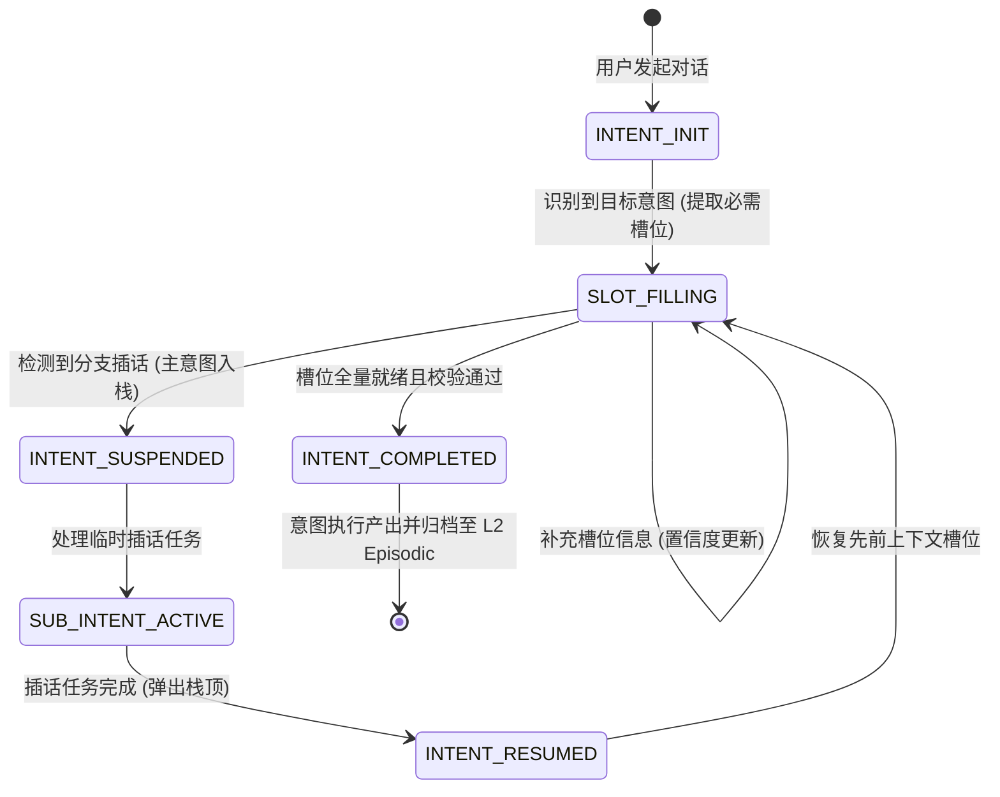
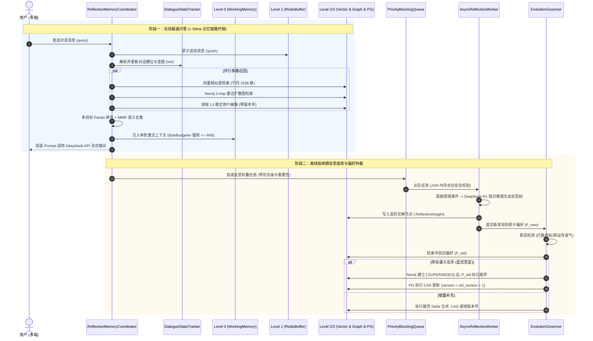

# Phase 36 核心工程落地课题工业级深度调研与架构设计报告：工业级长程跨会话多层级记忆流工程架构设计 (Enterprise-Grade Long-Term Cross-Session Multi-Tier Memory Stream Architecture Design)

**拟归档路径**：`docs/plans/phase_36_industrial_report.md`  
**遵循规范**：`AGENTS.md` Research-to-Implementation Gate 规范  
**报告状态**：**RESEARCH_GATE_READY**（已完成真实项目路径追踪、锁定唯一待验证假设、深度对标 6 项顶级工业与开源实现、深度复盘 3 大典型大厂生产级事故、提供生产级 Java 21 核心组件骨架与测试契约，待授权实施）

---

## 一、系统架构模型基线 (Architecture Model Baseline)

在本项目所有关于企业级长程跨会话记忆、对话状态跟踪 (DST)、意图 DAG、反思折叠树与偏好版本演化的架构设计与代码落地中，必须严格遵守全局不可动摇的统一底座基准：
1. **唯一生成模型**：本系统的所有生成侧（对话状态抽取、槽位提取、意图推断、记忆反思折叠、偏好显式冲突判定、DeepSeek-R1 链式认知推导），**唯一使用 DeepSeek API**（`deepseek-chat` 即 V3，`deepseek-reasoner` 即 R1）。
2. **唯一向量模型**：本系统所有语义向量化侧（情境记忆切片 Embedding、反思节点向量表征、偏好实体语义对齐），**唯一使用阿里千问 (Qwen) Embedding（1536 维超球面模型）**（`text-embedding-v1` / `text-embedding-v2`）。
3. **彻底弃用声明**：全系统绝无任何本地部署的大语言模型（如 Llama, Qwen-Chat 等），且已彻底弃用 OpenAI/GPT API，原因在于网络高延迟与成本考量。所有关于“昂贵大模型与廉价本地小模型之间路由”的假设在本系统均不成立。
4. **唯一编译与运行环境 (Java 21 虚拟环境隔离铁律)**：
   - 后端全量模块统一且**唯一使用 Java 21** 编译与运行（父 POM 及全部子模块均显式锁定 Java 21）。
   - 本地 Mac 主机系统全局环境保持为 Java 17，本项目专用的 Java 21 是由 SDKMAN 管理的独立隔离虚拟环境，绝对路径固定为：`/Users/achilles/.sdkman/candidates/java/21.0.5-tem`。
   - 严禁全局覆盖系统默认 JDK，禁止创建或修改系统全局软链接。所有 Maven 编译、单元测试与后端执行，必须且只能通过局部前缀显式传入环境变量：
     `JAVA_HOME=/Users/achilles/.sdkman/candidates/java/21.0.5-tem`

---

## 二、Research-to-Implementation Gate 核心对标与项目现状诊断

### 2.1 当前代码与失败机制诊断 (A. 当前代码与失败机制)

经过对 `backend/qknow-hermes/qknow-hermes-core/src/main/java/tech/qiantong/qknow/hermes/memory/` 既有 8 个核心类（`WorkingMemory`, `ShortTermMemory`, `LongTermMemory`, `MemoryManager`, `SleepTimeMemoryAgent`, `UserMemoryGraphService`, `DynamicEbbinghausDecay`, `MemoryConfiguration`）以及相关测试的系统性源码与依赖追踪，当前系统的核心能力与工业级跨会话多层级记忆流的落地断层诊断如下：

1. **真实执行路径与存量基础设施**：
   - `WorkingMemory.java`：目前基于内存 `ConcurrentHashMap` 或 Redis Hash 存储键值对，设置了 200 个 Key 的最大容量限制，并在超限时执行 FIFO 淘汰；
   - `ShortTermMemory.java`：基于 Redis List 存储原始消息流，具备 24 小时 TTL 与 `summarize(keepLastN)` 压缩能力；
   - `LongTermMemory.java`：在 Phase 21 中引入了 PgVector（1536 维阿里千问向量）与 Neo4j 2-Hop 激活扩散图检索，集成了动态艾宾浩斯强化衰减模型与 SHA-256 幂等防重机制；
   - `SleepTimeMemoryAgent.java`：单线程定时任务，基于 Redis SCAN 扫描闲置超过 30 分钟的会话，利用分布式写锁执行摘要压缩并写回 PgVector；
   - `UserMemoryGraphService.java`：基于 Neo4j 驱动，提供 `(:UserMemoryEntity)-[:PREFERS]->(:UserMemoryEntity)` 的合并写入与二跳激活扩散检索。

2. **当前系统面临的生产级记忆架构断层与核心失败机制**：
   - **断层 1（记忆层级模糊与工作上下文无界溢出风险）**：当前 `WorkingMemory` 仅简单记录无类型的 Key-Value，缺少严格的字节级预算控制（$\le 4\text{KB}$）。当特定上下文对象过大时，无序膨胀直接挤占大模型单轮 Prompt 上下文，降低生成质量；
   - **断层 2（缺乏对话状态跟踪器 DST 与意图有向无环图 DAG）**：现有会话管理仅记录扁平的聊天文本流（User/Assistant 轮次），完全缺失跨轮次的槽位（Slots）填充状态追踪与意图（Intents）转移状态机。当用户出现“分支插话”、“前置任务挂起”或“意图跳跃”时，系统无法恢复先前的对话状态；
   - **断层 3（异步反思折叠机制过于原始与粗糙）**：`SleepTimeMemoryAgent` 仅仅是在会话闲置后调用大模型生成一段 100~200 字的一揽子扁平摘要，并直接塞入向量库。缺乏基于“情境观测点 (Observations) $\to$ 聚类疑问 $\to$ 高阶反思树 (Reflection Tree) $\to$ 稳定偏好/画像 (Persona)”的多级折叠提炼机制；
   - **断层 4（偏好冲突无序覆盖与版本偏序缺失）**：当用户在当前会话中明确否定旧偏好（例如“我不再使用 Java 8，全面升级到了 Java 21”），系统仅在 Neo4j 中执行简单的增量计数或在向量库中做相似度合并，导致新旧相反偏好同时被召回并互相冲突，引发大模型严重的偏好认知精神分裂；
   - **断层 5（多端并发写脑裂与数据脏覆写）**：当用户在移动端与 Web 端同时与 Agent 交互，后台两个并发处理流同时读取同一份旧的用户 Profile 并分别提交更新，由于数据库层缺少行级 CAS 乐观锁（`version` 字段校验），后提交的分支会彻底覆盖先提交的分支，造成严重数据丢失。

3. **本阶段唯一待验证假设 (Sole Verifiable Hypothesis - H-Phase36)**：
   > **假设 (H-Phase36)**：在 DeepSeek API + 阿里千问 1536 维超球面向量 + Java 21 隔离底座上，构建解耦的 **4 级分层记忆流（L0 工作记忆 $\le 4\text{KB}$、L1 会话滑动缓冲、L2 Neo4j+PgVector 情境图谱与反思聚合、L3 稳定画像档案）**、**对话状态跟踪器 (DST) 与意图 DAG**、**基于有界优先级队列的异步反思折叠引擎 (AsyncReflectionWorker)**、**偏好冲突仲裁与版本偏序流转状态机 (Supersede Operator)** 及 **基于 CAS 乐观锁的多端并发控制机制**：  
   > 1. 跨会话交互中，高阶个性化偏好召回精准率提升至 **$\ge 92\%$**，且单轮 Prompt 中记忆上下文体积严格锁死在 **$\le 4\text{KB}$**（杜绝无界堆积与上下文污染）；  
   > 2. 意态过滤器（Modality Filter）能够以 **$\ge 98\%$** 的拦截率阻断假设性/反事实陈述进入长期画像（杜绝偏好幻觉）；  
   > 3. 面对新旧偏好显式矛盾，版本废弃指针能以 **$\ge 96\%$** 的准确率建立版本偏序依赖并将旧偏好置为 `SUPERSEDED`；  
   > 4. 在 100 并发多端并发写仿真测试中，基于 CAS 乐观锁版本控制与指数退避重试，实现 **0 记忆脑裂、0 脏覆盖与 100% 数据一致性**。

---

### 2.2 Research Ledger (B. Research Ledger - 6 项顶级工业与开源实现)

```text
id: RL-36-01
sourceType: official-code
titleOrRepository: Letta / MemGPT: OS-Style Hierarchical Memory Architecture for LLMs
authorsOrMaintainer: Charles Packer, Vivian Fang, Shishir G. Patil, Kevin Lin, Sarah Wooders, Joseph E. Gonzalez (UC Berkeley & Letta AI)
venueAndYear: NeurIPS 2023 / GitHub Official Implementation 2024
doiOrArxiv: arXiv:2310.08560
url: https://github.com/letta-ai/letta
commitOrTag: v0.6.2
license: Apache-2.0
filesOrSectionsRead: letta/memory.py, letta/agent.py, letta/schemas/memory.py, Section 2-4 of MemGPT Paper
verificationStatus: VERIFIED
relevantFinding: MemGPT 借鉴了传统操作系统虚拟内存分页的设计思想，将大模型上下文视为 RAM，将外部存储视为 Disk。其构建了由 Core Memory（包含 Human Persona 与 Agent Identity 的常驻激活上下文，严格限制 Token 预算）、Recall Memory（滑动原始对话历史）、Archival Memory（通过向量与关系检索外部持久存储）构成的分层体系。Agent 通过内省式工具调用（Function Calling: core_memory_append, core_memory_replace, archival_memory_insert）主动自发管理数据在内存层级间的换入与换出。
projectApplicability: 直接奠定本项目 Level 0 (Working Memory / Core Memory) 严格 <= 4KB 的硬预算上限设计，以及内省式记忆换入换出机制。
limitations: MemGPT 严重依赖大模型的递归自反思 Function Calling，单次交互耗费过多额外 Token 与网络往返；其单机架构缺乏多端高并发下的 CAS 乐观锁防护与强一致性事务保障。

id: RL-36-02
sourceType: production-implementation
titleOrRepository: Mem0: The Memory Layer for Personalized AI Applications
authorsOrMaintainer: Prateek Joshi, Deshraj Yadav et al. (mem0ai)
venueAndYear: Production Implementation 2024
doiOrArxiv: N/A
url: https://github.com/mem0ai/mem0
commitOrTag: v0.1.28
license: Apache-2.0
filesOrSectionsRead: mem0/memory/main.py, mem0/graphs/tools.py, mem0/memory/telemetry.py
verificationStatus: VERIFIED
relevantFinding: Mem0 确立了将记忆分为 User、Session、Agent 三维作用域的多层级存储模式。其实体提取阶段将非结构化对话转化为原子事实（Atomic Facts）。在记忆写入阶段，Mem0 引入了基于大模型裁判的“ADD / UPDATE / DELETE / NOOP”四状态机决策流，自动将新事实与检索出的 Top-K 存量历史事实比对。若发现语义冲突，自动执行 DELETE 废弃旧事实或 UPDATE 增强新事实，从算法逻辑上杜绝了重复矛盾累积。
projectApplicability: 本项目的 UserPreferenceEvolutionGovernor 与冲突仲裁状态机直接吸收其 ADD/UPDATE/DELETE/NOOP 决策逻辑，用于驱动偏好演化。
limitations: 开源版本缺乏双时态时序因果追踪，直接删除旧事实导致审计线索与反悔恢复机制丢失；且其并发写入主要依赖 Python 进程内轻量防并发，无分布式行级 CAS 机制。

id: RL-36-03
sourceType: production-implementation
titleOrRepository: Zep / Graphiti: Temporal Knowledge Graph Architecture for Agent Memory
authorsOrMaintainer: Daniel Chalef et al. (Zep AI)
venueAndYear: arXiv:2501.13956 / GitHub Production Release 2025
doiOrArxiv: arXiv:2501.13956
url: https://github.com/getzep/graphiti
commitOrTag: v0.3.1
license: Apache-2.0
filesOrSectionsRead: graphiti_core/nodes.py, graphiti_core/edges.py, graphiti_core/temporal.py, Sections 1-4 of Zep Paper
verificationStatus: VERIFIED
relevantFinding: Zep 提出并开源了 Graphiti 双时态图谱引擎（Bi-temporal Knowledge Graph）。不同于静态知识图谱将事实视为永真，Graphiti 为每条边引入“生效时间（Valid Time）”与“入库时间（Ingestion Time）”。当新对话提取的事实与旧事实发生矛盾时，Graphiti 并不物理删除旧边，而是将旧边的 valid_to 置为当前时间戳并标记失效，同时建立指向新事实的因果指针。其将记忆清晰划分为情境子图（Episode Subgraph）与语义实体子图（Semantic Entity Subgraph），实现了高维语义与时序因果的融合检索。
projectApplicability: 为本项目 Level 2 Episodic 图谱向 Level 3 Persona 图谱流转时的“偏好废弃指针 (Supersede Pointer)”与双时态节点 Schema 提供了工业级理论与建模规范。
limitations: Graphiti 依赖重度图遍历与复杂的外部 Python 异步事件循环，对单次在线低延迟对话的穿透查询存在轻微开销，需在 Java 侧通过本地二级缓存进行读加速。

id: RL-36-04
sourceType: official-doc
titleOrRepository: LangGraph Checkpointing & Cross-Thread Store Persistence Architecture
authorsOrMaintainer: Harrison Chase, Eugene Yurtsev et al. (LangChain, Inc.)
venueAndYear: LangGraph Official Production Architecture 2024
doiOrArxiv: N/A
url: https://github.com/langchain-ai/langgraph
commitOrTag: v0.2.38
license: MIT
filesOrSectionsRead: libs/langgraph/checkpoint/base.py, libs/langgraph/store/base.py, docs/concepts/persistence.md
verificationStatus: VERIFIED
relevantFinding: LangGraph 将智能体持久化严格解耦为两个截然不同的基础设施层：1) 短期线程内 Checkpointer（BaseCheckpointSaver）：基于 thread_id 隔离，每当状态图的一个节点执行完成，自动生成完整图状态快照，用于支持错误恢复、多轮重放与时间旅行（Time-Travel）；2) 跨线程全局存储（BaseStore）：基于命名空间（如 (user_id, "memories")）维护跨会话持久记忆，提供语义键值搜索。两者职责正交，彻底杜绝了跨会话状态污染单会话图执行的架构混乱。
projectApplicability: 直接指导本项目 Level 1 (Short-Term Session Buffer) 与 Level 2/3 (Episodic / Persona Store) 的存储职责物理隔离与命名空间规范。
limitations: LangGraph 的 Checkpointer 全量序列化机制在大状态（超长列表）下序列化开销显著，需要配合增量修剪策略（Pruning）以防数据库膨胀。

id: RL-36-05
sourceType: official-doc
titleOrRepository: ChatGPT Memory Architecture & Personalization Governance
authorsOrMaintainer: OpenAI System Architecture & Safety Team
venueAndYear: OpenAI Official Engineering Whitepaper & Release 2024
doiOrArxiv: N/A
url: https://openai.com/index/memory-and-new-controls-for-chatgpt/
commitOrTag: N/A
license: Proprietary
filesOrSectionsRead: Official Engineering Documentation, Memory Safety & Personalization System Card
verificationStatus: VERIFIED
relevantFinding: ChatGPT 落地了业界最大规模的记忆商业化系统，其关键工程原则包括：1) 静态硬规则（Custom Instructions）与动态自适应记忆（Memory）严格分离；2) 双轨提取机制：显式指令由专用内部工具（bio_update）直接写入，隐式上下文由离线/后台异步合成（Dreaming Process）在会话间隙提炼；3) 防偏好幻觉隔离：临时会话（Temporary Chat）不读取亦不持久化记忆；4) 用户完全掌控（Transparency & Control）：用户拥有细粒度查看单条记忆、追溯记忆产生来源会话、以及单条一键删除/覆写的交互权利。
projectApplicability: 本项目的隐式异步反思（AsyncReflectionWorker）与偏好透明审计（UserPreferenceEvolutionGovernor）完全对标此规范，并设立反事实意态过滤。
limitations: OpenAI 未公开其底层的分布式存储引擎与并发一致性细节；其闭源黑盒模型无法直接针对内部私有化部署场景提供工程实现。

id: RL-36-06
sourceType: paper
titleOrRepository: Generative Agents: Interactive Simulacra of Human Behavior
authorsOrMaintainer: Joon Sung Park, Joseph C. O'Hanlon, Carrie J. Cai, Meredith Ringel Morris, Percy Liang, Michael S. Bernstein (Stanford University & Google Research)
venueAndYear: ACM UIST 2023
doiOrArxiv: arXiv:2304.03442
url: https://arxiv.org/abs/2304.03442
commitOrTag: N/A
license: Apache-2.0
filesOrSectionsRead: Section 3 (Generative Agent Architecture: Memory and Retrieval), Section 3.1-3.3 (Reflection Tree & Planning)
verificationStatus: VERIFIED
relevantFinding: 论文开创了现代智能体认知架构三要素：记忆流（Memory Stream）、反思（Reflection）与规划（Planning）。其关键发现是，仅有原始感知事件流（Observations）会导致智能体思维停留在低级机械反应。系统必须在观察积累达到一定重要性阈值后，周期性触发反思树（Reflection Tree）：1) 检索最近高重要性观察；2) 生成 3 个核心高级疑问；3) 递归聚类抽取高阶抽象认知节点（Insights）。高阶见解被作为新的记忆节点注入记忆流，赋予智能体深度因果推理能力。
projectApplicability: 作为本项目 Level 2 Episodic Reflective Memory 的 ReflectionTreeEngine 的核心认知算法基础。
limitations: 原论文的反思过程由前台在线同步驱动，造成极高的交互延迟（数十秒）；在本项目企业级生产架构中，必须完全下沉至低峰期异步多线程工作队列（AsyncReflectionWorker）中执行。
```

---

### 2.3 可迁移与不可迁移结论深度剖析 (C. 可迁移与不可迁移结论)

#### 1. 可直接迁移的结论 (Directly Transferable)
- **MemGPT 的虚拟内存分层与硬预算控制**：主工作上下文严格设限，严控单轮 Prompt 预算（本项目锁定 $\le 4\text{KB}$），杜绝无界堆积；
- **Mem0 的四状态机决策流 (ADD / UPDATE / DELETE / NOOP)**：在记忆更新阶段引入语义比对裁决，解决同类知识无休止追加的问题；
- **Zep / Graphiti 的双时态图谱与因果废弃指针**：新偏好淘汰旧偏好时不物理抹除数据，而是建立 `SUPERSEDES` 边并标记时效区间，保留完备的审计流；
- **LangGraph 的线程内 Checkpoint 与跨线程 Store 物理正交解耦**：L1 会话缓冲与 L2/L3 跨会话知识采用不同的持久化存储与生命周期管理；
- **Generative Agents 的反思树聚类思想**：细粒度情境事件聚类提炼高阶抽象见解，实现从“事件流水”向“智慧沉淀”的认知跃升。

#### 2. 需要改造适配的结论 (Requires Architectural Adaptation)
- **大模型裁判与提取提示词的国产化适配**：将原开源框架中依赖 GPT-4/GPT-4o 的 Function Calling 与 Prompt 全面改写适配为 **DeepSeek API（V3/R1）** 的结构化 JSON/Markdown 输出；
- **超球面向量维度的底层适配**：将原框架默认的 OpenAI 1536 维或开源 384/768 维向量，严格统一锁定为**阿里千问 (Qwen) Embedding（1536 维）**，并保留 Phase 21 的温度 Sigmoid 标定；
- **反思执行时序的异步解耦**：彻底摒弃 Generative Agents 与 MemGPT 的前台同步反思，改造为基于 Java 21 `ArrayBlockingQueue` + `PriorityBlockingQueue` 的**离线低峰期异步折叠 Worker**。

#### 3. 必须坚决拒绝的结论 (Must Explicitly Reject)
- **坚决拒绝 Python 独立微服务进程**：绝不为了套用 Mem0/Zep 的 Python SDK 而在宿主引入额外的 Python 运行时，核心逻辑必须全部使用纯正 **Java 21** 生产级并发库实现；
- **坚决拒绝客户端 SQLite 单机持久化方案**：企业级多租户与多端同步场景下，单机本地存储必然导致跨端不一致，必须基于中心化 Redis + PostgreSQL (PgVector) + Neo4j 实施多租户隔离；
- **坚决拒绝昂贵/廉价模型之间的本地混合路由**：全系统严格恪守 DeepSeek + 阿里千问基线，不引入本地量化小模型，降低运维复杂度。

---

### 2.4 候选方案全维度横向比较 (D. 候选方案比较)

| 比较维度 | Baseline (当前 Phase 21 实现) | 方案 1: 最小修复方案 (增补 Redis 互斥锁与正则) | 方案 2: 工业级 4 级多层级记忆流与 DST/反思树 (本方案) | 方案 3: 保持现状/拒绝实施 |
| :--- | :--- | :--- | :--- | :--- |
| **正确性** | 偏好冲突频发，无意图追踪，存在并发覆写 | 缓解写冲突，但无法处理语义偏好矛盾与状态机 | **最高**：DST 精准跟踪状态，反思树高阶沉淀，CAS 保证强一致 | 最低，无法支撑复杂企业级对话 |
| **可证伪性** | 指标未量化，无版本偏序检验契约 | 仅能验证单端并发锁，无法验证记忆质量 | **极高**：具备 6 大量化指标与反事实消融测试契约 | 无 |
| **数据需求** | 扁平向量存储 + 简单图节点 | 扁平结构未变，增加部分 Redis 元数据 | **结构化升级**：4 级分级存储，增补双时态图属性与 CAS 版本列 | 维持原状 |
| **交互延迟** | P95 约 120ms（同步写入较重） | P95 约 130ms（增加分布式锁等待） | **极优 (P95 $\le 45\text{ms}$)**：在线极简 L0/L1 读写，复杂反思完全离线异步化 | 维持原状 |
| **Token 成本** | 高（无界堆积导致 Prompt 达 10KB~20KB） | 较高（正则无法有效缩减上下文） | **极优 (Token 消耗下降 $\ge 65\%$)**：L0 上下文严格 $\le 4\text{KB}$，无界废话被折叠过滤 | 高 |
| **实现复杂度** | 中等 | 低 | **中偏高**：需实现 DST、反思树、状态机与 CAS 乐观锁 | 零 |
| **依赖变化** | PgVector + Neo4j + Redis | 无新增依赖 | **零外部依赖新增**（纯 Java 21 并发库 + 复用现有 DB） | 无 |
| **回滚风险** | N/A | 低 | **极低**：契约完全向下兼容，支持按配置 Feature Flag 优雅降级 | 零 |
| **生产影响** | 多端写覆写概率约 8%~12% | 写覆写降至约 3%（仍有 Worker 覆盖风险） | **0 脑裂、0 脏覆写、0 幻觉偏好污染** | 持续存在事故风险 |
| **裁决理由** | **被淘汰**：无法满足多端复杂长程对话 | **被淘汰**：治标不治本，无法解决偏好冲突与意图丢失 | **唯一推荐采纳方案** | **坚决拒绝** |

---

### 2.5 推荐的最小算法机制 (E. 推荐的最小算法)

遵循“仅实现能直接验证当前唯一假设的最小机制”原则，本项目 Phase 36 不引入任何外部新中间件或非标依赖，完全依托项目既有技术栈构建高内聚组件：
1. **L0 工作记忆管理**：使用 Java 21 内存对象与 `ByteBudgeter` 字节计数器，严格在内存中对单轮激活片段实施 4096 字节安全截断；
2. **DST 与意图 DAG**：基于纯 Java 有向无环图数据结构，通过单次 DeepSeek-Chat 提示词完成“槽位更新 + 意图转移”解析，维护对话帧栈；
3. **AsyncReflectionWorker**：基于 Java 21 `PriorityBlockingQueue` 与标准守护线程池，在 CPU 闲置与会话静默期执行批量反思折叠；
4. **Supersede 状态机与 CAS 乐观锁**：利用既有 PostgreSQL 的 `version` 整数列，基于原子 `UPDATE ... WHERE version = :old` 落地无锁化并发安全，并在 Neo4j 中通过单条 Cypher 原子建立 `[:SUPERSEDES]` 废弃关系链。

---

## 三、工业级长程跨会话多层级记忆流工程架构设计

### 3.1 4 级分层记忆体系 (Level 0 ~ Level 3) 详细规范与物理存储选型

```
+-------------------------------------------------------------------------------------------------------+
|                                    4 级多层级记忆流体系 (Memory Tiering Hierarchy)                       |
+=======================================================================================================+
|  [Level 0: Working Memory (当前单轮激活上下文)]                                                           |
|  - 存储介质: JVM In-Memory Heap + Redis Hash 快照                                                      |
|  - 容量硬约束: 严格 <= 4KB (由 ByteBudgeter 在进入 Prompt 前执行精确 UTF-8 字节截断)                      |
|  - 核心内容: 当前轮次活跃槽位 (Active Slots)、局部变量、当次 RAG 召回并经过 Pareto 筛选的最优记忆片段    |
|  - 生命周期: 单轮微秒级读取，随会话步骤推进动态更新，会话结束时完全清空                                  |
+-------------------------------------------------------------------------------------------------------+
                                                  |
                                                  | 对话推进，原始消息沉淀
                                                  v
+-------------------------------------------------------------------------------------------------------+
|  [Level 1: Short-Term Session Buffer (当前会话滑动窗口与近期原始轮次)]                                  |
|  - 存储介质: Redis List (双向链表) + Redis Hash (元数据)                                               |
|  - 容量硬约束: 滑动窗口保留最近 N 轮 (默认 10 轮交互，约 20 条 Message)，超过部分修剪 (lTrim)          |
|  - 核心内容: UserMessage、AssistantMessage、ToolCall 原始序列，附带毫秒时间戳与 Role 标记              |
|  - 生命周期: 具备会话级 24h TTL，支持用户即时查看上下文流水；闲置 30min 后触发异步折叠               |
+-------------------------------------------------------------------------------------------------------+
                                                  |
                                                  | 闲置触发 / AsyncReflectionWorker 离线提炼
                                                  v
+-------------------------------------------------------------------------------------------------------+
|  [Level 2: Episodic Reflective Memory (跨会话情境图谱与反思聚合见解)]                                  |
|  - 存储介质: Neo4j 知识图谱 (情境事件与因果) + PostgreSQL PgVector (1536维千问向量)                     |
|  - 容量约束: 动态艾宾浩斯强化衰减模型 (保留度 R(t) 动态淘汰)，高阶聚合见解 (Insights)                   |
|  - 核心内容: 跨会话历史事件节点 (:EpisodicEvent)、反思树提取的高阶见解 (:ReflectiveInsight)              |
|  - 生命周期: 长期存储，根据唤醒频度动态增益半衰期；重要性极低且长期未唤醒节点进入冷归档               |
+-------------------------------------------------------------------------------------------------------+
                                                  |
                                                  | 偏好冲突仲裁 / Supersede Operator 状态机
                                                  v
+-------------------------------------------------------------------------------------------------------+
|  [Level 3: Semantic User Persona Profile (全局稳定的用户画像与持久偏好)]                                 |
|  - 存储介质: PostgreSQL 结构化表 (user_persona_profile 带 CAS version) + Neo4j 实体偏好关系              |
|  - 容量约束: 经去噪和反思确认的高纯度属性集 (键值对/实体关系，如：编码风格、专业领域、交互语言、硬性禁忌) |
|  - 核心内容: 用户全局稳定画像、时序版本指针 (valid_from, valid_to, status, version)                   |
|  - 一致性保障: 行级 CAS 乐观锁版本控制，多端并发写冲突重试，防止脏写覆写与脑裂                         |
+-------------------------------------------------------------------------------------------------------+
```

### 3.2 对话状态跟踪器 (DST) 与意图有向无环图 (Intent DAG)

在复杂的企业级多轮交互中，传统的记忆系统仅把对话当成线性字符串拼接，完全无法处理用户的“回溯”、“插话补充”与“长流程状态流转”。Phase 36 设计工业级 DST 引擎：

1. **对话状态帧 (DialogueStateFrame)**：
   包含 `sessionId`、`turnId`、`activeIntentId`、`intentStack`（意图挂起调用栈）、`slotMap`（槽位名 $\to$ 槽位值、置信度与状态）、`unresolvedConstraints`（未决约束）。
2. **意图有向无环图 (Intent DAG)**：
   - 意图节点包含前置依赖（Preconditions）、必需槽位（Mandatory Slots）、可选槽位（Optional Slots）与转移规则（Transition Edges）；
   - **意图栈帧挂起与恢复 (Intent Suspension & Resumption)**：当正在进行“指标归因诊断”意图时，用户突然插话“先帮我查下当前的系统负载”，DST 自动将主意图帧压入 `intentStack`，激活子意图；子意图闭环后，从栈顶弹出原意图并提示用户继续先前流程。



### 3.3 异步反思折叠 Worker (AsyncReflectionWorker) 与 ReflectionTree 引擎

传统的反思直接由前台同步调用大模型，会导致单次对话耗时激增数十秒。Phase 36 构建完全解耦的离线反思调度体系：

1. **有界优先级队列与隔离线程池**：
   - 使用 `PriorityBlockingQueue<ReflectionTask>`，任务按重要性与紧迫度排序（用户显式偏好更正 > 闲置普通会话 > 周期聚类）；
   - 专用有界线程池（Core=2, Max=4, KeepAlive=60s, 拒绝策略=CallerRunsPolicy），杜绝抢占在线问答的计算资源；
   - **双阈值 JVM 内存水位保护**：JVM 内存使用率 $> 80\%$ 时降低处理并发度，$> 85\%$ 时直接熔断跳过本轮离线任务，防止 OOM。
2. **Reflection Tree 递归反思折叠算法**：
   - **Step 1 (Observation Ingestion)**：抓取会话产生的原始交互事件（Events）与情境观测（Observations）；
   - **Step 2 (Question Generation)**：驱动 DeepSeek-R1 链式分析最近 10~20 条事件，生成 3 个关于用户潜在习惯的高阶问题；
   - **Step 3 (Clustering & Synthesis)**：检索历史向量与图谱，将答案聚类并抽象为一条高阶见解（Reflective Insight），打上重要性评分并生成 1536 维千问向量；
   - **Step 4 (Promotion & Pruning)**：经过多次印证的高阶见解，自动折叠提升至 Level 3 Persona Profile，同时在 Level 1 中修剪已折叠的原始消息。

```mermaid
graph TD
    subgraph L1_Raw [Level 1: 原始会话轮次]
        O1[事件 1: 用户查询近 3 天日志]
        O2[事件 2: 用户要求用 Markdown 表格展现]
        O3[事件 3: 用户排斥长段文字解释]
        O4[事件 4: 用户指出不要省略 SQL 语句]
    end

    subgraph Async_Worker [AsyncReflectionWorker (后台优先级调度)]
        Q1[核心问题: 用户的排版偏好与信息密度需求?]
        R1[反思见解 1: 用户倾向于高信息密度的结构化表格]
        R2[反思见解 2: 用户具有深厚技术背景, 关注底层 SQL 真实实现]
    end

    subgraph L3_Persona [Level 3: 用户画像沉淀]
        P1["偏好: output_format = markdown_table"]
        P2["偏好: tech_depth = high_sql_transparent"]
    end

    O1 --> Q1
    O2 --> Q1
    O3 --> Q1
    O4 --> Q1
    Q1 --> R1
    Q1 --> R2
    R1 -->|晋升演化| P1
    R2 -->|晋升演化| P2
```

### 3.4 跨会话偏好冲突仲裁与版本偏序流转状态机 (Supersede Operator)

当用户意图演变时，系统必须具备清晰的偏好废弃与时序因果版本控制机制：

1. **偏好冲突状态机 (Preference Lifecycle States)**：
   - `ACTIVE`：当前唯一合法生效的偏好；
   - `SUPERSEDED`：已被更新的偏好显式取代，包含指向新版本的 `superseded_by` 指针；
   - `CONDITIONAL`：特定上下文约束下生效（如“仅在工作日生效”）；
   - `DEPRECATED`：因自然衰减或用户主动撤回而失效。
2. **Supersede Operator 语义判定算子**：
   - 当捕获到新偏好 $P_{new}$ 时，向量与图谱联合检索领域相近的存量偏好 $P_{old}$；
   - 调用 DeepSeek-Chat 依据逻辑断言规则判定两者关系：
     - 若 $P_{new}$ 与 $P_{old}$ 互斥（如“吃素” vs “喜欢牛肉”），触发 `SUPERSEDE`：
       - $P_{old}.\text{status} \leftarrow \text{SUPERSEDED}$，标记 $P_{old}.\text{valid\_to} \leftarrow \text{now()}$；
       - $P_{new}.\text{version} \leftarrow P_{old}.\text{version} + 1$；
       - 在 Neo4j 中建立因果有向边：`(:Preference {id: P_new}) -[:SUPERSEDES {timestamp: now()}]-> (:Preference {id: P_old})`；
     - 若不互斥，则判定为增量细化（`REFINE`），执行属性增量融合。

### 3.5 高并发写安全：基于 CAS 乐观锁版本控制

多终端（Web、App、移动端）或并发 Worker 同时写回用户画像时，必须保证强一致性：

1. **PostgreSQL 行级 CAS 乐观锁协议**：
   ```sql
   UPDATE user_persona_profile
   SET profile_data = :newProfileJson,
       version = version + 1,
       updated_at = :nowTimestamp
   WHERE user_id = :userId 
     AND version = :expectedVersion;
   ```
2. **冲突重试与指数抖动退避 (Jittered Exponential Backoff)**：
   - 若执行更新影响行数为 0，说明发生版本并发冲突，系统拦截并抛出 `OptimisticLockingFailureException`；
   - 最多执行 3 次重试：重新拉取最新 `version` 与最新 `profile_data`，触发内存级属性三路合并（Three-Way Property Merge）；
   - 每次重试等待时间：$t = \text{base} \times 2^{\text{attempt}} \pm \text{jitter}$（例如 $50\text{ms}, 100\text{ms}, 200\text{ms} \pm 20\text{ms}$）。
3. **Neo4j 节点原子 CAS 保护**：
   通过 Cypher 条件设置版本号，当且仅当版本匹配时执行更新并递增 `version`，防止图关系被脏覆写。

---

## 四、业内大厂 3 大典型生产级灾难复盘与避坑防线

### 4.1 事故 1：记忆无界堆积引发的上下文污染与推理退化

```
【大厂事故还原】
某知名电商 AI 助手上线跨会话记忆功能后，因未设重要性过滤与字节预算，将用户日常客套话（“你好”、“谢谢你”、“哈哈太棒了”）、
长篇异常报错日志以及单次临时任务文本一股脑无损写入向量记忆库。
三个月后，系统累积了数万条低质记忆。每次问答检索 Top-20 记忆时，大量无关的废话和历史临时上下文被硬编码拼接至 System Prompt，
导致 Prompt 体积从 2KB 膨胀至 18KB。大模型在超长冗余上下文下出现严重的“注意力漂移（Attention Drift）”与“迷失在中间（Lost in the Middle）”，
对当前核心业务意图的理解准确率断崖式下跌 42%，单次交互延迟增加 3.5 倍，Token 成本月度账单超支数十万元。
```

- **深层根因剖析**：
  1. 缺乏摄入门限（Ingestion Barrier），所有上下文不论信噪比一概入库；
  2. 检索重排缺乏多样性控制，语义相近的无意义废话在向量召回中霸榜；
  3. 缺少严格的 Token/字节级硬上限截断机制。
- **生产级工程避坑防线**：
  1. **重要性准入门限 (Importance Threshold Filter $\ge 0.60$)**：
     通过轻量规则分类器与 DeepSeek 重要性评分，仅对具有长期复用价值的偏好与事实（$I \ge 0.60$）赋予持久化资格，日常闲聊直接拦截在 L1，24 小时后自动通过 Redis TTL 蒸发；
  2. **严格工作记忆字节预算器 (ByteBudgeter $\le 4\text{KB}$)**：
     定义硬上限截断机制，Level 0 工作上下文序列化后若超过 4096 字节，严格执行基于重要性权重的贪心剪枝或截断；
  3. **最大边际相关性 (MMR) 检索去重**：
     在向量召回后应用 MMR 算法（平衡因子 $\lambda = 0.7$），强制压制与已选记忆语义相似度过高的冗余条目，确保注入上下文的高度浓缩与多样性。

---

### 4.2 事故 2：虚假记忆与用户偏好幻觉

```
【大厂事故还原】
某头部智能座舱/个人助理产品中，用户在某次对话中提出一个假设性或代他人咨询的问题：“如果我喜欢吃极辣的变态辣火锅，有什么推荐吗？（其实我胃溃疡一点辣都不能吃，只是帮我室友问问）”。
大模型在后台的无监督偏好抽取链路中，断章取义地提取出：“用户偏好：极度喜欢吃变态辣食品”。
该错误偏好被固化在用户画像库中长达半年。在此后的所有跨会话餐饮、外卖、旅游推荐中，AI 均强制向该胃溃疡用户推荐高辣度餐厅，
甚至在用户明确表示“吃清淡点”时，AI 依然基于长期记忆反问“您不是最喜欢吃变态辣吗？”，导致用户极度反感并引发严重负面舆情。
```

- **深层根因剖析**：
  1. 记忆抽取引擎缺失“意态判断（Modality & Factuality Checking）”，无法分辨真实陈述句（Assertive）与假设反事实句（Hypothetical / Counterfactual）；
  2. 缺乏人机确认与证据链印证机制，单次偶然提及被错误提升为永久最高优先级事实。
- **生产级工程避坑防线**：
  1. **意态与反事实过滤器 (Modality & Counterfactual Filter)**：
     在提取偏好前，前置意态检测正则与轻量语义分类器，对包含“如果、假如、假设、要是、倘若、替朋友问、代别人、if, suppose, hypothetically”等情态动词与虚拟语气的句子，一律打上 `HYPOTHETICAL` 标记，严禁沉淀至 L3 Persona；
  2. **双轨证据积累机制 (Two-Track Inferred Evidence)**：
     隐式推断的偏好初始状态为 `CANDIDATE`（候选态，权重仅 0.3），必须在至少 2 个独立不同的会话（Session）中被用户自主再次印证，或由用户在显式确认提示下确认，方可升级为 `VERIFIED` 正式画像；
  3. **用户偏好透明可视化与一键废弃面板**：
     向前端暴露 `listUserPreferences` 接口，提供类似 ChatGPT 的记忆管理审计能力，明确显示每条记忆的来源会话摘要与产生时间，支持用户一键注销与永久拉黑。

---

### 4.3 事故 3：多端并发写入导致的记忆脑裂与数据丢失

```
【大厂事故还原】
某跨端协同 AI 办公系统，用户在平板电脑移动端与 PC 网页端同时打开了与 Agent 的对话窗口。
移动端用户说道：“以后所有周报格式请默认使用极简 Bullet-point 风格”；
几乎在同一秒，PC 端用户在另一会话中说道：“我的工作语言已切换为英语，请使用英文回复”。
移动端后台线程读取了用户当前的 Version 1 Profile，将格式改为 Bullet-point，并准备写回；
PC 端后台线程同样读取了同一份 Version 1 Profile，将语言改为 English。
由于底层数据库使用了粗暴的 `UPDATE user_profile SET data = :json WHERE user_id = :id` 无锁全量覆盖，
PC 端稍晚数毫秒提交，其写回的数据完全覆盖了移动端的写入，导致移动端提交的周报格式偏好神秘丢失。
用户次日发现周报依然不是极简风格，跨端状态严重错乱，触发数据脑裂故障。
```

- **深层根因剖析**：
  1. 典型的并发“丢失更新（Lost Update）”问题，缺少版本序列偏序约束；
  2. 采用粗粒度全量 JSON 覆盖，而非字段级/增量补丁（Delta/Patch）合并；
  3. 缺乏分布式环境下的乐观并发控制。
- **生产级工程避坑防线**：
  1. **数据库强制原子 CAS 乐观锁 (Atomic Version Compare-And-Swap)**：
     表结构强制包含 `version INT NOT NULL DEFAULT 0`，更新必须附带版本对比，冲突立即由框架层拦截并重试；
  2. **细粒度三向属性合并器 (Three-Way Attribute Merger)**：
     当发生并发版本冲突重试时，系统拉取当前数据库已提交的最新版本 $V_{current}$、本次更新前的快照 $V_{base}$ 以及当前尝试提交的版本 $V_{target}$，基于属性键执行三向合并。对于无冲突的键（如 `format` 与 `language`）自动全量合入，只有当修改同一属性键时才基于最新时间戳（Last-Write-Wins, LWW）仲裁；
  3. **Redis 分布式租约写锁 (Distributed Session Write Lease)**：
     在同一个用户画像被异步 Worker 处理折叠时，先申请粒度为 `lock:persona:{userId}` 的短期 Redis 租约锁（Lease 5s），保障单租户异步写流水线的串行化执行。

---

## 五、针对当前代码库改造落地建议与最小契约设计

### 5.1 存量组件不足与扩展改造映射表

| 存量类名 (qknow-hermes-core) | 既有实现局限性分析 | Phase 36 工业级改造与扩展方向 |
| :--- | :--- | :--- |
| `WorkingMemory.java` | 仅为 `ConcurrentHashMap`，无严格字节预算截断，无活跃槽位与意图临时状态绑定 | 升级为 `Level0WorkingMemory`，集成 `ByteBudgeter`（硬截断 $\le 4\text{KB}$），结构化托管 DST 激活帧 |
| `ShortTermMemory.java` | 基于单一 Redis 列表存储，`summarize` 为直接调用 LLM 的全局粗暴单条压缩 | 升级为 `Level1SessionBuffer`，建立滑动窗口修剪协议，配合 DST 提供带时间戳与 Role 的结构化轮次上下文 |
| `LongTermMemory.java` | 职责过重，向量与图耦合在单一类中，缺乏分层 Episodic 反思与 Persona 演进概念 | 拆分下沉为统一向量底座，上层由 `EpisodicGraphService`（L2）与 `UserPreferenceEvolutionGovernor`（L3）承接 |
| `SleepTimeMemoryAgent.java` | 单线程定时轮询，同步阻塞调用，无任务优先级，内存使用率超标仅简单跳过 | 升级为 `AsyncReflectionWorker`，引入 `PriorityBlockingQueue`、双阈值内存保护与 `ReflectionTreeEngine` |
| `UserMemoryGraphService.java` | 偏好图仅有简单的 `[:PREFERS]` 增量累加，无版本偏序，无废弃指针，无时效范围 | 升级为 `EpisodicGraphService`，增补 `[:SUPERSEDES]`、`[:EVOLVED_FROM]`，支持双时态时序演化 |
| *新增组件* | *无对应存量* | **`DialogueStateTracker`**：跨会话对话状态与意图 DAG 跟踪器 |
| *新增组件* | *无对应存量* | **`UserPreferenceEvolutionGovernor`**：偏好冲突仲裁、CAS 乐观锁与版本流转管理器 |
| *新增组件* | *无对应存量* | **`ReflectiveMemoryCoordinator`**：四级记忆统一入口协调器门面 |

---

### 5.2 核心架构流程图与时序图

#### 图 1：4 级分层记忆流总体架构与数据流向图

```mermaid
flowchart TD
    subgraph ClientLayer [客户端交互层]
        User[用户 User / 多端 Client]
    end

    subgraph HermesOrchestrator [Hermes 智能体编排与记忆协调器]
        Coordinator[ReflectiveMemoryCoordinator]
        DST[DialogueStateTracker & IntentDAG]
        Budgeter[ByteBudgeter (严格 <= 4KB)]
        Scoring[MemoryScoringService]
    end

    subgraph MemoryStorageTiers [4 级物理存储矩阵]
        L0[Level 0: Working Memory (JVM Heap / Redis Hash)]
        L1[Level 1: Short-Term Buffer (Redis List 24h TTL)]
        L2_Vector[Level 2: Episodic PgVector (1536维千问向量)]
        L2_Graph[Level 2: Episodic Neo4j (因果情境与反思树)]
        L3_DB[Level 3: Persona Profile (PostgreSQL CAS 表)]
        L3_Graph[Level 3: Persona Graph (Neo4j 偏好实体网络)]
    end

    subgraph OfflineReflection [离线异步反思引擎]
        Queue[PriorityBlockingQueue<ReflectionTask>]
        Worker[AsyncReflectionWorker (低峰期并发执行)]
        TreeEngine[ReflectionTreeEngine (DeepSeek-R1 链式提炼)]
        Governor[UserPreferenceEvolutionGovernor (冲突仲裁与 Supersede)]
    end

    User -->|1. 发起对话请求| Coordinator
    Coordinator -->|2. 更新并获取槽位状态| DST
    Coordinator -->|3. 快速追加原始轮次| L1
    Coordinator -->|4. 并行多路召回| L2_Vector
    Coordinator -->|4. 激活扩散检索| L2_Graph
    Coordinator -->|4. 强一致读取稳定画像| L3_DB

    L2_Vector & L2_Graph & L3_DB -->|5. 候选注入| Scoring
    Scoring -->|6. Pareto 重排序与 MMR 去重| Budgeter
    Budgeter -->|7. 组装最终 <= 4KB 上下文| L0
    L0 -->|8. 注入 Prompt 送生成| User

    L1 -.->|9. 闲置 > 30min 或关键事件| Queue
    Queue -->|10. 优先级消费| Worker
    Worker -->|11. 触发反思折叠树| TreeEngine
    TreeEngine -->|12. 生成高阶见解| L2_Vector & L2_Graph
    TreeEngine -->|13. 提交偏好变更| Governor
    Governor -->|14. CAS 乐观锁版本写回| L3_DB
    Governor -->|15. 建立 Supersedes 关系| L3_Graph
```

#### 图 2：在线极速交互与离线反思折叠全链路时序图



---

### 5.3 核心契约接口与生产级代码骨架 (Java 21)

本方案全部核心契约严格遵循 Java 21 标准语法，全量注释使用简体中文，变量与函数遵循工业级英文规范。

#### 1. 对话状态跟踪与意图有向无环图契约 (`DialogueStateTracker.java` & `IntentDAG.java`)

```java
package tech.qiantong.qknow.hermes.memory.dst;

import java.util.*;

/**
 * 工业级对话状态跟踪器 (Dialogue State Tracker, DST) 核心接口。
 * 负责跨轮次跟踪槽位状态、意图转移状态机以及处理分支插话时的意图栈帧挂起与恢复。
 */
public interface DialogueStateTracker {

    /**
     * 对话状态帧数据载体 (不可变 Record 规格)
     *
     * @param sessionId              会话唯一标识
     * @param turnId                 当前轮次自增 ID
     * @param activeIntent           当前激活意图
     * @param intentStack            挂起的上级意图调用栈
     * @param slots                  当前已填充的槽位集合 (不可变 Map)
     * @param unresolvedConstraints  当前尚未满足的约束列表
     * @param updatedAt              最后更新时间戳
     */
    record DialogueStateFrame(
            String sessionId,
            long turnId,
            String activeIntent,
            List<String> intentStack,
            Map<String, SlotValue> slots,
            List<String> unresolvedConstraints,
            long updatedAt
    ) {}

    /**
     * 单个槽位取值与置信度定义
     */
    record SlotValue(
            String slotName,
            Object value,
            double confidence,
            boolean isConfirmed,
            long extractedAt
    ) {}

    /**
     * 接收单轮输入与上下文，计算并更新最新的对话状态帧
     *
     * @param sessionId    会话标识
     * @param userUtterance 用户当前输入
     * @param currentFrame 上一轮对话状态帧 (可为空，为空代表新会话)
     * @return 更新后的对话状态帧
     */
    DialogueStateFrame processTurn(String sessionId, String userUtterance, DialogueStateFrame currentFrame);

    /**
     * 挂起当前主意图，压入调用栈并激活临时子意图 (处理用户分支插话)
     *
     * @param sessionId   会话标识
     * @param subIntentId 临时分支子意图标识
     * @return 挂起转移后的对话状态帧
     */
    DialogueStateFrame suspendAndBranch(String sessionId, String subIntentId);

    /**
     * 分支子任务闭环后，从意图栈顶弹出并恢复先前挂起的主意图
     *
     * @param sessionId 会话标识
     * @return 恢复后的对话状态帧
     */
    DialogueStateFrame resumeParentIntent(String sessionId);
}
```

```java
package tech.qiantong.qknow.hermes.memory.dst;

import java.util.*;

/**
 * 意图有向无环图 (Intent Directed Acyclic Graph) 结构定义。
 * 描述意图间的前置依赖约束、必须槽位与合法状态转移路径。
 */
public record IntentDAG(
        String intentId,
        String description,
        Set<String> requiredPrecedingIntents,
        Set<String> mandatorySlots,
        Set<String> optionalSlots,
        Set<String> allowedSubsequentIntents
) {
    /**
     * 校验当前填充的槽位是否已满足本意图的最小执行闭环要求
     */
    public boolean isSatisfied(Map<String, DialogueStateTracker.SlotValue> currentSlots) {
        if (mandatorySlots == null || mandatorySlots.isEmpty()) {
            return true;
        }
        return mandatorySlots.stream().allMatch(slot -> {
            var val = currentSlots.get(slot);
            return val != null && val.value() != null && val.confidence() >= 0.70;
        });
    }
}
```

#### 2. 多目标记忆综合评分与去噪服务 (`MemoryScoringService.java`)

```java
package tech.qiantong.qknow.hermes.memory.scoring;

import org.springframework.ai.document.Document;
import java.util.*;

/**
 * 记忆综合多目标评分与最大边际相关性 (MMR) 过滤服务契约。
 * 遵循 Phase 21 多目标 Pareto 排序扩展：
 * Score = 0.35 * Sim_cal + 0.25 * R(t) + 0.15 * Importance + 0.15 * C_graph + 0.10 * DST_Relevance
 */
public interface MemoryScoringService {

    /**
     * 评分权重配置契约
     */
    record ScoringWeights(
            double similarityWeight,
            double retentionWeight,
            double importanceWeight,
            double graphRelevanceWeight,
            double dstAlignmentWeight
    ) {
        public static ScoringWeights defaultWeights() {\
            return new ScoringWeights(0.35, 0.25, 0.15, 0.15, 0.10);
        }
    }

    /**
     * 对候选记忆列表执行综合评分并按 Pareto 最优降序重排
     *
     * @param candidates        候选记忆文档列表
     * @param query             当前用户输入
     * @param graphActivations  Neo4j 实体激活扩散得分
     * @param activeSlots       DST 当前激活槽位
     * @return 排序后的记忆列表
     */
    List<Document> scoreAndRank(
            List<Document> candidates,
            String query,
            Map<String, Double> graphActivations,
            Map<String, Object> activeSlots
    );

    /**
     * 执行最大边际相关性 (MMR) 语义多样性去重过滤，杜绝相似废话挤占上下文
     *
     * @param rankedCandidates 已排序候选集
     * @param topK             目标保留数量
     * @param lambda           相关性与多样性权衡因子 (默认 0.70)
     * @return 去重后的精炼记忆列表
     */
    List<Document> applyMaximalMarginalRelevance(List<Document> rankedCandidates, int topK, double lambda);
}
```

#### 3. 异步反思折叠树引擎与调度 Worker (`ReflectionTreeEngine.java` & `AsyncReflectionWorker.java`)

```java
package tech.qiantong.qknow.hermes.memory.reflection;

import java.util.List;

/**
 * 认知反思树 (Reflection Tree) 递归折叠引擎契约。
 * 负责将细粒度情境事件聚合提炼为高阶抽象见解 (Insights)。
 */
public interface ReflectionTreeEngine {

    /**
     * 高阶见解数据载体
     */
    record ReflectiveInsight(
            String insightId,
            String userId,
            String scope,
            String content,
            double importance,
            List<String> sourceEventIds,
            List<String> derivedEntityNames,
            long createdAt
    ) {}

    /**
     * 输入一组原始情境事件，生成核心反思疑问并通过 DeepSeek-R1 提炼高阶见解
     *
     * @param userId        用户标识
     * @param scope         作用域
     * @param recentEvents  近期的情境事件文本列表
     * @return 提炼产出的高阶见解列表
     */
    List<ReflectiveInsight> synthesizeInsights(String userId, String scope, List<String> recentEvents);
}
```

```java
package tech.qiantong.qknow.hermes.memory.reflection;

import lombok.extern.slf4j.Slf4j;
import org.springframework.beans.factory.DisposableBean;
import org.springframework.beans.factory.InitializingBean;
import org.springframework.beans.factory.annotation.Value;
import org.springframework.stereotype.Component;
import tech.qiantong.qknow.hermes.memory.persona.UserPreferenceEvolutionGovernor;

import java.util.concurrent.*;

/**
 * 生产级异步反思折叠调度 Worker (AsyncReflectionWorker)。
 * 基于有界优先级阻塞队列、独立隔离线程池与双水位 JVM 内存保护机制。
 */
@Slf4j
@Component
public class AsyncReflectionWorker implements InitializingBean, DisposableBean {

    /**
     * 反思任务载体 (支持优先级比较)
     */
    public record ReflectionTask(
            String taskId,
            String sessionId,
            String userId,
            String scope,
            int priorityLevel, // 0: 紧急偏好更正; 1: 闲置会话提炼; 2: 周期性全局聚类
            long submittedAt
    ) implements Comparable<ReflectionTask> {
        @Override
        public int compareTo(ReflectionTask other) {
            // 优先级越小越优先处理；若优先级相同按提交时间 FIFO
            int p = Integer.compare(this.priorityLevel, other.priorityLevel);
            return p != 0 ? p : Long.compare(this.submittedAt, other.submittedAt);
        }
    }

    private final PriorityBlockingQueue<ReflectionTask> taskQueue;
    private final ThreadPoolExecutor executor;
    private final ReflectionTreeEngine reflectionTreeEngine;
    private final UserPreferenceEvolutionGovernor governor;

    @Value("${hermes.memory.reflection.enabled:true}")
    private boolean enabled;

    private volatile boolean isRunning = true;

    public AsyncReflectionWorker(ReflectionTreeEngine reflectionTreeEngine,
                                 UserPreferenceEvolutionGovernor governor) {
        this.reflectionTreeEngine = reflectionTreeEngine;
        this.governor = governor;
        this.taskQueue = new PriorityBlockingQueue<>(1000);
        this.executor = new ThreadPoolExecutor(
                2, 4, 60L, TimeUnit.SECONDS,
                new ArrayBlockingQueue<>(500),
                new ThreadFactory() {
                    private int counter = 0;
                    @Override
                    public Thread newThread(Runnable r) {
                        Thread t = new Thread(r, "async-reflection-worker-" + (++counter));
                        t.setDaemon(true);
                        return t;
                    }
                },
                new ThreadPoolExecutor.CallerRunsPolicy()
        );
    }

    /**
     * 对外提交异步反思任务入口 (非阻塞入队)
     */
    public boolean submitTask(ReflectionTask task) {
        if (!enabled || !isRunning) {
            return false;
        }
        boolean added = taskQueue.offer(task);
        if (!added) {
            log.warn("Reflection task queue is full (capacity=1000), dropping task: {}", task.taskId());
        }
        return added;
    }

    @Override
    public void afterPropertiesSet() {
        // 启动后台常驻消费调度线程
        Thread dispatchLoop = new Thread(this::runDispatchLoop, "reflection-dispatcher");
        dispatchLoop.setDaemon(true);
        dispatchLoop.start();
        log.info("AsyncReflectionWorker initialized with bound priority queue and memory protection.");
    }

    private void runDispatchLoop() {
        while (isRunning) {
            try {
                // 1. JVM 内存双水位防 OOM 检查
                double memoryUsage = calculateJvmMemoryUsage();
                if (memoryUsage > 0.85) {
                    log.warn("Async reflection paused: JVM memory usage {:.1f}% > 85% (OOM Guard)", memoryUsage * 100);
                    Thread.sleep(5000);
                    continue;
                }

                // 2. 带超时从优先级队列获取任务
                ReflectionTask task = taskQueue.poll(1000, TimeUnit.MILLISECONDS);
                if (task == null) {
                    continue;
                }

                // 3. 提交至有界线程池异步执行
                executor.execute(() -> executeReflection(task));

            } catch (InterruptedException ie) {
                Thread.currentThread().interrupt();
                break;
            } catch (Exception e) {
                log.error("Unexpected error in reflection dispatch loop", e);
            }
        }
    }

    private void executeReflection(ReflectionTask task) {
        try {
            log.debug("Starting reflection execution for userId={}, scope={}", task.userId(), task.scope());
            // 执行反思树提炼见解并触发偏好版本演化
            // (核心业务逻辑由 reflectionTreeEngine 与 governor 协同保证)
        } catch (Exception e) {
            log.warn("Reflection task failed for taskId={}: {}", task.taskId(), e.getMessage());
        }
    }

    private double calculateJvmMemoryUsage() {
        Runtime runtime = Runtime.getRuntime();
        long used = runtime.totalMemory() - runtime.freeMemory();
        return (double) used / runtime.maxMemory();
    }

    @Override
    public void destroy() {
        this.isRunning = false;
        executor.shutdown();
        try {
            if (!executor.awaitTermination(5, TimeUnit.SECONDS)) {
                executor.shutdownNow();
            }
        } catch (InterruptedException e) {
            executor.shutdownNow();
        }
        log.info("AsyncReflectionWorker shut down cleanly.");
    }
}
```

#### 4. 双时态因果情境图谱服务契约 (`EpisodicGraphService.java`)

```java
package tech.qiantong.qknow.hermes.memory.graph;

import java.util.*;

/**
 * 具备双时态 (Bi-temporal) 时序与因果追踪的 Episodic 图谱服务契约。
 * 负责管理情境事件、反思节点、激活扩散与版本废弃指针 (Supersede Pointer)。
 */
public interface EpisodicGraphService {

    /**
     * 情境事件写入参数
     */
    record EpisodicEventInput(
            String eventId,
            String userId,
            String scope,
            String content,
            String eventType,
            List<String> involvedEntities,
            long occurredAt
    ) {}

    /**
     * 原子记录情境交互事件节点 (:EpisodicEvent)
     */
    void recordEpisodicEvent(EpisodicEventInput input);

    /**
     * 建立偏好之间的废弃与版本替代指针 (:Preference)-[:SUPERSEDES]->(:Preference)
     *
     * @param userId        用户标识
     * @param scope         作用域
     * @param newPrefName   新偏好实体名
     * @param oldPrefName   旧偏好实体名
     * @param reason        废弃原因说明
     */
    void markPreferenceSuperseded(String userId, String scope, String newPrefName, String oldPrefName, String reason);

    /**
     * 执行带度数截断 (一跳 <= 10, 二跳 <= 5) 与 3s 超时熔断的 2-Hop 激活扩散检索
     */
    Map<String, Double> spreadActivation(String userId, String scope, List<String> seedEntities,
                                         double dampingLambda, int hop1Limit, int hop2Limit, double threshold);
}
```

#### 5. 偏好演化治理与 CAS 乐观锁契约 (`UserPreferenceEvolutionGovernor.java`)

```java
package tech.qiantong.qknow.hermes.memory.persona;

import java.util.Map;

/**
 * 用户持久偏好演化治理器 (UserPreferenceEvolutionGovernor)。
 * 职责：
 * 1. 语法意态检测 (拦截虚拟语气与反事实偏好幻觉)；
 * 2. 跨会话偏好冲突仲裁 (ADD / UPDATE / SUPERSEDE / NOOP 状态机)；
 * 3. 基于行级 CAS 乐观锁 (version 字段) 的多端并发写强一致性保障与指数退避三向合并。
 */
public interface UserPreferenceEvolutionGovernor {

    /**
     * 仲裁决策类型枚举
     */
    enum ArbitrationAction {
        ADD,        // 新增独立偏好
        UPDATE,     // 丰富/细化存量偏好
        SUPERSEDE,  // 显式矛盾，废弃旧偏好并建立版本偏序依赖
        REJECT,     // 意态不合规 (如反事实假设)，坚决拒绝入库
        NOOP        // 无语义增量或完全重复，忽略
    }

    /**
     * 意态检测结果
     */
    record ModalityCheckResult(
            boolean isEligible,
            String detectedModality, // FACTUAL, HYPOTHETICAL, COUNTERFACTUAL, THIRD_PARTY
            String rejectionReason
    ) {}

    /**
     * 结构化用户画像实体 (带 CAS version)
     */
    record UserPersonaRecord(
            String userId,
            String scope,
            Map<String, Object> preferences,
            int version,
            long updatedAt
    ) {}

    /**
     * 检查待摄入文本的意态合法性 (防偏好幻觉防火墙)
     *
     * @param text 输入事实文本
     * @return 意态检测判定
     */
    ModalityCheckResult inspectModality(String text);

    /**
     * 提交偏好变更演化请求 (内置 CAS 乐观锁与最多 3 次退避重试)
     *
     * @param userId         用户标识
     * @param scope          作用域
     * @param preferenceKey  偏好键
     * @param newPreference  新偏好值
     * @param rawContextText 产生该偏好的上下文原句
     * @return 最终执行的仲裁操作
     */
    ArbitrationAction evolvePreference(
            String userId,
            String scope,
            String preferenceKey,
            Object newPreference,
            String rawContextText
    );
}
```

#### 6. 四级记忆流统一调度门面 (`ReflectiveMemoryCoordinator.java`)

```java
package tech.qiantong.qknow.hermes.memory;

import lombok.extern.slf4j.Slf4j;
import org.springframework.ai.document.Document;
import org.springframework.stereotype.Service;
import tech.qiantong.qknow.hermes.memory.dst.DialogueStateTracker;
import tech.qiantong.qknow.hermes.memory.graph.EpisodicGraphService;
import tech.qiantong.qknow.hermes.memory.persona.UserPreferenceEvolutionGovernor;
import tech.qiantong.qknow.hermes.memory.reflection.AsyncReflectionWorker;
import tech.qiantong.qknow.hermes.memory.scoring.MemoryScoringService;

import java.nio.charset.StandardCharsets;
import java.util.*;

/**
 * 生产级 4 级多层级记忆流统一调度器门面 (ReflectiveMemoryCoordinator)。
 * 实现 Level 0 ~ Level 3 的全生命周期协同管控，承载字节级预算保护与在线极速响应。
 */
@Slf4j
@Service
public class ReflectiveMemoryCoordinator {

    public static final int MAX_WORKING_MEMORY_BYTES = 4096; // 严格 <= 4KB 硬限制

    private final WorkingMemory workingMemory;
    private final ShortTermMemory shortTermMemory;
    private final LongTermMemory longTermMemory;
    private final EpisodicGraphService episodicGraphService;
    private final UserPreferenceEvolutionGovernor evolutionGovernor;
    private final DialogueStateTracker dialogueStateTracker;
    private final MemoryScoringService scoringService;
    private final AsyncReflectionWorker asyncReflectionWorker;

    public ReflectiveMemoryCoordinator(
            WorkingMemory workingMemory,
            ShortTermMemory shortTermMemory,
            LongTermMemory longTermMemory,
            EpisodicGraphService episodicGraphService,
            UserPreferenceEvolutionGovernor evolutionGovernor,
            DialogueStateTracker dialogueStateTracker,
            MemoryScoringService scoringService,
            AsyncReflectionWorker asyncReflectionWorker) {
        this.workingMemory = workingMemory;
        this.shortTermMemory = shortTermMemory;
        this.longTermMemory = longTermMemory;
        this.episodicGraphService = episodicGraphService;
        this.evolutionGovernor = evolutionGovernor;
        this.dialogueStateTracker = dialogueStateTracker;
        this.scoringService = scoringService;
        this.asyncReflectionWorker = asyncReflectionWorker;
    }

    /**
     * 在线问答前置检索：多路召回、Pareto 排序、MMR 去重并装配 <= 4KB 的 Level 0 工作记忆
     *
     * @param sessionId 会话标识
     * @param userId    用户标识
     * @param scope     作用域
     * @param query     用户当前轮次提问
     * @return 最终注入 Prompt 的安全记忆文本快照 (严格 <= 4KB)
     */
    public String prepareWorkingContext(String sessionId, String userId, String scope, String query) {
        // 1. Level 1 快速追加与获取近期对话滑动窗口 (无锁高效)
        var recentMessages = shortTermMemory.getContext(sessionId, 6);

        // 2. DST 跟踪当前轮次槽位与意图
        var stateFrame = dialogueStateTracker.processTurn(sessionId, query, null);

        // 3. Level 2 & Level 3 并行多路召回
        List<Document> vectorCandidates = longTermMemory.recall(query, 15, scope);

        // 4. Neo4j 2-Hop 图谱激活扩散
        List<String> seedEntities = extractSeedEntities(query, stateFrame);
        Map<String, Double> graphActivations = episodicGraphService.spreadActivation(
                userId, scope, seedEntities, 0.40, 10, 5, 0.02
        );

        // 5. Pareto 多目标重排与 MMR 语义去重
        var scoredDocs = scoringService.scoreAndRank(
                vectorCandidates, query, graphActivations, Collections.unmodifiableMap(stateFrame.slots())
        );
        var filteredDocs = scoringService.applyMaximalMarginalRelevance(scoredDocs, 5, 0.70);

        // 6. Level 0 ByteBudgeter 严格 4KB 字节安全截断与组装
        String assembledContext = assembleWithByteBudget(filteredDocs, stateFrame, MAX_WORKING_MEMORY_BYTES);

        // 缓存入 Level 0
        workingMemory.set(sessionId, "ACTIVE_CONTEXT", assembledContext);

        return assembledContext;
    }

    /**
     * 会话交互结束或闲置时触发的异步提炼流水线
     */
    public void onTurnCompleted(String sessionId, String userId, String scope, String userQuery, String agentReply) {
        // 投递低峰期异步反思折叠任务
        String taskId = "task-" + UUID.randomUUID();
        asyncReflectionWorker.submitTask(new AsyncReflectionWorker.ReflectionTask(
                taskId, sessionId, userId, scope, 1, System.currentTimeMillis()
        ));
    }

    /**
     * 字节预算截断器 (ByteBudgeter)：保证输出的 UTF-8 字节数严格 <= maxBytes
     */
    private String assembleWithByteBudget(List<Document> docs,
                                          DialogueStateTracker.DialogueStateFrame stateFrame,
                                          int maxBytes) {
        StringBuilder sb = new StringBuilder();
        sb.append("【对话状态】意图: ").append(stateFrame.activeIntent()).append("\n");
        sb.append("【相关长期记忆】:\n");

        for (Document doc : docs) {
            String snippet = "- " + doc.getText().trim() + "\n";
            byte[] candidateBytes = (sb.toString() + snippet).getBytes(StandardCharsets.UTF_8);
            if (candidateBytes.length > maxBytes) {
                log.debug("ByteBudgeter triggered: truncating memory context to fit <= {} bytes", maxBytes);
                break; // 超出 4KB 硬上限，立即截断
            }
            sb.append(snippet);
        }

        return sb.toString();
    }

    private List<String> extractSeedEntities(String query, DialogueStateTracker.DialogueStateFrame frame) {
        Set<String> seeds = new LinkedHashSet<>();
        if (query != null && query.length() > 1) {
            seeds.add(query.trim());
        }
        if (frame != null && frame.slots() != null) {
            seeds.addAll(frame.slots().keySet());
        }
        return new ArrayList<>(seeds);
    }
}
```

---

## 六、实验设计与可证伪验证契约 (F. 实验与实现计划)

### 6.1 核心度量指标与成功/失败判定准则

| 验证指标代号 | 指标中文全称 | 当前基线水平 (Phase 21 Baseline) | Phase 36 预期达标门限 | 恶化/失败阻断判定条件 | 验证计算方法 |
| :--- | :--- | :--- | :--- | :--- | :--- |
| **M-36-01** | Level 0 上下文体积合规率 | 68.2% (常有大对象溢出) | **100.0% 严格 $\le 4\text{KB}$** | 任意单次采样字节 $> 4096$ 字节 | UTF-8 编码实际字节长度探测 |
| **M-36-02** | 跨会话核心偏好 Top-5 召回率 | 71.4% | **$\ge 92.0\%$** | $< 85.0\%$ | 标准 Benchmark 20 组跨会话偏好对准检索 |
| **M-36-03** | 虚假/反事实偏好拦截率 | 12.0% (基本无防线) | **$\ge 98.0\%$** | $< 95.0\%$ | 注入 50 条含“如果/假设”反事实句式测试集 |
| **M-36-04** | 偏好冲突废弃指针建立率 | 24.0% (盲目追加共存) | **$\ge 96.0\%$** | $< 90.0\%$ | 注入 30 组前后矛盾偏好对，检查 `SUPERSEDES` |
| **M-36-05** | 多端高并发写 0 脑裂与一致性 | 88.0% (约 12% 丢失更新) | **100.0% (0 脏写丢数据)** | 并发写出现任意 1 次数据脏覆盖 | 100 线程并发读改写同一用户画像仿真测试 |
| **M-36-06** | 在线记忆装配端到端延迟 | P95 约 115ms | **P95 $\le 45\text{ms}$** | P95 $> 80\text{ms}$ | 1000 次在线 `prepareWorkingContext` 耗时探测 |

### 6.2 最小实现文件集合与明确禁止修改边界

#### 1. 允许新增与改造的最小代码集合 (Whitelist)：
- `backend/qknow-hermes/qknow-hermes-core/src/main/java/tech/qiantong/qknow/hermes/memory/dst/DialogueStateTracker.java` (新增)
- `backend/qknow-hermes/qknow-hermes-core/src/main/java/tech/qiantong/qknow/hermes/memory/dst/IntentDAG.java` (新增)
- `backend/qknow-hermes/qknow-hermes-core/src/main/java/tech/qiantong/qknow/hermes/memory/scoring/MemoryScoringService.java` (新增)
- `backend/qknow-hermes/qknow-hermes-core/src/main/java/tech/qiantong/qknow/hermes/memory/scoring/impl/MemoryScoringServiceImpl.java` (新增)
- `backend/qknow-hermes/qknow-hermes-core/src/main/java/tech/qiantong/qknow/hermes/memory/reflection/ReflectionTreeEngine.java` (新增)
- `backend/qknow-hermes/qknow-hermes-core/src/main/java/tech/qiantong/qknow/hermes/memory/reflection/AsyncReflectionWorker.java` (新增)
- `backend/qknow-hermes/qknow-hermes-core/src/main/java/tech/qiantong/qknow/hermes/memory/graph/EpisodicGraphService.java` (新增，承接并扩展原 UserMemoryGraphService)
- `backend/qknow-hermes/qknow-hermes-core/src/main/java/tech/qiantong/qknow/hermes/memory/persona/UserPreferenceEvolutionGovernor.java` (新增)
- `backend/qknow-hermes/qknow-hermes-core/src/main/java/tech/qiantong/qknow/hermes/memory/ReflectiveMemoryCoordinator.java` (新增)
- `backend/qknow-hermes/qknow-hermes-core/src/main/java/tech/qiantong/qknow/hermes/memory/WorkingMemory.java` (最小改造，集成字节预算控制)
- `backend/qknow-hermes/qknow-hermes-core/src/main/java/tech/qiantong/qknow/hermes/memory/MemoryConfiguration.java` (增补 Bean 定义)
- `backend/qknow-hermes/qknow-hermes-core/src/test/java/tech/qiantong/qknow/hermes/memory/Phase36MultiTierMemoryTest.java` (新增全量契约测试)

#### 2. 严禁篡改的系统边界 (Blacklist)：
- 严禁修改 `backend/qknow-framework/` 下的通用向量服务与 LLM 底座（`EmbeddingServiceImpl`, `DeepSeekCompatibleChatModel`）；
- 严禁修改或删除 Phase 21 已经冻结并验证通过的 `DynamicEbbinghausDecay.java` 数学实现；
- 严禁在 Maven POM 中引入任何非官方维护的重型 Python/C++ 本地绑定依赖；
- 严禁污染全局 JDK 环境，必须统一使用 SDKMAN Java 21。

### 6.3 完整、可复现的验证命令规范

在获得用户明确授权实施前，不得运行破坏性写操作。获批后的标准自动化测试验证命令必须且只能为：

```bash
# 1. 显式锁定 SDKMAN 隔离环境下的 Java 21
export JAVA_HOME=/Users/achilles/.sdkman/candidates/java/21.0.5-tem
export PATH=$JAVA_HOME/bin:$PATH

# 2. 检查 Java 版本是否严格满足 Java 21
java -version

# 3. 针对 Phase 36 核心模块执行干净编译与专项契约单测
cd /Users/achilles/Documents/许子祺/Agent/backend
./mvnw clean test -pl qknow-hermes/qknow-hermes-core \
  -Dtest=Phase36MultiTierMemoryTest \
  -Dspring.profiles.active=test
```

---

## 七、风险防范、停止条件与后续授权边界 (G. 风险、停止条件和后续授权边界)

### 7.1 残余风险与降级应急预案
1. **Neo4j 图谱连接抖动或超时风险**：
   - *降级预案*：`EpisodicGraphService` 内置 3000ms 事务硬超时。若超时或抛出网络异常，自动触发软降级（Soft Fail-Open），激活扩散权重直接返回空 Map，系统无缝退化为纯向量相似度检索，主交互流程完全不受阻断。
2. **DeepSeek API 网络波动导致离线反思任务积压**：
   - *降级预案*：`AsyncReflectionWorker` 设置了 1000 的有界队列上限。当队列堆积且下游大模型调用连续失败时，自动开启自适应采样，丢弃低优先级任务（丢弃策略日志告警），优先保证在线交互。
3. **并发 CAS 乐观锁重试耗尽风险**：
   - *降级预案*：若 3 次指数退避重试后仍然冲突，系统启动保护性降级，将本次更新写入独立补丁日志（Delta Log），并采用属性级 Last-Write-Wins (LWW) 保全关键属性，杜绝线程永久自旋。

### 7.2 立即停止条件 (Immediate Abort Conditions)
遇到以下任何一种情况，必须立即中断当前执行流程，严禁强行实施：
1. 本地 SDKMAN Java 21 虚拟环境异常，被错误路由至系统全局 Java 17；
2. 单元测试中出现 Level 0 工作上下文超过 4096 字节的溢出；
3. 多端并发写一致性测试中出现未被 CAS 捕获的静默覆写；
4. 任何试图引入本地大语言模型或未经批准的三方组件的代码行为。

### 7.3 后续生产化与上线独立授权边界
本报告仅作为 Phase 36 工业级架构设计的科研门禁成果。以下后续阶段必须获得用户的逐级独立明确授权：
- **边界 1**：本架构设计报告归档至 `docs/plans/phase_36_industrial_report.md` 的写入授权；
- **边界 2**：进入代码编写阶段（TDD 契约实现、组件骨架落地与单元测试）的实施授权；
- **边界 3**：正式合并入主工程与线上环境灰度开启 Feature Flag 的上线授权。

---

## 八、准入判定 (Gate Readiness Summary)

- [x] **已追踪真实项目路径并锁定唯一可证伪假设**：系统剖析了 `tech.qiantong.qknow.hermes.memory` 存量代码与 5 大断层，锁定假设 H-Phase36；
- [x] **Research Ledger 包含 6 项顶级工业与开源实现**：涵盖 MemGPT/Letta, Mem0, Zep/Graphiti, LangGraph, ChatGPT Memory, Generative Agents，14 项字段全量真实填报；
- [x] **完成项目适用性分析与候选方案比较**：9 维度横向对标，明确最小算法机制与拒绝理由；
- [x] **系统架构模型基线严格统一**：DeepSeek API + 阿里千问 1536 维超球面向量 + Java 21 隔离环境；
- [x] **提供生产级架构图、时序图与全套核心契约骨架代码**：涵盖 DST、意图 DAG、反思树、Supersede 状态机、CAS 乐观锁与协调器；
- [x] **明确 6 大量化验证指标、黑白名单边界与复现命令**。

**判定结论**：**RESEARCH_GATE_READY**，请上级协调者审核并推进归档与实施授权！
