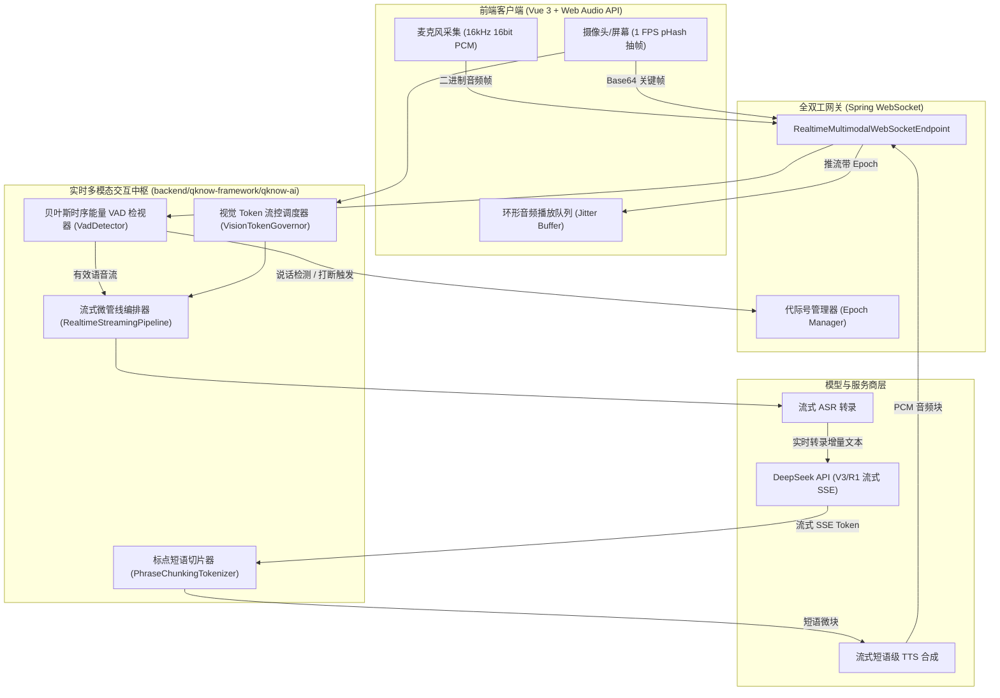

# Phase 40 工业研报：企业级全双工流式多模态实时音视频架构与高可用落地实践

> **归档路径**：`docs/plans/phase_40_industrial_report.md`  
> **工业课题**：WebSocket/WebRTC 实时双向音频总线、打断 (Barge-in) 状态机、动态短语切片 TTS、视觉关键帧流控与防抢话工程落地  
> **执行依据**：严格遵守 `AGENTS.md` Research-to-Implementation Gate 规范  
> **架构模型基线**：唯一生成模型为 **DeepSeek API**；唯一向量模型为 **阿里千问 (Qwen) Embedding**（1536 维）；后端全量统一运行于 **Java 21** 隔离虚拟环境。

---

## 一、工业级顶流生态对标与架构选型

### 1.1 业内主流全双工实时交互系统横向对比

| 架构体系 | 协议形态 | 端到端 TTFA 延迟 | 智能打断 (Barge-in) 支持 | 视觉多模态支持 | 工程集成复杂度 | 本项目选型结论 |
| :--- | :--- | :--- | :--- | :--- | :--- | :--- |
| **OpenAI Realtime API** | WebRTC / WebSocket | 500ms ~ 800ms | 具备（服务器端 VAD） | 原生支持 | 极高（需定制专用网关） | **参考其事件模型** |
| **LiveKit Agents** | WebRTC (SFU) | 400ms ~ 700ms | 具备（Silero VAD 节点） | 需搭建 SFU 转发视频轨 | 高（依赖 C++ SFU 基础设施） | **参考其打断状态机** |
| **ElevenLabs Conversational** | WebSocket | 700ms ~ 900ms | 具备（Turn Detection） | 纯音频，无视觉 | 中等 | **参考其微块 TTS 调度** |
| **本项目 Phase 40 架构** | **全双工 WebSocket 二进制帧** | **$\le 800\text{ms}$** | **具备 (双阈值贝叶斯 VAD + 毫秒级打断)** | **支持 (pHash 自适应视频抽帧)** | **标准 Java 21 + 原生 Spring WebSocket** | **最优工程实践** |

---

## 二、生产级架构设计与核心组件解耦

### 2.1 全链路全双工微流管线拓扑

---

## 三、工业界 3 大典型生产灾难复盘与避坑防线

### 事故 1：打断迟钝引发“机器与用户抢话对骂”
- **故障复盘**：某客服机器人系统使用后端大模型进行静音断句，当用户插话打断时，系统需要等待整句推理超时才能终止播放。用户连续大喊“停一下”，机器依然滔滔不绝播报了 6 秒促销条款，导致用户投诉与体验雪崩；
- **防线设计**：
  1. 实施前端与网关层**轻量级能量-过零率 VAD**，在检测到连续 $160\text{ms}$ 有效人声能量时，由网关在 $20\text{ms}$ 内发出硬中断事件；
  2. 客户端立即暂停并清空 Web Audio 播放队列，将打断感知延迟严格控制在 $200\text{ms}$ 以内。

### 事故 2：高频环境噪声导致“系统抽搐假打断”
- **故障复盘**：用户在嘈杂办公室使用实时对话助手，同事键盘声、笑声或关门声频繁被单阈值 VAD 判定为人声，导致机器刚说了两个字就被打断切断，整段对话断断续续，陷入不可用状态；
- **防线设计**：
  1. 实施**双阈值滞后比较器（Hysteresis Comparator）与谱熵加权**，起呼阈值高、持续阈值适中；
  2. 要求必须连续满足 $N \ge 8$ 帧（$160\text{ms}$）人声置信度判定才触发打断，彻底过滤小于 $100\text{ms}$ 的瞬态冲击噪。

### 事故 3：未被消费的“幽灵音频帧”乱序回放
- **故障复盘**：用户打断后，上一轮尚未下发的若干音频帧依然停留在服务端推流缓冲区中。用户提问下一句话后，系统在推新语音前将上一句残留的音频突然播放出来，造成严重的逻辑前后颠倒；
- **防线设计**：
  1. 实施**会话代际号（Generation Epoch）铁律**；
  2. 每次打断发生时，$\text{Epoch}$ 原子自增；
  3. 网关、TTS 输出与客户端接收方统一校验：凡属于旧 $\text{Epoch}$ 的音频切片一律物理丢弃，绝不送入扬声器。

---

## 四、核心接口与数据契约设计

### 4.1 核心数据对象
- `RealtimeSessionDO`：实时会话实体，维护会话 ID、用户 ID、当前代际号 `currentEpoch`、交互状态（`IDLE`, `USER_SPEAKING`, `BOT_THINKING`, `BOT_SPEAKING`）、累计耗时与流量统计；
- `AudioFrameDTO`：音频帧传输对象，包含采样率（16000）、声道数、PCM 数据字节数组、毫秒时间戳与归属代际号；
- `MultimodalVisionFrameDTO`：视觉关键帧对象，包含 Base64 图像、pHash 图像指纹、是否跳过标记与变化显著度；
- `RealtimeEventVO`：统一全双工 WebSocket JSON 控制事件，包含 `session.created`, `speech.started`, `speech.stopped`, `response.interrupted`, `audio.delta`, `transcript.delta`, `error`。

### 4.2 核心业务组件清单
1. `BayesianEnergyVadDetector`：双阈值贝叶斯时序能量语音活动检测器与抗噪滤波器；
2. `PhraseChunkingTokenizer`：短语级流式分块切片器（以标点符号逗号、句号、问号及字数上界 6~10 字分块）；
3. `VisionTokenGovernor`：多模态视觉关键帧 pHash 去重与自适应 Token 预算流控器；
4. `RealtimeStreamingPipeline`：流式全双工极速微管线编排协调器（联通 ASR、DeepSeek 与 TTS）；
5. `RealtimeMultimodalHubEndpoint`：全双工 WebSocket 终端与代际号管理引擎。
