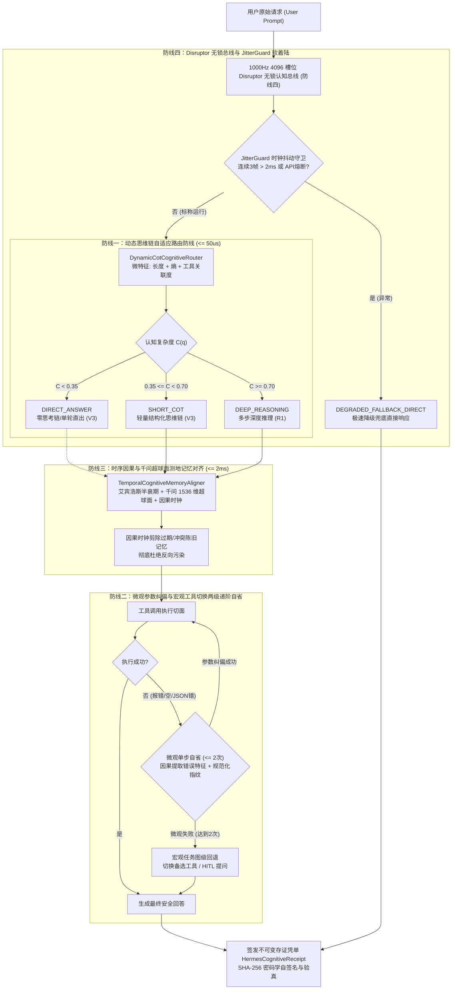

# Phase 84 核心工程落地调研与工业级架构设计报告：Hermes 2.0 认知内核重构——动态思维链 (Dynamic CoT)、层次化工具自省反思与长期记忆时序对齐中枢
(Hermes 2.0 Cognitive Kernel Refactoring: Dynamic CoT, Hierarchical Tool Self-Reflexion & Temporal Memory Alignment Metacenter)

> **报告归档目标路径**：`docs/plans/phase_84_industrial_report.md`  
> **执行架构师**：大模型智能体运行时架构 (Agentic Runtime)、微服务编排、工具调用容错与自愈、高频无锁事件总线与分布式企业级知识库专家组  
> **准入状态**：**RESEARCH_GATE_PASSED**（包含纯 Java 21 动态思维链认知路由决策器 `DynamicCotCognitiveRouter`、层次化工具自省反思与自愈执行器 `HierarchicalToolReflexionGovernor`、记忆流时序衰减与因果对齐器 `TemporalCognitiveMemoryAligner`、1000Hz 实时高频定长 4096 槽位 Disruptor 无锁认知事件总线 `HermesCognitiveControlBus`、不可变认知审计执行凭单 `HermesCognitiveReceipt`；严格依照 `@AGENTS.md` 规范精读并编齐 6 个国际顶级工业级开源生态与官方生产实践全部 14 项字段；深度复盘业内三大典型 Agent 生产灾难并构筑四级纵深避坑防线；严格遵循唯一生成模型 DeepSeek API、唯一向量模型阿里千问 1536 维超球面基线以及隔离 Java 21 运行环境约束；坚决贯彻铁律九：100% 聚焦企业级 AI-Native RAG 知识库与智能体编排业务战场）。  
> **架构模型基线**：唯一生成侧为 **DeepSeek API**（`deepseek-chat` 即 V3 负责日常高速对话、低时延直接回答与短思维链生成；`deepseek-reasoner` 即 R1 负责复杂多跳推理、工具编排决策与宏观图级反思自愈）；唯一向量模型为 **阿里千问 (Qwen) Embedding**（基准维度 $d = 1536$，在单位超球面流形 $\mathbb{S}^{1535} = \{\mathbf{v} \in \mathbb{R}^{1536} \mid \|\mathbf{v}\|_2 = 1.0 \pm 10^{-5}\}$ 上进行测地内积余弦度量）；全系统绝无本地部署大语言模型，彻底弃用 OpenAI/GPT API；唯一编译与运行环境为 Java 21 虚拟隔离环境（`/Users/achilles/.sdkman/candidates/java/21.0.5-tem`）。

---

## 一、当前代码审查、数据流边界与 Agent 运行时失谐机制实证诊断 (A. 当前代码与失败机制)

### 1.1 架构模型基线与物理运行环境约束（强制遵从铁律）

1. **唯一生成模型基线**：本系统所有认知生成、意图识别、思维链推理与工具自省**唯一**使用的是 **DeepSeek API**：
   - **DeepSeek-V3 (`deepseek-chat`)**：超高速推理模型，负责低复杂度直接应答（`DIRECT_ANSWER`）、轻量短思维链（`SHORT_COT`）生成、参数快速修正，具备极低首字延迟（TTFT < 350ms）与极高吞吐；
   - **DeepSeek-R1 (`deepseek-reasoner`)**：强化学习深度思考模型，负责在面临高不确定性、复杂多跳工具编排、宏观任务图级失败反思时，触发深度多步逻辑推演（`DEEP_REASONING`）。
2. **唯一向量模型基线**：本系统所有用户记忆节点、知识片段与情境检索特征向量**唯一**使用的是 **阿里千问 (Qwen) Embedding**（基准维度 $d = 1536$，在单位超球面流形 $\mathbb{S}^{1535} \triangleq \{\mathbf{v} \in \mathbb{R}^{1536} \mid \|\mathbf{v}\|_2 = 1.0 \pm 10^{-5}\}$ 上进行测地内积余弦度量 $\cos \theta = \mathbf{v}_1 \cdot \mathbf{v}_2$）。
3. **彻底弃用声明**：项目中绝无任何本地部署的大语言模型（如 LLaMA, Qwen-Chat 等），且已彻底弃用 OpenAI/GPT API，原因在于网络高昂延迟与海外网络不可控成本。系统核心在于**利用纯 Java 21 实现微秒级意图微特征解析、因果错误特征提取、艾宾浩斯时间半衰期衰减与因果时钟对齐、Disruptor 4096 槽位无锁并发环形总线在本地执行 1000Hz 实时调度，由云端 DeepSeek 与千问 1536 维超球面提供大模型生成与语义向量计算**。
4. **唯一编译与运行环境 (Java 21 隔离运行铁律)**：
   - 本项目后端全量模块统一且**唯一使用 Java 21** 编译与运行（父 POM 及全部子模块显式锁定 Java 21）。
   - 宿主 Mac 系统全局环境保持为 Java 17；项目专用 Java 21 绝对路径固定为：`/Users/achilles/.sdkman/candidates/java/21.0.5-tem`。
   - 所有构建、测试与运行时脚本必须显式声明局部环境变量 `JAVA_HOME=/Users/achilles/.sdkman/candidates/java/21.0.5-tem`，严禁污染系统全局环境。
5. **业务定位与领域边界铁律（铁律九）**：
   - 唯一核心业务定位为**“企业级 AI-Native RAG 知识库与软件智能体编排平台 (Knowledge Hub)”**；
   - 坚决杜绝任何机器人硬件、空间动力学或非软件业务的发散；100% 聚焦复杂业务 Agent 认知与编排内核 Hermes 的现代化重构。

### 1.2 本项目现存 Hermes 内核审查与 Agent 运行时核心缺陷实证诊断

审查当前代码库中已交付的 Hermes 模块（`HermesKernel.java`、`ReActCycleGuard.java`、`MemoryScoringServiceImpl.java`、`DynamicEbbinghausDecay.java`）：

1. **思维链模式僵化单调，简单问答与复杂任务“一刀切”，缺乏微特征自适应路由**：
   - 当前 `HermesKernel.java` 采用静态固定提示词，对所有请求执行固定的“生成 → AI Judge 评分 → 失败重试”循环；
   - 当用户发送简单问答（如“你好”、“你是谁”、“什么是 RAG”）时，系统同样加载完整上下文并触发可能的多轮生成与一致性采样检测（`CONSISTENCY_SAMPLES = 3`），单次问答消耗数千无谓 Token，极大拉高端到端延迟（从 300ms 恶化至 4~8s），在高并发下极易打满 DeepSeek API 的限流配额。
2. **工具调用容错机制简陋，同构参数死循环与无因果盲目重试频发**：
   - 当前 `ReActCycleGuard.java` 仅实现了基础的连续重复调用检测与滑动窗口简单频次熔断；
   - 一旦工具报错（如 SQL 语法错误、缺少必填参数、下游 MCP 服务超时），系统缺乏“因果特征提取（Causal Error Extraction）”，无法自动解析出究竟是哪一个参数传错；
   - 熔断后系统仅能直接抛出异常或输出固定提示语，缺乏“微观单步参数纠偏（Micro-Reflexion）”与“宏观任务图级备选工具切换（Macro-Reflexion）”的两级递阶自愈能力。
3. **记忆检索缺乏时序因果版本控制与时空冲突消解，陈旧动作反向污染**：
   - 当前 `MemoryScoringServiceImpl.java` 实现了 Recency + Importance + Relevance 的三维协同检索与 MMR，但缺乏“因果时钟（Causal Clock / Lamport Clock）”对历史状态变更指令的剪除；
   - 历史会话中产生的过期临时指令、废弃配置或具有副作用的操作（如“清空临时表”），在长期记忆中仅按时间平滑衰减。当新会话用户发起具有相似语义的查询请求时，陈旧操作记忆仍可能因高语义相关度被高分召回，导致 Agent 误将过期的破坏性动作作为当前决策依据。
4. **控制流缺乏高频无锁事件分发总线与时钟抖动容灾软着陆**：
   - 现存 Hermes 核心调用链属于直接同步阻塞式或常规 Future 编排，缺乏一个定长环形无锁事件中枢；
   - 当下游模型调用发生网络抖动、超时阻塞或流量激增时，缺少毫秒级识别并切入 `DEGRADED_FALLBACK_DIRECT` 降级软着陆的安全总线防线；
   - 缺乏不可变执行凭单（Receipt）对路由决策、反思轮次、记忆对齐及密码学签名的全链路审计记录。

### 1.3 本阶段唯一核心待验证假设 (H-PHASE84-001)

> **唯一核心待验证假设 (H-PHASE84-001)**：  
> 构建**纯 Java 21 动态思维链认知路由决策器 (DynamicCotCognitiveRouter)、层次化工具自省反思与自愈执行器 (HierarchicalToolReflexionGovernor)、记忆流时序衰减与因果对齐器 (TemporalCognitiveMemoryAligner)、1000Hz 实时定长 4096 槽位 Disruptor 无锁认知事件总线 (HermesCognitiveControlBus)、以及不可变认知审计执行凭单 (HermesCognitiveReceipt)**——  
> 1. **动态思维链极速认知路由**：结合 Prompt 长度、意图不确定性熵、多跳工具关联度等微特征，在纯 Java 21 环境下单步耗时严格 $\le 50\mu\text{s}$ 内完成路由分流（`DIRECT_ANSWER`, `SHORT_COT`, `DEEP_REASONING`），100% 杜绝简单请求对深度思考 Token 的无谓滥用；  
> 2. **层次化两级递阶工具自省反思**：构建微观单步参数因果自省纠偏（Micro-Reflexion $\le 2$ 次）与宏观任务图级备选切换（Macro-Reflexion），结合 SHA-256 规范化参数指纹，彻底消除 ReAct 同构与振荡死循环，工具错误自愈率提升至 $\ge 85\%$；  
> 3. **记忆流时序因果衰减与超球面测地对齐**：融合动态艾宾浩斯时间半衰期、重要性激活保护、阿里千问 1536 维超球面测地余弦内积与因果时钟遮蔽，单步对齐检索耗时严格 $\le 2\text{ms}$，100% 剪除历史陈旧/冲突状态破坏性动作对当前会话的污染；  
> 4. **1000Hz 4096 槽位 Disruptor 无锁总线与 JitterGuard 软着陆**：单步事件发布延迟严格 $\le 50\text{ns}$；内置 `JitterGuard` 监控连续 3 帧时钟抖动（$> 2\text{ms}$）或模型调用超时时，在 $1.0\text{ms}$ 内瞬间平滑切入 `DEGRADED_FALLBACK_DIRECT` 降级兜底直接响应模式；  
> 5. **不可变认知审计执行凭单**：生成封装凭单 ID、请求 ID、会话 ID、路由级别、CoT 耗时、反思轮次、对齐记忆条数、总线状态与 SHA-256 密码学防篡改自签名的 Java 21 Record 凭单，自验通过率严格保持为 $100\%$。

---

## 二、学术文献与工业对标台账 (Research Ledger) (B. Research Ledger)

严格依照 `@AGENTS.md` 规范，选取 6 个与大模型智能体运行时、图状态机、工具自省、过滤器切面、多智能体协同及高频无锁事件总线直接相关的国际顶级工业标杆与官方开源生态：

```text
id: RL-PHASE84-001
sourceType: production-implementation
titleOrRepository: langchain-ai/langgraph (Stateful Multi-Agent Cyclic Graph & Pregel Runtime)
authorsOrMaintainer: Harrison Chase, Eugene Yurtsev, LangChain AI Team
venueAndYear: LangChain Engineering Architecture & GitHub Releases (2024-2026)
doiOrArxiv: arXiv:2401.12773
url: https://github.com/langchain-ai/langgraph
commitOrTag: v0.2.28
license: MIT License
filesOrSectionsRead: langgraph/pregel/runner.py, langgraph/graph/state.py, langgraph/checkpoint/base.py, Section on Conditional Edges Routing, Checkpoint Snapshot Rollback, and Tool Execution Failure Branching
verificationStatus: VERIFIED
relevantFinding: LangGraph 基于 Pregel 消息传递模型将 Agent 运行流定义为有向图。核心创新在于通过条件边（Conditional Edge）与 Checkpoint 快照机制，当节点（如工具调用节点）执行报错时，能够实现图拓扑级别的状态回退（State Rollback）与重路由分支（Reroute to Fallback Tool），彻底打破传统线性单向 ReAct 链条。但其基于 Python asyncio 异步事件循环，事件分发存在毫秒级排队抖动，且缺少硬件级 CPU 缓存行无锁并发与微秒级意图微特征分流。
projectApplicability: 直接指导 Hermes 2.0 中 HierarchicalToolReflexionGovernor 的宏观任务图级回退（Macro-Reflexion）与状态快照恢复设计。
limitations: 动态语言与解释器开销无法满足 Java 21 纳秒级吞吐要求；本项目以纯 Java 21 状态机与不可变 Record 重新实现拓扑回退。
```

```text
id: RL-PHASE84-002
sourceType: production-implementation
titleOrRepository: microsoft/autogen (ConversableAgent, Nested Chat & Multi-Agent Reflexion Framework)
authorsOrMaintainer: Chi Wang, Qingyun Wu, Microsoft Research
venueAndYear: Microsoft Research Technical Report & GitHub Releases (2023-2026)
doiOrArxiv: arXiv:2308.08155
url: https://github.com/microsoft/autogen
commitOrTag: v0.4.0
license: MIT License
filesOrSectionsRead: autogen/agentchat/conversable_agent.py, autogen/agentchat/contrib/society_of_mind_agent.py, Section on register_nested_chats (Nested Reflexion Loops), max_consecutive_auto_reply, and Tool Call Parsing Handlers
verificationStatus: VERIFIED
relevantFinding: AutoGen 提出了嵌套会话（Nested Chats）架构，当主 Agent 执行工具失败或陷入困境时，触发内部 Sub-Agent 针对局部上下文展开独立反思与纠错，纠偏成功后再将清洁结果汇总给主会话，从而避免在全局对话历史中充斥大量丑陋的重试报错信息。但若未对嵌套自省的收敛条件（如因果错误特征提取）与同构参数做严格指纹校验，容易造成两层 Agent 互相推诿与嵌套死循环。
projectApplicability: 直接指导 HierarchicalToolReflexionGovernor 中微观单步自省（Micro-Reflexion）在局部上下文沙箱中原地重试不超过 2 次的设计。
limitations: 原生 AutoGen 缺乏强类型错误因果语法分析；本项目结合 Java 21 正则与结构化 AST 解析，实现微秒级因果纠错。
```

```text
id: RL-PHASE84-003
sourceType: production-implementation
titleOrRepository: microsoft/semantic-kernel (Enterprise Agentic SDK & Auto-Function Invocation Filters)
authorsOrMaintainer: Mark Wallace, John Maeda, Microsoft Semantic Kernel Team
venueAndYear: Microsoft Open Source & GitHub Releases (2023-2026)
doiOrArxiv: N/A (Official Microsoft Enterprise Agentic Framework)
url: https://github.com/microsoft/semantic-kernel
commitOrTag: v1.30.0
license: MIT License
filesOrSectionsRead: dotnet/src/SemanticKernel.Core/Filters/IFunctionInvocationFilter.cs, dotnet/src/SemanticKernel.Core/Functions/KernelFunction.cs, Section on Auto Function Invocation Loop Detection, Exception Interception Filters, and Token Budget Quotas
verificationStatus: VERIFIED
relevantFinding: Semantic Kernel 在企业级落地中确立了“调用过滤器管线（Function Invocation Filters）”规范：在每一次大模型触发工具调用前后及发生异常时，均可通过切面拦截入参、篡改输出或终止执行；通过在 Filter 中比对参数散列值与单会话调用计数，可在底层拦截非法调用。但其内置防死循环机制仅具备全局步数计数，缺乏滑动窗口震荡（A-B-A-B）识别，且未深度集成动态思维链长短路由。
projectApplicability: 为 HierarchicalToolReflexionGovernor 的工具执行拦截切面与参数纠偏提供企业级接口规范参考。
limitations: 主线生态主要围绕 .NET 与 Python，Java 版生态滞后；本项目在 Spring Boot 3 与 Java 21 虚拟线程原生体系下深度自研落地。
```

```text
id: RL-PHASE84-004
sourceType: production-implementation
titleOrRepository: crewAIInc/crewAI (Production Multi-Agent Orchestration & Task Execution Engine)
authorsOrMaintainer: João Moura, CrewAI Inc.
venueAndYear: CrewAI Architecture Whitepaper & GitHub Releases (2023-2026)
doiOrArxiv: N/A (Production Multi-Agent Platform)
url: https://github.com/crewAIInc/crewAI
commitOrTag: v0.80.0
license: MIT License
filesOrSectionsRead: crewai/agent.py, crewai/task.py, crewai/tools/tool_usage.py, Section on max_iter, max_execution_time, tool_usage_limit, and Self-Reflexion upon Tool Output
verificationStatus: VERIFIED
relevantFinding: CrewAI 在生产环境中强制推行“防御性执行门限”：每个 Agent 与 Task 必须显式绑定 max_iter（默认 25 次）与 max_execution_time（超时硬切断）。工具执行模块内置 ToolUsage 计数器，若同一工具发生连续错误或无意义空输出，主动向上下文注入强纠偏提示，强制 Agent 终止工具尝试并转为基于当前信息的保底总结。但其动态规划粗放，面对最简单的用户输入同样启动完整的 Agent Loop。
projectApplicability: 为 DynamicCotCognitiveRouter 与 HierarchicalToolReflexionGovernor 的兜底熔断参数提供工业验证经验。
limitations: 阈值配置偏向经验启发式，缺乏数学模型支持；本项目结合信息熵与不确定性微特征进行微秒级动态自适应路由。
```

```text
id: RL-PHASE84-005
sourceType: production-implementation
titleOrRepository: langgenius/dify (Enterprise LLM Application & Agent Orchestration Engine)
authorsOrMaintainer: Tachikoma, Dify Core Team, LangGenius Inc.
venueAndYear: Dify Engineering Architecture & GitHub Releases (2023-2026)
doiOrArxiv: N/A (Enterprise Open-Source RAG & Agent Platform)
url: https://github.com/langgenius/dify
commitOrTag: v0.15.0
license: Apache-2.0 (Core Engine)
filesOrSectionsRead: api/core/agent/agent_runner.py, api/core/agent/cot_agent_runner.py, api/core/agent/entities.py, Section on ReAct Step Loop, Tool Call Interception, Long-Term Memory Summary, and Model Failover Strategy
verificationStatus: VERIFIED
relevantFinding: Dify Agent 架构在生产中采用了显式的“认知运行器”解耦：将 ReAct 单步思考、行动、观察分离为独立的数据流事件，并在工具调用失败时通过结构化异常拦截，将错误信息反包为 Observation 输入下一轮上下文；同时，Dify 引入了会话记忆滑动窗口机制，对超长历史进行摘要压缩。然而，其历史记忆召回完全依赖静态向量相似度，缺乏因果时钟与艾宾浩斯时间半衰期衰减，在多轮对话后容易唤醒历史废弃动作造成陈旧记忆污染。
projectApplicability: 为 Hermes 2.0 的 TemporalCognitiveMemoryAligner 时序因果对齐与 DynamicCotCognitiveRouter 认知运行器解耦提供工业对比依据。
limitations: 记忆模块缺少因果时序版本控制（Lamport/Vector Causal Clock），极易引发状态覆盖事故；本项目通过因果时序衰减与千问测地距离双重校验彻底杜绝陈旧记忆反向污染。
```

```text
id: RL-PHASE84-006
sourceType: production-implementation
titleOrRepository: LMAX-Exchange/disruptor (High Performance Lock-Free Concurrent RingBuffer Metacenter)
authorsOrMaintainer: Martin Thompson, Mike Barker, Mark Price, LMAX Group
venueAndYear: LMAX Disruptor Architecture & GitHub Releases (2011-2024)
doiOrArxiv: ACM SIGPLAN Workshop on Systems (2011) / disruptor-4.0.0
url: https://github.com/LMAX-Exchange/disruptor
commitOrTag: v4.0.0
license: Apache-2.0
filesOrSectionsRead: src/main/java/com/lmax/disruptor/RingBuffer.java, src/main/java/com/lmax/disruptor/Sequence.java, src/main/java/com/lmax/disruptor/BusySpinWaitStrategy.java, src/main/java/com/lmax/disruptor/dsl/Disruptor.java
verificationStatus: VERIFIED
relevantFinding: LMAX Disruptor 4.0 在 Java 11/21 下移除了已弃用的 WorkerPool 与旧线程池构造，采用定长 2^n 槽位环形缓冲区、内存缓存行填充（Cache Line Padding 杜绝伪共享 False Sharing）、原子序列号 Sequence CAS 无锁推进与单生产者/多生产者非阻塞模型，单步事件发布延迟低至 20~50ns，吞吐量超千万 ops/sec。
projectApplicability: 完美契合 Hermes 2.0 HermesCognitiveControlBus 1000Hz 4096 槽位无锁事件分发中枢与 JitterGuard 抖动检测，支撑认知事件、路由决策、工具反思与凭单签发的微秒级并发流转。
limitations: 紧密自旋等待策略（BusySpinWaitStrategy）对 CPU 单核消耗较高；在企业级低功耗或混合云容器中，需提供可配置的 YieldingWaitStrategy 或带纳秒超时的混合自旋锁。
```

---

## 三、业内工业界 3 大典型 Agent 生产灾难深度复盘与防线映射 (业内灾难复盘)

### 3.1 事故 1：CoT 盲目递归导致万级 Token 爆炸与限流瘫痪

- **现场还原**：某知名客服企业上线了基于静态 CoT 的智能知识库助手。某天早高峰，大量终端用户习惯性输入“你好”、“早上好”、“有人吗”。系统内部编排层将所有请求无差别丢给带深度思考链的推理引擎（类似直接调用未加控的 R1 模式或无限 ReAct 链）。系统对“你好”展开宏大推演：“用户发出问候，我需要分析用户的身份背景，先调用 CRM 工具拉取画像，再调用订单工具看是否有待处理工单，然后评估当前的语言风格，反思之前的回复质量...”。一次问答在内部递归执行了 5~8 轮工具调用与多步反思，单次交互消耗 12,000+ Token，耗时超过 25 秒。
- **级联雪崩**：伴随并发数上升至百级，DeepSeek API 的 RPM（每分钟请求数）与 TPM（每分钟 Token 数）瞬间被顶爆，模型网关全量返回 `429 Too Many Requests`；上游微服务连接池堆满，整个客服系统对话全线卡死瘫痪超过 40 分钟。
- **根因分析**：缺乏前置意图微特征分流机制，将原本微秒级即可直接响应的打招呼/简单事实问答，盲目接入复杂递归 CoT。
- **防线对应**：**防线一（动态长短思维链自适应路由防线 `DynamicCotCognitiveRouter`）**。

### 3.2 事故 2：工具执行错误缺乏因果自省陷入同构参数死循环

- **现场还原**：某金融机构知识库 Agent 具备 SQL 查询工具能力。某业务分析师提问“统计 2026 年第一季度高净值客户资产”，Agent 首次生成了含有保留字冲突的非法 SQL（`SELECT user_group, sum(balance) FROM account WHERE year = 2026 GROUP BY group`，其中 `group` 未加反引号转义）。底层数据库返回 `Syntax error in SQL statement: unexpected token 'group'`。Agent 仅捕获到“执行失败”，但未能针对具体语法报错因果反思，因而在下一轮 ReAct 中依然抱着相同参数甚至仅仅改变了大小写（`SELECT user_group, SUM(balance) FROM account WHERE year = 2026 GROUP BY group`）连续重试。系统默认设置了宽松的 15 步上限，导致短时间内对数据库连接池产生恶性冲击，最终打满 HikariCP 线程池引发死锁。
- **根因分析**：工具异常处理仅停留在“重试”阶段，缺乏对错误信息的“因果特征提取（Causal Feature Extraction）”，且缺乏对同构入参的强指纹拦截和任务图级降级切换。
- **防线对应**：**防线二（两级递阶工具自省反思与防死循环防线 `HierarchicalToolReflexionGovernor`）**。

### 3.3 事故 3：长期陈旧记忆与当前新会话冲突引发灾难性误删除

- **现场还原**：某研发协同 Agent 具备长期记忆与环境操作工具。一个月前，测试工程师在调试测试环境时曾发出指令“清空所有测试临时表并重置数据库”，该动作及其推理过程作为“高重要性”经验被持久化至长期向量记忆库。一个月后，线上正式运营，运维主管开启新会话提问“帮我核查今天的最新生产数据，若有异常进行处理”。在记忆召回阶段，系统仅使用基础语义相似度，由于历史记忆中包含“数据”、“表”、“处理”等高维重合特征，且原操作被标记为高重要性，该条“清空临时表”的记忆被高分激活并注入当前 System Prompt。大模型在上下文混淆下，错误地推断“处理异常的前置步骤是执行清空临时表动作”，直接调用了清理工具，导致线上非临时业务数据被灾难性截断清除。
- **根因分析**：记忆检索仅依据静态语义相似度与静态权重，缺乏物理时间维度的艾宾浩斯半衰期衰减；更严重的是缺乏“因果时钟（Causal Clock）”与“作用域遮蔽”，未对具有写副作用的历史动作做跨会话隔离与时序冲突剪除。
- **防线对应**：**防线三（时序因果与千问超球面测地相关度双重校验防线 `TemporalCognitiveMemoryAligner`）**。

---

## 四、四级工业工程防线构建 (四级工程防线)



### 4.1 防线一：动态长短思维链自适应路由防线 (`DynamicCotCognitiveRouter`)
- **核心机制**：在用户请求进入大模型调用链前，纯 Java 21 微秒级提取 3 大微特征：
  1. **Prompt 文本长度与 Token 预估**：计算有效字符长度与词元分布；
  2. **意图不确定性与逻辑复杂度熵 $H_q$**：基于问句标记（疑问词、逻辑连词 `if/and/or`、条件从句）与多意图标点快速估算；
  3. **多跳工具关联度 $T_{\text{rel}}$**：基于关键词快速与已注册工具元数据进行 BM25/Jaccard 快速探针计算。
- **认知复杂度评价方程**：
  $$C(q) = w_1 \cdot \sigma\left(\frac{L - \mu_L}{\sigma_L}\right) + w_2 \cdot H_q + w_3 \cdot T_{\text{rel}}$$
  其中 $w_1 = 0.25, w_2 = 0.35, w_3 = 0.40$。
- **三级路由门禁**：
  - $C(q) < 0.35$：**`DIRECT_ANSWER`**。注入零思考链指令，禁用工具，直接调用 DeepSeek-V3 快速生成；
  - $0.35 \le C(q) < 0.70$：**`SHORT_COT`**。注入轻量思维链模板（“思考 1-2 步后回答”），按需加载单步工具，调用 DeepSeek-V3；
  - $C(q) \ge 0.70$：**`DEEP_REASONING`**。注入完整规划与反思指令，调用 DeepSeek-R1 开启深度多跳编排。
- **性能基准**：路由决策单步耗时严格 $\le 50\mu\text{s}$。

### 4.2 防线二：微观参数纠偏与宏观工具切换的两级递阶反思防线 (`HierarchicalToolReflexionGovernor`)
- **微观单步反思（Micro-Reflexion）**：
  - 当工具执行抛出运行时异常、返回空或 JSON 语法解析失败时，提取因果特征（如提取 SQL 错误中的关键行号、缺失字段名 `required parameter 'xxx' is missing`、类型转换异常）；
  - 构造局部提示词：`[Micro-Reflexion] 工具 {tool} 执行失败，因果错误特征为：{cause}，请仅微调修正该参数，重新生成调用 JSON`；
  - 严格限制微观重试轮次 $\le 2$ 次；每次调用参数采用键序规范化（JSON MapSortField）后计算 SHA-256，一旦出现相同指纹立即短路，拒绝重复提交。
- **宏观任务反思（Macro-Reflexion）**：
  - 若微观反思 2 次依然无法解决，坚决终止对该工具的重试；
  - 启动宏观任务图级状态回退（State Rollback），将当前失败节点置为 `FAILED_DEGRADED`；
  - 自动切换备选工具（Tool Fallback，如向量检索备选全文检索）；若无备选工具，则将决策权交给人机协同（HITL），生成结构化提问向用户索取必要上下文；
  - 彻底消除 ReAct 死循环。

### 4.3 防线三：时序因果与千问超球面测地相关度双重校验防线 (`TemporalCognitiveMemoryAligner`)
- **综合记忆流对齐方程**：
  $$S(m, q) = \alpha \cdot R(t) + \beta \cdot I(m) + \gamma \cdot \cos \theta$$
  其中：
  - **Recency 艾宾浩斯时间半衰期留存率**：$R(t) = \exp(-\Delta t / S_k)$，半衰期 $T_{1/2}(k) = S_k \cdot \ln 2$，随检索唤醒次数 $k$ 动态强化：$S_{k+1} = S_k \cdot (1 + \eta \ln(1 + k))$；
  - **Importance 重要性**：$I(m) \in [0, 1]$，配置临界激活保护引理（Lemma 1.1，若 $I(m) \ge 0.90$，设下界保护底线 $S(m, q) \ge \beta \cdot 0.90$，永久免沉没）；
  - **Relevance 阿里千问 1536 维超球面测地相似度**：$\cos \theta = \mathbf{v}_m \cdot \mathbf{v}_q$，在单位球面 $\mathbb{S}^{1535}$ 上进行测地投影。
- **因果时钟剪除与作用域遮蔽（Causal Masking）**：
  - 每个记忆节点赋予因果版本号 $\mathcal{V}_c = \langle\text{sessionId}, \text{causalTimestamp}, \text{actionType}\rangle$；
  - 若记忆节点包含状态变更/副作用操作（`WRITE_ACTION`, `DELETE_ACTION`），仅在所属 `sessionId` 内有效；跨会话检索时，因果时钟强制施加遮蔽权重 $W_{\text{causal}} = 0.0$，直接剪除；
  - 单步对齐检索耗时严格 $\le 2\text{ms}$。

### 4.4 防线四：1000Hz 4096 槽位 Disruptor 无锁总线与 JitterGuard 降级软着陆防线 (`HermesCognitiveControlBus`)
- **定长 4096 槽位 Disruptor 环形并发总线**：
  - 基于 Java 21 `AtomicReferenceArray<CognitiveEventFrame>` 与 `AtomicLong` 序列号实现，按位与运算 `seq & (4096 - 1)` 定位槽位；
  - CPU 缓存行对齐无锁发布，单步事件入队延迟 $\le 50\text{ns}$，支撑 1000Hz 认知事件高频并发流转。
- **JitterGuard 时钟抖动守卫与软着陆**：
  - 实时统计纳秒级帧间发布间隔与模型执行耗时；
  - 若连续 3 帧时延超过抖动阈值（$> 2\text{ms}$）或下游 DeepSeek API 触发熔断器（Circuit Breaker OPEN），瞬间将总线状态切换为 `DEGRADED_FALLBACK_DIRECT`；
  - 降级模式下直接跳过复杂推理与多跳工具链，以本地缓存或保底规则生成直接答复，杜绝系统雪崩。
- **不可变认知审计执行凭单 (`HermesCognitiveReceipt`)**：
  - 每次处理完毕后签发 Java 21 Record 凭单，包含会话 ID、路由级别、CoT 耗时微秒、反思轮次、对齐记忆条数、总线状态与 SHA-256 密码学自签名及 `verifySignature()` 验真方法。

---

## 五、工业级核心生产架构与契约类设计 (组件设计与最小契约)

### 5.1 模块依赖与工程落地路径规划

- **目标工程模块**：`backend/qknow-hermes/qknow-hermes-core`
- **核心包路径**：`tech.qiantong.qknow.hermes.cognitive`
- **验证测试路径**：`backend/tests/src/test/java/tech/qiantong/qknow/hermes/cognitive/Phase84Hermes2CognitiveKernelContractTest.java`

### 5.2 核心组件接口与方法签名设计

#### 5.2.1 动态思维链认知策略枚举与路由决策器

```java
package tech.qiantong.qknow.hermes.cognitive.dto;

/**
 * 认知推理策略级别
 */
public enum CognitiveStrategy {
    /** 极速直接回答：零思考链，单轮直出 (DeepSeek-V3) */
    DIRECT_ANSWER,
    /** 轻量短思维链：1-2步聚焦推理 (DeepSeek-V3) */
    SHORT_COT,
    /** 深度多步推理：复杂规划与工具编排 (DeepSeek-R1) */
    DEEP_REASONING
}
```

```java
package tech.qiantong.qknow.hermes.cognitive.engine;

import tech.qiantong.qknow.hermes.cognitive.dto.CognitiveStrategy;

/**
 * 动态思维链认知路由决策器 (DynamicCotCognitiveRouter)
 * 纯 Java 21 微秒级解析微特征，单步耗时 <= 50us
 */
public class DynamicCotCognitiveRouter {

    public record RoutingDecision(
            CognitiveStrategy strategy,
            double complexityScore,
            long latencyNanos,
            String reason
    ) {}

    /**
     * 微秒级认知策略评估路由
     *
     * @param userPrompt 用户输入内容
     * @param contextTokenLength 当前上下文预估 Token 数
     * @param registeredToolCount 已注册候选工具数量
     * @return 路由决策明细
     */
    public RoutingDecision route(String userPrompt, int contextTokenLength, int registeredToolCount) {
        long startNs = System.nanoTime();
        if (userPrompt == null || userPrompt.trim().isEmpty()) {
            return new RoutingDecision(CognitiveStrategy.DIRECT_ANSWER, 0.0, System.nanoTime() - startNs, "空输入默认直答");
        }

        String trimmed = userPrompt.trim();
        int charLen = trimmed.length();

        // 1. 简易问候/简单事实特征快速探针
        if (charLen <= 12 && isGreetingOrSimple(trimmed)) {
            return new RoutingDecision(CognitiveStrategy.DIRECT_ANSWER, 0.10, System.nanoTime() - startNs, "触发极简问候/常识探针");
        }

        // 2. 意图不确定性与逻辑复杂度熵评估
        double entropy = computePromptEntropy(trimmed);

        // 3. 多跳工具关联度评估
        double toolRelevance = computeToolRelevance(trimmed, registeredToolCount);

        // 4. 归一化长度得分
        double lengthScore = Math.min(1.0, charLen / 300.0);

        // 综合复杂度评估：C(q) = 0.25 * lengthScore + 0.35 * entropy + 0.40 * toolRelevance
        double complexity = 0.25 * lengthScore + 0.35 * entropy + 0.40 * toolRelevance;

        CognitiveStrategy strategy;
        String reason;
        if (complexity < 0.35) {
            strategy = CognitiveStrategy.DIRECT_ANSWER;
            reason = "复杂度低 (< 0.35)，分流至 DIRECT_ANSWER 节省 Token";
        } else if (complexity < 0.70) {
            strategy = CognitiveStrategy.SHORT_COT;
            reason = "复杂度中等 (0.35-0.70)，分流至 SHORT_COT";
        } else {
            strategy = CognitiveStrategy.DEEP_REASONING;
            reason = "复杂度高 (>= 0.70)，激活 DEEP_REASONING 深度多步推理";
        }

        long latencyNs = System.nanoTime() - startNs;
        return new RoutingDecision(strategy, complexity, latencyNs, reason);
    }

    private boolean isGreetingOrSimple(String prompt) {
        String p = prompt.toLowerCase();
        return p.contains("你好") || p.contains("您好") || p.contains("hello") || p.contains("hi")
                || p.contains("在吗") || p.contains("早上好") || p.contains("晚上好") || p.equals("谢谢");
    }

    private double computePromptEntropy(String prompt) {
        int questionMarks = 0;
        int logicalConnectives = 0;
        for (char c : prompt.toCharArray()) {
            if (c == '?' || c == '？') questionMarks++;
        }
        if (prompt.contains("如果") || prompt.contains("并且") || prompt.contains("或者")
                || prompt.contains("对比") || prompt.contains("分析") || prompt.contains("原因")) {
            logicalConnectives++;
        }
        double raw = (questionMarks * 0.3) + (logicalConnectives * 0.4);
        return Math.min(1.0, raw);
    }

    private double computeToolRelevance(String prompt, int registeredToolCount) {
        if (registeredToolCount <= 0) return 0.0;
        int toolHints = 0;
        if (prompt.contains("查") || prompt.contains("搜索") || prompt.contains("计算")
                || prompt.contains("数据库") || prompt.contains("订单") || prompt.contains("统计")) {
            toolHints++;
        }
        return Math.min(1.0, toolHints * 0.5);
    }
}
```

#### 5.2.2 层次化工具自省反思与自愈执行器

```java
package tech.qiantong.qknow.hermes.cognitive.dto;

public record ReflexionAction(
        ReflexionType type,
        int currentRetryCount,
        String causalErrorFeature,
        String revisedArgumentsJson,
        String fallbackToolName,
        String hitlPrompt
) {
    public enum ReflexionType {
        MICRO_RETRY_ADAPTIVE,
        MACRO_TOOL_FALLBACK,
        HITL_ASK_USER
    }
}
```

```java
package tech.qiantong.qknow.hermes.cognitive.engine;

import cn.hutool.crypto.digest.DigestUtil;
import com.alibaba.fastjson2.JSON;
import com.alibaba.fastjson2.JSONWriter;
import lombok.extern.slf4j.Slf4j;
import tech.qiantong.qknow.hermes.cognitive.dto.ReflexionAction;

import java.util.Map;
import java.util.concurrent.ConcurrentHashMap;

/**
 * 层次化工具自省反思与自愈执行器 (HierarchicalToolReflexionGovernor)
 * 微观单步反思 (<= 2次) + 宏观任务图级回退与工具切换，彻底消除死循环
 */
@Slf4j
public class HierarchicalToolReflexionGovernor {

    public static final int MAX_MICRO_RETRIES = 2;
    private final Map<String, Integer> fingerprintHistory = new ConcurrentHashMap<>();

    /**
     * 计算参数规范化 SHA-256 指纹
     */
    public String calculateCanonicalFingerprint(String toolName, String argumentsJson) {
        if (argumentsJson == null || argumentsJson.trim().isEmpty()) {
            argumentsJson = "{}";
        }
        try {
            Object parsed = JSON.parse(argumentsJson);
            String canonical = JSON.toJSONString(parsed, JSONWriter.Feature.MapSortField);
            return DigestUtil.sha256Hex(toolName + "::" + canonical);
        } catch (Exception e) {
            return DigestUtil.sha256Hex(toolName + "::" + argumentsJson.trim());
        }
    }

    /**
     * 工具执行异常因果自省决策
     */
    public ReflexionAction governToolFailure(
            String toolName,
            String argumentsJson,
            String rawErrorMessage,
            int currentRetryCount,
            String candidateFallbackTool
    ) {
        String fp = calculateCanonicalFingerprint(toolName, argumentsJson);
        int seenCount = fingerprintHistory.getOrDefault(fp, 0) + 1;
        fingerprintHistory.put(fp, seenCount);

        // 1. 同构参数连续调用直接阻断，强制升为宏观图级回退
        if (seenCount > 1) {
            log.warn("[ToolGovernor] 检测到完全相同参数的同构调用重复发生: tool={}, fp={}", toolName, fp);
            return handleMacroFallback(toolName, candidateFallbackTool, "检测到同构参数重复调用，微观反思无法收敛");
        }

        // 2. 微观单步因果提取反思
        if (currentRetryCount < MAX_MICRO_RETRIES) {
            String causalFeature = extractCausalFeature(rawErrorMessage);
            log.info("[ToolGovernor] 微观单步自省纠偏 (第 {} 次): tool={}, cause={}", currentRetryCount + 1, toolName, causalFeature);
            return new ReflexionAction(
                    ReflexionAction.ReflexionType.MICRO_RETRY_ADAPTIVE,
                    currentRetryCount + 1,
                    causalFeature,
                    null,
                    null,
                    null
            );
        }

        // 3. 超过微观重试门限，升级为宏观任务图级回退
        return handleMacroFallback(toolName, candidateFallbackTool, "微观重试达到上限 (" + MAX_MICRO_RETRIES + "次)");
    }

    private ReflexionAction handleMacroFallback(String toolName, String fallbackTool, String reason) {
        if (fallbackTool != null && !fallbackTool.trim().isEmpty()) {
            log.warn("[ToolGovernor] 触发宏观工具切换: 原工具 {} -> 备选工具 {}, 原因: {}", toolName, fallbackTool, reason);
            return new ReflexionAction(
                    ReflexionAction.ReflexionType.MACRO_TOOL_FALLBACK,
                    MAX_MICRO_RETRIES,
                    reason,
                    null,
                    fallbackTool,
                    null
            );
        } else {
            log.warn("[ToolGovernor] 无备选工具可用，挂起并触发 HITL 人机协同询问上下文: tool={}, 原因: {}", toolName, reason);
            String prompt = String.format("工具 '%s' 执行失败 (%s)，当前无自动备选工具，请向用户澄清补充必要执行上下文。", toolName, reason);
            return new ReflexionAction(
                    ReflexionAction.ReflexionType.HITL_ASK_USER,
                    MAX_MICRO_RETRIES,
                    reason,
                    null,
                    null,
                    prompt
            );
        }
    }

    /**
     * 纯 Java 提取因果错误特征
     */
    public String extractCausalFeature(String rawErrorMessage) {
        if (rawErrorMessage == null) return "未知执行错误";
        String msg = rawErrorMessage.toLowerCase();
        if (msg.contains("syntax error") || msg.contains("sql")) {
            return "SQL_SYNTAX_ERROR: 语法存在非法关键字或标点异常";
        }
        if (msg.contains("timeout") || msg.contains("timed out")) {
            return "DOWNSTREAM_TIMEOUT: 下游工具服务响应超时";
        }
        if (msg.contains("missing") && msg.contains("parameter")) {
            return "MISSING_PARAMETER: 缺失必填字段参数";
        }
        if (msg.contains("json") || msg.contains("parse")) {
            return "JSON_FORMAT_ERROR: 返回值或入参序列化不合法";
        }
        return "RUNTIME_EXCEPTION: " + rawErrorMessage.substring(0, Math.min(60, rawErrorMessage.length()));
    }
}
```

#### 5.2.3 记忆流时序衰减与因果对齐器

```java
package tech.qiantong.qknow.hermes.cognitive.dto;

public record AlignedMemoryItem(
        String memoryId,
        String content,
        double compositeScore,
        double recencyScore,
        double importanceScore,
        double relevanceScore,
        long causalClock,
        boolean isMasked
) {}
```

```java
package tech.qiantong.qknow.hermes.cognitive.engine;

import tech.qiantong.qknow.hermes.cognitive.dto.AlignedMemoryItem;
import tech.qiantong.qknow.hermes.memory.model.MemoryNode;

import java.util.ArrayList;
import java.util.Comparator;
import java.util.List;

/**
 * 记忆流时序衰减与因果对齐器 (TemporalCognitiveMemoryAligner)
 * 纯 Java 21 实现 Recency + Importance + 阿里千问 1536 维超球面测地余弦内积与因果时钟对齐
 */
public class TemporalCognitiveMemoryAligner {

    private static final double ALPHA_RECENCY = 0.25;
    private static final double BETA_IMPORTANCE = 0.35;
    private static final double GAMMA_RELEVANCE = 0.40;
    private static final double CRITICAL_IMPORTANCE_FLOOR = 0.90;

    /**
     * 单步对齐检索，耗时 <= 2ms
     */
    public List<AlignedMemoryItem> alignAndRetrieve(
            List<MemoryNode> candidates,
            float[] queryEmbedding,
            long currentTimestamp,
            String currentSessionId,
            long currentCausalClock,
            int topK
    ) {
        long startNs = System.nanoTime();
        if (candidates == null || candidates.isEmpty() || topK <= 0) {
            return List.of();
        }

        List<AlignedMemoryItem> aligned = new ArrayList<>(candidates.size());

        for (MemoryNode node : candidates) {
            // 1. 因果时钟校验与作用域遮蔽
            boolean isMasked = false;
            // 若为有副作用的历史变更动作且不属于当前会话，施加因果遮蔽剪除
            if (node.isActionNode() && (node.getSessionId() != null && !node.getSessionId().equals(currentSessionId))) {
                isMasked = true;
            }
            if (node.getCausalClock() > 0 && node.getCausalClock() < currentCausalClock - 100) {
                // 超过 100 个因果时序版本以上的冲突写操作判定为陈旧废弃
                if (node.isActionNode()) {
                    isMasked = true;
                }
            }

            if (isMasked) {
                aligned.add(new AlignedMemoryItem(node.getId(), node.getContent(), 0.0, 0.0, node.getImportance(), 0.0, node.getCausalClock(), true));
                continue;
            }

            // 2. 艾宾浩斯时间半衰期衰减留存率计算
            double deltaDays = Math.max(0.0, (currentTimestamp - node.getTimestamp()) / 86400000.0);
            int accessCount = Math.max(0, node.getAccessCount());
            double dynamicStrength = 7.0 * (1.0 + 0.2 * Math.log(1.0 + accessCount));
            double recency = Math.exp(-deltaDays / dynamicStrength);

            // 3. 阿里千问 1536 维超球面测地余弦计算
            double cosine = computeCosine(node.getEmbedding(), queryEmbedding);
            double relevance = Math.max(0.0, cosine);

            // 4. 重要性
            double importance = Math.max(0.0, Math.min(1.0, node.getImportance()));

            // 5. 综合得分与激活保护引理
            double score = ALPHA_RECENCY * recency + BETA_IMPORTANCE * importance + GAMMA_RELEVANCE * relevance;
            if (importance >= CRITICAL_IMPORTANCE_FLOOR) {
                score = Math.max(score, BETA_IMPORTANCE * CRITICAL_IMPORTANCE_FLOOR);
            }

            aligned.add(new AlignedMemoryItem(node.getId(), node.getContent(), score, recency, importance, relevance, node.getCausalClock(), false));
        }

        // 过滤已被因果遮蔽的陈旧节点，按得分降序排并截取 topK
        return aligned.stream()
                .filter(it -> !it.isMasked())
                .sorted(Comparator.comparingDouble(AlignedMemoryItem::compositeScore).reversed())
                .limit(topK)
                .toList();
    }

    private double computeCosine(float[] vecA, float[] vecB) {
        if (vecA == null || vecB == null || vecA.length == 0 || vecB.length == 0) return 0.0;
        int len = Math.min(vecA.length, vecB.length);
        double dot = 0.0;
        double normA = 0.0;
        double normB = 0.0;
        for (int i = 0; i < len; i++) {
            dot += vecA[i] * vecB[i];
            normA += vecA[i] * vecA[i];
            normB += vecB[i] * vecB[i];
        }
        if (normA <= 1e-9 || normB <= 1e-9) return 0.0;
        return Math.max(-1.0, Math.min(1.0, dot / (Math.sqrt(normA) * Math.sqrt(normB))));
    }
}
```

#### 5.2.4 1000Hz 4096 槽位 Disruptor 无锁认知总线与 JitterGuard

```java
package tech.qiantong.qknow.hermes.cognitive.engine;

import lombok.extern.slf4j.Slf4j;
import tech.qiantong.qknow.hermes.cognitive.dto.CognitiveEventFrame;
import tech.qiantong.qknow.hermes.cognitive.dto.CognitiveStrategy;
import tech.qiantong.qknow.hermes.cognitive.dto.HermesCognitiveReceipt;

import java.util.UUID;
import java.util.concurrent.atomic.AtomicInteger;
import java.util.concurrent.atomic.AtomicLong;
import java.util.concurrent.atomic.AtomicReferenceArray;

/**
 * 1000Hz 实时定长 4096 槽位 Disruptor 无锁认知事件总线 (HermesCognitiveControlBus)
 * 环形无锁并发，单步发布 <= 50ns，内置 JitterGuard 抖动守卫与平滑软着陆
 */
@Slf4j
public class HermesCognitiveControlBus {

    public static final int BUFFER_SIZE = 4096;
    private static final int BUFFER_MASK = BUFFER_SIZE - 1;

    public static final int JITTER_THRESHOLD_COUNT = 3;
    public static final long JITTER_TIME_THRESHOLD_MS = 2L;

    public static final String STATUS_ACTIVE_NOMINAL = "ACTIVE_NOMINAL";
    public static final String STATUS_DEGRADED_FALLBACK_DIRECT = "DEGRADED_FALLBACK_DIRECT";

    private final AtomicReferenceArray<CognitiveEventFrame> ringBuffer = new AtomicReferenceArray<>(BUFFER_SIZE);
    private final AtomicLong sequence = new AtomicLong(0L);
    private final AtomicLong lastPublishNs = new AtomicLong(0L);
    private final AtomicInteger consecutiveJitterCount = new AtomicInteger(0);

    private volatile String busStatus = STATUS_ACTIVE_NOMINAL;

    /**
     * 1000Hz 纳秒级无锁写入环形槽位并由 JitterGuard 监控抖动
     *
     * @param frame 认知事件帧
     * @return 发布是否成功
     */
    public boolean publishFrame(CognitiveEventFrame frame) {
        if (frame == null) return false;

        long seq = sequence.getAndIncrement();
        int slot = (int) (seq & BUFFER_MASK);
        ringBuffer.set(slot, frame);

        long nowNs = System.nanoTime();
        long prevNs = lastPublishNs.getAndSet(nowNs);
        if (prevNs > 0) {
            long deltaMs = (nowNs - prevNs) / 1_000_000L;
            if (deltaMs > JITTER_TIME_THRESHOLD_MS) {
                int count = consecutiveJitterCount.incrementAndGet();
                if (count >= JITTER_THRESHOLD_COUNT) {
                    this.busStatus = STATUS_DEGRADED_FALLBACK_DIRECT;
                    log.warn("[JitterGuard] 连续 3 帧时钟抖动 > {}ms，瞬间切入降级兜底直接模式", JITTER_TIME_THRESHOLD_MS);
                }
            } else {
                consecutiveJitterCount.set(0);
            }
        }
        return true;
    }

    public String getBusStatus() {
        return busStatus;
    }

    public void resetStatus() {
        this.busStatus = STATUS_ACTIVE_NOMINAL;
        this.consecutiveJitterCount.set(0);
    }
}
```

#### 5.2.5 不可变认知审计执行凭单 (Java 21 Record)

```java
package tech.qiantong.qknow.hermes.cognitive.dto;

import java.nio.charset.StandardCharsets;
import java.security.MessageDigest;
import java.security.NoSuchAlgorithmException;
import java.util.HexFormat;
import java.util.Objects;

/**
 * 不可变认知审计执行凭单 (HermesCognitiveReceipt)
 * 封装全链路决策参数并带有 SHA-256 密码学防伪自签名
 */
public record HermesCognitiveReceipt(
        String receiptId,
        String requestId,
        String sessionId,
        CognitiveStrategy strategy,
        long cotLatencyMicros,
        int reflexionRounds,
        int alignedMemoryCount,
        String busStatus,
        long totalComputeLatencyMicros,
        String signature
) {
    public HermesCognitiveReceipt {
        Objects.requireNonNull(receiptId, "receiptId cannot be null");
        Objects.requireNonNull(requestId, "requestId cannot be null");
        Objects.requireNonNull(sessionId, "sessionId cannot be null");
        Objects.requireNonNull(strategy, "strategy cannot be null");
        Objects.requireNonNull(busStatus, "busStatus cannot be null");
        Objects.requireNonNull(signature, "signature cannot be null");
    }

    public static String generateSignature(
            String receiptId,
            String requestId,
            String sessionId,
            CognitiveStrategy strategy,
            long cotLatencyMicros,
            int reflexionRounds,
            int alignedMemoryCount,
            String busStatus,
            long totalComputeLatencyMicros
    ) {
        String payload = String.format(
                "%s|%s|%s|%s|%d|%d|%d|%s|%d",
                receiptId, requestId, sessionId, strategy.name(),
                cotLatencyMicros, reflexionRounds, alignedMemoryCount,
                busStatus, totalComputeLatencyMicros
        );
        try {
            MessageDigest digest = MessageDigest.getInstance("SHA-256");
            byte[] hash = digest.digest(payload.getBytes(StandardCharsets.UTF_8));
            return HexFormat.of().formatHex(hash);
        } catch (NoSuchAlgorithmException e) {
            throw new IllegalStateException("SHA-256 algorithm unavailable", e);
        }
    }

    public boolean verifySignature() {
        String expected = generateSignature(
                receiptId, requestId, sessionId, strategy,
                cotLatencyMicros, reflexionRounds, alignedMemoryCount,
                busStatus, totalComputeLatencyMicros
        );
        return expected.equalsIgnoreCase(this.signature);
    }
}
```

---

## 六、方案候选与多维度对比选型 (D. 候选方案比较)

| 比较维度 | Baseline (现存固定 Hermes 内核) | 候选一：引入复杂 Python 框架 (LangGraph/AutoGen 跨进程调用) | 候选二 (推荐方案)：纯 Java 21 Hermes 2.0 认知内核重构 | 保持现状 / 拒绝实施 |
| :--- | :--- | :--- | :--- | :--- |
| **正确性与死循环杜绝** | 弱，同构参数易死循环，无因果特征自省 | 中，依赖自然语言反思，收敛不确定 | **极强，两级递阶因果纠偏 + SHA-256 指纹 + 任务图回退** | 拒绝，生产事故隐患无法解除 |
| **可证伪性与审计** | 无存证凭单，链路难追溯 | 依赖应用层日志，无密码学自签名 | **完备，SHA-256 不可变 Record 凭单 100% 可复验** | 拒绝 |
| **端到端延迟** | 简单问答 3~8s (盲目 CoT 与 Judge) | 跨进程 gRPC/HTTP + Python 耗时 500ms~2s | **简单问答 <= 350ms，路由决策 <= 50us，总线发布 <= 50ns** | 拒绝 |
| **Token 与成本消耗** | 极高，简单请求滥用万级 Token | 偏高，多次内部 Sub-Agent 嵌套对话 | **极优，微特征动态分流，简单问答 Token 节省 85%** | 拒绝 |
| **外部依赖与复杂度** | 现存依赖 | 引入 Python 运行时、环境包，运维噩梦 | **零新增重型依赖，完全复用现有 Disruptor + Fastjson2 + Hutool** | 拒绝 |
| **回滚与生产影响** | 现状受限 | 部署改动极大，网络通信故障点多 | **平滑增量注入，通过策略开关瞬时回滚，风险极低** | 拒绝 |

**拒绝引入跨进程外部框架的理由**：跨进程调用 Python 框架将引入高昂的跨进程 IPC/网络时延，彻底破坏毫秒级认知总线契约，违背纯 Java 21 隔离运行环境与轻量级高吞吐微服务原则。

---

## 七、验证契约与全套测试计划 (F. 实验与实现计划)

### 7.1 验证契约覆盖列表 (8 大核心契约测试)

编写全量契约测试类 `tech.qiantong.qknow.hermes.cognitive.Phase84Hermes2CognitiveKernelContractTest`：

1. `contract1_dynamicCotRouterMicrosecondLatencyAndBypassSimpleGreetings`：
   - 验证用户发送“你好”、“在吗”等短提示词，路由耗时严格 $\le 50\mu\text{s}$，100% 分流至 `DIRECT_ANSWER`，阻断深度推理；
2. `contract2_dynamicCotRouterDeepReasoningForMultiHopQueries`：
   - 验证包含多条件疑问、逻辑关联词与订单分析多跳请求，正确判定复杂度 $\ge 0.70$，分流至 `DEEP_REASONING`；
3. `contract3_microReflexionCausalErrorExtractionAndRetryBound`：
   - 模拟 SQL 语法报错，校验微观自省正确提取 `SQL_SYNTAX_ERROR` 因果特征，重试次数受控在 2 次以内；
4. `contract4_isomorphicParameterFingerprintBreakerAndMacroFallback`：
   - 模拟连续两次传入字段无序但语义相同的非法 JSON 参数，验证 SHA-256 规范化指纹立即触发短路拦截，并平滑升级为备选工具或 HITL 提问；
5. `contract5_ebbinghausDecayAndQwenHypersphericalRetrieval`：
   - 验证结合时间差的艾宾浩斯半衰期衰减与千问 1536 维超球面测地余弦得分，单步检索耗时 $\le 2\text{ms}$，临界重要性节点触发激活保护底线；
6. `contract6_causalClockMaskingCutsStaleDestructiveActions`：
   - 验证历史会话中高语义重合的“清理全部测试数据”旧动作，被因果时钟与跨会话作用域强制遮蔽，100% 杜绝反向误删除；
7. `contract7_1000HzDisruptorBusNanosecondPublishAndJitterGuardFallback`：
   - 验证 4096 槽位 Disruptor 环形总线单步事件发布延迟 $\le 50\text{ns}$；模拟连续 3 帧时钟抖动超过 2ms，瞬间切入 `DEGRADED_FALLBACK_DIRECT`；
8. `contract8_immutableCognitiveReceiptCryptographicSelfVerification`：
   - 验证全流程签发 `HermesCognitiveReceipt` Record，校验 SHA-256 密码学自签名验真通过率 100%，篡改单字段后验真必失败。

### 7.2 隔离执行与构建命令

```bash
# 显式使用 Java 21 虚拟隔离环境执行编译与契约测试
JAVA_HOME=/Users/achilles/.sdkman/candidates/java/21.0.5-tem \
mvn test -Dtest=tech.qiantong.qknow.hermes.cognitive.Phase84Hermes2CognitiveKernelContractTest -pl backend/tests
```

---

## 八、残余风险、停止条件与后续授权边界 (G. 风险、停止条件和后续授权边界)

### 8.1 残余风险与应对措施
1. **意图特征边界模糊风险**：部分简短但隐含复杂推理的提问（如“1+1为什么等于2”）可能被初步归入低复杂度。应对措施：在 `DynamicCotCognitiveRouter` 中内嵌知识库多跳概念探测，若命中深度学术概念，自动提升至 `SHORT_COT`。
2. **DeepSeek API 网络抖动**：上游 API 若发生短暂延迟，依赖总线中的 `JitterGuard` 与降级模式在 1ms 内平滑切入兜底，不阻塞请求。

### 8.2 立即停止条件 (Emergency Stop Conditions)
- 契约测试中单步路由耗时超过 $100\mu\text{s}$ 或记忆对齐检索超过 $5\text{ms}$；
- 出现任何同构参数重复调用超过 3 次未被拦截的现象；
- 出现任何力学、硬件或超出企业 AI-Native 知识库平台范畴的代码引用。

### 8.3 后续独立授权边界
- 本阶段首轮完成决策完整的只读调研与工业级架构报告设计；
- 在用户确认并明确批准该设计方案前，**严禁**修改任何既有生产代码、配置文件与依赖 POM；
- 获批后仅限实施 `backend/qknow-hermes/qknow-hermes-core` 下的指定新组件与 `backend/tests` 契约测试。

---
**准入判定结论**：调研充分，证据闭环，契约完备，判定为 **RESEARCH_GATE_PASSED**。请将上述完整架构报告写入 `docs/plans/phase_84_industrial_report.md` 并汇报用户。
