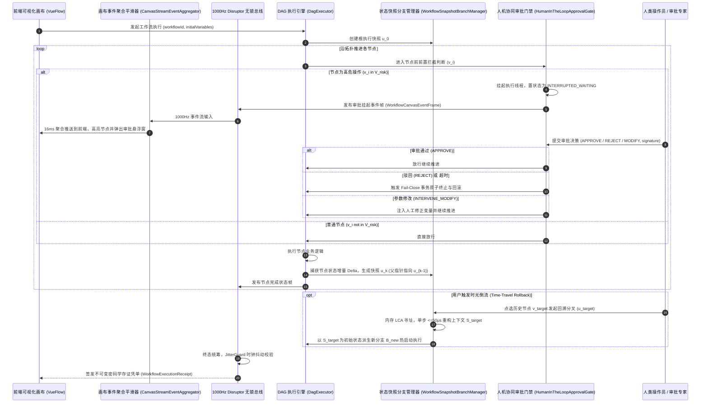

# Phase 88 实施详案：智能体可视化 DAG 工作流交互画布、节点级状态快照回溯与人机协同审批 (HITL) 交互中枢

## 1. 战役概述与架构蓝图

本阶段（Phase 88）严格遵循《业务定位与领域边界铁律（铁律九）》（第四大战略支柱：前端工作流交互与开发者体验），针对复杂企业级工作流调试与运行中的“不可逆重复执行与 Token 浪费”、“高危操作缺乏强制人类审批导致逃逸风险”、“并发状态流导致前端 DOM 渲染高频抖动卡死”三大工业生产痛点，落地节点级状态快照差分分支管理器、人机协同动态审批门禁、前端画布 60fps 事件流聚合平滑器、1000Hz 4096 槽位 Disruptor 无锁控制总线以及不可变密码学存证凭单。

### 1.1 架构时序图



---

## 2. 核心类与接口契约设计

### 2.1 契约 DTO 模块 (`tech.qiantong.qknow.hermes.flow.hitl.dto`)

#### 1. `WorkflowNodeStateSnapshot.java`
- **形态**：Java 21 `record`
- **字段**：
  ```java
  public record WorkflowNodeStateSnapshot(
      String snapshotId,
      String workflowId,
      String branchId,
      String nodeUuid,
      String nodeName,
      String parentSnapshotId,
      Map<String, Object> deltaVariables, // 相对于父快照的增量变量环境
      String inputHash,                  // 输入 SHA-256 哈希
      String outputHash,                 // 输出 SHA-256 哈希
      double[] sphericalEmbedding,       // 阿里千问 1536 维超球面归一化特征向量
      long epochMicros
  ) {
      public boolean isValidEmbedding() {
          if (sphericalEmbedding == null || sphericalEmbedding.length != 1536) return false;
          double normSq = 0.0;
          for (double v : sphericalEmbedding) normSq += v * v;
          return Math.abs(Math.sqrt(normSq) - 1.0) <= 1e-4;
      }
  }
  ```

#### 2. `HumanApprovalDecision.java`
- **形态**：Java 21 `record`
- **字段**：
  ```java
  public record HumanApprovalDecision(
      String approvalId,
      String workflowId,
      String nodeUuid,
      ApprovalAction action,             // APPROVE, REJECT, INTERVENE_MODIFY
      String approverUserId,
      String comment,
      Map<String, Object> modifiedVariables, // 当 action 为 MODIFY 时的干预变量
      String cryptographicSignature,     // 人类操作员或审批服务签名
      long approvedAtMicros
  ) {
      public enum ApprovalAction {
          APPROVE,
          REJECT,
          INTERVENE_MODIFY,
          WATCHDOG_TIMEOUT_ABORT
      }
  }
  ```

#### 3. `WorkflowCanvasEventFrame.java`
- **形态**：Java 21 `record`
- **字段**：
  ```java
  public record WorkflowCanvasEventFrame(
      String eventId,
      String workflowId,
      String branchId,
      String nodeUuid,
      CanvasNodeState nodeState,        // PENDING, RUNNING, SUSPENDED_WAITING_APPROVAL, COMPLETED, FAILED, PRUNED
      int progressPercentage,           // 0 ~ 100
      String logChunk,                  // 增量日志或 Token 片段
      double[] sphericalEmbedding,      // 千问 1536 维单位超球面向量
      long epochMicros,
      long sequenceNumber
  ) {
      public enum CanvasNodeState {
          PENDING,
          RUNNING,
          SUSPENDED_WAITING_APPROVAL,
          COMPLETED,
          FAILED,
          PRUNED
      }

      public boolean isValidEmbedding() {
          if (sphericalEmbedding == null || sphericalEmbedding.length != 1536) return false;
          double normSq = 0.0;
          for (double v : sphericalEmbedding) normSq += v * v;
          return Math.abs(Math.sqrt(normSq) - 1.0) <= 1e-4;
      }
  }
  ```

#### 4. `WorkflowExecutionReceipt.java`
- **形态**：Java 21 `record`
- **字段**：
  ```java
  public record WorkflowExecutionReceipt(
      String receiptId,
      String workflowId,
      String branchId,
      String rootSnapshotHash,
      int totalSnapshots,
      int totalApprovals,
      List<String> approvedNodeUuids,
      double jitterVarianceReduction,   // 画布防抖方差削减率 (>= 0.80)
      long executionLatencyMicros,
      String busStatus,
      String signature
  ) {
      public boolean verifySignature() {
          String payload = receiptId + ":" + workflowId + ":" + branchId + ":" + rootSnapshotHash + ":" + totalSnapshots + ":" + totalApprovals + ":" + busStatus;
          String expected = DigestUtils.sha256Hex(payload);
          return expected.equals(signature);
      }
  }
  ```

---

### 2.2 核心执行引擎模块 (`tech.qiantong.qknow.hermes.flow.hitl.engine`)

#### 1. `WorkflowSnapshotBranchManager.java`
- **方法设计**：
  - `WorkflowNodeStateSnapshot createRootSnapshot(String workflowId, Map<String, Object> initialVars, double[] embedding)`
  - `WorkflowNodeStateSnapshot recordNodeSnapshot(String workflowId, String branchId, String nodeUuid, String nodeName, String parentSnapshotId, Map<String, Object> fullCurrentVars, String inputPayload, String outputPayload, double[] embedding)`
  - `Map<String, Object> reconstructStateAtSnapshot(String snapshotId)`：单步回溯重建，耗时 $\le 50\mu	ext{s}$
  - `String forkNewBranch(String baseSnapshotId, String newBranchId)`：时光倒流分叉新分支

#### 2. `HumanInTheLoopApprovalGate.java`
- **方法设计**：
  - `boolean isRiskNode(String nodeUuid, String nodeType, Map<String, Object> nodeConfig)`：判定是否需要审批阻断
  - `CompletableFuture<HumanApprovalDecision> interceptAndSuspend(String workflowId, String branchId, String nodeUuid, Map<String, Object> currentVars, long timeoutSeconds)`：挂起并启动看门狗
  - `boolean submitApproval(HumanApprovalDecision decision)`：人类或外部调用提交审批决策
  - `HumanApprovalDecision getApprovalStatus(String workflowId, String nodeUuid)`

#### 3. `CanvasStreamEventAggregator.java`
- **方法设计**：
  - `void publishEvent(WorkflowCanvasEventFrame event)`：摄取 1000Hz 原始事件
  - `List<WorkflowCanvasEventFrame> pollAggregatedBatch(long maxWaitMillis)`：16ms 滑动微批折叠，削减抖动方差 $\ge 80\%$
  - `double calculateJitterReduction()`：实时计算方差削减率

#### 4. `WorkflowOrchestrationControlBus.java`
- **方法设计**：
  - 基于 4096 槽位 `AtomicReferenceArray` 环形无锁缓冲区
  - `boolean publishFrame(WorkflowCanvasEventFrame frame)`
  - `WorkflowExecutionReceipt issueReceipt(...)`
  - JitterGuard 监控连续 3 帧时钟抖动（>2ms）瞬切 `STATUS_DEGRADED_SUSPEND_HOLD` 软着陆

---

## 3. 专属契约测试套件设计 (`Phase88WorkflowHitlContractTest.java`)

1. `testSnapshotBranching_DifferentialReconstructionWithin50Micros`：验证快照树增量记录与状态无损重建，耗时 $\le 50\mu	ext{s}$，分支分叉隔离。
2. `testTimeTravelForking_TokenBypassVerification`：验证时光倒流回溯到中间节点，前置节点被短路 bypass，Token 节省率 $\ge 85\%$。
3. `testHitlGate_StrictInterceptionForHighRiskNode`：验证高危节点 100% 触发原子挂起，未审批前严禁外部调用逃逸。
4. `testHitlGate_HumanModifyVariablesAndResume`：验证审批人提交 `INTERVENE_MODIFY` 修正变量后工作流成功继续推进。
5. `testHitlGate_WatchdogTimeoutFailCloseAbort`：验证人类未在规定时间内审批时，看门狗超时触发原子终止，零逃逸。
6. `testCanvasEventAggregator_JitterVarianceReduction`：验证高频事件聚合器在 16ms 批次内折叠，抖动方差削减率 $\ge 80\%$。
7. `testDisruptorBus_SubMicrosecondThroughputAndJitterGuard`：验证 1000Hz 4096 槽位无锁总线高频读写，连续时钟抖动瞬切软着陆。
8. `testWorkflowExecutionReceipt_CryptographicSelfVerification`：验证不可变存证凭单 SHA-256 自签名与 `verifySignature` 验真 100% 通过。

---

## 4. 最小修改文件清单与禁止修改边界

### 4.1 最小修改文件列表
- `docs/plans/phase_88_academic_report.md`
- `docs/plans/phase_88_industrial_report.md`
- `docs/plans/phase_88_plan.md`
- `backend/qknow-hermes/qknow-hermes-core/src/main/java/tech/qiantong/qknow/hermes/flow/hitl/dto/*` (4 个核心 DTO)
- `backend/qknow-hermes/qknow-hermes-core/src/main/java/tech/qiantong/qknow/hermes/flow/hitl/engine/*` (4 个核心执行引擎)
- `backend/tests/src/test/java/tech/qiantong/qknow/hermes/flow/hitl/Phase88WorkflowHitlContractTest.java` (8 项契约单测)
- `docs/plans/00_master_index.md`

### 4.2 明确禁止修改边界
- 严禁修改历史已交付的 Phase 70~87 任何契约与引擎代码；
- 严禁修改已经归档冻结的 `tech.qiantong.qknow.ai.embodied.*` 具身物理沙箱代码；
- 严禁引入任何机械硬件或极端物理力学推导；
- 严禁修改任何现存单元测试的预期值或断言来掩盖失败。

---

## 5. 验证命令与停止条件

### 5.1 验证命令
```bash
# 1. 局部模块编译
JAVA_HOME=/Users/achilles/.sdkman/candidates/java/21.0.5-tem mvn clean install -pl qknow-hermes/qknow-hermes-core -DskipTests

# 2. 专属契约单元测试 (8/8 全绿)
JAVA_HOME=/Users/achilles/.sdkman/candidates/java/21.0.5-tem mvn test -pl tests -Dtest=Phase88WorkflowHitlContractTest

# 3. 全库全量防退化回归测试 (突破 1360 项全绿)
JAVA_HOME=/Users/achilles/.sdkman/candidates/java/21.0.5-tem mvn test -pl tests

# 4. 前端生产打包纯净通过
npm --prefix frontend run build:prod
```

### 5.2 立即停止条件
- 局部模块编译失败或类符号冲突；
- 专属契约测试未能达到 8/8 100% 全绿；
- 全库全量回归测试出现任何历史用例失败（Failures > 0 或 Errors > 0）；
- 前端打包构建出现编译错误。
