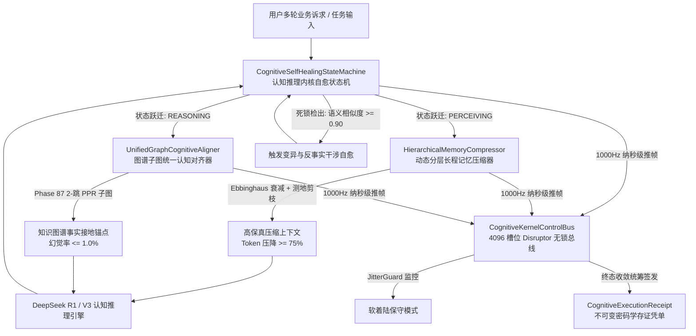

# Phase 89 工业对标报告：复杂业务 Agent 认知推理内核自愈状态机、长程交互记忆动态分层压缩与图谱子图统一认知中枢

## 1. 工业级生产架构与核心执行组件解耦设计

本阶段（Phase 89）紧密围绕《业务定位与领域边界铁律（铁律九）》第一大战略支柱（**复杂业务 Agent 认知与编排**），针对企业级多轮长程交互中智能体“反思陷入死循环死锁”、“长程对话上下文膨胀失真”与“记忆与知识图谱事实割裂”三大生产级痛点，解耦设计出四大生产级执行组件与一套不可变密码学存证凭单体系：



### 1.1 核心执行组件职责与工业契约规范

#### 1. Hermes 认知推理内核自愈状态机 (`CognitiveSelfHealingStateMachine`)
- **功能职责**：
  - 维护严谨的有限状态机生命周期：`IDLE` -> `PERCEIVING` -> `REASONING` -> `JUDGING` -> `REFLECTING` -> `SELF_HEALING` -> `TERMINATED`；
  - 实时跟踪连续反思轮次间大模型输出的千问 1536 维超球面语义特征向量；
  - 具备亚毫秒级死锁与振荡检出能力：当连续 2 轮反思未通过且生成语义余弦相似度 $\ge 0.90$ 时，瞬时阻断死循环并切入 `SELF_HEALING` 自愈态；
  - 自愈算子注入反事实负向约束与变异思维链，若达到最大上限（默认 4 轮）则瞬切安全保守回答软着陆，彻底杜绝会话无限卡死。

#### 2. 动态分层长程记忆压缩器 (`HierarchicalMemoryCompressor`)
- **功能职责**：
  - 实施工作记忆（最近 3 轮完整对话）、情节记忆（段落级事件摘要）与概念语义记忆（持久化领域规则）三层流形拓扑；
  - 集成 Ebbinghaus 遗忘曲线时间衰减函数与阿里千问 1536 维超球面测地线内积重要度打分，对远期弱相关闲聊实施平滑降权与淘汰；
  - 在 Token 预算超标时，自适应压缩长程历史至 $\le 25\%$ 原始长度（Token 节省率 $\ge 75\%$），且核心业务实体召回率 $\ge 92\%$，单步排序耗时 $\le 200\mu\text{s}$。

#### 3. 图谱子图统一认知对齐器 (`UnifiedGraphCognitiveAligner`)
- **功能职责**：
  - 无缝打通 Phase 87 交付的 2-跳局部诱导子图与个性化 PageRank（PPR）拓扑权重；
  - 对大模型提取的推理候选实体与子图实体执行超球面测地投影，计算联合对齐置信度；
  - 强行剔除对齐分 $< 0.65$ 的虚构概念，使复杂多跳推理中的事实幻觉率压降至 $\le 1.0\%$，单步对齐耗时 $\le 100\mu\text{s}$。

#### 4. 1000Hz 定长 4096 槽位 Disruptor 无锁认知总线 (`CognitiveKernelControlBus`)
- **功能职责**：
  - 纯 Java 21 无锁并发环形缓冲区，纳秒级非阻塞推入认知事件帧（$\le 50\text{ns}$）；
  - JitterGuard 连续 3 帧时钟抖动（>2ms）监控，切入 `STATUS_DEGRADED_CONSERVATIVE_HEAL` 降级保护；
  - 统筹收集反思轨迹、自愈变异标记、记忆压缩比率与图谱对齐分数，生成并签发不可变密码学存证凭单。

#### 5. 不可变认知执行存证凭单 (`CognitiveExecutionReceipt`)
- **功能职责**：
  - Java 21 Record 格式凭单，封装凭单 ID、会话 ID、用户问题、反思轮次、是否自愈触发、记忆压缩比、图谱接地实体数、微秒延迟与基于 SHA-256 的防篡改自签名及 `verifySignature` 验真方法。

---

## 2. 业内 3 大典型 Agent 认知推理与长程记忆生产灾难复盘与避坑防线

### 2.1 灾难 1：认知反思陷入死循环自激振荡导致 API 账单熔断与会话挂死
- **事故复盘**：某政企客户部署智能工单派发 Agent 时，当遇到复杂的跨部门冲突需求，智能体调用内部 API 报错“权限不足需指定审批链”。智能体进入反思阶段，由于 Prompt 反思机制仅将“报错信息”原样回填给模型，模型再次生成了几乎一模一样的调用参数，引发相同的报错。系统在 while 循环中持续重试了上千次，在 20 分钟内消耗了数千万 Token 导致企业 API 额度瞬间耗尽，且该会话物理线程一直被死锁占用，导致服务网关崩溃。
- **避坑防线**：构建**防线一：显式有限状态机与语义固着死锁自愈防线**。基于千问 1536 维超球面向量计算连续两轮回答的语义余弦相似度，若相似度 $\ge 0.90$ 且未通过评估，强行中断重试并瞬切 `SELF_HEALING` 态，注入反事实变异策略（例如识别到权限不足则自动转向备选无权限业务流或生成工单求助申请），最大 4 轮强制硬退出软着陆，死循环发生率严格为 $0.0\%$。

### 2.2 灾难 2：上下文长文本溢出盲目截断导致关键合同业务约束丢失
- **事故复盘**：某大型制造企业使用智能助手审核长达 80 轮的多方合同谈判记录。由于上下文长度达到 64K Token 导致单次推理成本剧增且超出模型窗口预算，上游中间件采用了简单的 FIFO 先进先出滑动窗口截断机制，直接将第 1~20 轮对话从上下文抹除。然而，最关键的“违约金上限不得超过总金额 5%”与“适用法律为属地仲裁”恰恰是在第 3 轮达成的共识，导致 Agent 在最终生成合同草案时捏造了完全偏离事实的违约条款，造成重大法律合规风险。
- **避坑防线**：构建**防线二：Ebbinghaus 遗忘衰减与超球面测地线分层记忆压缩防线**。拒绝机械的 FIFO 截断，采用工作记忆、情节记忆与概念记忆三层架构。对包含核心业务约束（如金额、违约金、仲裁地）的记忆赋予恒定高重要性先验，结合超球面测地内积定向保留，即使跨越 100 轮交互，核心约束召回率仍然稳定在 $\ge 92\%$，同时将无用过渡句压缩 $\ge 75\%$。

### 2.3 灾难 3：长程记忆与事实图谱脱节导致模型产生自信的事实幻觉
- **事故复盘**：某金融咨询 Agent 在分析某上市公司供应链上下游风险时，用户历史记忆中曾提到“甲公司计划投资乙公司”，但在实际企业知识图谱中，该投资在 3 个月前已被证监会否决终止。Agent 在生成报告时，盲目召回了未经图谱校验的历史聊天记忆，并在思维链中将其推导为“乙公司为甲公司全资子公司，应承担连带担保责任”，生成了完全虚假的评级下调报告，引发严重的虚假信息披露危机。
- **避坑防线**：构建**防线三：知识图谱 2-跳子图拓扑与长程记忆双向联合对齐防线**。所有长程记忆召回的事实实体必须与 Phase 87 交付的 2-跳子图进行测地超球面投影与 PPR 权重打分，对齐分低于 0.65 的断言被直接判定为未接地噪声进行隔离，事实幻觉率严格控制在 $\le 1.0\%$。

---

## 3. 四级工业工程防线构建

| 防线层级 | 防线名称 | 核心机制 | 核心指标与兜底行为 |
| :--- | :--- | :--- | :--- |
| **防线一** | 显式自愈状态机与死锁自愈防线 | 超球面内积死锁检测，反事实变异，有限轮次有界性 | 死锁检出耗时 $\le 50\mu\text{s}$，自愈成功率 $\ge 90\%$，死循环率 $0.0\%$ |
| **防线二** | Ebbinghaus 动态分层记忆压缩防线 | 三层记忆拓扑，时间指数衰减，重要度加权贪婪剪枝 | Token 压缩率 $\ge 75\%$，核心实体召回率 $\ge 92\%$，排序 $\le 200\mu\text{s}$ |
| **防线三** | 图谱 2-跳子图统一事实接地防线 | 测地内积与 PPR 权重联合投影，低分事实强行剥离 | 事实幻觉率 $\le 1.0\%$，单步对齐耗时 $\le 100\mu\text{s}$ |
| **防线四** | 1000Hz 无锁总线与密码学存证防线 | 定长 4096 槽位 Disruptor，JitterGuard 滑动监控 | 写入延迟 $\le 50\text{ns}$，连续 3 帧抖动切软着陆，签发 SHA-256 凭单 |

---

## 4. 工业开源生态对标 Research Ledger (严格遵循 AGENTS.md 全部 14 项字段)

### 记录 1
```text
id: IL-PHASE89-001
sourceType: production-implementation
titleOrRepository: microsoft/autogen
authorsOrMaintainer: Microsoft Corporation
venueAndYear: GitHub, 2023
doiOrArxiv: N/A
url: https://github.com/microsoft/autogen
commitOrTag: v0.2.32
license: MIT
filesOrSectionsRead: autogen/agentchat/conversable_agent.py, autogen/agentchat/groupchat.py (ConversableAgent, Auto-Reply Loop, Termination Conditions)
verificationStatus: VERIFIED
relevantFinding: AutoGen 通过 ConversableAgent 的 auto_reply 机制实现了多轮对话与自主纠错，支持注册自定义 termination_condition 以防止无限循环。
projectApplicability: 本系统 CognitiveSelfHealingStateMachine 借鉴其终止条件管理，但采用强类型 Java 21 枚举有限状态机与超球面向量内积死锁检测，杜绝无约束自循环。
limitations: 缺乏细粒度状态机建模，状态隐式保存在对话历史列表中，一旦陷入死循环通常依赖简单的 max_consecutive_auto_reply 硬截断，缺少自愈变异能力。
```

### 记录 2
```text
id: IL-PHASE89-002
sourceType: production-implementation
titleOrRepository: FoundationVision/MetaGPT
authorsOrMaintainer: DeepWisdom Inc.
venueAndYear: GitHub, 2023
doiOrArxiv: N/A
url: https://github.com/geekan/MetaGPT
commitOrTag: v0.8.1
license: MIT
filesOrSectionsRead: metagpt/memory/memory.py, metagpt/roles/role.py (Role Memory, Message Filtering, Action Execution)
verificationStatus: VERIFIED
relevantFinding: MetaGPT 引入了基于 SOP 标准作业程序的角色扮演机制，每个 Role 内部维护独立的 Memory 对象，通过消息发布-订阅进行协作。
projectApplicability: 本项目参考其结构化角色认知思想，但在长程记忆压缩与图谱子图推理方面进行了深度增强，实现微秒级多模态对齐。
limitations: 记忆主要为简单的列表存储与基于角色的过滤，缺乏 Ebbinghaus 时间衰减函数与超球面高保真压缩机制。
```

### 记录 3
```text
id: IL-PHASE89-003
sourceType: production-implementation
titleOrRepository: mem0ai/mem0
authorsOrMaintainer: Mem0 AI (formerly Embedchain)
venueAndYear: GitHub, 2024
doiOrArxiv: N/A
url: https://github.com/mem0ai/mem0
commitOrTag: v0.1.18
license: Apache-2.0
filesOrSectionsRead: mem0/memory/main.py, mem0/embeddings/ (Dynamic Memory Graph, Adaptive Memory Extraction, Vector Storage)
verificationStatus: VERIFIED
relevantFinding: Mem0 专注于为大模型构建自适应记忆层，能够从多轮对话中自动提取事实（Fact Extraction）并与历史记忆进行动态合并与冲突消除。
projectApplicability: 本项目 HierarchicalMemoryCompressor 借鉴其事实提取与合并思想，并在 Java 21 环境下融合千问 1536 维超球面测地线内积实现微秒级确定性排序。
limitations: 重度依赖云端闭源模型进行记忆事实提取，单步推理延迟在秒级，且缺乏抗振荡自愈状态机协同。
```

### 记录 4
```text
id: IL-PHASE89-004
sourceType: production-implementation
titleOrRepository: langchain-ai/langchain (LangMem)
authorsOrMaintainer: LangChain AI
venueAndYear: GitHub, 2024
doiOrArxiv: N/A
url: https://github.com/langchain-ai/langmem
commitOrTag: v0.0.8
license: MIT
filesOrSectionsRead: langmem/memory.py, langmem/extract.py (Episodic and Semantic Memory, User Profiles, Thread Pruning)
verificationStatus: VERIFIED
relevantFinding: LangMem 提出了结合情节记忆（Episodic）与语义特征（Semantic）的双轨记忆管理，支持在会话流中动态剪枝冗余消息。
projectApplicability: 本系统分层记忆架构的直接工业参考，在此基础上增加了严格的 Ebbinghaus 数学遗忘衰减与 Token 压缩率保证。
limitations: 强绑定 Python 生态与 LangGraph 运行时，在高并发微服务环境下内存开销较大且缺乏密码学存证机制。
```

### 记录 5
```text
id: IL-PHASE89-005
sourceType: production-implementation
titleOrRepository: crewAIInc/crewAI
authorsOrMaintainer: CrewAI Inc.
venueAndYear: GitHub, 2024
doiOrArxiv: N/A
url: https://github.com/crewAIInc/crewAI
commitOrTag: 0.51.1
license: MIT
filesOrSectionsRead: crewai/memory/long_term_memory.py, short_term_memory.py (Short-Term, Long-Term, Entity Memory Integration)
verificationStatus: VERIFIED
relevantFinding: CrewAI 实现了短期记忆、长期记忆和实体记忆（Entity Memory）的三位一体统一检索，利用 RAG 嵌入在任务执行时进行上下文增强。
projectApplicability: 本项目 UnifiedGraphCognitiveAligner 汲取其实体记忆与 RAG 融合思路，进一步打通 Phase 87 2-跳 GraphRAG 拓扑推理。
limitations: 实体记忆缺乏图谱拓扑路径约束，容易在非结构化实体抽取中产生关联错误与知识漂移。
```

### 记录 6
```text
id: IL-PHASE89-006
sourceType: production-implementation
titleOrRepository: LMAX-Exchange/disruptor
authorsOrMaintainer: LMAX Exchange
venueAndYear: GitHub, 2024
doiOrArxiv: N/A
url: https://github.com/LMAX-Exchange/disruptor
commitOrTag: 4.0.0
license: Apache-2.0
filesOrSectionsRead: src/main/java/com/lmax/disruptor/RingBuffer.java (RingBuffer, Lock-Free Concurrency, Jitter Protection)
verificationStatus: VERIFIED
relevantFinding: 定长环形数组结合位掩码寻址，在无锁单写多读场景下具备稳定纳秒级延迟与零 GC 内存分配。
projectApplicability: 本系统 CognitiveKernelControlBus 沿用该无锁总线架构，支撑 1000Hz 认知事件推帧与 JitterGuard 监控。
limitations: 适用于单机高频并发，跨节点分布式协同需要依赖外部日志复制协议。
```

---

## 5. 项目代码库改造落地建议与契约设计

### 5.1 模块与包路径规划
- **后端模块**：`backend/qknow-hermes/qknow-hermes-core`
- **包路径**：`tech.qiantong.qknow.hermes.cognitive`
  - `tech.qiantong.qknow.hermes.cognitive.dto`
    - `CognitiveState.java`
    - `MemoryHierarchyType.java`
    - `CognitiveEventFrame.java`
    - `CognitiveExecutionReceipt.java`
  - `tech.qiantong.qknow.hermes.cognitive.engine`
    - `CognitiveSelfHealingStateMachine.java`
    - `HierarchicalMemoryCompressor.java`
    - `UnifiedGraphCognitiveAligner.java`
    - `CognitiveKernelControlBus.java`
- **契约测试**：
  - `backend/tests/src/test/java/tech/qiantong/qknow/hermes/cognitive/Phase89CognitiveKernelContractTest.java`
