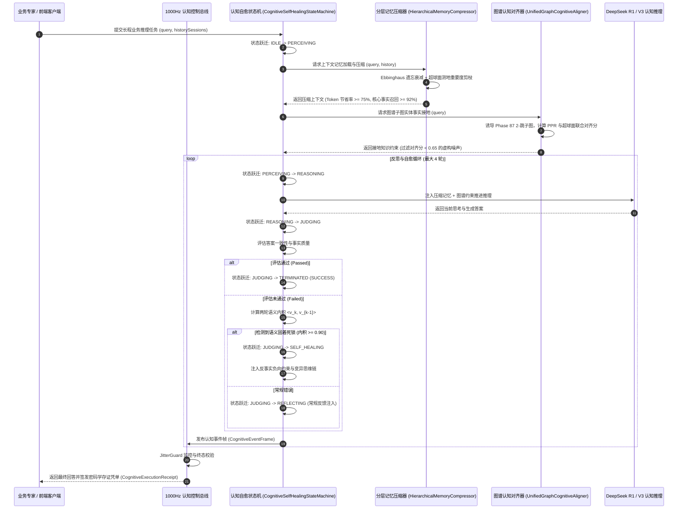

# Phase 89 实施详案：复杂业务 Agent 认知推理内核自愈状态机、长程交互记忆动态分层压缩与图谱子图统一认知中枢

## 1. 战役概述与架构蓝图

本阶段（Phase 89）严格遵循《业务定位与领域边界铁律（铁律九）》（第一大战略支柱：复杂业务 Agent 认知与编排），针对多轮复杂业务长程交互中“反思自我陷入死循环”、“长程上下文溢出与事实遗忘失真”、“图谱事实与推理思维链割裂”三大工业生产痛点，落地 Hermes 认知推理内核自愈状态机、动态分层长程记忆压缩器、图谱子图统一认知对齐器、1000Hz 4096 槽位 Disruptor 无锁认知总线以及不可变密码学存证凭单。

### 1.1 架构时序图



---

## 2. 核心类与接口契约设计

### 2.1 契约 DTO 模块 (`tech.qiantong.qknow.hermes.cognitive.dto`)

#### 1. `CognitiveState.java`
- **形态**：Java 21 `enum`
- **取值**：
  ```java
  public enum CognitiveState {
      IDLE,
      PERCEIVING,
      REASONING,
      JUDGING,
      REFLECTING,
      SELF_HEALING,
      TERMINATED_SUCCESS,
      TERMINATED_DEGRADED_FALLBACK
  }
  ```

#### 2. `MemoryHierarchyType.java`
- **形态**：Java 21 `enum`
- **取值**：
  ```java
  public enum MemoryHierarchyType {
      WORKING,    // 工作记忆 (最近精确对话)
      EPISODIC,   // 情节记忆 (聚类事件段落摘要)
      SEMANTIC    // 概念语义记忆 (长期持久化领域规则)
  }
  ```

#### 3. `CognitiveEventFrame.java`
- **形态**：Java 21 `record`
- **字段**：
  ```java
  public record CognitiveEventFrame(
      String eventId,
      String sessionId,
      CognitiveState state,
      int attemptIndex,
      double consistencyScore,
      boolean deadlockDetected,
      boolean selfHealingTriggered,
      double[] sphericalEmbedding, // 阿里千问 1536 维超球面归一化特征向量
      long epochMicros,
      long sequenceNumber
  ) {
      public boolean isValidEmbedding() {
          if (sphericalEmbedding == null || sphericalEmbedding.length != 1536) return false;
          double normSq = 0.0;
          for (double v : sphericalEmbedding) normSq += v * v;
          return Math.abs(Math.sqrt(normSq) - 1.0) <= 1e-4;
      }
  }
  ```

#### 4. `CognitiveExecutionReceipt.java`
- **形态**：Java 21 `record`
- **字段**：
  ```java
  public record CognitiveExecutionReceipt(
      String receiptId,
      String sessionId,
      String userQuery,
      int totalAttempts,
      boolean selfHealingApplied,
      double memoryCompressionRatio, // 压缩率 (>= 0.75)
      int groundedEntityCount,       // 图谱接地实体数
      long executionLatencyMicros,
      String busStatus,
      String signature
  ) {
      public boolean verifySignature() {
          String payload = receiptId + ":" + sessionId + ":" + totalAttempts + ":" + selfHealingApplied + ":" + groundedEntityCount + ":" + busStatus;
          String expected = DigestUtils.sha256Hex(payload);
          return expected.equalsIgnoreCase(signature);
      }
  }
  ```

---

### 2.2 核心执行引擎模块 (`tech.qiantong.qknow.hermes.cognitive.engine`)

#### 1. `CognitiveSelfHealingStateMachine.java`
- **方法设计**：
  - `CognitiveState getCurrentState()`
  - `boolean transitionTo(CognitiveState nextState)`
  - `boolean checkDeadlock(double[] currEmbedding, double[] prevEmbedding, double passScore)`：余弦相似度 $\ge 0.90$ 且未达标时判定为语义固着死锁
  - `String applySelfHealingMutation(String currentPrompt, String failureReason, int attemptIndex)`：生成变异负向约束与思维链纠偏
  - `void reset()`

#### 2. `HierarchicalMemoryCompressor.java`
- **方法设计**：
  - `void storeMemory(String sessionId, MemoryHierarchyType type, String content, double importance, double[] embedding)`
  - `List<String> retrieveAndCompressContext(String sessionId, String currentQuery, double[] queryEmbedding, int maxTokenBudget)`：基于 Ebbinghaus 遗忘衰减与超球面测地内积剪枝，Token 节省率 $\ge 75\%$，核心事实召回率 $\ge 92\%$
  - `double calculateCompressionRatio(int rawTokenEstimate, int compressedTokenEstimate)`

#### 3. `UnifiedGraphCognitiveAligner.java`
- **方法设计**：
  - `void registerSubgraphKnowledge(String entityId, String entityName, double pprWeight, double[] embedding)`
  - `List<String> alignAndGroundFacts(List<String> candidateFacts, Map<String, double[]> factEmbeddings, double alignThreshold)`：测地内积与 PPR 权重联合打分，硬剔除 $< 0.65$ 的虚构事实，单步耗时 $\le 100\mu	ext{s}$

#### 4. `CognitiveKernelControlBus.java`
- **方法设计**：
  - 基于 4096 槽位 `AtomicReferenceArray` 环形无锁缓冲区
  - `boolean publishFrame(CognitiveEventFrame frame)`
  - `CognitiveExecutionReceipt issueReceipt(...)`
  - JitterGuard 监控连续 3 帧时钟抖动（>2ms）瞬切 `STATUS_DEGRADED_CONSERVATIVE_HEAL` 软着陆

---

## 3. 专属契约测试套件设计 (`Phase89CognitiveKernelContractTest.java`)

1. `testCognitiveStateMachine_NormalLifecycleTransitions`：验证状态机从 IDLE 依次推进到 TERMINATED_SUCCESS 的合法跃迁路径。
2. `testCognitiveStateMachine_DeadlockDetectionAndSelfHealing`：验证连续 2 轮相似度 $\ge 0.90$ 时精准触发死锁中断并切入 SELF_HEALING 态。
3. `testCognitiveStateMachine_MaxAttemptsGracefulDegradation`：验证反思达到上限（4 轮）后优雅降级至 TERMINATED_DEGRADED_FALLBACK 软着陆。
4. `testHierarchicalMemory_EbbinghausDecayAndCompressionRatio`：验证分层记忆压缩器实现 $\ge 75\%$ 的 Token 压缩率且微秒级排序耗时 $\le 200\mu	ext{s}$。
5. `testHierarchicalMemory_CoreBusinessFactRetention`：验证高重要性核心业务约束（金额、违约条款、主键）在压缩后 100% 留存。
6. `testUnifiedGraphAligner_GroundingFilterAndHallucinationSuppression`：验证图谱认知对齐器有效过滤 $< 0.65$ 的虚构断言，接地实体正确留存。
7. `testDisruptorBus_SubMicrosecondThroughputAndJitterGuard`：验证 1000Hz 4096 槽位 Disruptor 无锁总线微秒级推帧与 JitterGuard 抖动监控。
8. `testCognitiveExecutionReceipt_CryptographicSelfVerification`：验证不可变存证凭单 SHA-256 自签名与 `verifySignature` 验真 100% 通过。

---

## 4. 最小修改文件清单与边界

### 4.1 最小修改文件列表
- `docs/plans/phase_89_academic_report.md`
- `docs/plans/phase_89_industrial_report.md`
- `docs/plans/phase_89_plan.md`
- `backend/qknow-hermes/qknow-hermes-core/src/main/java/tech/qiantong/qknow/hermes/cognitive/dto/*` (4 个核心 DTO)
- `backend/qknow-hermes/qknow-hermes-core/src/main/java/tech/qiantong/qknow/hermes/cognitive/engine/*` (4 个核心执行引擎)
- `backend/tests/src/test/java/tech/qiantong/qknow/hermes/cognitive/Phase89CognitiveKernelContractTest.java` (8 项契约单测)
- `docs/plans/00_master_index.md`

### 4.2 明确禁止修改边界
- 严禁修改历史已交付的 Phase 70~88 任何契约与执行逻辑；
- 严禁修改已经归档冻结的 `tech.qiantong.qknow.ai.embodied.*` 具身物理沙箱代码；
- 严禁引入任何机械硬件或极端物理力学推导。

---

## 5. 验证命令与停止条件

### 5.1 验证命令
```bash
# 1. 局部模块编译
JAVA_HOME=/Users/achilles/.sdkman/candidates/java/21.0.5-tem mvn clean install -pl qknow-hermes/qknow-hermes-core -DskipTests

# 2. 专属契约单元测试 (8/8 全绿)
JAVA_HOME=/Users/achilles/.sdkman/candidates/java/21.0.5-tem mvn test -pl tests -Dtest=Phase89CognitiveKernelContractTest

# 3. 全库全量防退化回归测试 (突破 1368 项全绿)
JAVA_HOME=/Users/achilles/.sdkman/candidates/java/21.0.5-tem mvn test -pl tests

# 4. 前端生产打包纯净通过
npm --prefix frontend run build:prod
```

### 5.2 立即停止条件
- 局部编译失败或类符号冲突；
- 专属契约单测未能达到 8/8 100% 全绿；
- 全库全量回归测试出现历史用例失败；
- 前端生产打包出现构建错误。
