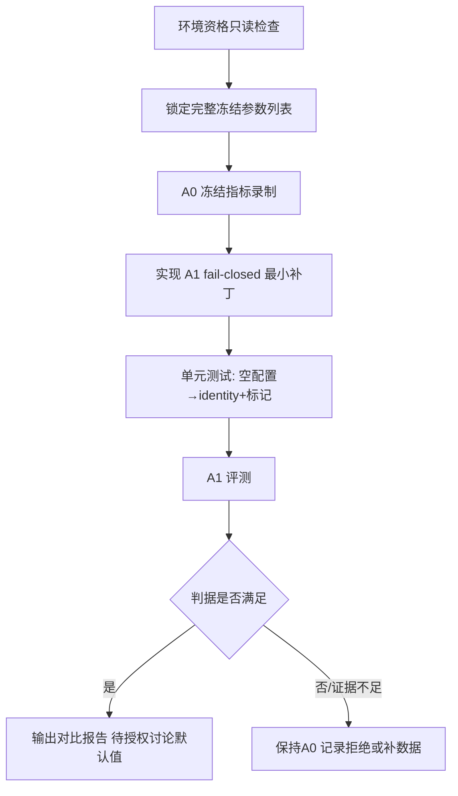

# Candidate A1：伪 ColBERT 粗排 Fail-Closed 实施计划

> **状态**：待审核（DRAFT — 未获批准前禁止实施）  
> **日期**：2026-09-10  
> **依据**：`AGENTS.md` Research-to-Implementation Gate 首轮研究报告（假设 H1）  
> **计划文件**：`plans/2026-09-10-candidate-a1-colbert-fail-closed.md`  
> **原则**：本文件为 reactor 输入以外的审核契约；批准后只做本文件允许的最小改动。

---

## 0. 审核摘要（给决策者）

| 项 | 内容 |
|---|---|
| **要做什么** | 当 ColBERT 粗排缺少真实 token embedding 配置时，**不再**回落 `tokenVectorHash` 伪向量并截断 `topK*3`，改为**跳过粗排**（identity）并打点 |
| **不改什么** | topK、RRF k、CRAG、QueryRouter、切块、golden/qrel、context 预算、Hermes、前端、生产默认业务参数 |
| **如何证明** | 冻结 golden 上 A0（现状 hash 粗排）vs A1（跳过伪粗排）消融：Recall@10 / MRR@10 / NDCG@10 / p95 |
| **何时算通过** | Holdout 上 A1 相对 A0：Recall@10 与 MRR@10 **同时不劣**，且达到约定最小效应；A1 全程零 hash 回落 |
| **回滚** | 单一配置开关，可立即恢复 A0 行为 |
| **请求授权** | 批准后实施「最小代码改动 + A0/A1 评测」；**不**授权调参、换模型、改路由或上线 |

---

## 1. 当前状态与失败机制（A）

### 1.1 真实执行路径

```
RagRetrievalService.retrieveScoped
  → retrieveOnce: Vector + Keyword + Metadata + Graph
  → CandidateFusionService (RRF k=60)
  → RagRerankService.rerank
       → filterIrrelevant
       → colbertCoarseRerank(query, candidates, topK*3)   ← 问题点
       → API / Local / Deterministic 精排
```

### 1.2 失败机制（file:line）

| 位置 | 事实 |
|---|---|
| `RagRerankService.java:49-50` | 无条件调用 `colbertCoarseRerank(..., topK * 3)` |
| `ColbertScorer.java:243-278` | `embeddingPlatform/BaseUrl/ApiKey/Model` 任一为空或调用失败 → `tokenVectorHash` 伪向量 |
| 配置（dev/测试套件） | `hermes.rag.colbert.enabled=true` 且 embedding 四元组多为空 |

伪向量 MaxSim 近似随机，却决定保留哪 `3×topK` 条进入精排，**系统性丢弃 RRF 已排好的高相关候选**。

### 1.3 唯一待验证假设 H1

> 在中文组织知识库场景下，RRF 之后、精排之前的 ColBERT 粗排在缺少真实 token embedding 时回落 hash 并按 `topK*3` 截断，会以近似随机方式丢弃高相关候选，是 live Recall@10 / MRR@10 低于设计基线的主要失败机制。

**可证伪**：若 A1（跳过伪粗排）相对 A0 在 Holdout 上不升或显著变差，则 H1 不成立。

### 1.4 已冻结、本计划不碰的相关问题（仅备案）

- 生产 Agent 路径 `recallTest` 丢弃 `RagResult.getContext()`（接线缺陷，可并行修，**不得**计入 H1 证据）。
- `QueryRouter` 短查询 SIMPLE→空上下文、CRAG 清空策略、IVFFlat vs HNSW 文档漂移——**另开 Gate**。

---

## 2. 范围

### 2.1 In Scope

1. `ColbertScorer`（及必要时 `RagRerankService`）增加 **fail-closed**：无有效编码能力时不粗排、不截断。
2. 观测：debugInfo / 计数器记录 `colbert_skipped_no_embedding` 或等价标记。
3. 评测：在现有冻结套件上跑 **A0 / A1** 两臂，输出指标对比。
4. 测试开关：`-Dqknow.rag.colbert.skip-when-no-embedding=true|false`（名称可按仓库惯例微调，获批时写死）。

### 2.2 Out of Scope（明确禁止）

| 禁止项 | 原因 |
|---|---|
| 修改 golden / qrel / fixture 期望值 | 泄漏防护 |
| 调整 topK、`topK*3` 倍数、RRF k、弱路径阈值 | 超出唯一假设 |
| 配置真实 ColBERT checkpoint / Jina / PLAID | 属 A2，另批 |
| 修改 `QueryRouter`、CRAG、切块、`RagContextBuilder` 默认预算 | 另开 Gate |
| 变更生产 `application-*.yml` 业务默认（仅允许评测用系统属性） | 未授权上线 |
| 引入新 Maven/Python/Rust 依赖 | 最�算法原则 |
| 前端、Hermes 编排、gRPC 协议改动 | 无关 |

---

## 3. 候选方案回顾（D）

| 方案 | 结论 |
|---|---|
| A0 Baseline：保持 hash 粗排 | 对照臂 |
| **A1 Candidate：无 embedding 则跳过粗排** | **本计划实施** |
| A2 真 ColBERT / Jina late-interaction | 拒绝（超范围，待 A1 证据） |
| 引入 PLAID / 新向量库 | 拒绝 |
| 同时改 SIMPLE 路由 / CRAG | 拒绝（换假设） |

**推荐理由**：只改「无效信号阶段」的失败语义（fail-open→hash 改为 fail-closed→skip），复用全部现有召回/融合/精排，零新依赖，可单开关回滚。

---

## 4. 最小算法定义（E）

### 4.1 语义

```
if (!colbertEnabled) → 不粗排（现行为）
else if (embedding 四元组不完整 或 编码失败) {
    if (skipWhenNoEmbedding) → 返回输入候选（顺序保持 RRF 结果），记 colbert_skipped_no_embedding
    else                     → 现行为：hash 伪向量 + topK*3 截断（A0）
}
else → 真 late-interaction 粗排（现状保留，本计划不测）
```

### 4.2 关键约束

- **A1 臂内禁止出现 hash 向量参与排序**；出现即 `HASH_FALLBACK_IN_A1` → 实验 INVALID。
- 跳过时 **不得** 改变候选列表内容与相对顺序（identity），避免引入新变量。
- 开关默认值：**生产/未显式设置时保持 A0**，避免未授权行为变更；仅评测显式开启 A1。

### 4.3 预期接触面

| 文件 | 改动性质 |
|---|---|
| `backend/qknow-module-kmc/qknow-module-kmc-biz/src/main/java/tech/qiantong/qknow/module/kmc/service/rag/rerank/ColbertScorer.java` | 主改动：能力探测 + skip 分支 + 标记 |
| `backend/qknow-module-kmc/qknow-module-kmc-biz/src/main/java/tech/qiantong/qknow/module/kmc/service/rag/RagRerankService.java` | 可选：粗排前 guard / 传递 skip 标记到 debugInfo |
| `backend/tests/...` 评测类 | A0/A1 开关与断言；**不改** golden 数据文件内容 |
| 配置绑定 | 新增 `skip-when-no-embedding`（默认 false）挂到现有 colbert 前缀 |

> 获批后以 `serena`/实际符号为准；若双份 `ColbertScorer` 存在，**只改生产路径**（kmc-module 下那份），测试桩不动。

---

## 5. 实验与验证计划（F）

### 5.1 固定契约

| 项 | 冻结值 |
|---|---|
| 假设 | H1 |
| 数据 | 现有 rag golden + candidate10 证据基线套件所用 query；**文件内容不改** |
| 指标 | Recall@5, Recall@10, MRR@10, NDCG@10, p50/p95 latency |
| Baseline A0 | `colbert.enabled=true`，embedding 空，`skip-when-no-embedding=false`（hash 粗排） |
| Candidate A1 | 其余参数与 A0 **逐键相同**，仅 `skip-when-no-embedding=true` |
| 不可变量 | topK、RRF k=60、weak-path-threshold、graph.enabled=false、dynamic-top-k、query-entity、CRAG、context.max-bytes、reranker provider 链 |
| 泄漏防护 | 不改 qrel；Selection/Holdout 划分沿用现套件；禁止用失败 case 调阈值后宣称通过 |
| 额外调用预算 | 检索侧新增 LLM/embedding 调用 = 0 |
| 时延预算 | A1 相对 A0 的 p95 延迟升幅 ≤ 5%（预期为降） |

### 5.2 通过/失败判据

**通过（H1 支持，可申请后续默认策略讨论）**：

1. A1 全程 `HASH_FALLBACK_IN_A1` 次数 = 0；
2. Holdout：`Recall@10_A1 ≥ Recall@10_A0` 且 `MRR@10_A1 ≥ MRR@10_A0`；
3. 且至少一项达到最小效应：`ΔRecall@10 ≥ +2pp` **或** 相对错误率（1−Recall@10）下降 ≥10%；
4. p95 延迟不劣于 +5%；
5. 测试计数、命令、Surefire 报告可复现。

**失败**：

- 指标回归且排除环境故障 → H1 不成立或证据不足，**保持 A0**，记入拒绝理由防重引入；
- A1 出现 hash 参与排序 → 实现缺陷，修实现后重跑，不得改数据。

**证据不足**：

- Holdout 有效 query < 20 或环境未过 qualification → 结论标 `PARTIALLY_VERIFIED`，**禁止**改生产默认。

### 5.3 停止条件（立即停）

- 需要修改 golden/qrel 才能跑绿；
- 必须引入新模型/新依赖才能完成 A1；
- 无法在不改其他阶段的前提下隔离变量；
- 出现 `INVALID_CONFIG` / `EMPTY_CANDIDATES` 且无法用环境问题解释。

### 5.4 失败码

| 码 | 含义 |
|---|---|
| `INVALID_CONFIG` | A0/A1 开关或冻结参数未按臂设置 |
| `EMPTY_CANDIDATES` | 融合后候选为空，无法评粗排 |
| `HASH_FALLBACK_IN_A1` | A1 臂仍走 hash（实验无效） |
| `METRICS_REGRESSION` | Holdout 指标回归 |
| `ENV_QUALIFICATION_FAILED` | DB/索引/embedding 服务等环境不合格 |

### 5.5 复现命令（获批后按仓库实际 surefire 旗标对齐并写死进测试 README/注释）

```bash
cd /Users/achilles/Documents/许子祺/Agent/backend

# 伪代码结构 — 实施时替换为与 RagCandidate102A 套件一致的完整 -D 列表
# A0
mvn -pl tests -am -Dtest=<EvalTest>#<a0Method> \
  -Dsurefire.failIfNoSpecifiedTests=false \
  -Dhermes.rag.colbert.enabled=true \
  -Dqknow.rag.colbert.skip-when-no-embedding=false \
  <其余冻结参数与现网/套件一致>

# A1
mvn -pl tests -am -Dtest=<EvalTest>#<a1Method> \
  -Dsurefire.failIfNoSpecifiedTests=false \
  -Dhermes.rag.colbert.enabled=true \
  -Dqknow.rag.colbert.skip-when-no-embedding=true \
  <其余冻结参数与 A0 逐键相同>
```

> 实施任务第一步：打开现网/测试套件，抄录**完整**冻结 `-D` 列表，写入本计划附录并作为唯一真源。

### 5.6 建议执行顺序



---

## 6. 实施任务分解（批准后执行）

| ID | 任务 | 验收 |
|---|---|---|
| T1 | 只读：确认 `ColbertScorer`/`RagRerankService` 现签名、配置前缀、现有 eval 旗标 | 附录冻结参数表 |
| T2 | 只读：跑/阅读 A0 基线是否可复现（不改代码） | A0 指标或环境失败码 |
| T3 | 实现 skip 分支 + 默认 false | 单测：无 embedding + skip=true → identity + 标记 |
| T4 | 单测：skip=false → 保持 hash 行为（回归保护） | 测试绿 |
| T5 | A1 全量评测 | 指标 JSON/日志归档 |
| T6 | 撰写对比结果（通过/失败/不足） | 本文附录 B 更新 |
| T7 | **停**：不改生产默认，等待用户下一步授权 | — |

**明确不做**：git commit/push 除非用户单独要求；不改 docker/部署；不写长期文档。

---

## 7. 风险与缓解（G）

| 风险 | 缓解 |
|---|---|
| Golden 过小导致过拟合结论 | 标 PARTIALLY_VERIFIED，禁止改生产默认 |
| 双路径/双类 `ColbertScorer` | 只改生产模块；测试用例用反射或包内可见性验证 |
| 与 candidate10 套件旗标冲突 | T1 抄录完整列表；A0/A1 仅差一个旗标 |
| 开关误开到生产 | 默认 false；本计划不改 `application-prod.yml` |
| 误把 wiring 修复算进 H1 | Context 接线另票；报告中分列 |

### 回滚

```text
qknow.rag.colbert.skip-when-no-embedding=false   # 或删除系统属性
→ 立即恢复 A0 hash 粗排行为
```

代码级回滚：revert 单 commit/单文件 diff。

---

## 8. 授权边界

| 动作 | 本计划 | 需另批 |
|---|---|---|
| 实施 A1 fail-closed + 评测 | **待您批准** | |
| 改 topK / RRF / 截断倍数 / context 预算 | | 是 |
| A2 真 ColBERT / 换模型 / PLAID | | 是 |
| 改 Router / CRAG / 切块 | | 是 |
| 生产默认改为 A1、A/B、promotion、线上 | | **是（独立授权）** |
| 修改 golden/qrel | | **是（原则上禁止）** |

---

## 9. 研究来源快照（B 摘要）

| ID | 来源 | 状态 | 对 H1 的作用 |
|---|---|---|---|
| R1 | ColBERT arXiv:2004.12832 (SIGIR'20) | VERIFIED | 真 late interaction 依赖 token 向量 |
| R2 | ColBERTv2 arXiv:2112.01488 (NAACL'22) | VERIFIED | 专用压缩索引，≠ 任意 embedding API |
| R3 | stanford-futuredata/ColBERT (MIT) | PARTIALLY | 无“无 checkpoint 的 hash 粗排”路径 |
| R4 | Adaptive-RAG arXiv:2403.14403 | VERIFIED | 路由边界；本轮不改 Router |
| R5 | CRAG arXiv:2401.15884 | VERIFIED | 本轮冻结 CRAG |
| R6 | TREC'22 多阶段 + Vespa phased ranking | VERIFIED/PARTIAL | 无效粗排应删除 |

---

## 附录 A：冻结参数表（T1 后填写）

> 实施前必须填完；未填完不得改代码。

```text
[colbert]
enabled=
ngram-size=
dimensions=
max-tokens-per-doc=
embedding-platform=
embedding-base-url=
embedding-api-key=
embedding-model=

[skip]
qknow.rag.colbert.skip-when-no-embedding=   # A0=false / A1=true

[retrieval]
qknow.rag.dynamic-top-k.enabled=
qknow.rag.query-entity.enabled=
qknow.rag.rrf.k=
qknow.rag.rrf.weak-path-threshold=
qknow.rag.graph.enabled=
qknow.rag.vector.vecsim-rescore-enabled=
qknow.rag.keyword.identifier-aware=
qknow.rag.rerank.identifier-consistency-enabled=
qknow.rag.local-reranker.enabled=
qknow.rag.onnx-reranker.enabled=
hermes.rag.context.max-bytes=
hermes.rag.context.max-tokens=

[golden]
datasetPath=
selectionCaseCount=
holdoutCaseCount=
evalTestClassName=
```

## 附录 B：评测结果（T5/T6 后填写）

```text
A0 Recall@5/10=
A0 MRR@10=
A0 NDCG@10=
A0 p50/p95=
A1 Recall@5/10=
A1 MRR@10=
A1 NDCG@10=
A1 p50/p95=
HASH_FALLBACK_IN_A1 count=
判定=PASS | FAIL | INSUFFICIENT
说明=
```

## 附录 C：审核勾选

- [ ] 批准 H1 与 A1 最小机制
- [ ] 批准 In/Out of Scope
- [ ] 批准通过/失败判据与停止条件
- [ ] 批准默认开关为 false（仅评测显式开启）
- [ ] 批准开始 T1–T7（T7 后停，不改生产默认）
- [ ] 其他修改意见：________________

**审核结论**：☐ 批准实施　☐ 驳回/修改后再报　☐ 仅批准只读 T1–T2  
**审核人**：________　**日期**：________
